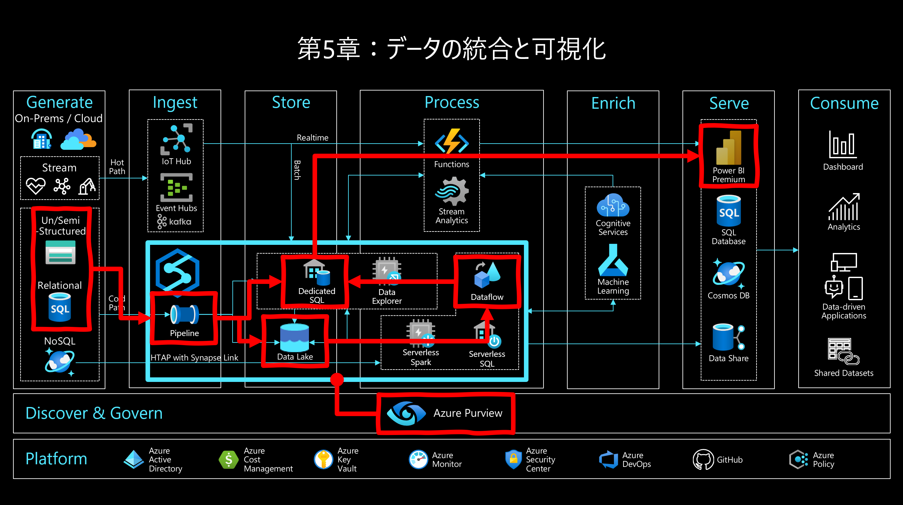
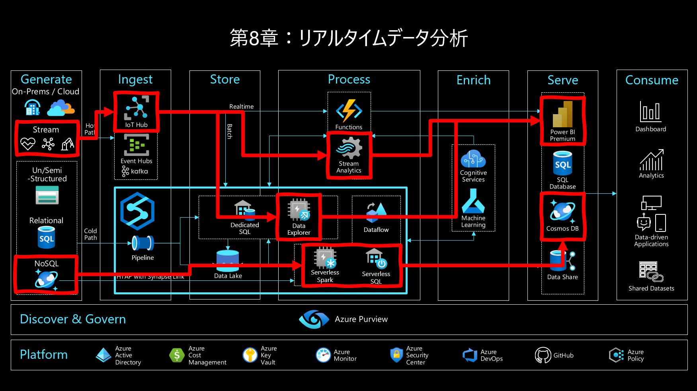
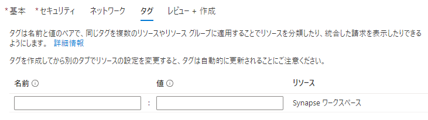
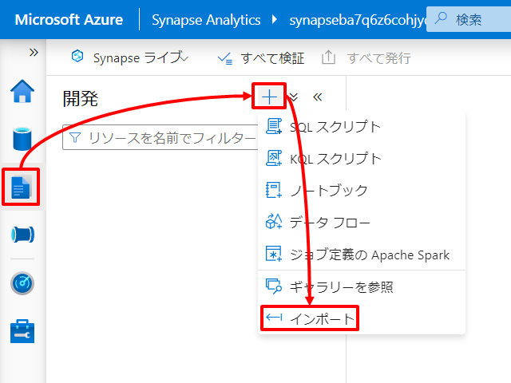

---
# 4. ハンズオンの概要とハンズオンリソースの準備  

第4章～第8章ではこれまでに学んだ基礎知識を踏まえて、Azure Synapse Analytics のいくつかのユースケースにそって Step-by-Step のハンズオンを行っていきます。まずは本章でハンズオンの概要理解とハンズオンに必要となるリソースの準備を行いましょう。

---
## 4-1. Azure Data Analytics Platform 全体アーキテクチャ

ハンズオンの概要説明の前にまずは Azure における Data Analytics Platform の全体感をとらえましょう。下図は Microsoft Azure における Data Analytics Platform の全体アーキテクチャを示しています。  
左端の「Generate 層」で生成されたデータは Data Analytics Platform を通じて右端の「Consume 層」によってデータドリブンな意思決定の支援に活用されていく一連の流れを示しています。現在の Azure Synapse Analytics はこの全体の中で青枠でくくったエリアをカバーします。

  

各層ごとにもう少し理解を進めてみましょう。  

### Generate 層  
Generate 層はデータの源泉を示します。クラウドやオンプレ、トランザクションデータやストリームデータ、構造化や半構造化や非構造化データ、など様々な源泉から様々データが生成されます。  

### Ingest 層  
Ingest 層は Generate 層で生成されるデータをとらまえる層で、大きくはバッチ処理系とストリーム処理系の2系統で構成されます。現在の Azure Synapse Analytics は前者のバッチ処理系による Ingest に対応する Synapse Pipeline を備えます。なお、後者のストリーム処理系は主に Azure IoT Hub や Azure Event Hubs が対応します。  

| アイコン | リソース | 役割 |
| :---: | :---- | :---- |
|  | Synapse Pipeline | バッチ処理による Ingest に対応します。90 以上の組み込みコネクタを備えオンプレからマルチクラウドまで散在する多種多様なターゲットをサポートし、ターゲットに対する様々なアクティビティのオーケストレーションをパイプラインとして定義します。  |

### Store 層  
Store 層は Ingest 層でとらまえた様々なデータを蓄積する層です。Azure Synapse Analytics は蓄積先の選択肢を複数もち、データ種類や活用用途に応じて最適な蓄積先を選択することができます。なお、Store 層への蓄積は主としてコールドパス分析やウォームパス分析に対応し、ホットパス分析では Store 層を介さず直接 Process 層に連結します。  

| アイコン | リソース | 役割 |
| :---: | :---- | :---- |
|  | Data Lake Storage | 文字通りデータレイクです。主として、非構造から半構造まで様々な形式のデータを未整形の生データとして格納し、データ活用者は生データに対して未発見のInsightを求め実験的な広域探索をアドホックに行います。 |
|  | Synapse Dedicated SQL Pool | OLAP用途に最適化されたRDBエンジンでいわゆるデータウェアハウスです。主として、業務理解にもとづき整えられた構造化データを格納し、データ活用者は整形済みであるデータに対してビジネス分析を行います。 |
|  | Synapse Data Explorer Pool (執筆時点で Preview) | データレイクやデータウェアハウスとは異なりニアリアルタイムな分析に最適化されたエンジンです。主として、メトリックやログを格納し、データ活用者は順次転送されてくるメトリックやログに対してニアリアルタイムな分析（事実把握や監視）を行います。 |

### Process 層  
Process 層は Store 層に蓄積されたデータを分析にかける層です。Store 層と同様に Azure Synapse Analytics は複数のデータ処理エンジンの選択肢をもち、用途やスキルセットに応じて最適なデータ処理エンジンを選択することができます。ストリームデータについては Store 層 に永続化される系統（コールドパス分析やウォームパス分析）と、直接リアルタイム分析にかける系統（ホットパス分析）に分岐しており、後者のストリームデータに対するホットパス分析については主に Azure Functions や Azure Stream Analytics が対応します。  

| アイコン | リソース | 役割 |
| :---: | :---- | :---- |
|  | Synapse Serverless SQL Pool | データレイクへのアドホッククエリエンジンです。SQL文（T-SQL）によるデータエンジニアリングに利用します。コンピューティング環境はフルマネージドであるためメンテナンスフリーな一方でそのスペックを調整することはできないため性能の揺れに対する許容が必要です。 |
|  | Synapse Serverless Spark Pool | Spark エンジンです。コードファースト（C#、Scala、PySpark、Spark SQL）によるデータエンジニアリングに利用します。処理の実行時に指定したスペックでコンピューティング環境がプロビジョニングされます。 |
|  | Synapse DataFlows | Spark エンジンです。ローコード（GUI）によるデータエンジニアリング（主として Synapse Pipeline に組み込むデータ加工）に利用します。処理の実行時に指定したスペックでコンピューティング環境がプロビジョニングされます。 |

### Enrich 層  
Enrich 層は Process 層のコンポーネントと連携し機械学習によるデータエンリッチを行う層です。Azure Synapse Analytics は Azure Machine Learning や Azure Cognitive Services と統合することでデータエンリッチを容易に素早く構成可能です。

### Serve 層  
Serve 層は分析されたエンリッチされたインサイトを可視化ツールやデータマートを通じて Cosume 層に提供する層です。Azure Synapse Analytics では Power BI Service や 各種データストアと統合することで Consume 層へのインサイト提供を容易に素早く構成可能です。

### Consume 層  
Consume 層は Azure Data Analytics Platform を通じて得られたインサイトを活用しデータドリブンな意思決定の支援を行う層です。

## 4-2. ハンズオンの概要

今回のハンズオンは４つのシナリオを用意しシナリオごと章で分かれています。ここではそれぞれのシナリオごとに概要を解説します。

### データの統合と可視化（第5章）  
第5章はオンプレからクラウドまで外部の様々なデータソースとのコネクタを持つ Synapse Pipeline を利用してサイロ化されたデータを Data Lake Storage へ統合します。統合したデータは Synapse Dataflow による加工処理を通じて整形済みのデータとして Synapse Dedicated SQL Pool に格納します。最後にデータ活用の典型例として Power BI Service と連携し整形済みデータの可視化を行います。  
このハンズオンでは架空のタクシー事業者のタクシー乗車記録の分析と可視化を行います。
  

### アドホックデータ探索とデータプレパレーション（第6章）  
第6章は Data Lake Storage 上の生データに対するアドホックデータ探索とデータプレパレーションを行います。  
このハンズオンでは Azure Purview が管理するデータカタログを通じて第5章で作成したレポートの源泉となっている生データを特定し、その生データから新たなインサイトを得るためのアドホックデータ探索とデータプレパレーションを行います。Azure Synapse Analytics はデータ探索のためのデータ処理エンジンを複数搭載しますが、このハンズオンでは Synapse Serverless Spark Pool を利用するパターンと Synapse Serverless SQL Pool を利用するパターンの両パターンに触れていきます。  
  

### 機械学習統合によるデータエンリッチメント（第7章）  
第7章は Synapse Serverless Spark Pool と機械学習サービスとの連携によるデータエンリッチメントを行います。機械学習連携は2つのシナリオに触れていきます。    

ひとつは「Azure Machine Learning と連携した自動機械学習によるデータエンリッチメント」です。このハンズオンでは架空の小売事業者を想定し、商品の販売実績から機械学習モデルを構築し、該当モデルから将来の販売数量を予測させます。  

もうひとつは「Azure Cognitive Services と連携し構築済みモデルを利用したデータエンリッチメント」です。このハンズオンでは IoT デバイスから送信されたメトリックデータに対して構築済みモデルを利用した機械学習によって異常検出を行います。  
  

### リアルタイムデータ分析（第8章）  
第8章では第5章～第7章のようなバッチ処理とは異なるリアルタイム処理によるデータ分析を行います。リアルタイム処理は2つのシナリオに触れていきます。  

ひとつは「オンラインシステムで生成されるトランザクションデータに対するリアルタイム分析」でいわゆるHTAP（Hybrid Transaction Analytical Processing）と呼ばれるシナリオです。このハンズオンでは Azure Synapse Analytics がもつ Synapse Link 機能を活用します。Synapse Link とはクラウドネイティブの HTAP を実現するための機能で OLTP 向けデータストアの背後に OLAP 向けのデータストア（分析ストア）を自動的に作成し、その分析ストアと Azure Synapse Analytics をシームレスに統合することでオンラインのトランザクションデータに対するニアリアルタイムな分析を実現します。ここではオンライントランザクションデータを格納している Azure Cosmos DB に対して Synapse Link を有効にし Synapse Serverless Spark Pool と Synapse Serverless SQL Pool からアクセスし分析を行います。その分析結果は Azure Cosmos DB に書き戻しすぐにアプリケーションから再利用できるようにします。  

もうひとつは「IoT デバイスなどから発生するストリームデータに対するリアルタイム分析」です。このハンズオンでは IoT デバイスから発生するメトリックデータを Azure IoT Hub でとらまえ、Azure IoT Hub に順次到着するストリームデータを Azure Stream Analytics でリアルタイム分析を行い、結果を Power BI Service にプッシュする、いわゆるホットパス分析を行います。さらに Synapse Data Explorer Pool (執筆時点プレビュ) を Azure IoT Hub に接続しウォームパス分析を行い、結果を Power BI Service 上のホットパス分析結果に合流させます。  
なお、IoT デバイスにはオンラインシミュレーターを活用するため、物理的な IoT デバイスを準備することなくハンズオンが可能です。  
  

***削除手予定（ここから）***
### データ蓄積（第9章）
***TODO: 9章はメッセージとして重要だがハンズオンまでは不要かも。サンプルへのリンクだけの紹介とかでもいいかも***
  - メッセージ：Synapse は データウェアハウス と レイクハウス（データレイク＋アドホッククエリエンジン）の両シナリオに対応（Snowflakeは前者のみ、Databricksは後者のみ）  
    - データウェアハウス：プロビジョニング型（Serverlessと比較すると予測可能な性能）、枯れた技術で機能がリッチ(***スケーラビリティの観点で強化予定あり。Snowflake相当のマルチクラスタ対応***）  
    - レイクハウス：アドホック型でコストメリット、最低限のものはそろってきたけどセキュリティ機能は弱い。  
  - 実感体験として  
    - Synapse Dedicatedによるデータウェアハウスのリッチなセキュリティ機能の体験  
    - Purviewによるレイクハウスのセキュリティ補強の体験  
  - おまけ  
    - Synapse ケーパビリティの網羅の観点でKustoエンジン紹介

  ***TODO: アーキ図挿入***
***削除手予定（ここまで）***

---
## 4-3. ハンズオンの準備  

全体のアーキテクチャとシナリオを頭の片隅に置きながら、ここからいよいよ Azure に触れていきます。ここではまず次章からのハンズオンで利用する Azure リソースのデプロイとセットアップを行います。  

先に解説した通り、今回のハンズオンでは Azure Synapse Analytics のほか、以下の一覧にある Azure Data Analytics Platform に関連する各種リソースにも触れていきます。  

| リソース                 | URL   |
| :----                    | :---- |
| Azure Synapse Analytics  | https://azure.microsoft.com/ja-jp/services/synapse-analytics/ |
| Azure Data Lake Storage  | https://azure.microsoft.com/ja-jp/services/storage/data-lake-storage/ |
| Azure Blob Storage       | https://azure.microsoft.com/ja-jp/services/storage/blobs/ |
| Azure SQL Database       | https://azure.microsoft.com/ja-jp/products/azure-sql/database/ |
| Azure Purview            | https://azure.microsoft.com/ja-jp/services/purview/ |
| Azure Machine Learning   | https://azure.microsoft.com/ja-jp/services/machine-learning/ |
| Azure Cognitive Services | https://azure.microsoft.com/ja-jp/services/
| Azure Key Vault | https://azure.microsoft.com/ja-jp/services/key-vault/ |
| Azure IoT Hub            | https://azure.microsoft.com/ja-jp/services/iot-hub/ |
| Azure Stream Analytics   | https://azure.microsoft.com/ja-jp/services/stream-analytics/ |
| Azure Cosmos DB          | https://azure.microsoft.com/ja-jp/services/cosmos-db/ |
| Powewr BI                | https://powerbi.microsoft.com/ja-jp/ |

各章ごとに利用するリソースは下表の通りです。  

| リソース                 | 第5章 | 第6章 | 第7章 | 第8章 |
| :----                    | :---: | :---: | :---: | :---: |
| Azure Synapse Analytics  | ○    | ○    | ○    | ○    |
| Azure Data Lake Storage  | ○    | ○    | ○    | ○    |
| Azure Blob Storage       | ○    | －    | －    | －    |
| Azure SQL Database       | ○    | －    | －    | －    |
| Azure Purview            | ○    | ○    | －    | －    |
| Azure Machine Learning   | －    | －    | ○    | －    |
| Azure Cognitive Services | －    | －    | ○    | －    |
| Azure Key Vault          | －    | －    | ○    | －    |
| Azure IoT Hub            | －    | －    | －    | ○    |
| Azure Stream Analytics   | －    | －    | －    | ○    |
| Azure Cosmos DB          | －    | －    | －    | ○    |
| Powewr BI                | ○    | －    | －    | ○    |

なお、6章についてのみ5章のハンズオンの完了を前提とするハンズオンとなっていますが、それ以外は章ごとの依存関係はありません。お試しするハンズオンの章に必要となるリソースのみを準備いただくことも可能な構成をとっているので興味のあるものをピックアップしてください。  

また、Azure 無料アカウントのご利用などクレジットが限られている場合を想定し、できるだけ最小限の構成でセットアップを行うことで各リソースの維持コストを抑えています。加えて Synapse Dedicated SQL Pool、Synapse Data Explorer Pool、Azure Stream Analytics についてはハンズオン中断時にリソースを停止することでコストをさらに抑えることができます。また Azure Purview については他のリソースに比較し維持コストを要すため、必要に応じて5章、6章のハンズオン完了時にリソース自体を削除してください。  

それでは、Azure リソースのデプロイとセットアップを行いましょう。

### 4-3-1. シナリオ共通の事前準備

ここではシナリオ共通の準備を行います。

#### ハンズオンのアセット一式のダウンロード   

ハンズオンに利用するサンプルデータ、サンプルスクリプト、サンプルレポートはあらかじめ用意しており、これらハンズオンアセット一式は GitHub リポジトリに公開しています。  

https://github.com/gho9o9/SynapseHandsOn  
***TODO：↑正式な置き場に置換***

上記のサイトにアクセスし ZIP ファイルをダウンロードし解凍してください。  
  

#### Power BI Desktop のインストール

***TODO：ダウンロード版とMicrosoft Store版がある（とりあえず 自動アップデートされるMS Store版で解説👇）***  
***TODO: 参考：https://bi-seminar.jp/2018/03/07/power-bi-desktop-2way-install/***

今回のハンズオンでは分析データの可視化に Power BI を利用します。  
https://powerbi.microsoft.com/ja-jp/downloads/  

上記のサイトにアクセスし、Power BI Desktop をインストールしてください。  
  
  

#### リソースプロバイダーの登録

Azure でリソースをデプロイする際はサブスクリプションごとに該当リソースに関連するリソースプロバイダーを事前に登録しておく必要があります。  

 - Microsoft.Synapse
 - Microsoft.Sql
 - Microsoft.DataLakeStore
 - Microsoft.Storage
 - Microsoft.Purview
 - Microsoft.EventHub
 - Microsoft.KeyVault
 - Microsoft.StreamAnalytics
 - Microsoft.CognitiveServices
 - Microsoft.Devices
 - Microsoft.DocumentDB
 - Microsoft.Insights
 - Microsoft.ContainerRegistry
 - Microsoft.MachineLearningServices
 - Microsoft.Network
 - Microsoft.AlertsManagement
 - ***TODO：リストアップ***
   - https://docs.microsoft.com/ja-jp/azure/azure-resource-manager/management/azure-services-resource-providers#find-resource-provider
 - ***Synapse Manageg VNET に必要？（VNET有効Synapseのデプロイでエラーになった）***

*** Tips：執筆時点の必要リソースであるためリソースプロバイダーが必要なエラーがでたら該当のプロバイダーを登録してください***

上記のリソースプロバイダーごと状態を確認し「NotRegistered」となっている場合には以下の登録処理を行い状態を「Registered」としてください。

リソースプロバイダーごと状態を確認します。画面は Microsoft.Synapse の例です。   
  

該当のリソースプロバイダーの状態「NotRegistered」となっている場合は、リソースプロバイダーを選択し登録ボタンを押下します。  
  

登録ボタンの押下後しばらく待ち、状態が Registering から Registered になれば登録完了です。  
  

***TODO：コマンドもあり***
az provider register --namespace Microsoft.EventGrid
az provider show --namespace Microsoft.EventGrid --query "registrationState"

### 4-3-2. 第5章、第6章向け事前準備

ここでは第5章「データ統合と可視化」と第6章「データレイクへのアドホックデータ探索とデータプレパレーション」で利用する Azure リソースについて事前準備を行います。  
  
  

#### Synapse Workspace のデプロイ（これは2章で説明ずみなので書籍からはカット）

検索  


作成  


基本  


セキュリティ  


ネットワーク  


タグ  


レビュー＋作成  


#### Synapse Dedicated SQL Pool のデプロイ

Synapse Dedicated SQL Pool をデプロイします。  
Synapse ワークスペース の Azure Portal メニュを辿り「＋新規」をクリックします。  
  

以下の通り必要情報を入力します。  

| タブ | 項目 | 値 |
| :---- | :---- | :---- |
| 基本 | 専用 SQL プール名 | 例：dedicatedsql |
| 基本 | パフォーマンスレベル | 例：DW100c |
| 追加設定 | 既存のデータを使用します | 例：なし |
| 追加設定 | 専用 SQL プールの照合順序 | 例：Japanese_XJIS_100_CS_AS_KS_WS |

  
  

その他の入力項目は既定のまま「＋作成」をクリックし Synapse Dedicated SQL Pool を作成します。  


なお、Synapse Dedicated SQL Pool についてはハンズオン中断時に一時停止することで維持コストを抑えることができるため、必要に応じて適宜停止を行ってください。
  

#### Synapse Serverless Spark Pool のデプロイ

Synapse Serverless Spark Pool をデプロイします。
Synapse ワークスペース の Azure Portal メニュを辿り「＋新規」をクリックします。  
  

以下の通り必要情報を入力します。  

| タブ | 項目 | 値 |
| :---- | :---- | :---- |
| 基本 | Apache Spark プール名 | 例：spark31 |
| 基本 | ノードサイズ | 例：small |
| 基本 | 自動スケーリング | 例：有効 |
| 基本 | ノード数 | 例：3 ~ 5 |
| 基本 | エグゼキューターを動的に割り当てる | 例：無効 |
| 追加設定 | 自動一時停止中 | 例：有効 |
| 追加設定 | アイドル状態の時間 | 例：15分 |
| 追加設定 | Apache Spark | 3.1 |

  
  

その他の入力項目は既定のまま「＋作成」をクリックし Synapse Serverless Spark Pool を作成します。  
  

#### その他の Azure リソースのデプロイ

Azure Synapse Analytics 以外の Azure リソースについては解説を割愛し、各章ごとに事前準備した ARM テンプレートを使用してデプロイします。  

[](https://portal.azure.com/#create/Microsoft.Template/uri/https%3A%2F%2Fraw.githubusercontent.com%2Fgho9o9%2FSynapseHandsOn%2Fmain%2Fresource%2Fdeploy%2Fazuredeploy_integration.json)  
***TODO：書籍からは上記リンクを削除***  

ARM テンプレートは GitHub リポジトリに公開しており、この ARM テンプレートの実行により以下の Azure リソースがデプロイされます。  

- Azure Blob Storage
- Azure SQL Database
- Azure Purview

下記の GitHub サイトにアクセスし5章、6章用の「Deploy to Azure」ボタンをクリックします。 
https://github.com/gho9o9/SynapseHandsOn  
***TODO：↑正式な置き場に置換***


***TODO：↑正式なキャプチャに置換**

Azure へログインします。  


以下の通り必要情報を入力します。  

| タブ | 項目 | 値 |
| :---- | :---- | :---- |
| 基本 | サブスクリプション | ハンズオン用のサブスクリプションを指定します |
| 基本 | リソースグループ | ハンズオン用に作成したリソースグループを指定します（例：handson） |
| 基本 | SQL Database Server Name | SQL Database の論理 SQL サーバ名を指定します（例：sqlserver） |
| 基本 | SQL Database Name | SQL Database のデータベース名を指定します（例：sqldb） |
| 基本 | SQL Database Admin | SQL Database の サーバ管理者名を指定します（例：sqladminuser） |
| 基本 | SQL Database Admin Password | SQL Database の サーバ管理者のパスワードを指定します |
| 基本 | Purview Account Name | Purview アカウント名を指定します（例：purview） |
| 基本 | Storage Account Name | Storage アカウント名を指定します（例：storage） |
| 基本 | Blob Container Name | Storage アカウント配下に作成する Blob コンテナ名を指定します（例：blob） |

  

なお、この ARM テンプレートでは Azure リソース名がグローバルで一意となるように、指定された文字列の末尾にユニークな文字列を自動追加しています。  
パラメータを入力したら「作成」をクリックしデプロイの完了を待ちます。  
  

#### Azure リソースのセットアップ

ここではデプロイした Azure リソースに対してハンズオンに備えたいくつかのセットアップを行います。  

##### Blob へのデータファイルの作成

ハンズオン用のサンプルデータを Blob 上に準備します。    
今回は Python SDK を通じて[ニューヨークイエロータクシー乗車記録](https://docs.microsoft.com/ja-jp/azure/open-datasets/dataset-taxi-yellow?tabs=azureml-opendatasets)のオープンデータを取得しこれを CSV ファイルとして Blob へ格納します。  

まずはノートブックをインポートしましょう。Synapse Studio メニュを辿り「インポート」をクリックし、ハンズオンアセット一式内の「resource\script\CreateNYCTaxiCSVFiles.ipynb」をインポートします。  
  

ノートブックが開いたら<Storage アカウント名>、<Blob コンテナ名>、<Storage アカウントキー>をそれぞれ環境に合わせて編集します。なお、<Storage アカウントキー>は以下のようにストレージアカウントの Azure Portal メニュを辿ることで確認できます。  
  

パラメータの編集したのち、ノートブックの実行環境として作成した Serverless Spark Pool 名を指定し実行します。  
  

しばらく待ち、処理が正常終了する該当ストレージアカウントの「blob\source\nyctaxidata」配下に2019年1月から6月までそれぞれフォルダが作成され、それぞれのフォルダ配下に単一の CSV ファイルが作成されます。  
  

##### SQL Database のスキーマ定義とデータ投入

同様にハンズオン用のサンプルデータを SQL Database 上に準備します。  
まずはじめに SQL Server の Azure Portal メニュの「ファイアウォールと仮想ネットワーク」の設定でクライアント IP からの接続を許可します。  
  

次に SQL Database の Azure Portal メニュの「クエリエディター」から SQL Database にログインします。  
  

画面上部の「クエリを開く」をクリックし、ハンズオンアセット一式内の「resource/script/sqldb.sql」を開き、実行します。  
  
***TODO：画面キャプチャちょっと端折りすぎ？***

このスクリプトは TaxiLocationLookup のテーブル定義とデータ挿入を行っています。  

以上で5章、6章向けの事前準備の完了です。

### 4-3-3. 第7章向け事前準備  

ここでは第7章「機械学習統合によるデータエンリッチメント」で利用する Azure リソースについて事前準備を行います。  
  

#### Cognitive Services マルチアカウントのデプロイ  

***MEMO:AI Term への同意が ARM テンプレートではできず Portal 経由じゃないとできないため）***

Cognitive Services マルチアカウントをデプロイします。  
Azure Portal 検索ボックスから「Cognitive Services マルチアカウント」を検索し選択します。  
  

「＋作成」をクリックします。  
  

以下の通り必要情報を入力します。  

| タブ | 項目 | 値 |
| :---- | :---- | :---- |
| 基本 | サブスクリプション | ハンズオン用のサブスクリプションを指定します |
| 基本 | リソースグループ | ハンズオン用に作成したリソースグループを指定します（例：handson） |
| 基本 | 名前 | Cognitive Services マルチアカウントの名前を一意になるように指定します（例：cogs-[some unique suffix]） |
| 基本 | 価格レベル | 例：Standard S0 |
| 基本 | 責任ある AI 通知 | ご契約条件へ同意の場合チェックボックスをONにしてください |

その他の入力項目は既定のまま「＋作成」をクリックし Cognitive Services マルチアカウントをデプロイします。  
  

#### その他の Azure リソースのデプロイ  

その他の Azure リソースについては、解説を割愛して ARM テンプレートを使用してデプロイします。  

[](https://portal.azure.com/#create/Microsoft.Template/uri/https%3A%2F%2Fraw.githubusercontent.com%2Fgho9o9%2FSynapseHandsOn%2Fmain%2Fresource%2Fdeploy%2Fazuredeploy_ml.json)  
***TODO：書籍からは上記リンクを削除***  

ARM テンプレートは GitHub リポジトリに公開しており、この ARM テンプレートの実行により以下の Azure リソースがデプロイされます。  

- Azure Machine Learning  
  - Application Insights（Azure Machine Learning に付随）
  - Azure Container Registry（Azure Machine Learning に付随）
  - Azure Key Vault（Azure Machine Learning に付随）
  - Azure Storage（Azure Machine Learning に付随）
- Azure Cognitive Services Anomaly Detector
- Azure Cognitive Services Text Analytics
- Azure Key Vault

下記の GitHub サイトにアクセスし7章用の「Deploy to Azure」ボタンをクリックします。 
https://github.com/gho9o9/SynapseHandsOn  
***TODO：↑正式な置き場に置換***


***TODO：↑正式なキャプチャに置換**

Azure へログインします。  
  

以下の通り必要情報を入力します。  

| タブ | 項目 | 値 |
| :---- | :---- | :---- |
| 基本 | サブスクリプション | ハンズオン用のサブスクリプションを指定します |
| 基本 | リソースグループ | ハンズオン用に作成したリソースグループを指定します（例：handson） |
| 基本 | Machine Learning Workspace Name | Azure Machine Learning のワークスペースの名前を指定します（例：ml） |
| 基本 | Key Vault Name | Azure Key Vault の名前を指定します（例：keyvault） |
| 基本 | Anomaly Detector Name | Azure Cognitive Services Anomaly Detector の名前を指定します（例：anomalydetection） |
| 基本 | Text Analytics Name | Azure Cognitive Services Text Analytics の名前を指定します（例：textanalytics） |

  

なお、この ARM テンプレート では Azure リソース名がグローバルで一意となるように、指定された文字列の末尾にユニークな文字列を自動追加しています。  
パラメータを入力したら「作成」をクリックしデプロイの完了を待ちます。  
  

#### Azure リソースのセットアップ  

ここではデプロイした Azure リソースに対してハンズオンに備えたいくつかのセットアップを行います。  

##### Synapse Dedicated SQL Pool へのサンプルデータのコピー  

販売予測に利用するサンプルデータを Synapse Dedicated SQL Pool へコピーします。  
Synapse Studio のメニュを辿りクエリエディタを開きハンズオンアセット一式内の「resource/script/dedicatedsql_lab7.sql」の内容をエディタ上に張り付け実行をクリックします。  
  

```SQL
CREATE TABLE [dbo].[ProductQuantityForecast]
(
	[ProductId] [int] NOT NULL,
	[TransactionDate] [int] NOT NULL,
	[Hour] [int] NOT NULL,
	[TotalQuantity] [int] NOT NULL
)
WITH
(
	DISTRIBUTION = round_robin,
	CLUSTERED COLUMNSTORE INDEX
)
GO
INSERT [dbo].[ProductQuantityForecast] ([ProductId], [TransactionDate], [Hour], [TotalQuantity]) VALUES (1100, 20201209, 10, 0)
GO
INSERT [dbo].[ProductQuantityForecast] ([ProductId], [TransactionDate], [Hour], [TotalQuantity]) VALUES (300, 20201209, 10, 0)
GO
# <以下省略>
```

***todo　画像置き換え***
  

この SQL スクリプトの実行により「ProductQuantityForecastテーブル」が作成されます。  
このテーブルにサンプルデータが登録されていることを確認しておきましょう。  

***TODO:画像追加***

##### Data Lake Storage へのサンプルデータのコピー  

次に異常検出に利用するサンプルデータを Data Lake Storage へコピーします。  
ストレージアカウントの Azure Portal メニュのデータエクスプローラーからディレクトリ「synapsefs/source/IoTSignals」を作成します。  
  

作成したディレクトリにハンズオンアセット一式内の「resource/data/IoTSignals/IoTSignals.csv」をアップロードします。  
  
  

続けて機械学習モデル構築に利用する販売実績サンプルデータを Data Lake Storage へコピーします。  
ここでは azcopy コマンドを利用して再帰的にファイルをアップロードします。  

azcopy コマンドは下記のサイトからダウンロードしてください。  
https://docs.microsoft.com/ja-jp/azure/storage/common/storage-use-azcopy-v10

以下のコマンドは Data Lake Storage 上の *synapsefs/source* ディレクトリに対してハンズオンアセット一式内の「resource/data/WWI」ディレクトリ配下の全ファイルを再帰的にアップロードします。  

``` cmd
azcopy login
azcopy copy "<ハンズオンアセット一式のファイルパス>\resource\data\WWI" "https://<Data Lake Storage 用の Storage アカウント名>.dfs.core.windows.net/synapsefs/source" --recursive
```

  

ストレージアカウントの Azure Portal メニュのデータエクスプローラーからファイルがアップロードされたことを確認します。  
  

以上で7章向けの事前準備の完了です。

### 4-3-4. 第8章向け事前準備

ここでは第8章「リアルタイムデータ分析」で利用する Azure リソースについて事前準備を行います。  
  

#### Synapse Data Explorer Pool のデプロイ  

Synapse Data Explorer Pool を作成します。
Synapse ワークスペース の Azure Portal メニュを辿り「＋新規」をクリックします。  
  

以下の通り必要情報を入力します。  

| タブ | 項目 | 値 |
| :---- | :---- | :---- |
| 基本 | データ エクスプローラー プール名 | 例：sdxpreview |
| 基本 | ワークロード | 例：コンピューティング最適化 |
| 基本 | サイズ | 例：極小規模（2コア） |
| 追加設定 | スケーリング方法 | 例：手動スケール |
| 追加設定 | インスタンス数 | 例：2 |
| 追加設定 | ストリーミング インジェスト | 例：オフ |
| 追加設定 | 消去を有効にする | 例：オフ |

  
  

その他の入力項目は既定のまま「作成」をクリックし Synapse Data Explorer Pool を作成します。  
  

なお、Synapse Data Explorer Pool についてはハンズオン中断時に一時停止することで維持コストを抑えることができるため、必要に応じて適宜停止を行ってください。
  

#### その他の Azure リソースのデプロイ

Synapse Analytics 以外の Azure リソースについては解説を割愛し事前に準備された ARM テンプレートを使用してデプロイします。  

[](https://portal.azure.com/#create/Microsoft.Template/uri/https%3A%2F%2Fraw.githubusercontent.com%2Fgho9o9%2FSynapseHandsOn%2Fmain%2Fresource%2Fdeploy%2Fazuredeploy_realtime.json)  
***TODO：書籍からは上記リンクを削除***  

ARM テンプレートは GitHub リポジトリに公開しており、この ARM テンプレートの実行により以下の Azure リソースがデプロイされます。  

- Azure IoT Hub
- Azure Stream Analytics
- Azure Cosmos DB

下記の GitHub サイトにアクセスし8章用の「Deploy to Azure」ボタンをクリックします。 
https://github.com/gho9o9/SynapseHandsOn  
***TODO：↑正式な置き場に置換***


***TODO：↑正式なキャプチャに置換**

Azure へログインします。  
  

以下の通り必要情報を入力します。  

| タブ | 項目 | 値 |
| :---- | :---- | :---- |
| 基本 | サブスクリプション | ハンズオン用のサブスクリプションを指定します |
| 基本 | リソースグループ | ハンズオン用に作成したリソースグループを指定します（例：handson） |
| 基本 | Iot Hub Name | Azure IoT Hub 名を指定します（例：iothub） |
| 基本 | Cosmos DB Account Name | Azure Cosmos DB アカウント名を指定します（例：cosmos） |
| 基本 | Stream Job Name | Azure Stream Analytics ジョブ名を指定します（例：streamjob） |

  

なお、この ARM テンプレート では Azure リソース名がグローバルで一意となるように、指定された文字列の末尾にユニークな文字列を自動追加しています。  
パラメータを入力したら作成ボタンを押下しデプロイの完了を待ちます。  
   

#### Azure リソースのセットアップ

ここではデプロイした Azure リソースに対してハンズオンに備えたいくつかのセットアップを行います。  

##### Data Lake Storage へのサンプルデータのコピー  

HTAP に利用するサンプルデータを Data Lake Storage へコピーします。  
ストレージアカウントの Azure Portal メニュのデータエクスプローラーからディレクトリ「synapsefs/source/SalesDB」を作成します。  
  

作成したディレクトリにハンズオンアセット一式内の「resource/data/SalesDB/customer.json」と「resource/data/SalesDB/salesOrder.json」をアップロードします。  
  
  

以上で8章向けの事前準備の完了です。  