---
# 4. ハンズオンの概要とハンズオンリソースの準備  

第4章～第8章ではこれまでに学んだ基礎知識を踏まえて、Azure Synapse Analytics のいくつかのユースケースにそって Step-by-Step のハンズオンを行っていきます。まずは本章でハンズオンの概要理解とハンズオンに必要となるリソースの準備を行いましょう。

---
## 4-1. Azure Data Analytics Platform 全体アーキテクチャ

ハンズオンの概要説明の前にまずは Azure における Data Analytics Platform の全体感をとらえましょう。
下図は Microsoft Azure における Data Analytics Platform の全体アーキテクチャを示しています。
左の「Generate 層」で生成されたデータは Data Analytics Platform を通じて右の「Consume 層」によってデータドリブンな意思決定の支援に活用されていく一連の流れを示しています。現在の Synapse Analytics はこの全体の中で青枠でくくったエリアをカバーします。

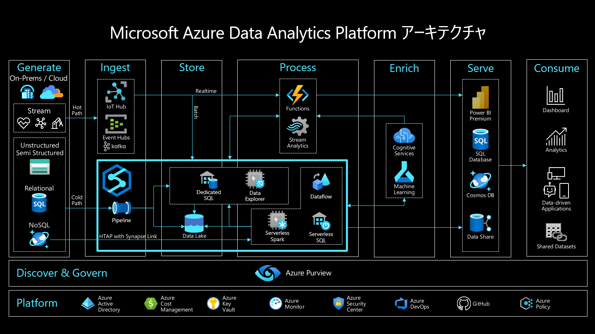  

各層ごとにもう少し理解を進めてみましょう。

### Generate 層  
Generate 層はデータの源泉を示します。クラウドやオンプレ、トランザクションデータやストリームデータ、構造化や半構造化や非構造化データ、など様々な源泉から様々データが生成されます。  

### Ingest 層  
Ingest 層は Generate 層で生成されるデータをとらまえる層で、大きくはバッチ処理系とストリーム処理系の2系統で構成されます。  

- Synapse Pipeline

Synapse Pipeline は前者のバッチ処理による Ingest に対応します。また後者のストリーム処理系には IoT Hub や Event Hub が対応します。  
 

### Store 層  
Store 層は Ingest 層でとらまえた様々なデータを蓄積する層です。Synapse は蓄積先の選択肢を複数もち、データ種類や活用用途に応じて最適な蓄積先を選択することができます。なお、Store 層への蓄積は主としてコールドパス分析やウォームパス分析に対応し、ホットパス分析では Store 層を介さず直接 Process 層でとらまえます。
 

- Data Lake Store  

文字通りデータレイクです。主として、非構造から半構造まで様々な形式のデータを未整形の生データとして格納し、データ活用者は生データに対して未発見のInsightを求め実験的な広域探索をアドホックに行います。  
 

- Synapse Dedicated SQL Pool  
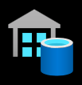
OLAP用途に最適化されたRDBエンジンでいわゆるデータウェアハウスです。主として、業務理解にもとづき整えられた構造化データを格納し、データ活用者は整形済みであるデータに対してビジネス分析を行います。  
 

- Synapse Data Explorer (執筆時点で Preview) 
  
データレイクやデータウェアハウスとは異なりニアリアルタイムな分析に最適化されたエンジンです。主として、メトリックやログを格納し、データ活用者は順次転送されてくるメトリックやログに対してニアリアルタイムな分析（事実把握や監視）を行います。
 

### Process 層
Process 層は Store 層に蓄積されたデータを分析にかける層です。Store 層と同様に Synapse は複数の処理エンジンの選択肢をもち、用途に応じて最適な処理エンジンを選択することができます。なお、ストリームデータについてはStore 層 に永続化される系統（コールドパス分析やウォームパス分析）と、直接リアルタイム分析にかける系統（ホットパス分析）に分岐しており、後者のストリームデータに対するホットパス分析については Functions や Stream Analytics が対応します。

- Synapse Serverless SQL Pool
  
データレイクへのアドホッククエリエンジンです。SQL文（T-SQL）によるデータエンジニアリングに利用します。コンピューティング環境はフルマネージドであるためメンテナンスフリーな一方でそのスペックを調整することはできないため性能の揺れに対する許容が必要です。 
 

- Synapse Serverless Spark Pool
  
Sparkエンジンです。コードファースト（C#、Scala、PySpark、Spark SQL）によるデータエンジニアリングに利用します。処理の実行時に指定したスペックでコンピューティング環境がプロビジョニングされます。  
 

- Synapse DataFlows
  
Sparkエンジンです。ローコード（GUI）によるデータエンジニアリング（主としてPipelineに組み込むデータ加工）に利用します。処理の実行時に指定したスペックでコンピューティング環境がプロビジョニングされます。   
 

### Enrich 層
Enrich 層は Process 層のコンポーネントと連携し機械学習によるデータエンリッチを行う層です。Synapse は Machine Learning Service や Cognitive Services と統合することでデータエンリッチを容易に素早く構成可能です。

### Serve 層
Serve 層は分析されたエンリッチされたインサイトを可視化ツールやデータマートを通じて Cosume 層に提供する層です。Synapse では Power BI や 各種データストアと統合することで Consume 層へのインサイト提供を容易に素早く構成可能です。

### Consume 層
Consume 層は Data Analytics Platform を通じて得られたインサイトを活用しデータドリブンな意思決定の支援を行う層です。

## 4-2. ハンズオンの概要

今回のハンズオンは４つのシナリオを用意しています。４つのシナリオごと章で分けています。ここではそれぞれのシナリオごとに概要を解説します。

### データの統合と可視化（第5章）  
第5章ではまずオンプレからクラウドまで様々な外部のデータソースとのコネクタを持つ Synapse Pipeline を利用してサイロ化されたデータを Data Lak Store へ統合します。統合したデータは Synapse Dataflow による加工処理を通じて整形済みのデータとして Synapse Dedicated に格納します。最後にデータ活用の典型例として、Power BI と連携し整形済みデータの可視化を行います。  

### アドホックデータ探索とデータプレパレーション（第6章）  
第6章では Data Lake Store 上の生データに対するアドホックデータ探索とデータプレパレーションを行います。Synapse は複数の処理エンジンの選択肢をもちますが、ここでは Synapse Serverless Spark Pool を利用するパターンと Synapse Serverless SQL Pool を利用するパターンの2つのパターンを用意しています。また、Azure Purview というデータガバナンスのためのサービスと連携し探索対象データの特定を行うことにも触れていきます。

### 機械学習統合によるデータエンリッチメント（第7章）  
第7章では Synapse Spark を利用したデータプレパレーションと機械学習連携によるデータエンリッチメントを行います。ここでは2つの機械学習連携に触れていきます。ひとつは Azure Machine Learning と連携した自動機械学習によるオリジナルモデルの構築とそれを利用した推論、もうひとつは Azure Cognitive Services と連携し構築済みモデルを利用した推論を行います。

  

### リアルタイムデータ分析（第8章）  
第8章では第5章～第7章のようなバッチ処理とは異なるリアルタイム処理によるデータ分析を行います。ここではトランザクションデータとストリームデータの2種類のデータを扱います。前者のトランザクションデータに対する分析は Synapse がもつ Synapse Link 機能を活用し HTAP（Hybrid Transaction Analytical Processing） による分析を行います。後者のストリームデータについては Azure Stream Analytics によるホットパス分析 と Synapse Data Explorer (執筆時点プレビュ) によるウォームパス分析を行います。

### データ蓄積（第9章）
***TODO: 9章はメッセージとして重要だがハンズオンまでは不要かも。サンプルへのリンクだけの紹介とかでもいいかも***
  - メッセージ：Synapse は データウェアハウス と レイクハウス（データレイク＋アドホッククエリエンジン）の両シナリオに対応（Snowflakeは前者のみ、Databricksは後者のみ）  
    - データウェアハウス：プロビジョニング型（Serverlessと比較すると予測可能な性能）、枯れた技術で機能がリッチ(***スケーラビリティの観点で強化予定あり。Snowflake相当のマルチクラスタ対応***）  
    - レイクハウス：アドホック型でコストメリット、最低限のものはそろってきたけどセキュリティ機能は弱い。  
  - 実感体験として  
    - Synapse Dedicatedによるデータウェアハウスのリッチなセキュリティ機能の体験  
    - Purviewによるレイクハウスのセキュリティ補強の体験  
  - おまけ  
    - Synapse ケーパビリティの網羅の観点でKustoエンジン紹介

  ***TODO: アーキ図挿入***

---
## 4-3. ハンズオンの準備  

さて、いよいよ Azure に触れていきます。ここではまず次章からのハンズオンに備えハンズオンで利用する Azure リソースのデプロイとセットアップを行います。  

先に解説した通り、今回のハンズオンでは Azure Synapse Analytics のほか、以下の一覧にあるように Azure Data Analytics Platform に関連する各種リソースにも触れていきます。

| リソース                 | URL   |
| :----                    | :---- |
| Azure Synapse Analytics  | https://azure.microsoft.com/ja-jp/services/synapse-analytics/ |
| Azure Data Lake Storage  | https://azure.microsoft.com/ja-jp/services/storage/data-lake-storage/ |
| Azure Blob Storage       | https://azure.microsoft.com/ja-jp/services/storage/blobs/ |
| Azure SQL Database       | https://azure.microsoft.com/ja-jp/products/azure-sql/database/ |
| Azure Purview            | https://azure.microsoft.com/ja-jp/services/purview/ |
| Azure Machine Learning   | https://azure.microsoft.com/ja-jp/services/machine-learning/ |
| Azure Cognitive Services | https://azure.microsoft.com/ja-jp/services/
| Azure Key Vault | https://azure.microsoft.com/ja-jp/services/key-vault/ |
| Azure IoT Hub            | https://azure.microsoft.com/ja-jp/services/iot-hub/ |
| Azure Stream Analytics   | https://azure.microsoft.com/ja-jp/services/stream-analytics/ |
| Azure Cosmos DB          | https://azure.microsoft.com/ja-jp/services/cosmos-db/ |
| Powewr BI                | https://powerbi.microsoft.com/ja-jp/ |

各章ごとに利用するリソースは下表の通りです。  

| リソース                 | 第5章 | 第6章 | 第7章 | 第8章 | 第9章 |
| :----                    | :---: | :---: | :---: | :---: | :---: |
| Azure Synapse Analytics  | ○    | ○    | ○    | ○    | ○    |
| Azure Data Lake Storage  | ○    | ○    | ○    | ○    | ○    |
| Azure Blob Storage       | ○    | －    | －    | －    | －    |
| Azure SQL Database       | ○    | －    | －    | －    | －    |
| Azure Purview            | ○    | ○    | －    | －    | －    |
| Azure Machine Learning   | －    | －    | ○    | －    | －    |
| Azure Cognitive Services | －    | －    | ○    | －    | －    |
| Azure Key Vault          | －    | －    | ○    | －    | －    |
| Azure IoT Hub            | －    | －    | －    | ○    | －    |
| Azure Stream Analytics   | －    | －    | －    | ○    | －    |
| Azure Cosmos DB          | －    | －    | －    | ○    | －    |
| Powewr BI                | ○    | －    | －    | ○    | －    |

なお、6章についてのみ5章のハンズオンの完了を前提にしていますが、それ以外は章ごとの以前関係はありません。そのためお試しするハンズオンの章に必要となるリソースのみを準備いただくことも可能な構成をとっているので興味のあるものをピックアップしてください。  

また、各リソースはコストを抑えるためにハンズオンのための最小限の構成でセットアップを行います。ただし、Synapse Analytics の Dedicated SQL Pool と Data Explorer Pool のコストをさらに抑えるためにはハンズオン中以外は停止しておくことをお勧めします。

### 4-3-1. 共通準備

ここではシナリオ共通の準備を行います。

#### ハンズオンのアセット一式をダウンロード   

ハンズオンに利用するサンプルデータ、サンプルスクリプト、サンプルレポートをあらかじめ用意してあります。  
これらアセット一式は GitHub リポジトリに公開しています。

https://github.com/gho9o9/SynapseHandsOn

上記のサイトにアクセスし ZIP ファイルをダウンロードし解凍しておいてください。  

#### Power BI Desktop のインストール

***TODO：ダウンロード版とMicrosoft Store版がある（とりあえず 自動アップデートされるMS Store版で解説👇）***  
***TODO: 参考：https://bi-seminar.jp/2018/03/07/power-bi-desktop-2way-install/***

今回のハンズオンでは分析データの可視化に Power BI を利用します。  
https://powerbi.microsoft.com/ja-jp/downloads/

上記のサイトにアクセスし、Power BI Desktop をインストールしてください。  
  
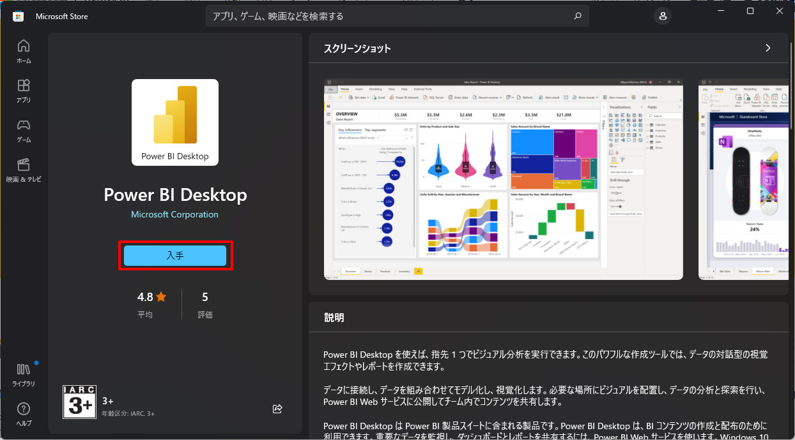

#### リソースプロバイダーの登録

Azure で リソースをデプロイする際は、サブスクリプションごとに該当するリソースに関連するリソースプロバイダーを登録しておく必要があります。
今回の一連のハンズオンで利用する Azure リソース に関連する以下のすべてのリソースプロバイダーが *NotRegistered* となっている場合には登録を行い *Registered* としてください。

 - Microsoft.Synapse
 - Microsoft.Sql
 - Microsoft.DataLakeStore
 - Microsoft.Storage  ***明示的に実施***
 - Microsoft.Purview  ***明示的に実施***
 - Microsoft.EventHub（Purviewに付随）  ***明示的に実施***
 - Microsoft.KeyVault
 - Microsoft.StreamAnalytics
 - Microsoft.CognitiveServices
 - Microsoft.Devices
 - Microsoft.DocumentDB
 - Microsoft.Insights
 - Microsoft.ContainerRegistry
 - Microsoft.MachineLearningServices
 - Microsoft.AlertsManagement
 - ***TODO：リストアップ***
   - https://docs.microsoft.com/ja-jp/azure/azure-resource-manager/management/azure-services-resource-providers#find-resource-provider

リソースプロバイダーごと状態を確認します。  

該当のリソースプロバイダーの状態「NotRegistered」となっている場合は、リソースプロバイダーを選択し登録ボタンを押下します。  
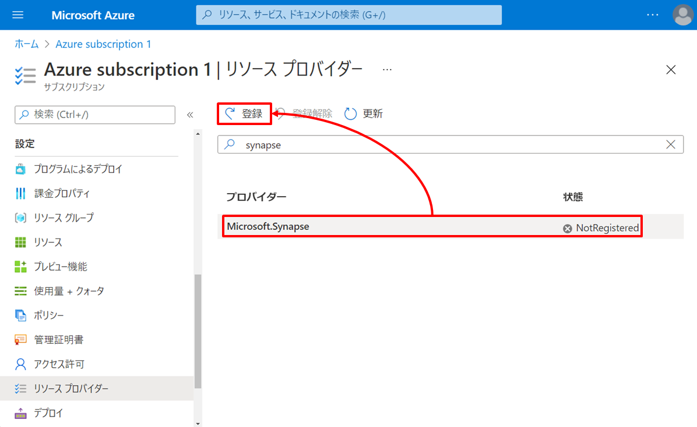  

登録ボタンの押下後、状態が Registering から Registered になれば登録完了です。  

### 4-3-2. 第5章、第6章向け事前準備

ここでは第5章と第6章向けの事前準備を行います。  

#### Synapse Workspace のデプロイ（これは2章で説明ずみなので書籍からはカット）

検索  

作成  
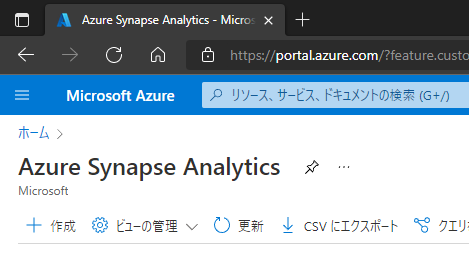

基本  

セキュリティ  
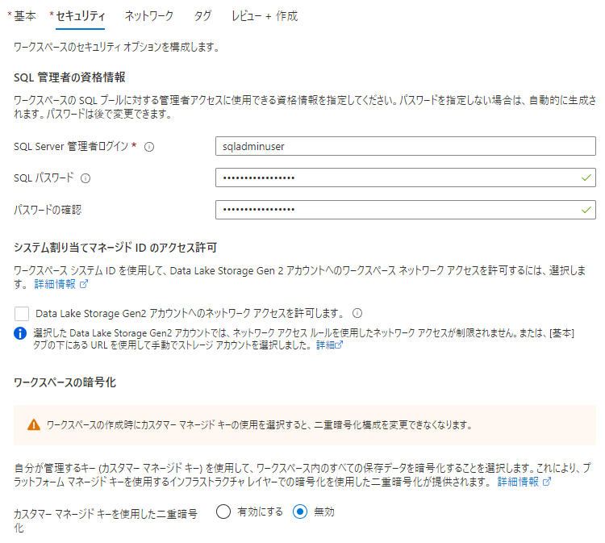

ネットワーク  

タグ  

レビュー＋作成  

#### Synapse Dedicated SQL Pool の作成

Synapse Dedicated SQL Pool を作成します。
Synapse Workspace の Portal メニュを辿り *＋新規* をクリックします。  
  

以下の通り必要情報を入力します。  

| タブ | 項目 | 値 |
| :---- | :---- | :---- |
| 基本 | 専用 SQL プール名 | 例：dedicatedsql |
| 基本 | パフォーマンスレベル | 例：DW100c |
| 追加設定 | 既存のデータを使用します | 例：なし |
| 追加設定 | 専用 SQL プールの照合順序 | 例：Japanese_XJIS_100_CS_AS_KS_WS |

  
  

その他の入力項目は既定のまま *＋作成* を押下し Synapse Dedicated SQL Pool を作成します。  
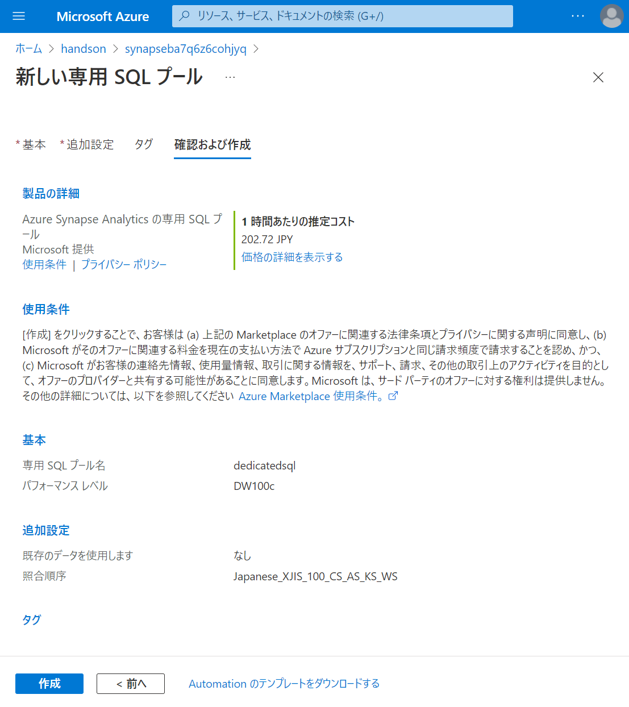

なお、Synapse Dedicated SQL Pool の起動中は未使用の場合でも課金されるため、ハンズオン中以外は停止しておくことをお勧めします。
  

#### Synapse Serverless Spark Pool の作成

Synapse Serverless Spark Pool を作成します。
Synapse Workspace の Portal メニュを辿り *＋新規* をクリックします。  
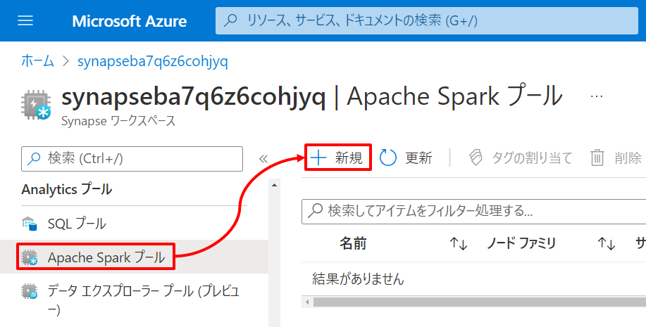  

以下の通り必要情報を入力します。  

| タブ | 項目 | 値 |
| :---- | :---- | :---- |
| 基本 | Apache Spark プール名 | 例：spark31 |
| 基本 | ノードサイズ | 例：small |
| 基本 | 自動スケーリング | 例：有効 |
| 基本 | ノード数 | 例：3 ~ 5 |
| 基本 | エグゼキューターを動的に割り当てる | 例：無効 |
| 追加設定 | 自動一時停止中 | 例：有効 |
| 追加設定 | アイドル状態の時間 | 例：15分 |
| 追加設定 | Apache Spark | 3.1 |

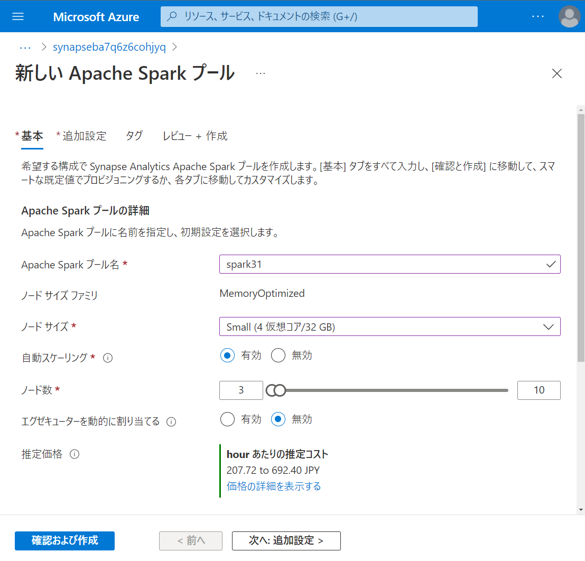  
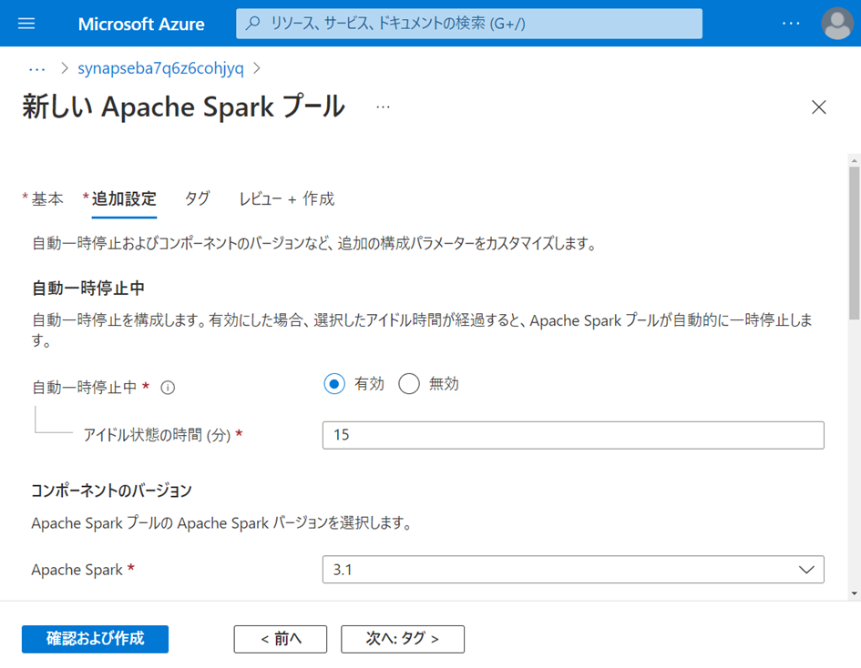  

その他の入力項目は既定のまま *＋作成* を押下し Synapse Serverless Spark Pool を作成します。  
  

#### その他の Azure リソースのデプロイ

Synapse Analytics 以外の Azure リソースについては解説を割愛し事前に準備された ARM テンプレートを使用してデプロイします。  

この ARM テンプレート は 以下の Azure リソースをデプロイします。

- Azure Blob Storage
- Azure SQL Database
- Azure Purview

Deploy to Azure ボタンをクリックします。  
  
***TODO：書籍用にURL表記が必要***

Azure へログインします。  

以下の通り必要情報を入力します。  

| タブ | 項目 | 値 |
| :---- | :---- | :---- |
| 基本 | サブスクリプション | ハンズオン用のサブスクリプションを指定します |
| 基本 | リソースグループ | 例：handson |
| 基本 | SQL Database Server Name | SQL Database の論理 SQL サーバ名を指定します（例：sqlserver） |
| 基本 | SQL Database Name | SQL Database のデータベース名を指定します（例：sqldb） |
| 基本 | SQL Database Admin | SQL Database の サーバ管理者名を指定します（例：sqladminuser） |
| 基本 | SQL Database Admin Password | SQL Database の サーバ管理者のパスワードを指定します |
| 基本 | Purview Account Name | Purview アカウント名を指定します（例：purview） |
| 基本 | Storage Account Name | Storage アカウント名を指定します（例：storage） |
| 基本 | Blob Container Name | Storage アカウント配下に作成する Blob コンテナ名を指定します（例：blob） |

なお、この ARM テンプレート では Azure リソース名がグローバルで一意となるように、指定された文字列の末尾にユニークな文字列を自動追加しています。  

パラメータを入力したら作成ボタンを押下しデプロイの完了を待ちます。  
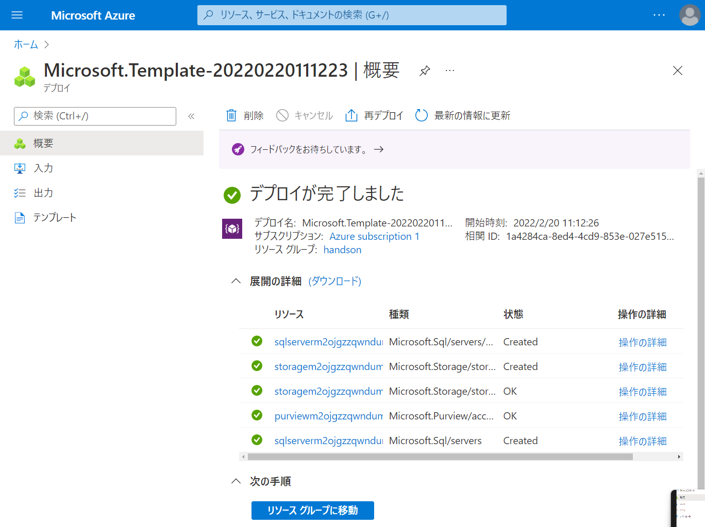

#### Azure リソースの Set Up

ここでは デプロイ後の Azure リソースに対してハンズオンに備えたいくつかのセットアップを行います。  

##### Blob へのデータファイルの作成

分析対象とするハンズオン用のサンプルデータを Blob に準備します。    
今回は Python SDK を通じて[ニューヨークイエロータクシー乗車記録](https://docs.microsoft.com/ja-jp/azure/open-datasets/dataset-taxi-yellow?tabs=azureml-opendatasets)のオープンデータを取得しこれを CSV ファイルとして Blob へ格納します。  

まずは ノートブックをインポートしましょう。メニュを辿り *インポート* をクリックし *resource\script\CreateNYCTaxiCSVFiles.ipynb* をインポートします。  
  

ノートブックが開いたら<Storage アカウント名>、<Storage コンテナ名>、<Storage アカウントキー>をそれぞれ環境に合わせて編集します。<Storage アカウントキー>は Portal メニュを辿ることで確認できます。  
  

パラメータの編集したのち、ノートブックの実行環境とする Spark Pool を指定し実行します。  
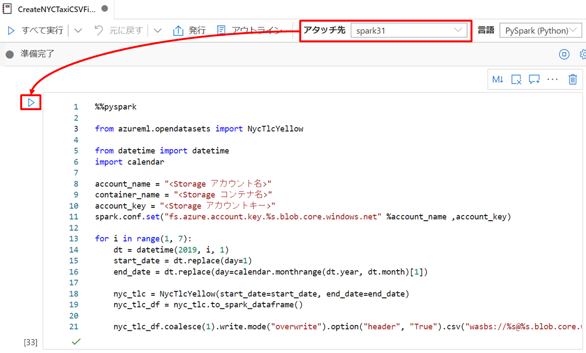  

処理が正常終了すると、*blob\source\nyctaxidata* 配下に2019年1月から6月までそれぞれフォルダが作成され、それぞれのフォルダ配下に単一の CSV ファイルが作成されます。  
  

##### SQL Database のスキーマ定義とデータ投入

同様に分析に活用するサンプルデータを SQL Database に準備します。  
まずはじめに SQL Database Server の Portal メニュの「ファイアウォールと仮想ネットワーク」の設定でクライアントIPからの接続を許可してください。  
  

次に SQL Database の Portal メニュの「クエリエディタ」から SQLDB にログインします。  
  

「クエリを開く」から *resource/script/sqldb.sql* を開き「実行」します。  
このスクリプトは TaxiLocationLookup のテーブル定義とデータ挿入を行っています。  
  

### 4-3-3. 第7章向け事前準備  

ここでは第7章向けの事前準備を行います。  

#### Cognitive Services マルチアカウントのデプロイ  

***MEMO:AI TeramがPortalじゃないとできないため）***

Cognitive Services マルチアカウントをデプロイします。  
Portal 検索ボックスから Cognitive Services マルチアカウント を検索し選択します。  
  

*＋作成* をクリックします。  
  

以下の通り必要情報を入力します。  

| タブ | 項目 | 値 |
| :---- | :---- | :---- |
| 基本 | サブスクリプション | ハンズオン用のサブスクリプションを指定 |
| 基本 | リソースグループ | 例：handson |
| 基本 | 名前 | 任意の名前を指定してください。 |
| 基本 | 価格レベル | 例：Standard S0 |
| 基本 | 責任ある AI 通知 | ご契約条件へ同意の場合チェックボックスをONにしてください。 |

その他の入力項目は既定のまま *＋作成* を押下し Cognitive Services マルチアカウントをデプロイします。  
  

#### その他の Azure リソースのデプロイ（AML,AKV,個別Cogs（感情分析と異常検出））  

その他の Azure リソースについては、解説を割愛して ARM テンプレートを使用してデプロイします。  
Deploy to Azure ボタンをクリックします。  

  
***TODO：書籍用にURL表記が必要***  

Azure へログインします。  
  

以下の通り必要情報を入力します。  

| タブ | 項目 | 値 |
| :---- | :---- | :---- |
| 基本 | サブスクリプション | ハンズオン用のサブスクリプションを指定します |
| 基本 | リソースグループ | 例：handson |
| 基本 | Machine Learning Workspace Name | Machine Learning のワークスペース名を指定します（例：ml） |
| 基本 | Key Vault Name | Key Vault 名を指定します（例：keyvault） |
| 基本 | Anomaly Detector Name | Anomaly Detector 名を指定します（例：anomalydetection） |
| 基本 | Text Analytics Name | Text Analytics 名を指定します（例：textanalytics） |

なお、この ARM テンプレート では Azure リソース名がグローバルで一意となるように、指定された文字列の末尾にユニークな文字列を自動追加しています。  

  

パラメータを入力したら作成ボタンを押下しデプロイの完了を待ちます。  
  

#### Azure リソースの Set Up  

ここでは デプロイ後の Azure リソースに対してハンズオンに備えたいくつかのセットアップを行います。  

##### Data Lake Store へのサンプルデータのコピー  

異常検出に利用するサンプルデータを Data Lake Store へコピーします。  
まず、Portalのデータエクスプローラーからディレクトリ *synapsefs/source/IoTSignals* を作成します。  
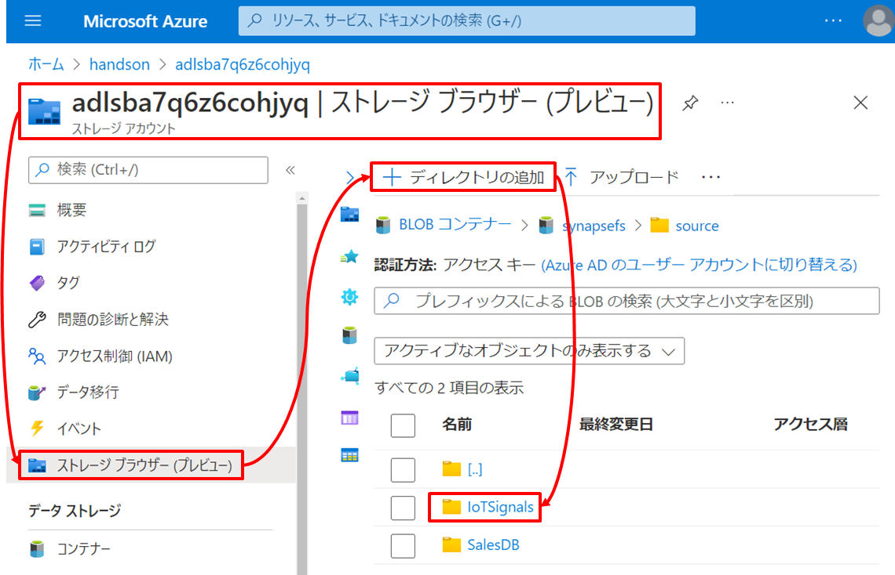  

作成したディレクトリに *resource/data/IoTSignals.csv* をアップロードします。  
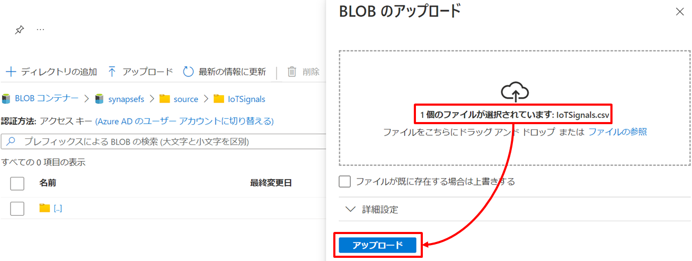  
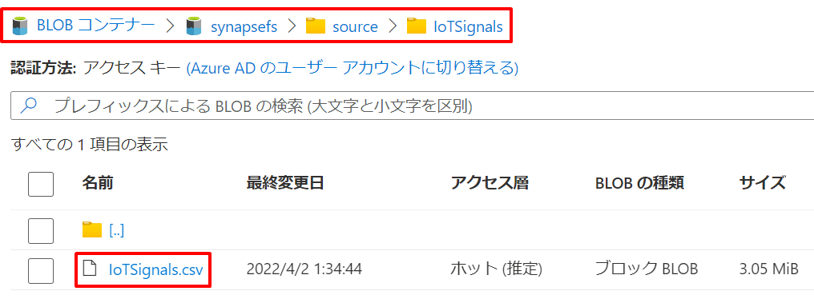  

***TODO：↓ファイルデカすぎる問題をどうする？***

続けて、機械学習モデル構築に利用するサンプルデータを Data Lake Store へコピーします。  
*synapsefs/source* ディレクトリに *resource/data/wwi* ディレクトリごと全ファイルをアップロードします。  

### 4-3-4. 第8章向け事前準備

#### Synapse Data Explorer Pool の作成

Synapse Data Explorer Pool を作成します。
Synapse Workspace の Portal メニュを辿り *＋新規* をクリックします。  
  

以下の通り必要情報を入力します。  

| タブ | 項目 | 値 |
| :---- | :---- | :---- |
| 基本 | データ エクスプローラー プール名 | 例：sdxpreview |
| 基本 | ワークロード | 例：コンピューティング最適化 |
| 基本 | サイズ | 例：極小規模（2コア） |
| 追加設定 | スケーリング方法 | 例：手動スケール |
| 追加設定 | インスタンス数 | 例：2 |
| 追加設定 | ストリーミング インジェスト | 例：オフ |
| 追加設定 | 消去を有効にする | 例：オフ |

  
  

その他の入力項目は既定のまま *＋作成* を押下し Synapse Data Explorer Pool を作成します。  
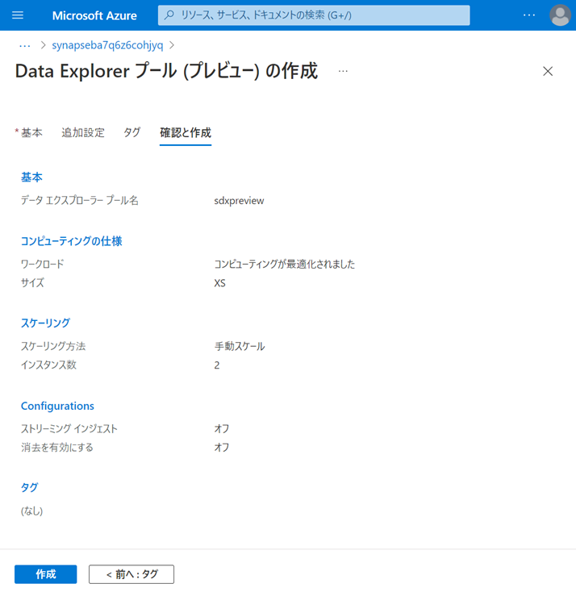  

なお、Synapse Data Explorer Pool の起動中は未使用の場合でも課金されるため、ハンズオン中以外は停止しておくことをお勧めします。
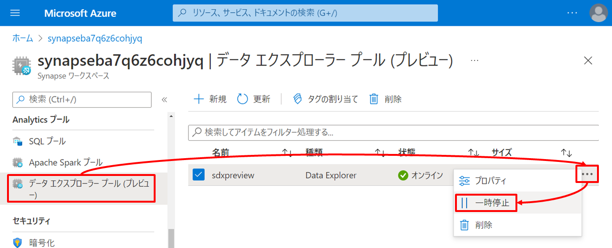  

#### その他の Azure リソースのデプロイ（IoT / ASA / Cocsmos）

Synapse Analytics 以外の Azure リソースについては解説を割愛し事前に準備された ARM テンプレートを使用してデプロイします。  
Deploy to Azure ボタンをクリックします。  

  
***TODO：書籍用にURL表記が必要***

以下の通り必要情報を入力します。  

| タブ | 項目 | 値 |
| :---- | :---- | :---- |
| 基本 | サブスクリプション | ハンズオン用のサブスクリプションを指定します |
| 基本 | リソースグループ | 例：handson |
| 基本 | Iot Hub Name | IoT Hub 名を指定します（例：iothub） |
| 基本 | Cosmos DB Account Name | Cosmos DB アカウント名を指定します（例：cosmos） |
| 基本 | Stream Job Name | Stream Analytics ジョブ名を指定します（例：streamjob） |

なお、この ARM テンプレート では Azure リソース名がグローバルで一意となるように、指定された文字列の末尾にユニークな文字列を自動追加しています。  

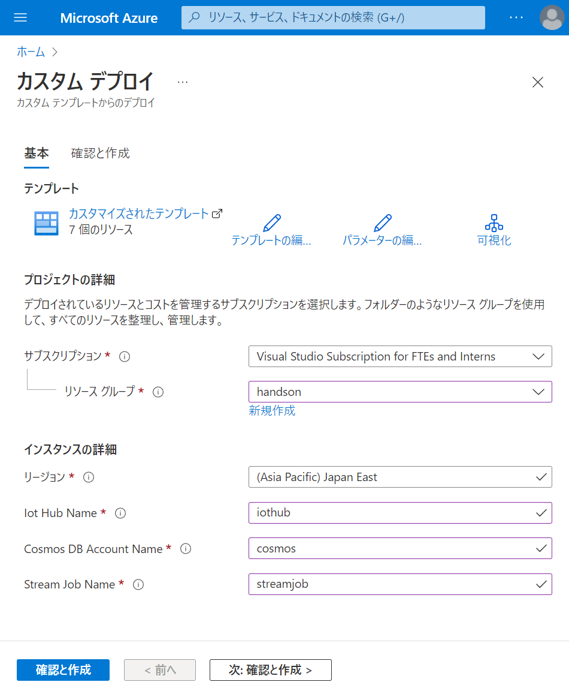  

パラメータを入力したら作成ボタンを押下しデプロイの完了を待ちます。  
   

#### Azure リソースの Set Up

ここでは デプロイ後の Azure リソースに対してハンズオンに備えたいくつかのセットアップを行います。  

##### Data Lake Store へのサンプルデータのコピー  

HTAPによる分析に利用するサンプルデータを Data Lake Store へコピーします。  
Portalのデータエクスプローラーからディレクトリ *synapsefs/source/SalesDB* を作成します。  
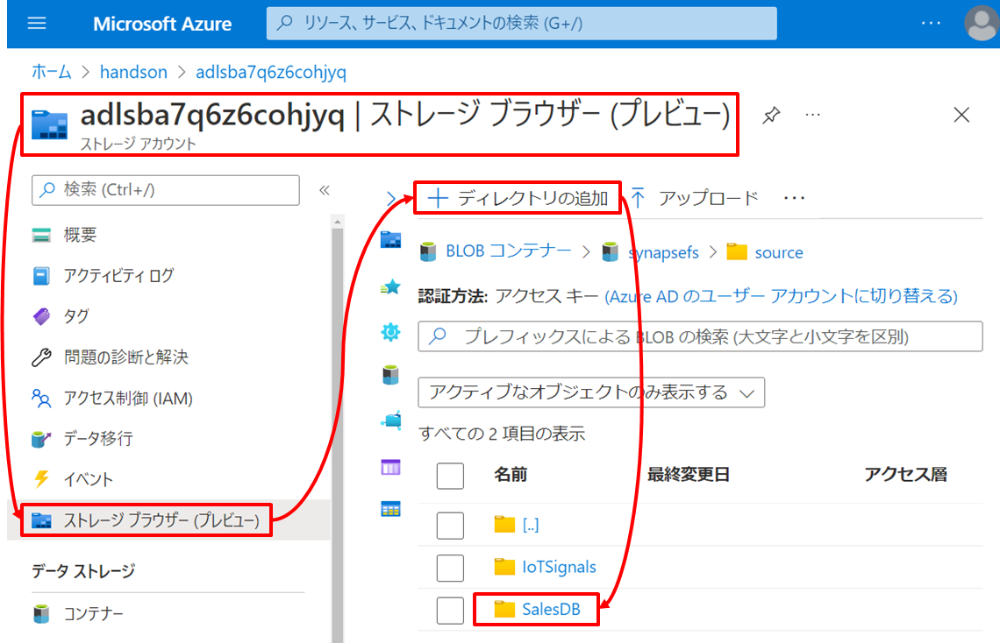  

作成したディレクトリに *resource/data/customer.json* と *resource/data/salesOrder.json* をアップロードします。  
  
  