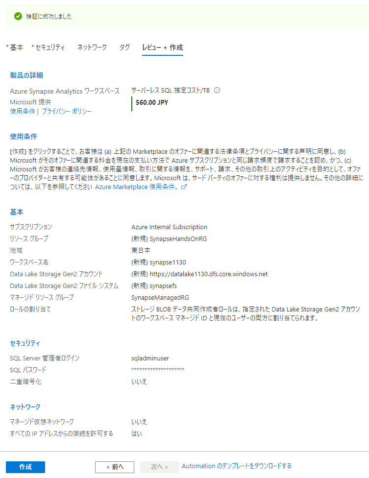
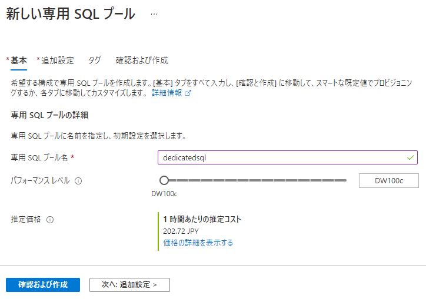
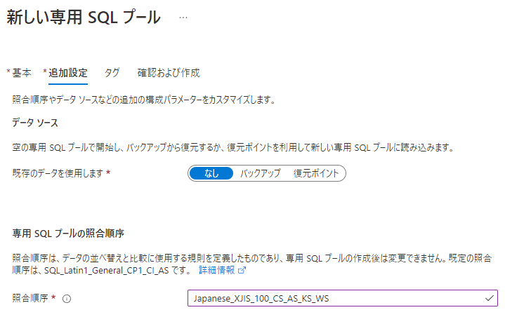
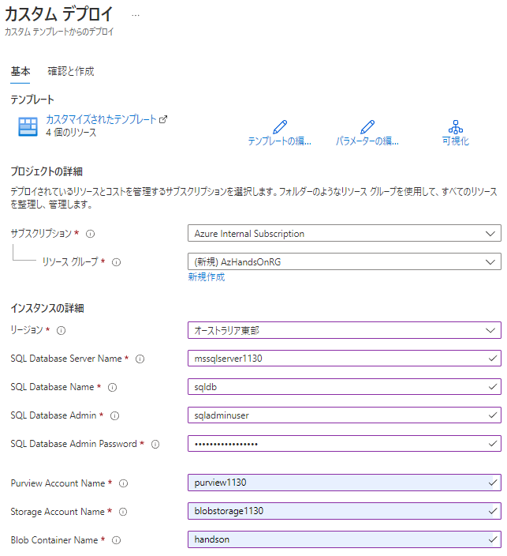
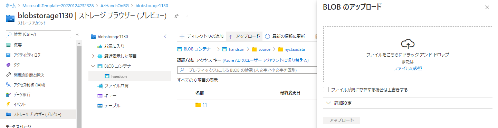
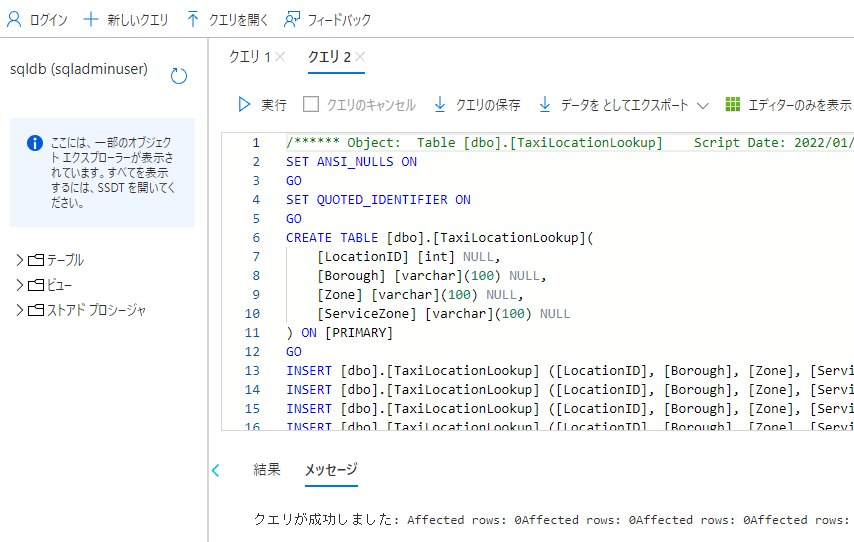
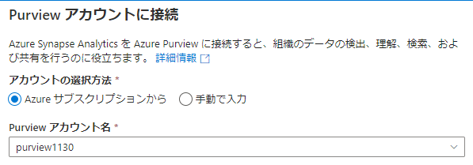

---
## **事前準備**

1. リソース一式をダウンロード   

   1. [Github](https://github.com/gho9o9/SynapseHandsOn)  

      

   2. [Sample Data](https://o9o9storageshare.blob.core.windows.net/share/synapse_hands_on/nyctaxidata.zip)  
      
      

2. Azure リソースのデプロイ

   1. Synapse のデプロイ

      1. 検索  
         

      2. 作成  
         

      3. 基本  
         

      4. セキュリティ  
         

      5. ネットワーク  
         

      6. タグ  
         

      7. レビュー＋作成  
         
   
   2. Synapse Dedicated SQL Pool の作成
   
      1. 作成  

        

      2. 基本  
        
        | 項目 | 値 |
        | :---- | :---- |
        | 専用 SQL プール名 | 例：dedicatedsql |
        | パフォーマンスレベル | 例：DW100c |

        

      3. 追加設定
        
        | 項目 | 値 |
        | :---- | :---- |
        | 照合順序 | 例：Japanese_XJIS_100_CS_AS_KS_WS |      

        

      4. タグ

        

      5. 確認および作成

        

   3. その他のAzureリソースのデプロイ  
      
      1. Deploy to Azure ボタンをクリック  

         

      2. Azure ログイン  

         

      3. パラメータ指定  

         

      4. 作成  
      
            
      
3. Azure リソースの Set Up  

   1. Blob へのデータファイルのアップロード  

      1. Portalのデータエクスプローラーからディレクトリ *source/nyctaxidata* を作成

         

      2. Sample Data 一式をアップロード

         

   2. SQLDB のスキーマ定義とデータ投入  

      1. Azure Portal の SQL Database Server の「ファイアウォールと仮想ネットワーク」の設定でクライアントIPからの接続を許可します。
         
         

      2. Azure Portal の SQL Database の「クエリエディタ」から SQLDB にログイン  

         

      3. 「クエリを開く」から *resource/script/sqldb.sql* を開き「実行」  

         

   3. Synapse と Purview のリンク  

      1. Synapse Studio 起動  
         
          

      2.  Purview カウントに接続  

          

          

          

4. Power BI Desktop のインストール  
   
   https://powerbi.microsoft.com/ja-jp/downloads/

   

   

