---
# 4. ハンズオンの概要とハンズオンリソースの準備  

第5章～第9章では第2章～第3章で学んだ基礎知識を踏まえて、実際のユースケースに対する Azure Synapse Analytics (Synapse) の機能に Step-by-Step のハンズオンを行います。  
本章ではハンズオンに先立ち第5章～第9章のハンズオンの概要説明とハンズオンに必要となるリソースの準備を行います。

---
## 4-1. ハンズオンの概要

ここでは第5章～第9章のハンズオンの概要を説明します。
第6章のみ第5章のハンズオンを前提にしていますが、それ以外の章は単独でハンズオン可能になっているため、興味のあるハンズオンを個別に試していただくことができる構成になっています。

### 4-1-1. Azure における Data Analytics Platform 全体アーキテクチャ

***TODO: なんか書く***


### 4-1-2. 各章の解説

***MEMO: ここでは具体的なシナリオには触れず何をやるかを簡単に説明する。***

#### 第5章：データの統合と可視化  
外部データソースとの多様なコネクタを持つ Synapse Pipeline を利用してサイロ化されたデータをデータレイクへ統合します。統合したデータは Synapse Dataflow による加工処理を通じ整形済みデータとして Synapse Dedicated に格納します。最後にデータ活用の典型例として、Power BI と連携し整形済みデータの可視化を行います。  


#### 第6章：アドホックデータ探索とデータプレパレーション  
Synapse が持つ多様なクエリエンジンである Synapse Spark や Synapse Serverless を利用してデータレイク上のデータに対するアドホック探索を行います。また、Azure Purview (Purview) を利用して探索対象となるデータ資産の検索についても触れていきます。


#### 第7章：機械学習統合によるデータエンリッチメント  
Synapse が持つクエリエンジンを利用したデータプレパレーションと該当データによる機械学習を行います。ここでは2つのシナリオに触れていきます。ひとつは Azure Machine Learning (AML) と連携した自動機械学習によるオリジナルモデルの構築とそれを利用した推論を行います。もうひとつは Azure Cognitive Services (ACS) と連携し構築済みモデルを利用した推論を行います。

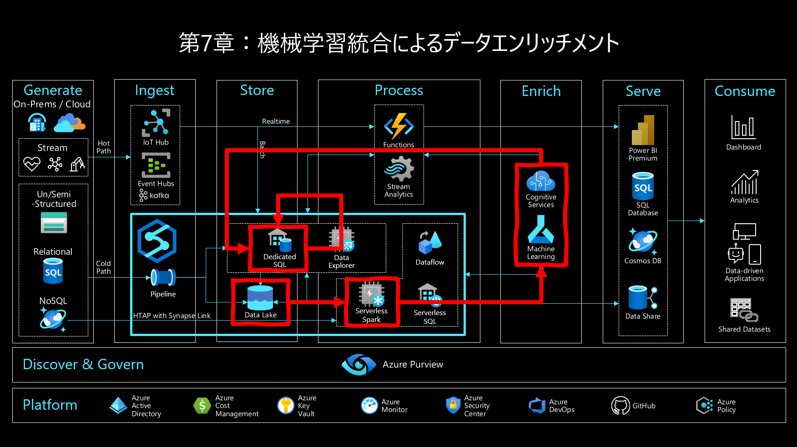  

#### 第8章：リアルタイムデータ分析  
第5章～第7章のようなバッチ処理ではなくリアルタイム処理によるデータ分析を行います。ここでは2つのシナリオに触れていきます。ひとつは Azure Stream Analytics (ASA) と連携してストリームデータをリアルタイムに分析します。もうひとつは Synapse Link 機能による Azure Cosmos DB (Cosmos) 連携によりトランザクションデータをリアルタイムに分析します。

  

#### 第9章：データ蓄積（***TODO: 9章はメッセージとして重要だがハンズオンまでは不要かも。サンプルへのリンクだけの紹介とかでもいいかも***）
  - メッセージ：Synapse は データウェアハウス と レイクハウス（データレイク＋アドホッククエリエンジン）の両シナリオに対応（Snowflakeは前者のみ、Databricksは後者のみ）  
    - データウェアハウス：プロビジョニング型（Serverlessと比較すると予測可能な性能）、枯れた技術で機能がリッチ(***スケーラビリティの観点で強化予定あり。Snowflake相当のマルチクラスタ対応***）  
    - レイクハウス：アドホック型でコストメリット、最低限のものはそろってきたけどセキュリティ機能は弱い。  
  - 実感体験として  
    - Synapse Dedicatedによるデータウェアハウスのリッチなセキュリティ機能の体験  
    - Purviewによるレイクハウスのセキュリティ補強の体験  
  - おまけ  
    - Synapse ケーパビリティの網羅の観点でKustoエンジン紹介

  ***TODO: アーキ図挿入***

---
## 4-2. ハンズオンリソースの一覧  

ここでは第5章～第9章のハンズオンで必要となる以下のリソースの準備を行います。

| リソース                 | URL   |
| :----                    | :---- |
| Azure Synapse Analytics  | https://azure.microsoft.com/ja-jp/services/synapse-analytics/ |
| Azure Data Lake Storage  | https://azure.microsoft.com/ja-jp/services/storage/data-lake-storage/ |
| Azure Blob Storage       | https://azure.microsoft.com/ja-jp/services/storage/blobs/ |
| Azure SQL Database       | https://azure.microsoft.com/ja-jp/products/azure-sql/database/ |
| Azure Purview            | https://azure.microsoft.com/ja-jp/services/purview/ |
| Azure Machine Learning   | https://azure.microsoft.com/ja-jp/services/machine-learning/ |
| Azure Cognitive Services | https://azure.microsoft.com/ja-jp/services/cognitive-services/ |
| Azure IoT Hub            | https://azure.microsoft.com/ja-jp/services/iot-hub/ |
| Azure Stream Analytics   | https://azure.microsoft.com/ja-jp/services/stream-analytics/ |
| Azure Cosmos DB          | https://azure.microsoft.com/ja-jp/services/cosmos-db/ |
| Powewr BI                | https://powerbi.microsoft.com/ja-jp/ |

各章ごとに利用するリソースは下表の通りです。お試しするハンズオンの章に必要となるリソースのみを準備いただくことも可能です。

| リソース                 | 第5章 | 第6章 | 第7章 | 第8章 | 第9章 |
| :----                    | :---: | :---: | :---: | :---: | :---: |
| Azure Synapse Analytics  | ○    | ○    | ○    | ○    | ○    |
| Azure Data Lake Storage  | ○    | ○    | ○    | ○    | ○    |
| Azure Blob Storage       | ○    | －    | －    | －    | －    |
| Azure SQL Database       | ○    | －    | －    | －    | －    |
| Azure Purview            | ○    | ○    | －    | －    | －    |
| Azure Machine Learning   | －    | －    | ○    | －    | －    |
| Azure Cognitive Services | －    | －    | ○    | －    | －    |
| Azure IoT Hub            | －    | －    | －    | ○    | －    |
| Azure Stream Analytics   | －    | －    | －    | ○    | －    |
| Azure Cosmos DB          | －    | －    | －    | ○    | －    |
| Powewr BI                | ○    | －    | －    | ○    | －    |

***TODO: ↑費用についての言及***

## 4-3. ハンズオンリソースの準備  

### 4-3-1. 共通準備

#### リソース一式をダウンロード   

- [Github](https://github.com/gho9o9/SynapseHandsOn)  
***TODO：書籍用にURL表記が必要***


- [Sample Data](https://o9o9storageshare.blob.core.windows.net/share/synapse_hands_on/nyctaxidata.zip)  
***TODO：書籍用にURL表記が必要***   


### 4-3-2. 第5章、6章向け事前準備

#### リソースプロバイダーの登録

以下のリソースそれぞれについてリソースプロバイダーの状態を確認します。  
 - Microsoft.Synapse
 - Microsoft.Sql
 - Microsoft.DataLakeStore
 - Microsoft.Storage  ***明示的に実施***
 - Microsoft.Purview  ***明示的に実施***
 - Microsoft.EventHub（Purviewに付随）  ***明示的に実施***


該当のリソースプロバイダーの状態「NotRegistered」となっている場合は、リソースプロバイダーを選択し登録ボタンを押下します。

  

登録ボタンの押下後、状態が Registering から Registered になれば登録完了です。

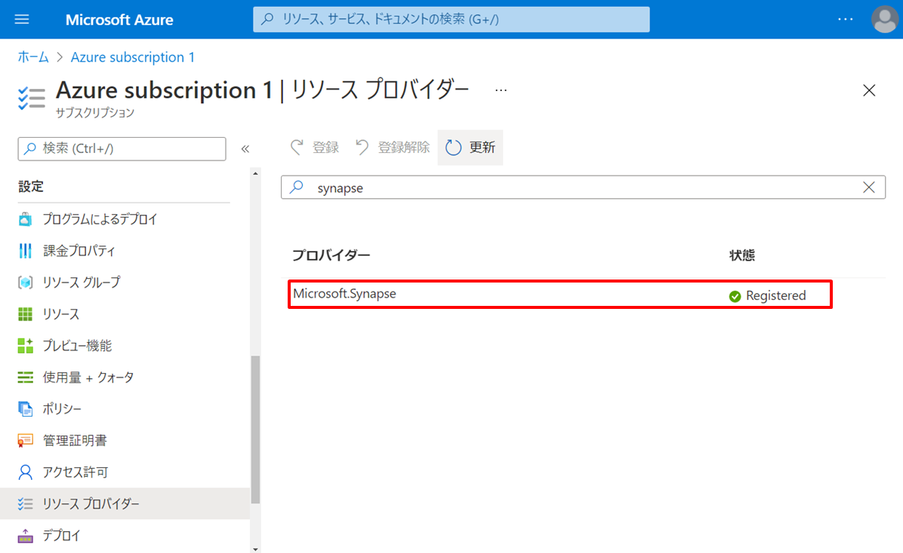

#### Synapse Workspace のデプロイ（これは2章で説明ずみなので書籍からはカット）

検索  


作成  


基本  


セキュリティ  


ネットワーク  


タグ  


レビュー＋作成  


#### Synapse Dedicated SQL Pool の作成

作成  
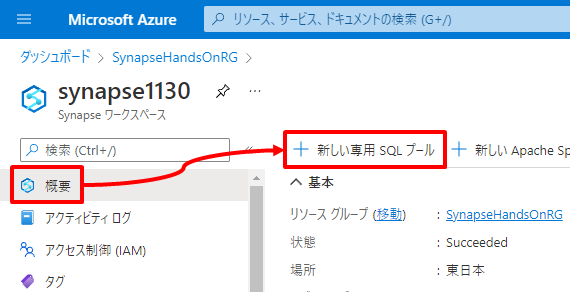

基本  
***TODO：後続のPower BIレポートはDB名を即値dedicatedsqlが前提（pbitのパラメータにできる？）***

| 項目 | 値 |
| :---- | :---- |
| 専用 SQL プール名 | 例：dedicatedsql |
| パフォーマンスレベル | 例：DW100c |


追加設定  

| 項目 | 値 |
| :---- | :---- |
| 照合順序 | 例：Japanese_XJIS_100_CS_AS_KS_WS |      


タグ  


確認および作成  
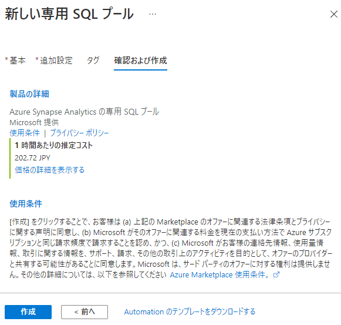

#### Synapse Spark Pool の作成

作成  


基本  

| 項目 | 値 |
| :---- | :---- |
| Apache Spark プール名 | 例：spark31 |
| ノードサイズ | 例：small |
| 自動スケーリング | 例：有効 |
| ノード数 | 例：3 ~ 5 |


追加設定  

| 項目 | 値 |
| :---- | :---- |
| 自動一時停止中 | 有効 |
| アイドル状態の時間 | 15分 |
| Apache Spark | 3.1 |


タグ  


レビュー + 作成  


#### その他の Azure リソースのデプロイ

Deploy to Azure ボタンをクリックします。  

[](https://portal.azure.com/#create/Microsoft.Template/uri/https%3A%2F%2Fraw.githubusercontent.com%2Fgho9o9%2FSynapseHandsOn%2Fmain%2Fresource%2Fdeploy%2Fazuredeploy.json)  
***TODO：書籍用にURL表記が必要***

Azure へログインします。  


それぞれパラメータ指定します。なお、SQL Database Server Name や Storage Account Name などグローバルで一意な名前が必要なパラメータについては内部的にユニークな文字をSafixに自動追加しています。  


パラメータを入力したら作成ボタンを押下しデプロイの完了を待ちます。  


#### Azure リソースの Set Up

##### Blob へのデータファイルのアップロード

Portalのデータエクスプローラーからディレクトリ *source/nyctaxidata* を作成


Sample Data 一式を *source/nyctaxidata* にアップロード

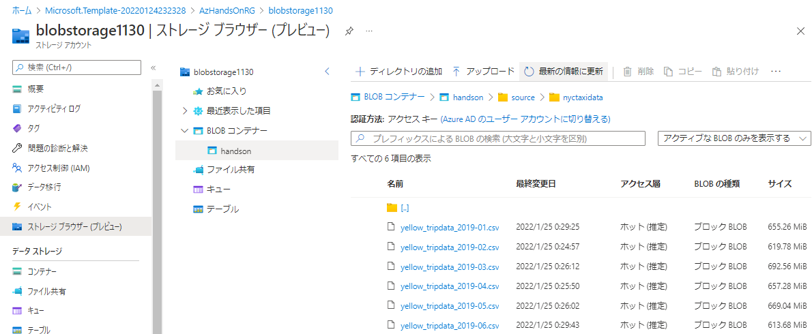

***TODO: データセットはオープンデータを利用***
作り方↓
https://ms.web.azuresynapse.net/authoring/analyze/notebooks/CreateNYCTaxiDataFile?workspace=%2Fsubscriptions%2F6f11db96-1ff9-4887-ab71-7d65065f8b98%2FresourceGroups%2FSandbox%2Fproviders%2FMicrosoft.Synapse%2Fworkspaces%2Fo9o9synapse

##### SQLDB のスキーマ定義とデータ投入

Azure Portal の SQL Database Server の「ファイアウォールと仮想ネットワーク」の設定でクライアントIPからの接続を許可します。

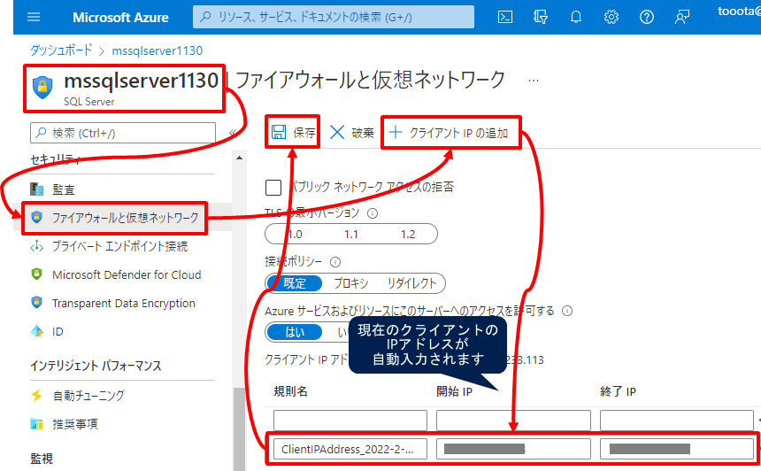

Azure Portal の SQL Database の「クエリエディタ」から SQLDB にログイン  


「クエリを開く」から *resource/script/sqldb.sql* を開き「実行」  


##### Synapse と Purview のリンク

Synapse Studio 起動  

Synapse の Poratal メニュを辿り Synapse Studio を起動します。  


Purview カウントに接続  


#### Power BI Desktop のインストール

***TODO：ダウンロード版とMicrosoft Store版がある（とりあえず 自動アップデートされるMS Store版で解説👇）***  
***TODO: 参考：https://bi-seminar.jp/2018/03/07/power-bi-desktop-2way-install/***

https://powerbi.microsoft.com/ja-jp/downloads/


### 4-3-3. 第7章向け事前準備

#### リソースプロバイダーの登録

以下のリソースそれぞれについてリソースプロバイダーの状態を確認します。  
 - ***TODO:リストアップ***


該当のリソースプロバイダーの状態「NotRegistered」となっている場合は、リソースプロバイダーを選択し登録ボタンを押下します。

  

登録ボタンの押下後、状態が Registering から Registered になれば登録完了です。


#### Cogsのデプロイ（AI TeramがPortalじゃないとできないため）

***TODO***
GUIでの感情分析と異常検出はマルチサービスアカウントではだめで個別に作らないとダメ。

#### その他の Azure リソースのデプロイ（AML,AKV,個別Cogs（感情分析と異常検出））

Deploy to Azure ボタンをクリックします。  

[](https://portal.azure.com/#create/Microsoft.Template/uri/https%3A%2F%2Fraw.githubusercontent.com%2Fgho9o9%2FSynapseHandsOn%2Fmain%2Fresource%2Fdeploy%2Fazuredeploy_aml.json)  
***TODO：書籍用にURL表記が必要***

Azure へログインします。  


Azure Machine Learning Workspace の名前を指定します。グローバルで一意となるよう内部的にユニークな文字をSafixに自動追加しています。  


パラメータを入力したら作成ボタンを押下しデプロイの完了を待ちます。  


#### Azure リソースの Set Up

##### Data Lake へのコピー

IoTSignals ***TODO:追記***
raw/iotsignals/IoTSignals.csv

##### AKV設定（7章）  

| 項目 | 値 |
| :---- | :---- |
| resource_group | リソースグループ名（例：handson） |
| synapse_name | Synapse Workspace名（例：synapse20220220） |
| cognitive_name | Cognitive Services名（例：cognitive20220220） |
| keyvault_name | Key Vault名（例：akvm2ojgzzqwndum） |

```Bash
resource_group=<リソースグループ名>
synapse_name=<Synapse Workspace 名>
keyvault_name=<Key Vault 名>
cognitive_anomaly_name=<Cognitive Services Anomaly Detector 名>
cognitive_anomaly_secret_name=<Cognitive Services Anomaly Detector 用のシークレット名（例：cognitive-anomaly-key）>
cognitive_text_name=<Cognitive Services Text Analytics 名>
cognitive_text_secret_name=<Cognitive Services Text Analytics 用のシークレット名（例：cognitive-text-key）>

my_object_id=$(az ad signed-in-user show --query objectId -o tsv)
synapse_object_id=$(az ad sp list --display-name $synapse_name --query [].objectId -o tsv)
cognitive_anomaly_key=$(az cognitiveservices account keys list --name $cognitive_anomaly_name -g $resource_group --query "key1" -o tsv)
cognitive_text_key=$(az cognitiveservices account keys list --name $cognitive_text_name -g $resource_group --query "key1" -o tsv)
az keyvault set-policy --name $keyvault_name --object-id $my_object_id --secret-permissions get set delete list
az keyvault set-policy --name $keyvault_name --object-id $synapse_object_id --secret-permissions get list
az keyvault secret set --vault-name $keyvault_name --name $cognitive_anomaly_secret_name --value $cognitive_anomaly_key
az keyvault secret set --vault-name $keyvault_name --name $cognitive_text_secret_name --value $cognitive_text_key
```
##### Synapse と Azure Machine Learning（AML） のリンク

AML の AIM 設定

AML の Portal メニュを辿り「ロールの割り当ての追加」画面に遷移します。

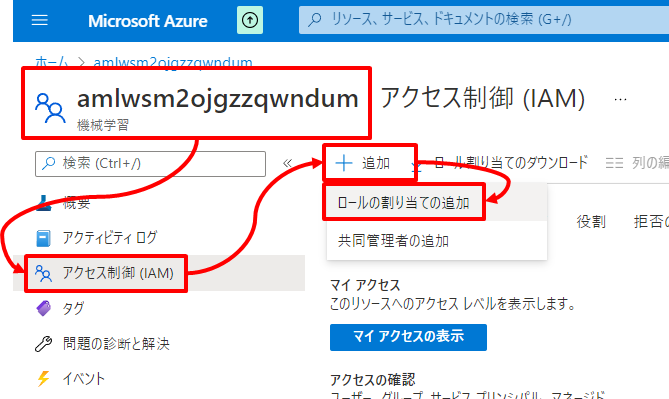

*共同作成者*を選択し「次へ」を押下します。

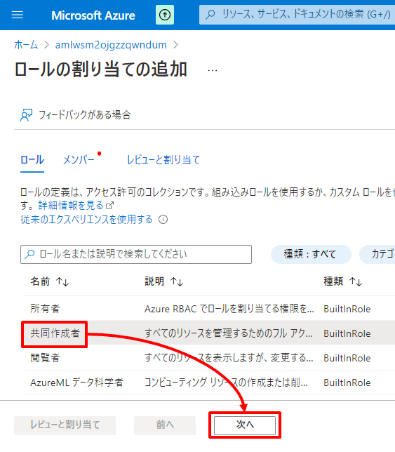

*マネージドID*を選択し *＋メンバーを選択する* をクリックします。
サブスクリプションを指定したのち、マネージドIDのドロップダウンリストから *Synapse ワークスペース* を選択し、前の手順で作成した Synapse を指定し「選択」ボタン、「レビュと割り当て」ボタンの順に押下します。

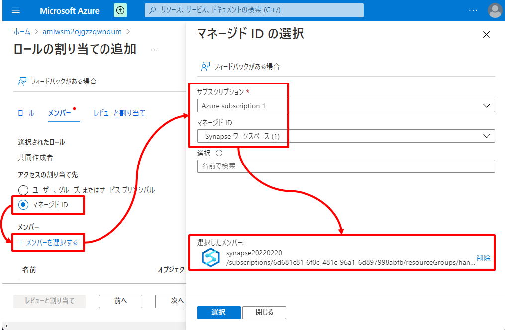

Synapse とのリンク

Synapse の Poratal メニュを辿り Synapse Studio を起動します。

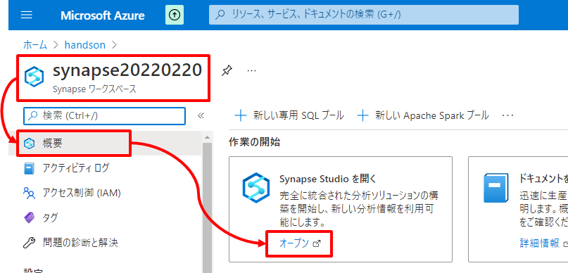

Synapse Studio メニュを辿り リンクサービス画面の *＋新規* を選択します。


Azure Machine Learning を検索し選択したのち「続行」ボタンを押下します。

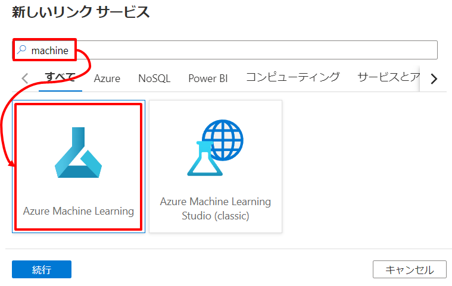

いくつかの情報を指定し「テスト接続」を試したのち「作成」ボタンを押下します。  

| 項目 | 値 |
| :---- | :---- |
| 名前 | 例：MyAML |
| 認証方法 | マネージドID |
| Azure サブスクリプション | ご利用のサブスクリプションを指定 |
| Azure Machine Learning ワークスペース名 | 前の手順で作成したAMLを指定 |


「すべてを発行」、「発行」の順でボタンを押下します。  

  
  

##### Synapse と Azure Key Vault のリンク

Synapse の Poratal メニュを辿り Synapse Studio を起動します。

  

Synapse Studio メニュを辿り リンクサービス画面の *＋新規* を選択します。


Azure Key Vault を検索し選択したのち「続行」ボタンを押下します。


いくつかの情報を指定し「テスト接続」を試したのち「作成」ボタンを押下します。  

| 項目 | 値 |
| :---- | :---- |
| 名前 | 例：MyKey |
| 認証方法 | マネージドID |
| Azure サブスクリプション | ご利用のサブスクリプションを指定 |
| Azure Key Vault の名前 | 前の手順で作成した Azure Key Vault を指定 |
| テスト接続 | シークレットへ |
| シークレット名 | 前の手順で作成したシークレットを指定（例：cognitive-key） |

  

「すべてを発行」、「発行」の順でボタンを押下します。  
  
  


##### Synapse と Azure Cognitive Services のリンク

Synapse の Poratal メニュを辿り Synapse Studio を起動します。

  

Synapse Studio メニュを辿り リンクサービス画面の *＋新規* を選択します。


Azure Cognitive Services を検索し選択したのち「続行」ボタンを押下します。

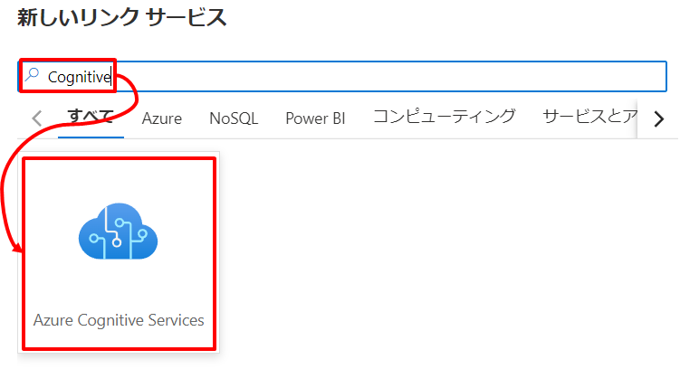

Anomaly Detector への情報を指定し「作成」ボタンを押下します。  

| 項目 | 値 |
| :---- | :---- |
| 名前 | 例：MyCogAnomaly |
| Azure サブスクリプション | ご利用のサブスクリプションを指定 |
| Azure Cognitive Services の名前 | 前の手順で作成した Anomaly Detector を指定 |
| AKV のリンクサービス | 前の手順で作成した Azure Key Vault のリンクサービスを指定 |
| シークレット名 | 前の手順で作成した Cognitive Services Anomaly Detector 用のシークレットを指定 |

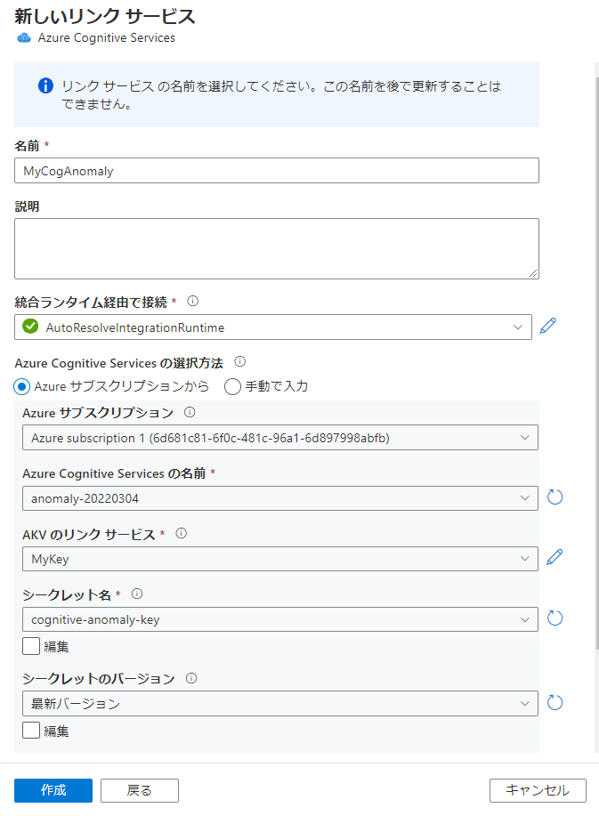  

同じ手順で Text Analytics についてもリンクサービスを作成します。  

| 項目 | 値 |
| :---- | :---- |
| 名前 | MyCogSentiment |
| Azure サブスクリプション | ご利用のサブスクリプションを指定 |
| Azure Cognitive Services の名前 | 前の手順で作成した Text Analytics を指定 |
| AKV のリンクサービス | 前の手順で作成した Azure Key Vault のリンクサービスを指定 |
| シークレット名 | 前の手順で作成した Cognitive Services Text Analytics 用のシークレットを指定 |

「すべてを発行」、「発行」の順でボタンを押下します。  
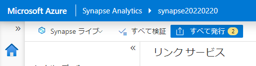   
  


### 4-3-4. 第8章向け事前準備

#### リソースプロバイダーの登録

以下のリソースそれぞれについてリソースプロバイダーの状態を確認します。  
 - ***TODO:リストアップ***


該当のリソースプロバイダーの状態「NotRegistered」となっている場合は、リソースプロバイダーを選択し登録ボタンを押下します。

  

登録ボタンの押下後、状態が Registering から Registered になれば登録完了です。


#### Synapse Data Explorer Pool の作成

***TODO***

#### その他の Azure リソースのデプロイ（IoT / ASA / Cocsmos）

***TODO***

#### Azure リソースの Set Up

##### Data Lake へのコピー

Cosmos Json ***TODO:追記***
- customer.json
- salesorder.json


