---

# **5. ハンズオン：データ統合と可視化**  

本章のハンズオンでは外部データソースとの多様なコネクタを持つ Synapse Pipeline を利用してサイロ化されたデータをデータレイクへ統合します。統合したデータは Synapse Dataflow による加工処理を通じ整形済みデータとして Synapse Dedicated に格納し、最後にデータ活用の典型例として、Power BI と連携し整形済みデータの可視化を行います。  

## **シナリオ**  
ここでは架空のタクシー事業者を想定したタクシーの運行データの分析と可視化を行います。  

## **アーキテクチャ と このシナリオにおける各サービスの用途**  

- Azure Blob Storage (Blob)  
  このシナリオでは Blob が分析対象となるタクシーの運行データ（生データ）の発生源と位置づけ、この生データを Synapse 内の Azure Datalake Store へ集約します。

- Azure SQL Database (SQLDB)  
  このシナリオでは SQLDB にタクシーの運行データ（生データ）を補完する参照データ（例えばローケーションの名称）が格納されているものとします。このデータも Synapse Dedicated にコピーし腹持ちさせます。

- Synapse Pipeline  
  データレイクへのデータ集約 や Synapse Dataflow によるデータの加工処理を呼び出す一連のデータパイプラインを定義します。
  
- Azure Data Lake Storage (DataLake)  
  生データを集約するデータレイクとして利用します。

- Synapse Dataflow  
  データの加工処理を定義し実行します。

- Synapse Dedicated  
  構造化データを格納するデータウェアハウスとして利用します。このシナリオでは生データを補完する参照データ と 加工結果のデータを格納します。

- Power BI Service  
  Synapse Dedicated に格納された加工結果のデータを元にしたレポートを定義し公開します。

## **ハンズオンステップ概要**  

- 5-1. 分析に利用するデータを定義する  
  データパイプラインの定義やデータ加工処理の定義に先立ち、それら処理の入力元と出力先のデータを Synapse Intgrated Dataset として定義します。

- 5-2. データパイプラインを定義する  
  DataLake への生データ集約 と Synapse Dedicatedへの参照データコピーを Synapse Pipeline に定義し実行します。

- 5-3. データの加工処理を定義しデータパイプラインに追加する  
  データの加工と Synapse Dedicated への結果データ格納を Synapse Dataflow に定義し、データパイプラインに追加します。

- 5-4. 整形したデータを可視化する  
  整形したデータを利用し Power BI でレポートを作成し公開します。

---
# **Let's get started**

---
## **5-1. 分析に利用するデータを定義する**  

データパイプラインの定義やデータ加工処理の定義に先立ち、それら処理の入力元と出力先のデータを データセット として定義します。

### **5-1-1. 入力元データセットの定義**

1. リンクサービス定義    
   
   データセットの定義にはそのソースとなるサービスをリンクサービスとして定義する必要があります。ここではタクシー運行データの発生源となる Blob と タクシー運行データを補完する参照データが格納されている SQLDB について、以下の情報と手順でリンクサービスを定義します。

   1. Azure Blob Storage  
            
      メニューを辿りリンクサービスを新規作成します。  
      
      
      リンクサービスの種類として「Azure Blob ストレージ」を選択します。
      
      
      リンクサービス定義の情報を入力し、テスト接続を行ったのち作成ボタンを押下します。
      | 項目 | 値 |
      | :---- | :---- |
      | 名前 | 例：blobstorage1130 |
      | 認証方法 | アカウントキー |
      | アカウントの選択方法 | Azure サブスクリプションから |
      | サブスクリプション | ハンズオンに利用しているサブスクリプションを指定 |
      | ストレージアカウント名 | デプロイした Azure Blob Storage を指定 |

      
      
      ***TODO：認証方法のバリエーションをTipsとして解説***

   2. Azure SQL Database  
      
      メニューを辿りリンクサービスを新規作成します。  
      
      
      リンクサービスの種類として「Azure SQL Database」を選択します。  
      
      
      リンクサービス定義の情報を入力し、テスト接続を行ったのち作成ボタンを押下します。
      | 項目 | 値 |
      | :---- | :---- |
      | 名前 | mssqlserver1130（任意） |
      | アカウントの選択方法 | Azure サブスクリプションから |
      | サブスクリプション | ハンズオンに利用しているサブスクリプションを指定 |
      | サーバー名 | デプロイした Azure SQL Database を指定 |
      | データベース名 | 作成した データベース を指定 |
      | 認証の種類 | SQL 認証 |
      | ユーザー名 | デプロイ時に指定したユーザー名を指定 |
      | パスワード | デプロイ時に指定したパスワードを指定 |

      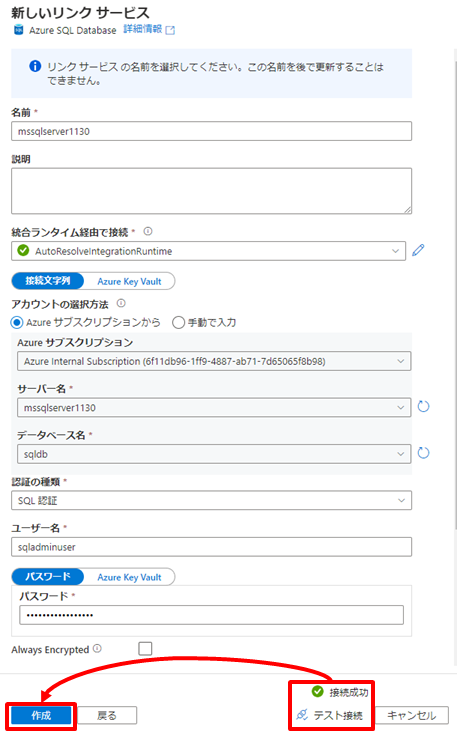
      
      ***TODO：パスワードのAKV管理をTipsとして解説***

2. データセット定義  
   
   前の手順で作成したリンクサービスを使い、以下の情報と手順でデータセットを定義します。
   
   1. Azure Blob Storage  
      
      メニューを辿り統合データセットを新規作成します。  
        
      
      データセットの種類として「Azure Blob ストレージ」を選択します。  
        
      
      データセットのファイル種類として「DelimitedText」を選択します。  
      
      
      データセット定義の情報を入力しOKボタンを押下します。
      | 項目 | 値 |
      | :---- | :---- |
      | 名前 | BLOB_NYCTaxiData_CSV（任意） |
      | リンクサービス | 作成したリンクサービスを指定 |
      | コンテナ－ | handson |
      | ディレクトリ | source/nyctaxidata（任意） |
      | 先頭行をヘッダーとして | Yes |
      | スキーマのインポート | 接続またはストアから |

      

   2. Azure SQL Database  
      
      メニューを辿り統合データセットを新規作成します。  
      
      
      データセットの種類として「Azure SQL Database」を選択します。  
      
      
      データセット定義の情報を入力しOKボタンを押下します。  
      | 項目 | 値 |
      | :---- | :---- |
      | 名前 | SQLDB_TaxiLocationLookup（任意） |
      | リンクサービス | 作成したリンクサービスを指定 |
      | テーブル名 | dbo.TaxiLocationLookup |
      | スキーマのインポート | 接続またはストアから |

      

   3. 発行 
      
      これまでの定義を発行し確定します。  
        
      

### **5-1-2. 統合先（出力先）データセットの定義**

1. Synapse への出力先の準備
   
   Blob と SQLDB を Synapse に統合するにあたり、まずは Synapse 内にその出力先を作成します。

   1. Synapse Data Lake
      
      Portal から Synapse デプロイ時に指定したファイルシステム配下にディレクトリ *raw/nyctaxidata* を作成します。        
      

   2. Synapse Dedicated SQL Pool

      Synapse Studio からクエリエディタを開き *resource/script/dedicatedsql.sql* の内容を張り付け *TaxiDataSummaryテーブル* と *TaxiLocationLookupテーブル* 定義します。  
        
      

2. データセット定義
   
      出力先についても入力先と同じようにデータセットとして定義します。

   1. Synapse Data Lake  
      
      メニューを辿り統合データセットを新規作成します。  
      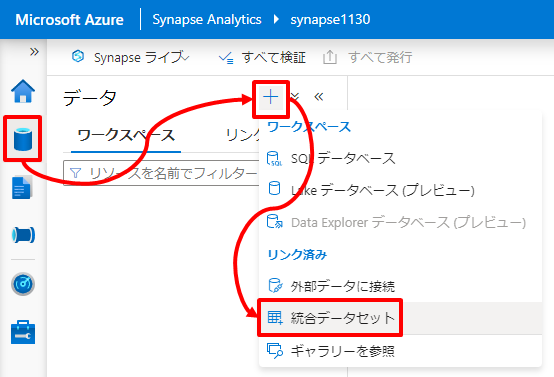  
      
      データセットの種類として「Azure Data Lake Storage Gen2」を選択します。  
        
      
      データセットのファイル種類として「DelimitedText」を選択します。  
      
      
      データセット定義の情報を入力しOKボタンを押下します。
      | 項目 | 値 |
      | :---- | :---- |
      | 名前 | ADLS_NYCTaxiData_CSV（任意） |
      | リンクサービス | Synapse のデプロイの延長で自動作成されるADLSへのリンクサービスを指定 |
      | コンテナ－ | synapsefs |
      | ディレクトリ | raw/nyctaxidata（任意） |
      | 先頭行をヘッダーとして | Yes |  

      
   
   2. Synapse Dedicated SQL Pool  
      
      メニューを辿り統合データセットを新規作成します。  
      
      
      データセットの種類として「Azure Synapse Analytics」を選択します。  
      
      
      名前を入力し、リンクサービスに Synapse Dedicated SQL Pool のデプロイの延長で自動作成されるリンクサービスを指定した上で、テーブル名の横の更新ボタンを押下します。    
      | 分類 | 項目 | 値 |
      | :---- | :---- | :---- |
      | 全般 | 名前 | SQL_TaxiLocationLookup（任意） |
      | 接続 | リンクサービス | Synapse Dedicated SQL Pool のデプロイの延長で自動作成されるリンクサービスを指定 |

      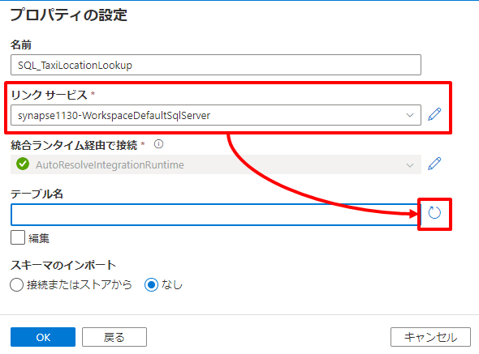  

      DBName に dedicatedsql を入力し OK を押下します。  
        

      テーブル名に dbo.TaxiLocationLookup を選択しOKボタンを押下します。     
      | 分類 | 項目 | 値 |
      | :---- | :---- | :---- |
      | 接続 | テーブル | dbo.TaxiLocationLookup |  

        

      最後に接続タブのリンクサービスプロパティ DBName に dedicatedsql を設定します。     
      | 分類 | 項目 | 値 |
      | :---- | :---- | :---- |
      | 接続 | リンクサービスプロパティ DBName | dedicatedsql |
      
        

      同様に「Azure Synapse Analytics」の統合データセットを新規作成し以下のデータセット定義の情報を入力しOKボタンを押下します。
      | 分類 | 項目 | 値 |
      | :---- | :---- | :---- |
      | 全般 | 名前 | SQL_TaxiDataSummary（任意） |
      | 接続 | リンクサービス | Synapse Dedicated SQL Pool のデプロイの延長で自動作成されるリンクサービスを指定 |
      | 接続 | テーブル | dbo.TaxiDataSummary |
      | 接続 | リンクサービスプロパティ DBName | dedicatedsql |
      
        
      

   3. 発行 
      
      これまでの定義を発行し確定します。     
        
      

---
## **5-2. データパイプラインを定義する**  

ここでは Datalake への生データ集約 と Synapse Dedicated への参照データコピーを Synapse Pipeline に定義し実行します。

### **5-2-1. データパイプラインの定義**

1. パイプラインの追加
   
   メニューを辿りパイプラインを新規作成します。  
   
   
   パイプラインの名前を入力します。
   | 分類 | 項目 | 値 |
   | :---- | :---- | :---- |
   | 全般 | 名前 | 例：DataIntegration |
   
   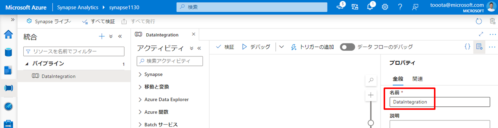
   
2. データレイクへ生データを集約するアクティビティの追加
   
   アクティビティの「移動と変換」から「データのコピー」をドラッグし、右の編集エリアにドロップします。  
   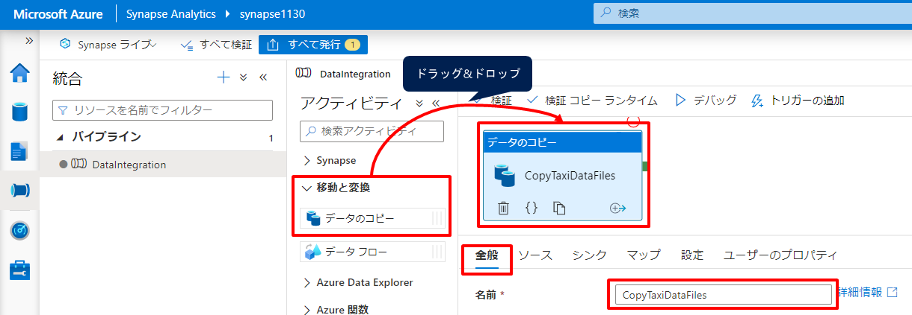

   追加したアクティビティに対して以下の情報を入力しOKボタンを押下します。
   この設定は Blob の データセット配下のすべての CSV ファイルを ADLS のデータセット配下にコピーすることを示しています。
   | 分類 | 項目 | 値 |
   | :---- | :---- | :---- |
   | 全般 | 名前 | 例：CopyTaxiDataFiles |
   | ソース | ソース データセット | 例：BLOB_NYCTaxiData_CSV |
   | ソース | ファイル パスの種類 | ワイルドカード ファイル パス |
   | ソース | ワイルドカード ファイル名 | *.csv |
   | シンク | シンク データセット | 例：ADLS_NYCTaxiData_CSV |

   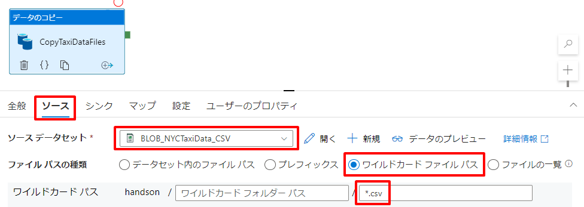  
   
   
3. Dedicated への参照データをコピーするアクティビティの追加
   
   同様にアクティビティの「移動と変換」から「データのコピー」をドラッグし、右の編集エリアにドロップします。  
   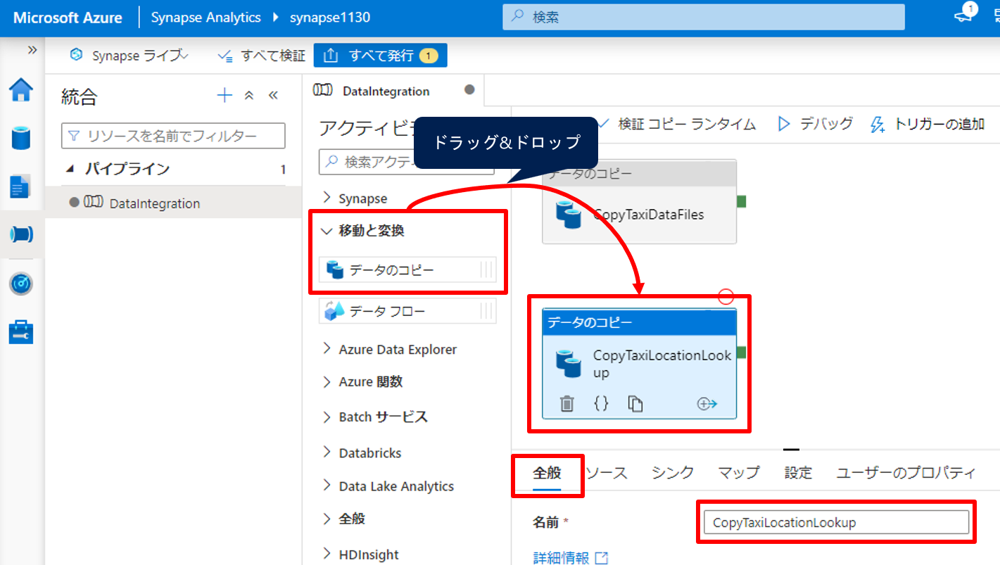

   追加したアクティビティに対して以下の情報を入力しOKボタンを押下します。
   この設定は SQLDB のデータセット（TaxiLocationLookupテーブル）のレコード全件を Dedicated のデータセット（TaxiLocationLookupテーブル）へコピーすることを示しています。コピーは COPY コマンドにて処理し、コピーに必要なステージング領域としてADLSを設定しています。またコピーの事前に Dedicated のデータセットを TRUNCATE することでデータを毎回洗い替えしています。

   ***MEMO：https://docs.microsoft.com/ja-jp/azure/data-factory/connector-azure-sql-data-warehouse?tabs=data-factory***

   | 分類 | 項目 | 値 |
   | :---- | :---- | :---- |
   | 全般 | 名前 | 例：CopyTaxiLocationLookup |
   | ソース | ソース データセット | 例：SQLDB_TaxiLocationLookup |
   | シンク | シンク データセット | 例：SQL_TaxiLocationLookup |
   | シンク | 事前コピー スクリプト | TRUNCATE TABLE dbo.TaxiLocationLookup |
   | 設定 | ステージングを有効にする | 有効 |
   | 設定 | ステージング アカウントのリンク サービス | Synapse のデプロイの延長で自動作成されるADLSへのリンクサービスを指定 |
   | 設定 | ステージングを有効にする | staging |

   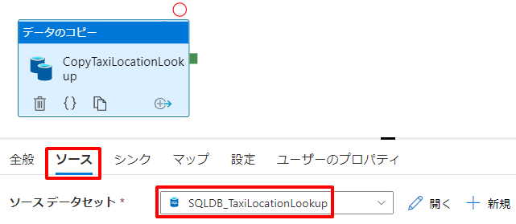  
   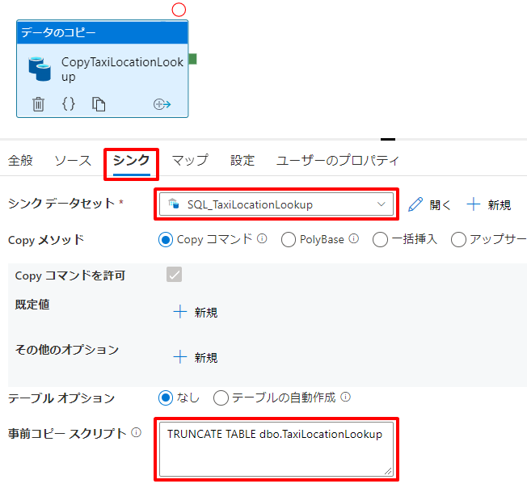  
   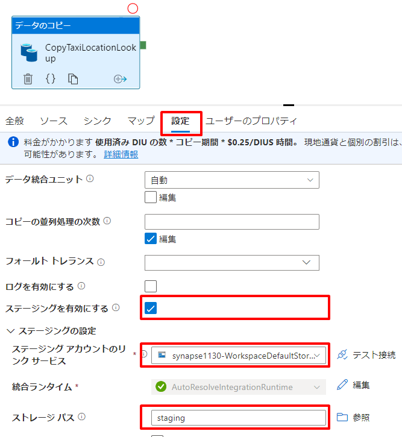

4. 発行
      
   これまでの定義を発行し確定します。        
   

### **5-2-2. データパイプラインの実行**  

1. パイプラインの実行  
    
   編集エリア上部の「トリガーの追加」から「今すぐトリガー」を選択しパイプラインを実行します。
     
   

2. パイプラインの実行の確認

   メニューを辿り「パイプラインの実行」でトリガーしたパイプラインの状態が”成功”となることを確認します。  
   

   メニューを辿り出力先の ADLS データセット配下に６つの CSV ファイルがコピーされていることを確認します。 
   

   メニューを辿り出力先の Dedicated データセット（TaxiLocationLookupテーブル）に対して「上位100行を選択」しレコードが登録されていることを確認します。
     
   

---
## **5-3. データの加工処理を定義しデータパイプラインに追加する**  

ここではデータの加工と Synapse Dedicated への結果データ格納を Synapse Dataflow に定義し、データパイプラインに追加します。

### **5-3-1. データフローの定義**  

1. スキーマのインポート  

   データの加工を行うためにはデータセットのスキーマを知る必要があります。  
   ADLS データセットについて、前の手順でコピーした実データに基づいてスキーマをインポートします。  
   メニューを辿り ADLS データセットの「スキーマのインポート」を実行します。
     
   
   
   なお、実データの配置前であってもサンプルファイルを指定することで「スキーマのインポート」が可能です。

2. データフローによるデータ加工の定義

   メニューを辿り、データフローを追加します。

   | 分類 | 項目 | 値 |
   | :---- | :---- | :---- |
   | 全般 | 名前 | PrepNYCTaxiData |

     
   

   ① まず始めに加工の対象となるデータを指定します。編集エリア「ソースの追加」の下向き山カッコから「ソースの追加」を選択します。     
   

   以下の ADLS データセットを追加します。  
   
   | 分類 | 項目 | 値 |
   | :---- | :---- | :---- |
   | ソースの設定 | 出力ストリーム名 | TaxiDataFiles |
   | ソースの設定 | データセット | ADLS_NYCTaxiData_CSV |

   

   ② 同じように編集エリア「ソースの追加」の下向き山カッコから「ソースの追加」を選択し、以下の Dedicated データセットを追加します。
   
   | 分類 | 項目 | 値 |
   | :---- | :---- | :---- |
   | ソースの設定 | 出力ストリーム名 | TaxiLocationLookup |
   | ソースの設定 | データセット | SQL_TaxiLocationLookup |

   

   ③ 次に派生列を定義します。派生列とは入力列のデータを加工し新たな列を定義することです。
   
   TaxiDataFiles の + から 派生列 を選択します。  
   
   
   以下の派生列の設定を入力します。
   | 分類 | 項目 | 値 |
   | :---- | :---- | :---- |
   | 派生列の設定 | 出力ストリーム名 | TransformColumns |
   | 派生列の設定 | 着信ストリーム | TaxiDataFiles |

     

   「式ビルダーを開く」を選択します。     
   

   以下の定義のとおりそれぞれ式を追加します。  
   | 分類 | 項目 | 値 |
   | :---- | :---- | :---- |
   | 派生列の設定 | 列：PaymentType | case (payment_type == '1', 'Credit card', payment_type == '2', 'Cash', payment_type == '3', 'No charge', payment_type == '4', 'Dispute', payment_type == '5', 'Unknown', payment_type == '6', 'Voided trip') |
   | 派生列の設定 | 列：PickUpDate | toDate(tpep_pickup_datetime,'yyyy-MM-dd') |
   | 派生列の設定 | 列：PickUpLocationID | toInteger(PULocationID) |
   | 派生列の設定 | 列：PassengerCount | toInteger(passenger_count) |
   | 派生列の設定 | 列：DistanceTravelled | toDecimal(trip_distance) |
   | 派生列の設定 | 列：TipAmount | toDecimal(tip_amount) |
   | 派生列の設定 | 列：FareAmount | toDecimal(fare_amount) |
   | 派生列の設定 | 列：TotalAmount | toDecimal(total_amount) |

   

   同様に他の列も追加します。

   

   

   すべての列の追加後に「保存して終了」を押下します。

   

   

   ④ 次に結合を定義します。ここでは生データと参照データを結合することで生データの情報を補完します。

   TransformColumns の + から 派生列 を選択します。  
   
   
   以下の定義のとおり結合条件を設定します。  
   | 分類 | 項目 | 値 |
   | :---- | :---- | :---- |
   | 結合の設定 | 出力ストリーム名 | JonPickUpLocation |
   | 結合の設定 | 左ストリーム | TransformColumns |
   | 結合の設定 | 右ストリーム | TaxiLocationLookup |
   | 結合の設定 | 結合の種類 | 内部 |
   | 結合の設定 | 結合条件 | TransformColumns.PickUpLocationID == TaxiLocationLookup.LocationID|

   

   ⑤ 次に集約を定義します。ここではグループ化とグループごとの集計関数を設定します。

   JonPickUpLocation の + から 結合 を選択します。  
   

   以下の定義のとおりグループ化と集計関数を設定します。  
   | 分類 | 項目 | 値 |
   | :---- | :---- | :---- |
   | 集計の設定 | 出力ストリーム名 | AggregateDailySummary |
   | 集計の設定 | 着信ストリーム | JonPickUpLocation |
   | 集計の設定 | グループ化 | PickUpDate, PaymentType, Borough, Zone |
   | 集計の設定 | 集約：TotalTripCount | count() |
   | 集計の設定 | 集約：TotalPassengerCount | sum(PassengerCount) |
   | 集計の設定 | 集約：TotalDistanceTravelled | sum(DistanceTravelled) |
   | 集計の設定 | 集約：TotalTipAmount | sum(TipAmount) |
   | 集計の設定 | 集約：TotalFareAmount | sum(FareAmount) |
   | 集計の設定 | 集約：TotalTripAmount | sum(TotalAmount) |

     
   

   ⑥ 次に選択を定義します。ここでは出力列の別名を設定します。別名の設定の他、出力に必要な列の選択も可能です。

   AggregateDailySummary の + から 選択 を選択します。  
   

   以下の定義のとおり列の別名を設定します。  
   | 分類 | 項目 | 値 |
   | :---- | :---- | :---- |
   | 選択の設定 | 出力ストリーム名 | RenameColumns |
   | 選択の設定 | 着信ストリーム | AggregateDailySummary |
   | 選択の設定 | 入力列：Borough | PickUpBorough |
   | 選択の設定 | 入力列：Zone | PickUpZone |

   

   ⑦ 最後にシンクを定義します。これまでの加工によって生成されたデータセットの出力先設定です。
   
   RenameColumns の + から 選択 を選択します。  
   

   以下の定義のとおり出力先を設定します。  
   | 分類 | 項目 | 値 |
   | :---- | :---- | :---- |
   | シンク | 出力ストリーム名 | TaxiDataSummary |
   | シンク | 着信ストリーム | RenameColumns |
   | シンク | データセット | SQL_TaxiDataSummary |
   | 設定 | テーブルアクション | テーブルの切り詰め |

   

   以下の定義のとおりテーブルアクションを設定します。これはテーブルへの出力前に切り詰め（TRUNCATE）を行うことを示しています。    
   | 分類 | 項目 | 値 |
   | :---- | :---- | :---- |
   | 設定 | テーブルアクション | テーブルの切り詰め |

   

   これでデータフローの完成です。  
   

### **5-3-2. データパイプラインへの追加と再実行**

1. パイプラインの更新（データフローアクティブティの追加）
   
   データコピーの延長としてデータ加工のアクティビティを追加します。  
   DataIntegration パイプラインの定義に戻り、アクティビティの「移動と変換」から「データ フロー」をドラッグし、右の編集エリアにドロップします。  
   

2. データフローの設定
   
   追加したアクティビティに対して以下の情報を入力しOKボタンを押下します。
   ここではデータフローの実行に必要なステージング領域としてADLSを設定しています。    
   | 分類 | 項目 | 値 |
   | :---- | :---- | :---- |
   | 設定 | データフロー | PrepNYCTaxiData |
   | 設定 | ステージングのリンクサービス | Synapse デプロイ時に作成したADLSを指定 |
   | 設定 | ステージング ストレージ フォルダー：コンテナ | Staging |

   

3. アクティビティの結合
   
   ２つのコピーアクティビティそれぞれについて、右の緑突起をドラッグし、データフローアクティビティへドロップします。  
     
   

4. 発行
      
   これまでの定義を発行し確定します。  
     
   

5. パイプラインの再実行

   パイプラインを再実行します。編集エリア上部の「トリガーの追加」から「今すぐトリガー」を選択しパイプラインを実行します。
   

6. パイプラインの実行の結果確認  
   
   メニューを辿り「パイプラインの実行」でトリガーしたパイプラインの状態が”成功”となることを確認します。  
   

   メニューを辿り出力先の Dedicated データセット（TaxiDataSummaryテーブル）に対して「上位100行を選択」しデータ加工結果のレコードが登録されていることを確認します。  
     
   

---
## **5-4. 整形したデータを可視化する**  

整形したデータ（Synapse Dedicated 内の TaxiDataSummaryテーブル）を Power BI を利用しレポートとして可視化を行い、作成したレポートは Power BI Service に発行し組織に共有します。  
また、Synapse に Power BI Service をリンクさせることで、Synapse Studio 上からレポートの参照や編集を行います。

### **5-4-1. Power BI Desktop でレポートを作成する**

1. Power BI Desktop を起動します。
   
   本ハンズオンでは Power BI レポートの作成自体の解説は割愛し、既に作成済みのレポートを利用します。  
   *resource/report/NYC Taxi Operation Report.pbit* から Power BI Desktop を起動します。  
   

2. 接続先の Synapse Dedicated のエンドポイント、SQL Pool 名、および資格情報を入力します。

   Synapse Dedicated のエンドポイント、SQL Pool 名、および資格情報は Portal で確認できます。  
     
   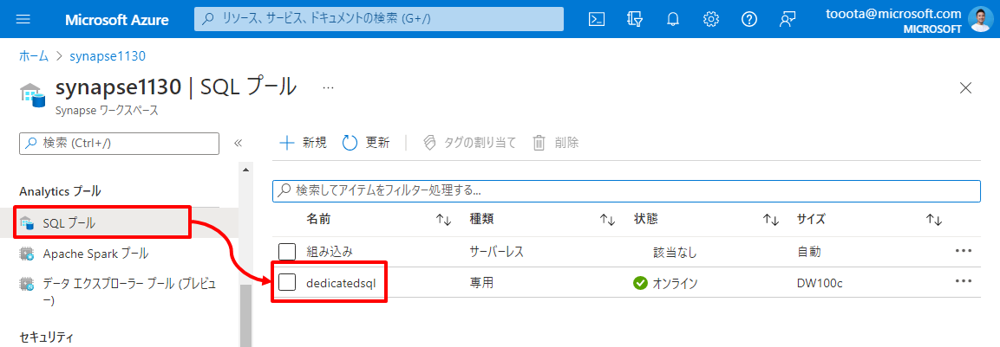  

   Synapse Dedicated のエンドポイントと SQL Pool 名を入力します。
   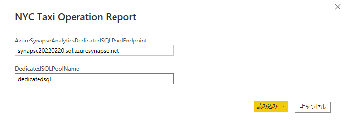

   Synapse Dedicated の資格情報を入力します。
   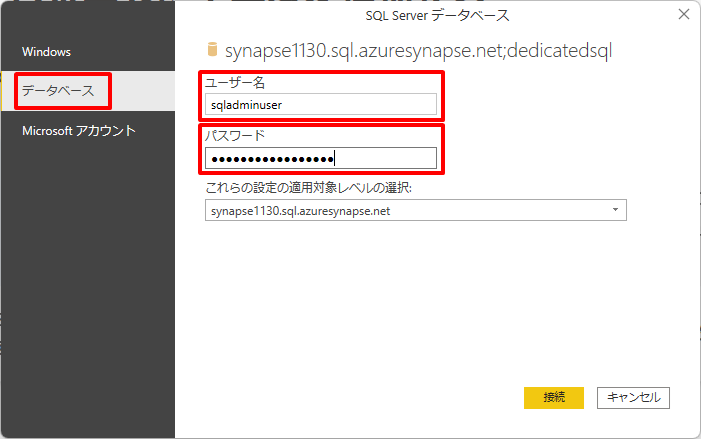

3. Synapse Dedicated 内の TaxiDataSummaryテーブル を可視化したレポートが開きます。

   

### **5-4-2. Power BI Service のワークスペースへレポートを発行する**

前の手順でローカルで作成したレポートをPower BI Service のワークスペースへ発行することで組織へレポートを共有します。

1. Power BI Service にログインします。

   https://powerbi.microsoft.com/ja-jp/  

   

2. Power BI ワークスペースを作成します。

   

   

   ※ Free ラインセンスアカウントの場合は「ワークスペースの作成」を押下後に Power BI Pro へのアップグレードに誘導されます。「無料で試す」を選択することで 60 日間 Power BI Pro を試用することができます。本ハンズオンを継続する場合は「無料で試す」を選択ください。

   

   

3. Power BI Service にレポートを発行します。

   Power BI Desktop に戻り発行ボタンを押下します。
   
   

   作成したワークスペースを指定しレポートを発行します。

   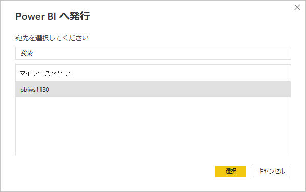

   

   この操作により Power BI Service を通じてレポートが共有されます。

   

### **5-4-1. Synapse と Power BI Service ワークスペースをリンクする**  

Power BI Service ワークスペースを Synapse にリンクし、Synapse Studio 上でレポートを参照や編集を行います。

1. Power BI Service ワークスペースを Synapse にリンクする  
   
   メニューを辿りリンクサービスを新規作成します。  
     
      
   リンクサービスの種類として「Power BI」を選択します。  
   
      
   リンクサービス定義の情報を入力し、作成ボタンを押下します。  
   

   これまでの定義を発行し確定します。  
     
   

2. Synapse Studio での レポートを編集する

   メニューから Power BI Service ワークスペース上のレポートを辿ります。
   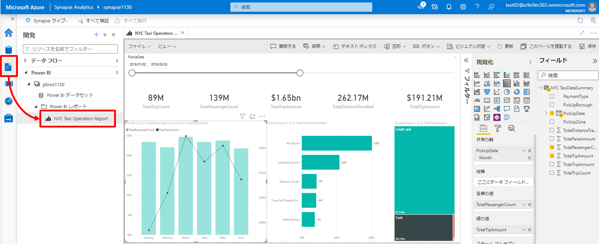

   ここではレポートの参照だけではなく編集を行うこともでき、ここでの編集は Power BI Service ワークスペース上のレポートへ反映されます。
   
# まとめ

***TODO:何か書く***
