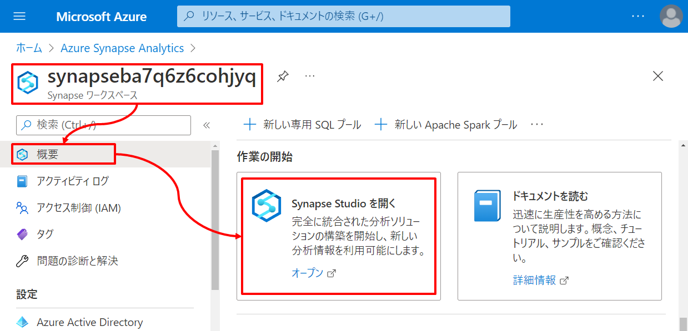
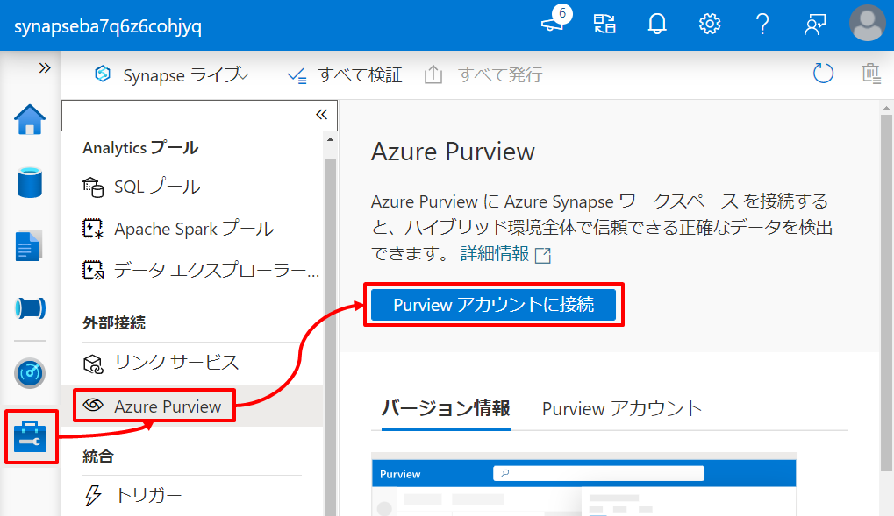
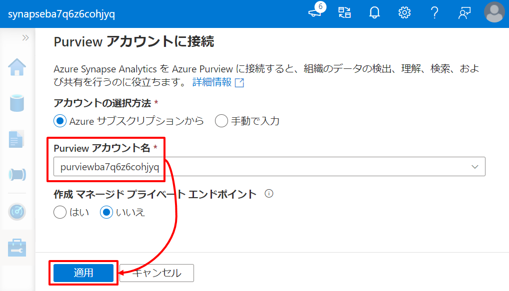
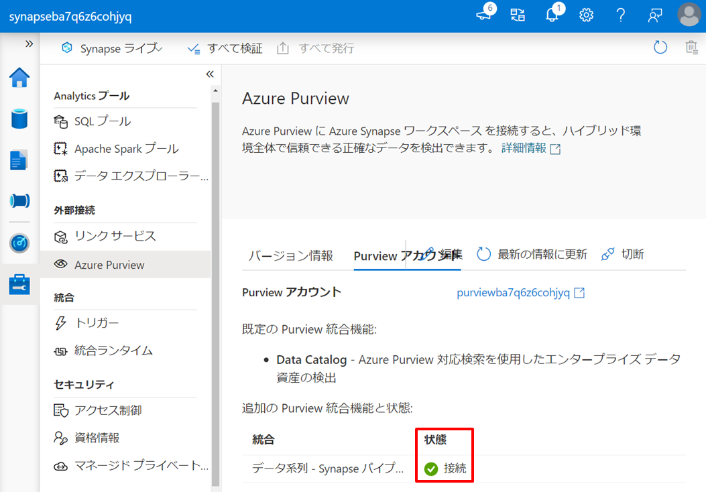

---
# 5. ハンズオン：データ統合と可視化  

第5章ではオンプレからクラウドまで外部の様々なデータソースとのコネクタを持つ Synapse Pipeline を利用してサイロ化されたデータを Data Lak Store へ統合します。統合したデータは Synapse Dataflow による加工処理を通じて整形済みのデータとして Synapse Dedicated に格納します。最後にデータ活用の典型例として、Power BI と連携し整形済みデータの可視化を行います。  

# シナリオ  
このハンズオンでは架空のタクシー事業者のタクシー乗車記録の分析と可視化を行います。  

このシナリオのアーキテクチャと関連リソースの役割は以下の通りです。矢印はデータの流れを示しています。  
  

| アイコン | リソース | 役割 |
| :---: | :---- | :---- |
|  | Azure Blob Storage | Blob Storage を分析対象となるタクシーの運行データ（生データ）の発生源と位置づけ、この生データを Synapse 内の Data Lake Store へ集約します。 |
|  | Azure SQL Database | SQL Database にタクシーの運行データ（生データ）を補完する参照データ（例えばローケーションの名称）が格納されているものとします。このデータも Synapse Dedicated にコピーし腹持ちさせます。 |
|  | Synapse Pipeline | 一連のデータパイプライン（Data Lake Storage への生データの集約、Synapse Dedicated SQL Pool への参照データのコピー、Synapse Dataflow によるデータの加工処理の呼び出し）を定義します。 |
|  | Azure Data Lake Storage | サイロ化されたデータ、非構造から半構造まで様々な形式のデータ、それらを未整形の生データとして集約するデータレイクです。 |
|  | Synapse Dataflow | データの加工処理を定義し実行します。 |
|  | Synapse Dedicated SQL Pool | 構造化データを格納するデータウェアハウスとして利用します。このシナリオでは生データを補完する参照データ と 加工結果のデータを格納します。 |
|  | Power BI Service | Synapse Dedicated に格納された加工結果のデータを元にしたレポートを定義し公開します。 |
|  | Azure Purview | 今回のシナリオでは Synapse Pipeline によるデータパイプラインをとらまえデータの系譜を管理します。とらまえデータの系譜は第6章で活用します。 |

---
# Let's get started  

## 5-1. Synapse と Purview のリンク  

Synapse は外部の Azure リソースの機能と連携し役割を強化することができます。第5章では Azure Purview と連携し、Synapse Pipeline によるデータパイプラインをとらまえデータの系譜を管理します。とらまえデータの系譜は第6章で活用します。  

それではまず Synapse と Azure Purview と連携させましょう。Synapse の Poratal メニュを辿り Synapse Studio を起動します。  
  

Synapse Studio のメニュを辿り *Purview カウントに接続* をクリックします。  
  

「Purview アカウントに接続」ブレードで第4章で作成した Purview アカウントを指定します。  
  

状態が *接続* となっていることを確認します。  
  

## 5-2. リンクサービスと統合データセットを定義する  

データパイプラインを構成するにはそのパイプラインに関連するデータを「統合データセット」として Synapse 内に定義します。また、統合データセットの定義にはそのソースとなるリソースをリンクサービスとして定義する必要があります。  
それでは、入力元と出力先のそれぞれについて「リンクサービス」と「統合データセット」を定義していきましょう。

### 5-2-1. 入力元のリンクサービスと統合データセットを定義する

#### リンクサービス定義  
ここではタクシー運行データの発生源となる Blob Storage と タクシー運行データを補完する参照データが格納されている SQL Database についてリンクサービスを定義します。

##### Azure Blob Storage  
            
Synapse Studio メニューを辿りリンクサービスを新規作成します。  

      
リンクサービスの種類として「Azure Blob ストレージ」を選択します。

      
リンクサービス定義の情報を入力し、テスト接続を行ったのち作成ボタンを押下します。
| 項目 | 値 |
| :---- | :---- |
| 名前 | 例：blobstorage1130 |
| 認証方法 | アカウントキー |
| アカウントの選択方法 | Azure サブスクリプションから |
| サブスクリプション | ハンズオンに利用しているサブスクリプションを指定 |
| ストレージアカウント名 | デプロイした Azure Blob Storage を指定 |


      
***TODO：認証方法のバリエーションをTipsとして解説***

##### Azure SQL Database  

同じく Synapse Studio メニューを辿りリンクサービスを新規作成します。  


リンクサービスの種類として「Azure SQL Database」を選択します。  


リンクサービス定義の情報を入力し、テスト接続を行ったのち作成ボタンを押下します。
| 項目 | 値 |
| :---- | :---- |
| 名前 | mssqlserver1130（任意） |
| アカウントの選択方法 | Azure サブスクリプションから |
| サブスクリプション | ハンズオンに利用しているサブスクリプションを指定 |
| サーバー名 | デプロイした Azure SQL Database を指定 |
| データベース名 | 作成した データベース を指定 |
| 認証の種類 | SQL 認証 |
| ユーザー名 | デプロイ時に指定したユーザー名を指定 |
| パスワード | デプロイ時に指定したパスワードを指定 |


***TODO：パスワードのAKV管理をTipsとして解説***

#### 統合データセット定義  

リンクサービスが定義できたので次に統合データセットを定義します。  
前の手順で作成したリンクサービスを使い、統合データセットを定義していきます。

##### Azure Blob Storage  

Synapse Studio メニューを辿り *統合データセット* をクリックします。  
  

データセットの種類として「Azure Blob ストレージ」を選択します。  
  

データセットのファイル種類として「DelimitedText」を選択します。  
  

データセット定義の情報を入力しOKボタンを押下します。  

| 項目 | 値 |
| :---- | :---- |
| 名前 | BLOB_NYCTaxiData_CSV（任意） |
| リンクサービス | 作成したリンクサービスを指定 |
| コンテナ－ | handson |
| ディレクトリ | source/nyctaxidata（任意） |
| 先頭行をヘッダーとして | Yes |
| スキーマのインポート | 接続またはストアから |

  

##### Azure SQL Database

同じく Synapse Studio メニューを辿り *統合データセット* をクリックします。  
  

データセットの種類として「Azure SQL Database」を選択します。  
  

データセット定義の情報を入力しOKボタンを押下します。  

| 項目 | 値 |
| :---- | :---- |
| 名前 | SQLDB_TaxiLocationLookup（任意） |
| リンクサービス | 作成したリンクサービスを指定 |
| テーブル名 | dbo.TaxiLocationLookup |
| スキーマのインポート | 接続またはストアから |

  

#### 発行

Synapse Studio 上で行った定義を確定させるために「発行」を行います。  
Synapse Studio の上部にある *すべて発行* をクリックしここまでの定義を確定させます。  
  
  

### 5-2-2. 出力先の統合データセットを定義する

#### Synapse 上の出力先の準備
   
まずは、入力元のデータの統合先となる Synapse 内の出力先を作成します。

##### Data Lake Storage

Blob Storage 上の生データ（タクシー運行データ）の統合先となる Data Lake Storage 上のディレクトリを作成します。  
Data Lake Storage の Portal メニュ から Synapse デプロイ時に指定したファイルシステム（例：synapsefs）の配下にディレクトリ *raw/nyctaxidata* を作成してください。  


##### Synapse Dedicated SQL Pool

SQL Database 上の参照データの統合先となる Synapse SQL Dedicated Pool 上のテーブルを作成します。  
まず Synapse Studio のメニュを辿りクエリエディタを開きます。  
  

次に *resource/script/dedicatedsql.sql* の内容をエディタ上に張り付け実行をクリックします。  
  

このSQLスクリプトの実行により *TaxiDataSummaryテーブル* と *TaxiLocationLookupテーブル* が作成されます。
テーブル定義後このクエリエディタを保存せずに閉じてしまって問題はありません。

#### 統合データセット定義

Synapse 内の Data Lake Storage や Synapse SQL Dedicated Pool については Synapse のデプロイの延長でリンクサービスは自動作成されています。   
このリンクサービスを使って出力先となる統合データセットを定義していきましょう。

##### Synapse Data Lake  
      
Synapse Studio メニューを辿り *統合データセット* をクリックします。  
  

データセットの種類として「Azure Data Lake Storage Gen2」を選択します。  
  

データセットのファイル種類として「DelimitedText」を選択します。  


データセット定義の情報を入力しOKボタンを押下します。  

| 項目 | 値 |
| :---- | :---- |
| 名前 | ADLS_NYCTaxiData_CSV（任意） |
| リンクサービス | Synapse のデプロイの延長で自動作成されるADLSへのリンクサービスを指定 |
| コンテナ－ | synapsefs |
| ディレクトリ | raw/nyctaxidata（任意） |
| 先頭行をヘッダーとして | Yes |  

  

##### Synapse Dedicated SQL Pool  
      
同じく Synapse Studio メニューを辿り *統合データセット* をクリックします。  
  

データセットの種類として「Azure Synapse Analytics」を選択します。  
  

名前を入力し、リンクサービスに Synapse Dedicated SQL Pool のデプロイの延長で自動作成されるリンクサービスを指定した上で、テーブル名の横の更新ボタンを押下します。  

| 分類 | 項目 | 値 |
| :---- | :---- | :---- |
| 全般 | 名前 | SQL_TaxiLocationLookup（任意） |
| 接続 | リンクサービス | Synapse Dedicated SQL Pool のデプロイの延長で自動作成されるリンクサービスを指定 |

  

DBName に dedicatedsql を入力し OK を押下します。  
  

テーブル名に dbo.TaxiLocationLookup を選択しOKボタンを押下します。  

| 分類 | 項目 | 値 |
| :---- | :---- | :---- |
| 接続 | テーブル | dbo.TaxiLocationLookup |  

  

最後に接続タブのリンクサービスプロパティ DBName に dedicatedsql を設定します。  

| 分類 | 項目 | 値 |
| :---- | :---- | :---- |
| 接続 | リンクサービスプロパティ DBName | dedicatedsql |

  

同様に「Azure Synapse Analytics」の統合データセットを新規作成し以下のデータセット定義の情報を入力しOKボタンを押下します。  

| 分類 | 項目 | 値 |
| :---- | :---- | :---- |
| 全般 | 名前 | SQL_TaxiDataSummary（任意） |
| 接続 | リンクサービス | Synapse Dedicated SQL Pool のデプロイの延長で自動作成されるリンクサービスを指定 |
| 接続 | テーブル | dbo.TaxiDataSummary |
| 接続 | リンクサービスプロパティ DBName | dedicatedsql |

  
  

#### 発行 
      
これまでの定義を発行し確定させます。  
  
  

---
## 5-3. データパイプラインを構成して実行する  

次に作成した統合データセットを利用しデータパイプラインの構成します。また構成したデータパイプラインを実際に実行しその動作を見ていきましょう。  
ここでは Data Lake Storage への生データ集約 と Synapse Dedicated SQL Pool への参照データコピーのデータパイプラインを Synapse Pipeline に定義したのち実行します。

### 5-3-1. データパイプラインを構成する

#### パイプラインの追加
   
Synapse Studio メニューを辿り *パイプライン* をクリックします。  
  

パイプラインの名前を入力します。  
| 分類 | 項目 | 値 |
| :---- | :---- | :---- |
| 全般 | 名前 | 例：DataIntegration |

  

#### Data Lake Storage へ生データを集約するアクティビティの追加

パイプラインは様々なアクティビティの集まりで構成されます。  
ここでは Blob Storage 上の生データを Data Lake Storage へ集約するための *コピーアクティビティ* をパイプラインに追加します。  

アクティビティの「移動と変換」から「データのコピー」をドラッグし、右の編集エリアにドロップします。  
  

追加したアクティビティに対して以下の情報を入力しOKボタンを押下します。  
この設定は Blob の データセット配下のすべての CSV ファイルを ADLS のデータセット配下にコピーすることを示しています。  

| 分類 | 項目 | 値 |
| :---- | :---- | :---- |
| 全般 | 名前 | 例：CopyTaxiDataFiles |
| ソース | ソース データセット | 例：BLOB_NYCTaxiData_CSV |
| ソース | ファイル パスの種類 | ワイルドカード ファイル パス |
| ソース | ワイルドカード ファイル名 | *.csv |
| シンク | シンク データセット | 例：ADLS_NYCTaxiData_CSV |

  
  

#### Synapse Dedicated SQL Pool への参照データをコピーするアクティビティの追加
   
同様にアクティビティの「移動と変換」から「データのコピー」をドラッグし、右の編集エリアにドロップします。  
  

追加したアクティビティに対して以下の情報を入力します。  
この設定は SQLDB のデータセット（TaxiLocationLookupテーブル）のレコード全件を Dedicated のデータセット（TaxiLocationLookupテーブル）へコピーすることを示しています。コピーは COPY コマンドにて処理し、コピーに必要なステージング領域として Data Lake Storage を設定しています。またコピーの事前に Synapse Dedicated SQL Pool のデータセットを TRUNCATE することでデータを毎回洗い替えしています。  

***MEMO：https://docs.microsoft.com/ja-jp/azure/data-factory/connector-azure-sql-data-warehouse?tabs=data-factory***

| 分類 | 項目 | 値 |
| :---- | :---- | :---- |
| 全般 | 名前 | 例：CopyTaxiLocationLookup |
| ソース | ソース データセット | 例：SQLDB_TaxiLocationLookup |
| シンク | シンク データセット | 例：SQL_TaxiLocationLookup |
| シンク | 事前コピー スクリプト | TRUNCATE TABLE dbo.TaxiLocationLookup |
| 設定 | ステージングを有効にする | 有効 |
| 設定 | ステージング アカウントのリンク サービス | Synapse のデプロイの延長で自動作成されるADLSへのリンクサービスを指定 |
| 設定 | ステージングを有効にする | staging |

  
  
  

#### 発行
      
これまでの定義を発行し確定します。  
  

### 5-3-2. データパイプラインを実行する  

#### パイプラインの実行  

作成したデータパイプラインを実行しその動作を確認しましょう。  
編集エリア上部の *トリガーの追加* から *今すぐトリガー* を選択しパイプラインを即時実行させます。  
  

「パイプライン実行」ブレードで *OK* をクリックするとデータパイプラインの実行が開始されます。  
  

***Memo***
*新規/編集* を選択するとデータパイプラインの実行を開始させるためのトリガを定義することができます。トリガにはスケジュールの他にイベントを定義することも可能です。  

#### パイプライン実行の確認

実行を開始させたパイプラインの状態を確認しましょう。  
Synapse Studio メニューを辿り *パイプラインの実行* から実行したパイプラインの状態が”成功”となることを確認します。  
  

次に、Data Lake Storage への生データ集約アクティビティの結果を確認しましょう。  
Synapse Studio メニューを辿り出力先に指定した Data Lake Storage 上のパスに６つの CSV ファイルがコピーされていることを確認します。  


同様に、Synapse Dedicated SQL Pool への参照データコピーアクティビティの結果を確認しましょう。  
Synapse Studio メニューを辿り出力先の Synapse Dedicated SQL Pool データセット（TaxiLocationLookupテーブル）に対して「上位100行を選択」しレコードが登録されていることを確認します。  
  
  

---
## 5-4. データの加工処理を定義しデータパイプラインに追加する  

ここまでのハンズオンでは点在しているデータを Synapse Pipeline によるデータパイプラインによって Synapse へ統合しました。ここからは統合したデータを加工し分析のためのデータセットを作成していきましょう。  

### 5-4-1. データフローの定義  

Synapse にはコードファーストによるデータ処理エンジンである Synapse Serverless Spark Pool、SQL文によるデータ処理エンジンである Synapse Serverless SQL Pool、ローコード（GUI 操作）によるデータ処理エンジンである Synapse Dataflow など複数のデータ処理エンジンの選択肢をもっています。この5章のハンズオンでは Synapse Dataflow による GUI 操作によって、Data Lake Storage に統合した生データと Synapse Dedicated SQL Pool に統合した 参照データに対して加工処理を行ってみましょう。  

#### スキーマのインポート  

データ加工の定義を行う前にまず Data Lake Storage の統合データセットに対して生データのスキーマを認識させます。  
今回は前の手順で統合した実データに基づいてスキーマ認識を行います。なお、実データ以外にもサンプルデータによるスキーマ認識も可能です。  

Synapse Studio メニューを辿り ADLS データセットの *スキーマのインポート* から *'*.csv'を含むファイルから* をクリックします。   
  
  

#### データ加工の定義

それではデータ加工の定義を行っていきましょう。
Synapse Studio メニューを辿り、*データ フロー* をクリックします。  

  

このデータフローの名前を指定します。

| タブ | 項目 | 値 |
| :---- | :---- | :---- |
| 全般 | 名前 | PrepNYCTaxiData |


##### ① 加工対象データの指定

編集エリア「ソースの追加」の下向き山カッコから「ソースの追加」を選択します。  
  

Data Lake Storage の統合データセットを追加します。  

| タブ | 項目 | 値 | 説明 |
| :---- | :---- | :---- | :---- |
| ソースの設定 | 出力ストリーム名 | TaxiDataFiles | このコンポーネントの任意の名前を指定します |
| ソースの設定 | データセット | ADLS_NYCTaxiData_CSV | このコンポーネントに対する入力を指定します |

  

同様に編集エリア「ソースの追加」の下向き山カッコから「ソースの追加」を選択し、Synapse Dedicated SQL Pool の統合データセットを追加します。  

| タブ | 項目 | 値 | 説明 |
| :---- | :---- | :---- | :---- |
| ソースの設定 | 出力ストリーム名 | TaxiLocationLookup | このコンポーネントの任意の名前を指定します |
| ソースの設定 | データセット | SQL_TaxiLocationLookup | このコンポーネントに対する入力を指定します |

  

##### ② 派生列の定義

派生列とは入力列へのデータ加工結果に対して新たな列を定義することです。  

TaxiDataFiles の *＋* から *派生列* を選択します。  
  

以下の派生列の情報を入力します。  

| タブ | 項目 | 値 | 説明 |
| :---- | :---- | :---- | :---- |
| 派生列の設定 | 出力ストリーム名 | TransformColumns |  このコンポーネントの任意の名前を指定します |
| 派生列の設定 | 着信ストリーム | TaxiDataFiles | このコンポーネントに対する入力コンポーネントを指定します |

  

「式ビルダーを開く」を選択します。  
  

列名 *PaymentType* に対して以下の式を指定します。  

```DataFlow
case (payment_type == '1', 'Credit card'
    , payment_type == '2', 'Cash'
    , payment_type == '3', 'No charge'
    , payment_type == '4', 'Dispute'
    , payment_type == '5', 'Unknown'
    , payment_type == '6', 'Voided trip')
```


同様の手順で以下の派生列をすべて定義します。  

| タブ | 列名 | 式 | 説明 |
| :---- | :---- | :---- | :---- |
| 派生列の設定 | 列：PaymentType | case (payment_type == '1', 'Credit card', payment_type == '2', 'Cash', payment_type == '3', 'No charge', payment_type == '4', 'Dispute', payment_type == '5', 'Unknown', payment_type == '6', 'Voided trip') | payment_type の値に応じた説明を付与します |
| 派生列の設定 | 列：PickUpDate | toDate(tpep_pickup_datetime,'yyyy-MM-dd') | tpep_pickup_datetime の文字列を書式に基づき日付に変換します |
| 派生列の設定 | 列：PickUpLocationID | toInteger(PULocationID) | 入力値を Integer 型の値に変換します |
| 派生列の設定 | 列：PassengerCount | toInteger(passenger_count) | 入力値を Integer 型の値に変換します |
| 派生列の設定 | 列：DistanceTravelled | toDecimal(trip_distance) | 入力値を Integer 型の値に変換します |
| 派生列の設定 | 列：TipAmount | toDecimal(tip_amount) | 入力値を Decimal 型の値に変換します |
| 派生列の設定 | 列：FareAmount | toDecimal(fare_amount) | 入力値を Decimal 型の値に変換します |
| 派生列の設定 | 列：TotalAmount | toDecimal(total_amount) | 入力値を Decimal 型の値に変換します |

新しい派生列を追加するには *＋新規作成* 横の下向き山カッコから *列* を選択します。  
  

列名と式を指定します。  
  

すべての列が追加されたことを確認してください。  
  

最後に「保存して終了」を押下します。  
  

##### ③ 結合の定義

ここでは生データと参照データを結合することで生データの情報を補完します。  

TransformColumns の *＋* から *結合* を選択します。  
  

以下の定義のとおり結合条件を設定します。  

| タブ | 項目 | 値 | 説明 |
| :---- | :---- | :---- | :---- |
| 結合の設定 | 出力ストリーム名 | JonPickUpLocation | このコンポーネントの任意の名前を指定します |
| 結合の設定 | 左ストリーム | TransformColumns | 左側の結合対象コンポーネントを指定します |
| 結合の設定 | 右ストリーム | TaxiLocationLookup | 右側の結合対象コンポーネントを指定します |
| 結合の設定 | 結合の種類 | 内部 | 結合の種類を指定します（SQL の INNER JOIN に相当します） |
| 結合の設定 | 結合条件 | TransformColumns.PickUpLocationID == TaxiLocationLookup.LocationID | 結合の条件式を指定します |

  

##### ④ 集約の定義

ここではグループ化とグループごとの集計関数を設定します。  

JonPickUpLocation の *＋* から *集約* を選択します。  
  

以下の定義のとおりグループ化と集計関数を設定します。  

| タブ | 項目 | 値 | 説明 |
| :---- | :---- | :---- | :---- |
| 集計の設定 | 出力ストリーム名 | AggregateDailySummary | このコンポーネントの任意の名前を指定します |
| 集計の設定 | 着信ストリーム | JonPickUpLocation | このコンポーネントに対する入力コンポーネントを指定します |
| 集計の設定 | グループ化 | PickUpDate, PaymentType, Borough, Zone | 集約対象を指定します（SQL の GROUP BY に相当します） |
| 集計の設定 | 集約：TotalTripCount | count() | 集約処理を指定します |
| 集計の設定 | 集約：TotalPassengerCount | sum(PassengerCount) | 集約処理を指定します |
| 集計の設定 | 集約：TotalDistanceTravelled | sum(DistanceTravelled) | 集約処理を指定します |
| 集計の設定 | 集約：TotalTipAmount | sum(TipAmount) | 集約処理を指定します |
| 集計の設定 | 集約：TotalFareAmount | sum(FareAmount) | 集約処理を指定します |
| 集計の設定 | 集約：TotalTripAmount | sum(TotalAmount) | 集約処理を指定します |

  
  

##### ⑤ 選択の定義

ここでは出力列の別名を設定します。別名の設定の他、出力に必要な列の選択も可能です。

AggregateDailySummary の *＋* から *選択* を選択します。  
  

以下の定義のとおり列の別名を設定します。  

| タブ | 項目 | 値 | 説明 |
| :---- | :---- | :---- | :---- |
| 選択の設定 | 出力ストリーム名 | RenameColumns | このコンポーネントの任意の名前を指定します |
| 選択の設定 | 着信ストリーム | AggregateDailySummary | このコンポーネントに対する入力コンポーネントを指定します |
| 選択の設定 | 入力列：Borough | PickUpBorough | 別名を指定します（SQL の AS に相当します） |
| 選択の設定 | 入力列：Zone | PickUpZone | 別名を指定します（SQL の AS に相当します） |

  

##### ⑥ シンクの定義

最後にこれまでの加工によって生成されたデータセットを出力する設定です。

RenameColumns の  *＋* から *シンク* を選択します。  


以下の定義のとおり出力先を設定します。  

| タブ | 項目 | 値 | 説明 |
| :---- | :---- | :---- | :---- |
| シンク | 出力ストリーム名 | TaxiDataSummary | このコンポーネントの任意の名前を指定します |
| シンク | 着信ストリーム | RenameColumns | このコンポーネントに対する入力コンポーネントを指定します |
| シンク | データセット | SQL_TaxiDataSummary | 出力先とする統合データセットを指定します | 

  

以下の定義のとおりテーブルアクションを設定します。これはテーブルへの出力前に切り詰め（TRUNCATE）を行うことを示しています。  

| 分類 | 項目 | 値 | 説明 |
| :---- | :---- | :---- | :---- |
| 設定 | テーブルアクション | テーブルの切り詰め | 今回はデータパイプラインを実行する度にデータを全件削除ののち上書きすることとします |

  

これでデータフローの完成です。  
  

### 5-4-2. データパイプラインへの追加と再実行  

#### データフローアクティビティの追加

作成したデータフローをパイプラインのアクティビティとして追加しましよう。  

DataIntegration パイプラインの定義に戻り、アクティビティの「移動と変換」から「データ フロー」をドラッグし、右の編集エリアにドロップします。  
  

追加したアクティビティに対して以下の情報を入力します。  
データフローの実行に必要なステージング領域として Data Lake Storage を設定しています。  

| 分類 | 項目 | 値 | 説明 |
| :---- | :---- | :---- | :---- |
| 設定 | データフロー | PrepNYCTaxiData | 作成したデータフローを指定します |
| 設定 | ステージングのリンクサービス | Synapse デプロイ時に作成した Data Lake Storage へのリンクサービスを指定 | Data Lake Storage がデータフローの実行時に必要なステージング領域として利用されます |
| 設定 | ステージング ストレージ フォルダー：コンテナ | 例）Staging | ステージング領域のパスを指定します |

  

#### アクティビティの結合

Synapse へのデータ統合となるコピーアクティビティの延長としてデータフローのアクティビティを追加します。  
２つのコピーアクティビティそれぞれについて、右の緑突起をドラッグし、データフローアクティビティへドロップします。  
  
  

#### 発行
      
これまでの定義を発行し確定します。  
  
  

#### パイプラインの再実行  

パイプラインを再実行して動作を確認しましょう。  
編集エリア上部の「トリガーの追加」から「今すぐトリガー」を選択しパイプラインを実行します。  


#### パイプラインの実行の確認  

再実行したパイプラインの状態を確認しましょう。  
Synapse Studio メニューを辿り *パイプラインの実行* から実行したパイプラインの状態が”成功”となることを確認します。  


次に、パイプラインの実行結果としてデータフローで定義したシンク先にデータ加工結果が格納されていることを確認しましょう。  
Synapse Studio メニューを辿りシンク先と設定した統合データセットである Synapse Dedicated SQL Pool の TaxiDataSummaryテーブル に対して「上位100行を選択」しデータ加工結果のレコードが登録されていることを確認します。  
  
  

---
## 5-5. 整形したデータを可視化する  

最後にデータ活用の典型例として Power BI Desktop を利用しデータ加工結果の可視化を行い、これをレポートとして Power BI Service に発行し組織に共有します。  
また、Synapse に Power BI Service をリンクさせることで、Synapse Studio 上からレポートの参照や編集を行うこともできることも確認してみましょう。  

### 5-5-1. Power BI Desktop でレポートを作成する  
   
本ハンズオンでは Power BI Desktop によるレポートの作成自体の解説は割愛し、準備済みのレポートを利用します。  
*resource/report/NYC Taxi Operation Report.pbit* から Power BI Desktop を起動します。  
  

Synapse Dedicated SQL Pool のエンドポイントと SQL Pool 名を入力します。


次に Synapse Dedicated SQL Pool への資格情報を入力します。  
  

なお、Synapse Dedicated のエンドポイント、SQL Pool 名、および資格情報は Portal で確認できます。  
  
  

接続情報の入力が完了すると Synapse Dedicated SQL Pool 内の TaxiDataSummary テーブル を可視化したレポートが開きます。  
  

このレポートにはタクシーの乗車記録の明細データを元にした分析結果が表示され、指定した期間における乗車回数、走行距離、チップ額の総計値や月ごとの推移、乗車開始場所の統計、支払方法の統計などの事実から、この架空のタクシー　　　事業者にとって新たな気づきが得らるかもしれません。  

### 5-5-2. Power BI Service を通じ組織へレポートを共有する

レポートを作成したらそれを組織に共有しましょう。  
組織への共有にはまず Power BI Service にワークスペースを作成する必要があります。  

Power BI Service にサインインします（※ Power BI Service のサインアップには組織アカウントが必要です）。  
https://powerbi.microsoft.com/ja-jp/   


Power BI Service のメニュを辿りワークスペースを作成します。  
  
  

なお、Free ラインセンスアカウントの場合は「ワークスペースの作成」を押下後に Power BI Pro へのアップグレードに誘導されます。「無料で試す」を選択することで 60 日間 Power BI Pro を試用することができます。本ハンズオンを継続する場合は「無料で試す」を選択ください。  
  
  

Power BI Service ワークスペースへレポートを発行します。Power BI Desktop に戻り発行ボタンを押下します。  
  

作成したワークスペースを指定しレポートを発行します。  


この操作により Power BI Service ワークスペース上にレポートが配置されます。  
  

### 5-5-3. Synapse Studio で Power BI レポートを参照・編集する  

Power BI Service ワークスペースを Synapse にリンクさせることで Synapse Studio 上で Power BI レポートを参照・編集することができるようになります。  

Synapse Studio メニューを辿りリンクサービスで *＋新規* をクリックします。  
  
   
リンクサービスの種類として「Power BI」を選択します。  
  

リンクサービス定義の情報を入力し、作成ボタンを押下します。  

| 項目 | 値 |
| :---- | :---- |
| 名前 | このリンクサービスの任意の名前を指定します |
| テナント | 自組織のテナントを指定します |
| ワークスペース名 | 作成した Power BI Service ワークスペース名を指定します |


これまでの定義を発行し確定します。  
  
  

Synapse Studio メニューから Power BI Service ワークスペース上のレポートを辿り Power BI Service ワークスペース上のレポートを開きます。ここでは参照だけではなく編集を行うこともでき、ここでの編集は Power BI Service ワークスペース上のレポートと同期されます。  
  

# まとめ

***TODO:要整理***
- Pipelineで多様なコネクタでサイロ化されたデータを統合
- DataflowでGUIで加工定義可能（SprakでのコードファーストもOK）
