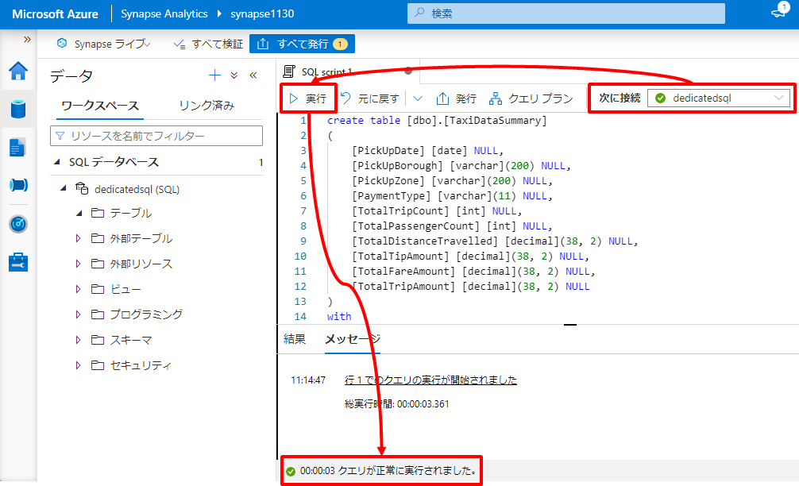
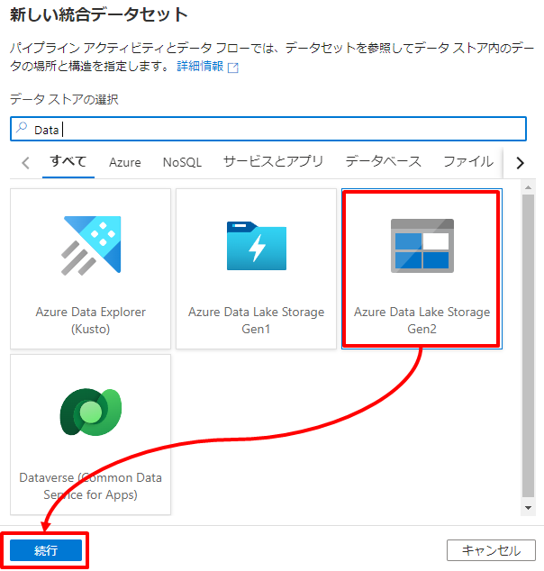
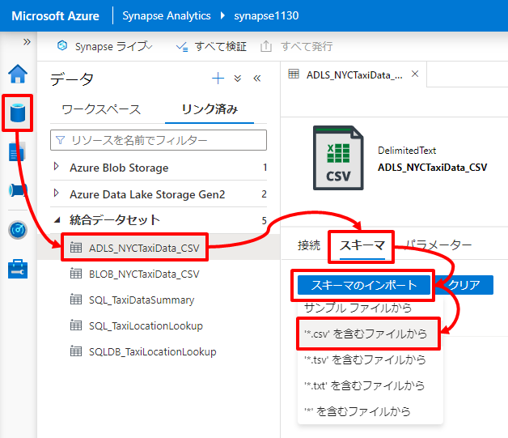
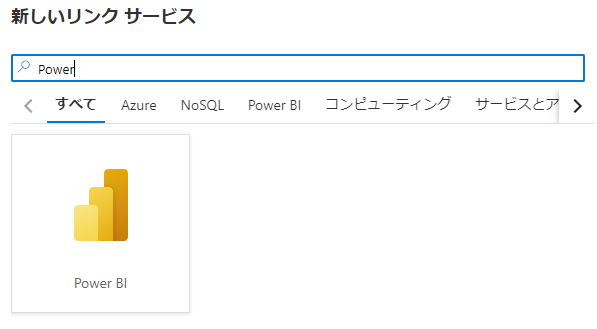

---

# **5. ハンズオン：データ統合と可視化**  

本章では外部データソースとの多様なコネクタを持つ Synapse Pipeline を利用してサイロ化されたデータをデータレイクへ統合します。統合したデータは Synapse Dataflow による加工処理を通じ整形済みデータとして Synapse Dedicated に格納します。最後にデータ活用の典型例として、Power BI と連携し整形済みデータの可視化を行います。  

## **シナリオ**  
ここでは架空のタクシー事業者を想定し、タクシーの運行データの分析と可視化を行います。  

## **アーキテクチャ と このシナリオにおける各サービスの用途**  

- Azure Blob Storage (Blob)  
  このシナリオでは Blob が分析対象となる生データの発生源とします。この生データを Synapse 内の Azure Datalake Store へ集約します。

- Azure SQL Database (SQLDB)  
  このシナリオでは SQLDB に生データを補完する参照データが格納されているものとします。このデータは Synapse Dedicated にコピーし腹持ちさせます。

- Azure Data Lake Storage (DataLake)  
  生データを集約するデータレイクとして利用します。

- Synapse Dataflow  
  データの加工処理を定義し実行します。

- Synapse Pipeline  
  データレイクへのデータ集約 や Synapse Dataflow によるデータの加工処理を呼び出す一連のデータパイプラインを定義します。

- Synapse Dedicated  
  構造化データを格納するデータウェアハウスとして利用します。このシナリオでは生データを補完する参照データ と 加工結果のデータを格納します。

- Power BI Service  
  Synapse Dedicated に格納された加工結果のデータを元にしたレポートを定義し公開します。

## **ハンズオンステップ概要**  

- 5-1. 分析に利用するデータを定義する  
  データパイプラインの定義やデータ加工処理の定義に先立ち、それら処理の入力元と出力先のデータを Synapse Intgrated Dataset として定義します。

- 5-2. データパイプラインを定義する  
  DataLake への生データ集約 と Synapse Dedicatedへの参照データコピーを Synapse Pipeline に定義し実行します。

- 5-3. データの加工処理を定義しデータパイプラインに追加する  
  データの加工と Synapse Dedicated への結果データ格納を Synapse Dataflow に定義し、データパイプラインに追加します。

- 5-4. 整形したデータを可視化する  
  整形したデータを利用し Power BI でレポートを作成し公開します。

---
# **ハンズオン**

---
## **5-1. 分析に利用するデータを定義する**  

データパイプラインの定義やデータ加工処理の定義に先立ち、それら処理の入力元と出力先のデータを Synapse Intgrated Dataset として定義します。

### **5-1-1. 入力元データセットの定義**

1. リンクサービス定義    

   1. Azure Blob Storage  

      | 項目 | 値 |
      | :---- | :---- |
      | 名前 | 例：blobstorage1130 |
      | サブスクリプション | ハンズオンに利用しているサブスクリプションを指定 |
      | ストレージアカウント名 | デプロイした Azure Blob Storage を指定 |

      

      

      

   2. Azure SQL Database  

      | 項目 | 値 |
      | :---- | :---- |
      | 名前 | 例：mssqlserver1130 |
      | サブスクリプション | ハンズオンに利用しているサブスクリプションを指定 |
      | サーバー名 | デプロイした Azure SQL Database を指定 |
      | データベース名 | 作成した データベース を指定 |
      | 認証の種類 | SQL 認証 |
      | ユーザー名 | デプロイ時に指定したユーザー名を指定 |
      | パスワード | デプロイ時に指定したパスワードを指定 |

      

      

      

2. データセット定義  

   1. Azure Blob Storage  

      | 項目 | 値 |
      | :---- | :---- |
      | 名前 | 例：BLOB_NYCTaxiData_CSV |
      | リンクサービス | 作成したリンクサービスを指定 |
      | コンテナ－ | handson |
      | ディレクトリ | source/nyctaxidata |
      | 先頭行をヘッダーとして | Yes |

      

      

      

      

   2. Azure SQL Database  

      | 項目 | 値 |
      | :---- | :---- |
      | 名前 | 例：SQLDB_TaxiLocationLookup |
      | リンクサービス | 作成したリンクサービスを指定 |
      | テーブル名 | dbo.TaxiLocationLookup |

      

      

      

   3. 発行 
   
      

      

### **5-1-2. 出力先データセットの定義**

1. Synapse に統合する出力先の準備

   1. Synapse Data Lake
      
      Portal から Synapse デプロイ時に指定したファイルシステム配下にディレクトリ *raw/nyctaxidata* を作成します。

      

   2. Synapse Dedicated SQL Pool

      Synapse Studio からクエリエディタを開き *resource/script/dedicatedsql.sql* の内容を張り付け *TaxiDataSummaryテーブル* と *TaxiLocationLookupテーブル* 定義します。

      

      

2. データセット定義
   1. Synapse Data Lake  

      | 項目 | 値 |
      | :---- | :---- |
      | 名前 | 例：ADLS_NYCTaxiData_CSV |
      | リンクサービス | Synapse のデプロイの延長で自動作成されるADLSへのリンクサービスを指定 |
      | コンテナ－ | synapsefs |
      | ディレクトリ | raw/nyctaxidata |
      | 先頭行をヘッダーとして | Yes |

      

      

      

      
   
   2. Synapse Dedicated SQL Pool
   
      | 分類 | 項目 | 値 |
      | :---- | :---- | :---- |
      | 全般 | 名前 | 例：SQL_TaxiLocationLookup |
      | 接続 | リンクサービス | Synapse Dedicated SQL Pool のデプロイの延長で自動作成されるリンクサービスを指定 |
      | 接続 | DB Name | Synapse Dedicated SQL Pool のデプロイ時に指定した SQL Pool 名を指定 |
      | 接続 | テーブル | dbo.TaxiLocationLookup |

      

      

      

      

      

      

      同様に繰り返します。

      | 分類 | 項目 | 値 |
      | :---- | :---- | :---- |
      | 全般 | 名前 | 例：SQL_TaxiDataSummary |
      | 接続 | リンクサービス | Synapse Dedicated SQL Pool のデプロイの延長で自動作成されるリンクサービスを指定 |
      | 接続 | DB Name | Synapse Dedicated SQL Pool のデプロイ時に指定した SQL Pool 名を指定 |
      | 接続 | テーブル | dbo.TaxiDataSummary |

      

      

   3. 発行 
   
      

      

---
## **5-2. データパイプラインを定義する**  

Datalake への生データ集約 と Synapse Dedicatedへの参照データコピーを Synapse Pipeline に定義し実行します。

### **5-2-1. データパイプラインの定義**

1. パイプラインの追加
   
   | 項目 | 値 |
   | :---- | :---- |
   | 名前 | 例：DataIntegration |
   | リンクサービス | 作成したリンクサービスを指定 |
   | テーブル名 | dbo.TaxiDataSummary |
      
   
   
2. データレイクへの生データの集約
   
   コピーアクティビティ追加

   | 分類 | 項目 | 値 |
   | :---- | :---- | :---- |
   | 全般 | 名前 | 例：CopyTaxiDataFiles |
   | ソース | ソース データセット | 例：BLOB_NYCTaxiData_CSV |
   | ソース | ファイル パスの種類 | ワイルドカード ファイル パス |
   | ソース | ワイルドカード ファイル名 | *.csv |
   | シンク | シンク データセット | 例：ADLS_NYCTaxiData_CSV |

   
   
3. Dedicated への参照データのコピー
   
   コピーアクティビティ追加

   | 分類 | 項目 | 値 |
   | :---- | :---- | :---- |
   | 全般 | 名前 | 例：CopyTaxiDataFiles |
   | ソース | ソース データセット | 例：BLOB_NYCTaxiData_CSV |
   | シンク | シンク データセット | 例：ADLS_NYCTaxiData_CSV |

   

4. 発行
   
   

### **5-2-2. データパイプラインの実行**  

1. パイプラインの実行  

     

   

2. パイプラインの実行の確認

   

   

   

   

---
## **5-3. データの加工処理を定義しデータパイプラインに追加する**  

データの加工と Synapse Dedicated への結果データ格納を Synapse Dataflow に定義し、データパイプラインに追加します。

### **5-3-1. データフローの定義**  

1. スキーマのインポート  

   

   
   
2. データフローの定義

   データフローを追加します。

   | 分類 | 項目 | 値 |
   | :---- | :---- | :---- |
   | 全般 | 名前 | PrepNYCTaxiData |

   

   

   Rawデータソースを追加します。
   
   | 分類 | 項目 | 値 |
   | :---- | :---- | :---- |
   | ソースの設定 | 出力ストリーム名 | TaxiDataFiles |
   | ソースの設定 | データセット | ADLS_NYCTaxiData_CSV |

   

   

   参照データソースを追加します。
   
   | 分類 | 項目 | 値 |
   | :---- | :---- | :---- |
   | ソースの設定 | 出力ストリーム名 | TaxiLocationLookup |
   | ソースの設定 | データセット | SQL_TaxiLocationLookup |

   

   派生列を定義します。
   
   | 分類 | 項目 | 値 |
   | :---- | :---- | :---- |
   | 派生列の設定 | 出力ストリーム名 | TransformColumns |
   | 派生列の設定 | 着信ストリーム | TaxiDataFiles |
   | 派生列の設定 | 列：PickUpDate | toDate(tpep_pickup_datetime,'yyyy-MM-dd') |
   | 派生列の設定 | 列：PickUpLocationID | toInteger(PULocationID) |
   | 派生列の設定 | 列：PassengerCount | toInteger(passenger_count) |
   | 派生列の設定 | 列：DistanceTravelled | toDecimal(trip_distance) |
   | 派生列の設定 | 列：TipAmount | toDecimal(tip_amount) |
   | 派生列の設定 | 列：FareAmount | toDecimal(fare_amount) |
   | 派生列の設定 | 列：TotalAmount | toDecimal(total_amount) |

   

   

   

   

   同様に他の列も追加します。

   

   

   すべての列の追加後に「保存して終了」します。

   

   

   結合を定義します。
   
   | 分類 | 項目 | 値 |
   | :---- | :---- | :---- |
   | 結合の設定 | 出力ストリーム名 | JonPickUpLocation |
   | 結合の設定 | 左ストリーム | TransformColumns |
   | 結合の設定 | 右ストリーム | TaxiLocationLookup |
   | 結合の設定 | 結合の種類 | 内部 |
   | 結合の設定 | 結合条件 | TransformColumns.PickUpLocationID == TaxiLocationLookup.LocationID|
   
   

   

   集約を定義します。

   | 分類 | 項目 | 値 |
   | :---- | :---- | :---- |
   | 集計の設定 | 出力ストリーム名 | AggregateDailySummary |
   | 集計の設定 | 着信ストリーム | JonPickUpLocation |
   | 集計の設定 | グループ化 | PickUpDate, PaymentType, Borough, Zone |
   | 集計の設定 | 集約：TotalTripCount | count() |
   | 集計の設定 | 集約：TotalPassengerCount | sum(PassengerCount) |
   | 集計の設定 | 集約：TotalDistanceTravelled | sum(DistanceTravelled) |
   | 集計の設定 | 集約：TotalTipAmount | sum(TipAmount) |
   | 集計の設定 | 集約：TotalFareAmount | sum(FareAmount) |
   | 集計の設定 | 集約：TotalTripAmount | sum(TotalAmount) |

   

   

   

   選択を定義します。

   | 分類 | 項目 | 値 |
   | :---- | :---- | :---- |
   | 選択の設定 | 出力ストリーム名 | RenameColumns |
   | 選択の設定 | 着信ストリーム | AggregateDailySummary |
   | 選択の設定 | 入力列：Borough | PickUpBorough |
   | 選択の設定 | 入力列：Zone | PickUpZone |

   

   

   シンクを定義します。
   
   | 分類 | 項目 | 値 |
   | :---- | :---- | :---- |
   | シンク | 出力ストリーム名 | TaxiDataSummary |
   | シンク | 着信ストリーム | RenameColumns |
   | シンク | データセット | SQL_TaxiDataSummary |
   | 設定 | テーブルアクション | テーブルの切り詰め |

   

   

   

   データフローの完成です。

   

### **5-3-2. データパイプラインへの追加と再実行**

1. パイプラインの更新（データフローアクティブティの追加）

   

2. データフローの設定
   
   | 分類 | 項目 | 値 |
   | :---- | :---- | :---- |
   | 設定 | データフロー | PrepNYCTaxiData |
   | 設定 | ステージングのリンクサービス | Synapse デプロイ時に作成したADLSを指定 |
   | 設定 | ステージング ストレージ フォルダー：コンテナ | Staging |

   

3. アクティビティの結合
   
   

   

4. 発行
   
   

   

5. パイプラインの再実行

   

6. パイプラインの実行の結果確認
   
   

   

   
 
---
## **5-4. 整形したデータを可視化する**  

整形したデータ（Synapse Dedicated 内の TaxiDataSummaryテーブル）を Power BI を利用しレポートとして可視化を行ます。なお、本ハンズオンでは Power BI レポートの作成自体の解説は割愛し、既に作成済みのレポートを利用して Synapse  と Power BI の統合のハンズオンを継続します。

### **5-4-1. Power BI Desktop でレポートを作成する**

1. *resource/report/NYC Taxi Operation Report.pbit* から Power BI Desktop を起動します。
   
   

2. 接続先の Synapse Dedicated のエンドポイントと資格情報を入力します。

   

   

   ※ Synapse Dedicated のエンドポイントや資格情報はPortalで確認できます。

   

3. Synapse Dedicated 内の TaxiDataSummaryテーブル を可視化したレポートが開きます。

   

### **5-4-2. Power BI Service のワークスペースへレポートを発行する

1. Power BI Service にログインします。

   https://powerbi.microsoft.com/ja-jp/  

   

2. Power BI ワークスペースを作成します。

   

   

   ※ Free ラインセンスアカウントの場合は「ワークスペースの作成」を押下後に Power BI Pro へのアップグレードに誘導されます。「無料で試す」を選択することで 60 日間 Power BI Pro を試用することができます。本ハンズオンを継続する場合は「無料で試す」を選択ください。

   

   

3. Power BI Service にレポートを発行します。

   Power BI Desktop に戻り発行ボタンを押下します。
   
   

   作成したワークスペースを指定しレポートを発行します。

   

   

   この操作により Power BI Service 上で作成したレポートが組織に共有されます。

   

### **5-4-1. Synapse と Power BI Service ワークスペースをリンクする**

1. Power BI Service ワークスペースを Synaose にリンクする  
   
   

   

   

   

   

2. Synapse Studio での レポートを編集する

   Synapse と Power BI Service ワークスペースをリンクすることで該当ワークスペース内のレポートの参照と編集が可能になります。ここでの編集は Power BI Service ワークスペース上のレポートへ反映されます。

   