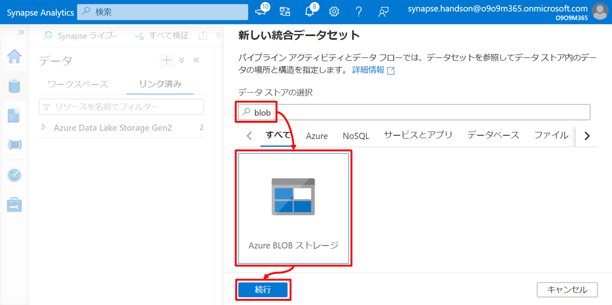
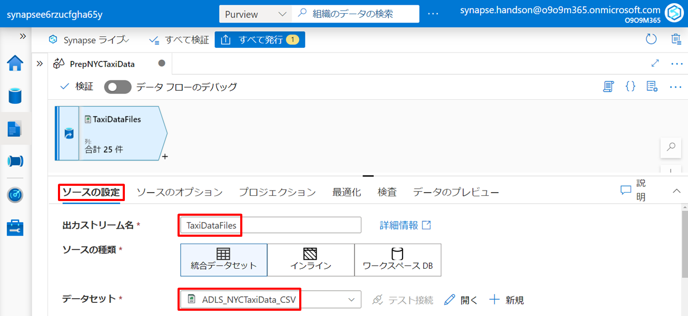

---
# 5. ハンズオン：データ統合と可視化  

第5章はオンプレからクラウドまで外部の様々なデータソースとのコネクタを持つ Synapse Pipeline を利用してサイロ化されたデータを Data Lake Storage へ統合します。統合したデータは Synapse Dataflow による整形処理を通じて整形済みのデータとして Synapse Dedicated SQL Pool に格納します。最後にデータ活用の典型例として Power BI Service と連携し整形済みデータの可視化を行います。  

# シナリオ  
このハンズオンでは架空のタクシー事業者のタクシー乗車記録の分析と可視化を行います。  

このシナリオのアーキテクチャと関連リソースの役割は以下の通りです。矢印はデータの流れを示しています。  
  

| アイコン | リソース | 役割 |
| :---: | :---- | :---- |
|  | Azure Blob Storage | Azure Blob Storage を分析対象となるタクシーの運行データ（生データ）の発生源と位置づけ、この生データを Azure Synapse Analytics 内の Data Lake Store へ集約します。 |
|  | Azure SQL Database | Azure SQL Database にタクシーの運行データ（生データ）を補完する参照データ（例えばローケーションの名称）が格納されているものとします。このデータも Synapse Dedicated SQL Pool にコピーし腹持ちさせます。 |
|  | Synapse Pipeline | 一連のアクティビティ（Data Lake Storage への生データの集約、Synapse Dedicated SQL Pool への参照データのコピー、Synapse Dataflow によるデータの整形処理の呼び出し）とそれらを結ぶパイプラインを定義し実行します。 |
|  | Azure Data Lake Storage | サイロ化されたデータ、非構造から半構造まで様々な形式のデータ、それらを未整形の生データとして集約するデータレイクです。 |
|  | Synapse Dataflow | ローコードでデータの整形処理を定義します。定義した整形処理は Synapse Pipeline のパイプラインアクティビティとして呼び出されることで実行されます。 |
|  | Synapse Dedicated SQL Pool | 構造化データを格納するデータウェアハウスです。このシナリオでは生データを補完する参照データ と 加工結果のデータを格納します。 |
|  | Power BI Service | Synapse Dedicated SQL Pool に格納された加工結果のデータを元にしたレポートを定義し公開します。 |
|  | Azure Purview | 今回のシナリオでは Synapse Pipeline によるパイプライン処理を監視しデータの系譜を記録管理します。記録管理したデータの系譜は第6章で活用します。 |

---
# Let's get started  

## 5-1. Azure Synapse Analytics と Azure Purview とのリンクを行う   

Azure Synapse Analytics は外部の Azure リソースと連携し機能を強化することができます。第5章では Azure Purview と連携し、Synapse Pipeline によるパイプライン処理を監視しデータの系譜を記録管理したいと思います。そのためパイプラインを構成する前にまずは Azure Synapse Analytics と Azure Purview を連携させます。  
Synapse ワークスペースの Azure Portal メニューを通じ Synapse Studio を開きます。  
  

Synapse Studio のメニューを通じ「Purview カウントに接続」をクリックします。  
  

「Purview アカウントに接続」ブレードで第4章で作成した Purview アカウントを指定します。  
  

状態が「接続」となっていれば Purview とのリンクが完了です。  
  

## 5-2. リンクサービスと統合データセットを定義する  

ここからはパイプラインを構成していきます。  
パイプラインを構成するにはまずはそのパイプラインに関連するデータを「統合データセット」として Azure Synapse Analytics 内に定義します。また、統合データセットの定義にはそのソースとなるリソースを「リンクサービス」として定義する必要があります。  

それでは、入力元と出力先のそれぞれについて「リンクサービス」と「統合データセット」を定義していきましょう。  

### 5-2-1. 入力元のリンクサービスと統合データセットを定義する  

まずは入力元の定義です。  

#### 1. リンクサービス定義  
タクシー運行データの発生源となる Azure Blob Storage と タクシー運行データを補完するための参照データを格納する Azure SQL Database についてそれぞれリンクサービスを定義します。  

##### Azure Blob Storage  

Synapse Studio のメニューを通じリンクサービスで「＋新規」をクリックします。  
  
      
リンクサービスの種類として「Azure Blob ストレージ」を選択し「続行」をクリックします。  
  
      
リンクサービス定義の情報を入力し、テスト接続を行ったのち作成ボタンを押下します。  
| 項目 | 値 |
| :---- | :---- |
| 名前 | リンク対象の Azure Blob Storage について Azure Synapse Analytics 内で識別する際の任意の名前を指定します（例：storagee6rzucfgha65y） |
| 認証方法 | 任意の認証方法を選択可能ですがこのハンズオンでは「アカウントキー」とします |
| アカウントの選択方法 | "Azure サブスクリプションから"を指定します |
| サブスクリプション | ハンズオンに利用しているサブスクリプションを指定します |
| ストレージアカウント名 | 4章でデプロイした Azure Blob Storage を指定します |

  

##### Azure SQL Database  

同じく Synapse Studio のメニューを通じリンクサービスで「＋新規」をクリックします。  
  

リンクサービスの種類として「Azure SQL Database」を選択します。  
  

リンクサービス定義の情報を入力し、テスト接続を行ったのち作成ボタンを押下します。  

| 項目 | 値 |
| :---- | :---- |
| 名前 | リンク対象の Azure SQL Database について Azure Synapse Analytics 内で識別する際の任意の名前を指定します（例：sqlservere6rzucfgha65y_sqldb） |
| アカウントの選択方法 | "Azure サブスクリプションから"を指定します |
| サブスクリプション | ハンズオンに利用しているサブスクリプションを指定します |
| サーバー名 | 4章でデプロイした Azure SQL Database の論理サーバー名を指定します |
| データベース名 | 4章でデプロイした Azure SQL Database のデータベース名を指定します |
| 認証の種類 | 任意の認証方式を選択可能ですがこのハンズオンでは「SQL 認証」とします |
| ユーザー名 | 4章のデプロイ時に指定したユーザー名を指定します |
| パスワード | パスワードは Azure Key Vault 上で管理するシークレットを参照することが推奨ですがこのハンズオンでは4章のデプロイ時に指定したパスワードを直接指定します |

  

#### 2. 統合データセット定義  

次に統合データセットを定義します。  
前の手順で作成したリンクサービスを使い、統合データセットを定義していきます。  

##### Azure Blob Storage  

Synapse Studio メニューを通じ「統合データセット」をクリックします。  
  

データセットの種類として「Azure Blob ストレージ」を選択します。  
  

データセットのファイル種類として「DelimitedText」を選択します。  
  

データセット定義の情報を入力し「OK」をクリックします。  

| 項目 | 値 |
| :---- | :---- |
| 名前 | BLOB_NYCTaxiData_CSV |
| リンクサービス | 作成した Azure Blob Storage のリンクサービスを指定します |
| コンテナ－ | blob |
| ディレクトリ | source/nyctaxidata |
| 先頭行をヘッダーとして | Yes |
| スキーマのインポート | "接続またはストアから"を指定します |

  

##### Azure SQL Database

同じく Synapse Studio メニューを通じ「統合データセット」をクリックします。  
  

データセットの種類として「Azure SQL Database」を選択します。  
    

データセット定義の情報を入力しOKボタンを押下します。  

| 項目 | 値 |
| :---- | :---- |
| 名前 | SQLDB_TaxiLocationLookup |
| リンクサービス | 作成した Azure SQL Database のリンクサービスを指定します |
| テーブル名 | dbo.TaxiLocationLookup |
| スキーマのインポート | "接続またはストアから"を指定します |

  

#### 3. 発行

Synapse Studio 上で行った定義を確定させるために「発行」を行います。  
Synapse Studio の上部にある「すべて発行」->「発行」の順にクリックしここまでの定義を確定させます。  
  
  

### 5-2-2. 出力先の統合データセットを定義する

続いて出力先の定義です。出力先となる Azure Synapse Analytics 内の Data Lake Storage や Synapse SQL Dedicated Pool については Azure Synapse Analytics のデプロイの延長でリンクサービスは自動作成されているため、ここでは統合データセットのみを定義します。  

#### 1. Synapse 上の出力先の準備

統合データセットの定義の前にまずはそれが指し示す Azure Synapse Analytics 内の出力先を作成します。  

##### Data Lake Storage

Azure Blob Storage 上の生データ（タクシー運行データ）の統合先とする Data Lake Storage 上に用意します。  

Synapse Studio のメニューを通じ Azure Synapse Analytics デプロイ時に指定した Data Lake Storage 上のファイルシステム（例：synapsefs）の配下にフォルダー「raw/nyctaxidata」を作成します。  
  

##### Synapse Dedicated SQL Pool

Azure SQL Database 上の参照データの統合先となる Synapse SQL Dedicated Pool 上のテーブルを作成します。  

Synapse Studio のメニューを通じ「空のスクリプト」をクリックしクエリエディタを開きます。  
  
  

クエリエディタ上にハンズオンアセット一式内の「resource/script/dedicatedsql.sql」の内容を張り付け実行をクリックします。  

```SQL
CREATE TABLE [dbo].[TaxiDataSummary]
(
    [PickUpDate] [date] NULL,
    [PickUpBorough] [varchar](200) NULL,
    [PickUpZone] [varchar](200) NULL,
    [PaymentType] [varchar](11) NULL,
    [TotalTripCount] [int] NULL,
    [TotalPassengerCount] [int] NULL,
    [TotalDistanceTravelled] [decimal](38, 2) NULL,
    [TotalTipAmount] [decimal](38, 2) NULL,
    [TotalFareAmount] [decimal](38, 2) NULL,
    [TotalTripAmount] [decimal](38, 2) NULL
)
WITH
(
	DISTRIBUTION = round_robin,
	CLUSTERED COLUMNSTORE INDEX
)
GO

CREATE TABLE [dbo].[TaxiLocationLookup]
(
    [LocationID] [int] NULL,
    [Borough] [varchar](200) NULL,
    [Zone] [varchar](200) NULL,
    [ServiceZone] [varchar](200) NULL
)
WITH
(
	DISTRIBUTION = round_robin,
	CLUSTERED COLUMNSTORE INDEX
)
GO
```

  

この SQL スクリプトの実行により「TaxiDataSummaryテーブル」と「TaxiLocationLookupテーブル」が作成されます。  
テーブル定義後このクエリエディタを保存せずに閉じてしまって問題ありません。  

#### 2. 統合データセット定義

次に出力先の統合データセットを定義しましょう。  

##### Synapse Data Lake  
      
Synapse Studio メニューを通じ「統合データセット」をクリックします。  
  

データセットの種類として「Azure Data Lake Storage Gen2」を選択します。  
  

データセットのファイル種類として「DelimitedText」を選択します。  
  

データセット定義の情報を入力し「OK」をクリックします。  

| 項目 | 値 |
| :---- | :---- |
| 名前 | ADLS_NYCTaxiData_CSV |
| リンクサービス | Azure Synapse Analytics のデプロイ時に自動作成される Data Lake Storage へのリンクサービスを指定します |
| コンテナ－ | synapsefs |
| ディレクトリ | raw/nyctaxidata |
| 先頭行をヘッダーとして | Yes |  

  

##### Synapse Dedicated SQL Pool  

同じく Synapse Studio メニューを通じ「統合データセット」をクリックします。  
  

データセットの種類として「Azure Synapse Analytics」を選択します。  
  

この統合データセットの名前を「SQL_TaxiLocationLookup」とし、Azure Synapse Analytics のデプロイ時に自動作成される Synapse Dedciated SQL Pool へのリンクサービスを指定したのち、テーブル名の横の更新ボタンをクリックします。  

| 項目 | 値 |
| :---- | :---- |
| 名前 | SQL_TaxiLocationLookup |
| リンクサービス | Azure Synapse Analytics のデプロイ時に自動作成される Synapse Dedciated SQL Pool へのリンクサービスを指定します |

  

DBName に「dedicatedsql」を入力し「OK」をクリックします。  

| 項目 | 値 |
| :---- | :---- |
| DBName | dedicatedsql |  

  

テーブル名に「dbo.TaxiLocationLookup」を選択し「OK」をクリックします。  

| 項目 | 値 |
| :---- | :---- |
| テーブル名 | dbo.TaxiLocationLookup |  

  

最後に接続タブのリンクサービスプロパティ DBName に「dedicatedsql」を設定します。  

| 項目 | 値 |
| :---- | :---- |
| リンクサービスプロパティ DBName | dedicatedsql |

  

以上と同様の手順で「dbo.TaxiDataSummary」テーブルについても統合データセットを定義します。  

| 項目 | 値 |
| :---- | :---- |
| 名前 | SQL_TaxiDataSummary |
| リンクサービス | Azure Synapse Analytics のデプロイ時に自動作成される Synapse Dedciated SQL Pool へのリンクサービスを指定します |
| テーブル名 | dbo.TaxiDataSummary |
| リンクサービスプロパティ DBName | dedicatedsql |

  
  

#### 3. 発行  

これまでの定義を発行し確定させます。  
  
  

---
## 5-3. パイプラインを構成して実行する  

次に作成した統合データセットを利用しパイプラインを構成します。また構成したパイプラインを実際に実行しその動作を見ていきましょう。  
ここでは「Data Lake Storage への生データ集約」と「Synapse Dedicated SQL Pool への参照データコピー」の２つのアクティビティを含むパイプラインを定義し実行します。  

### 5-3-1. パイプラインを構成する  

#### 1. パイプラインの作成  
   
Synapse Studio メニューを通じ「パイプライン」をクリックします。  
  

パイプラインの名前を入力します。  

| タブ | 項目 | 値 |
| :---- | :---- | :---- |
| 全般 | 名前 | DataIntegration |

  

#### 2. Azure Blob Stogage から Data Lake Storage へのコピーアクティビティの追加  

パイプラインは様々なアクティビティの集まりで構成されます。  
ここでは Azure Blob Storage 上の生データを Data Lake Storage へコピーするためのコピーアクティビティをパイプラインに追加します。  

アクティビティの「移動と変換」から「データのコピー」をドラッグし、右の編集エリアにドロップします。  
  

追加したアクティビティに対して以下の情報を入力します。  

| タブ | 項目 | 値 |
| :---- | :---- | :---- |
| 全般 | 名前 | CopyTaxiDataFiles |
| ソース | ソース データセット | BLOB_NYCTaxiData_CSV |
| ソース | ファイル パスの種類 | ワイルドカード ファイル パス |
| ソース | ワイルドカード ファイル名 | *.csv |
| シンク | シンク データセット | ADLS_NYCTaxiData_CSV |

  
  

この設定は Azure Blob Storage の統合データセット配下のすべての CSV ファイルを Data Lake Storage の統合データセット配下にコピーすることを示しています。  

#### 3. Azure SQL Database から Synapse Dedicated SQL Pool へのコピーアクティビティの追加

同様に Azure SQL Database 上の参照データを Synapse Dedicated SQL Pool へコピーするためのアクティビティをパイプラインに追加します。  

アクティビティの「移動と変換」から「データのコピー」をドラッグし、右の編集エリアにドロップします。  
  

追加したアクティビティに対して以下の情報を入力します。  

| 分類 | 項目 | 値 |
| :---- | :---- | :---- |
| 全般 | 名前 | CopyTaxiLocationLookup |
| ソース | ソース データセット | SQLDB_TaxiLocationLookup |
| シンク | シンク データセット | SQL_TaxiLocationLookup |
| シンク | 事前コピー スクリプト | TRUNCATE TABLE dbo.TaxiLocationLookup |
| 設定 | ステージングを有効にする | 有効 |
| 設定 | ステージング アカウントのリンク サービス | Azure Synapse Analytics のデプロイ時に自動作成される Data Lake Storage へのリンクサービスを指定します |
| 設定 | ストレージパス | staging |

  
  
  

この設定は Azure SQL Database のデータセット（TaxiLocationLookupテーブル）のレコード全件を Synapse Dedicated SQL Pool のデータセット（TaxiLocationLookupテーブル）へコピーすることを示しています。コピーは COPY コマンドにて処理し、コピーに必要なステージング領域として Data Lake Storage を設定しています。またコピーの事前に Synapse Dedicated SQL Pool のデータセットを TRUNCATE することでデータを毎回洗い替えしています。  

#### 4. 発行  
      
これまでの定義を発行し確定します。  
  

### 5-3-2. パイプラインを実行する  

#### 1. パイプラインの実行  

作成したパイプラインを実行しコピー動作を確認しましょう。  
編集エリア上部の「トリガーの追加」から「今すぐトリガー」を選択しパイプラインを実行します。  
  
  

***Tips***
*新規/編集* を選択するとパイプラインの実行を開始させるためのトリガを定義することができます。トリガにはスケジュールの他にイベントを定義することも可能です。  

#### 2. パイプライン実行の確認  

パイプラインの状態を確認しましょう。  
Synapse Studio メニューを通じ「パイプラインの実行」から実行したパイプラインの状態が「成功」となることをしばらく待ちます。  
  

次に、Data Lake Storage へのコピーアクティビティの結果を確認しましょう。  
Synapse Studio メニューを通じて、出力先に指定した Data Lake Storage 配下に2019年1月から6月までそれぞれフォルダが作成され、それぞれのフォルダ配下に CSV ファイルがコピーされていることを確認します。  
  

同様に、Synapse Dedicated SQL Pool へのコピーアクティビティの結果を確認しましょう。  
Synapse Studio メニューを通じて、出力先に指定した Synapse Dedicated SQL Pool の TaxiLocationLookupテーブル を右クリックしたのち「上位100行を選択」を指定しレコードが登録されていることを確認します。  
  
  

---
## 5-4. データの整形処理を定義しパイプラインに追加する  

ここまでのハンズオンでは点在しているデータをパイプラインによって Azure Synapse Analytics へ統合しました。  
ここからは統合したデータを整形処理にかけ整形します。この整形したデータはこの次の手順でレポートによる可視化に利用します。  

### 5-4-1. データフローの定義  

Azure Synapse Analytics にはコードファーストによるデータ処理エンジンである Synapse Serverless Spark Pool、SQL文によるデータ処理エンジンである Synapse Serverless SQL Pool、ローコード（GUI 操作）によるデータ処理エンジンである Synapse Dataflow など複数のデータ処理エンジンの選択肢をもっています。このハンズオンでは Synapse Dataflow による GUI 操作によって、Data Lake Storage に統合した生データと Synapse Dedicated SQL Pool に統合した参照データに対して整形処理を行います。  

#### 1. スキーマのインポート  

データ加工の定義を行う前にまず Data Lake Storage の統合データセットに対してスキーマを認識させます。  
今回は前の手順で統合済みの実データに基づいてスキーマ認識を行いますが、サンプルデータを利用することで事前にスキーマ認識させることも可能です。  

Synapse Studio メニューを通じ Data Lake Storage 統合データセットの 「スキーマのインポート」 から 「'*.csv'を含むファイルから」をクリックします。  
  

するとこの CSV ファイルのスキーマ定義が実データに基づいてインポートされます。  
  

もし「スキーマのインポート」ボタンがグレーアウトされている場合は以下の手順で統合ランタイムを起動させます。  
  
  

「接続」タブの「統合ランタイム」について「インタラクティブな編集」が「有効」となるまでしばらく待ちます。
  

「インタラクティブな編集」が「有効」となったことを確認したのち「スキーマのインポート」を行ってください。  

#### 2. データ加工の定義  

データ加工の定義を行います。  
Synapse Studio メニューを通じ「データ フロー」をクリックします。  

  

このデータフローの名前を指定します。  

| タブ | 項目 | 値 |
| :---- | :---- | :---- |
| 全般 | 名前 | PrepNYCTaxiData |


##### ① 加工対象データの指定  

「ソースの追加」の下向き山カッコから「ソースの追加」を選択します。  
  

Data Lake Storage の統合データセットを追加します。  

| タブ | 項目 | 値 | 説明 |
| :---- | :---- | :---- | :---- |
| ソースの設定 | 出力ストリーム名 | TaxiDataFiles | このコンポーネントの任意の名前を指定します |
| ソースの設定 | データセット | ADLS_NYCTaxiData_CSV | このコンポーネントに対する入力として Data Lake Storage 上の生データ（CSV ファイル）を示す統合データセットを指定します |

  

同様に「ソースの追加」の下向き山カッコから「ソースの追加」を選択し、Synapse Dedicated SQL Pool の統合データセットを追加します。  
  

| タブ | 項目 | 値 | 説明 |
| :---- | :---- | :---- | :---- |
| ソースの設定 | 出力ストリーム名 | TaxiLocationLookup | このコンポーネントの任意の名前を指定します |
| ソースの設定 | データセット | SQL_TaxiLocationLookup | このコンポーネントに対する入力として Synapse Dedicated SQL Pool 上の参照データ（TaxiLocationLookup テーブル）を示す統合データセットを指定します |

  

##### ② 派生列の定義

入力列へのデータ加工結果に対する新たな列として派生列を定義します。  

TaxiDataFiles の「＋」から「派生列」を選択します。  
  

以下の派生列の情報を入力したのち「式ビルダーを開く」をクリックします。    

| タブ | 項目 | 値 | 説明 |
| :---- | :---- | :---- | :---- |
| 派生列の設定 | 出力ストリーム名 | TransformColumns |  このコンポーネントの任意の名前を指定します |
| 派生列の設定 | 着信ストリーム | TaxiDataFiles | このコンポーネントに対する入力コンポーネントを指定します |

  

派生列として「PaymentType」を追加し以下の式を指定します。  

```DataFlow
case (paymentType == '1', 'Credit card'
    , paymentType == '2', 'Cash'
    , paymentType == '3', 'No charge'
    , paymentType == '4', 'Dispute'
    , paymentType == '5', 'Unknown'
    , paymentType == '6', 'Voided trip')
```

  

同様の手順で以下の派生列をすべて定義します。  

| タブ | 列名 | 式 | 説明 |
| :---- | :---- | :---- | :---- |
| 派生列の設定 | PaymentType | case (paymentType == '1', 'Credit card', paymentType == '2', 'Cash', paymentType == '3', 'No charge', paymentType == '4', 'Dispute', paymentType == '5', 'Unknown', paymentType == '6', 'Voided trip') | paymentType の値に応じた説明を付与します |
| 派生列の設定 | PickUpDate | toDate(tpepPickupDateTime,'yyyy-MM-dd') | tpepPickupDateTime の文字列を書式に基づき日付に変換します |
| 派生列の設定 | PickUpLocationID | toInteger(puLocationId) | 入力値を Integer 型の値に変換します |
| 派生列の設定 | PassengerCount | toInteger(passengerCount) | 入力値を Integer 型の値に変換します |
| 派生列の設定 | DistanceTravelled | toDecimal(tripDistance) | 入力値を Integer 型の値に変換します |
| 派生列の設定 | TipAmount | toDecimal(tipAmount) | 入力値を Decimal 型の値に変換します |
| 派生列の設定 | FareAmount | toDecimal(fareAmount) | 入力値を Decimal 型の値に変換します |
| 派生列の設定 | TotalAmount | toDecimal(totalAmount) | 入力値を Decimal 型の値に変換します |

新しい派生列を追加するには「＋新規作成」横の下向き山カッコから「列」を選択します。  
  

すべての列が追加できたら「保存して終了」をクリックします。  
  

##### ③ 結合の定義  

生データと参照データを結合することで情報を補完します。  

TransformColumns の「＋」から「結合」を選択します。  
  

以下の定義のとおり結合条件を設定します。  

| タブ | 項目 | 値 | 説明 |
| :---- | :---- | :---- | :---- |
| 結合の設定 | 出力ストリーム名 | JonPickUpLocation | このコンポーネントの任意の名前を指定します |
| 結合の設定 | 左ストリーム | TransformColumns | 左側の結合対象コンポーネントとして生データを指定します |
| 結合の設定 | 右ストリーム | TaxiLocationLookup | 右側の結合対象コンポーネントとして参照データを指定します |
| 結合の設定 | 結合の種類 | 内部 | 結合の種類として「内部（SQL の INNER JOIN に相当）」を指定します |
| 結合の設定 | 結合条件 | TransformColumns.PickUpLocationID == TaxiLocationLookup.LocationID | 結合の条件式を指定します |

  

##### ④ 集計の定義  

ここではグループ化とグループごとの集計関数を設定します。  

JonPickUpLocation の「＋」から「集約」を選択します。  
  

以下の定義のとおりグループ化と集計関数を設定します。  

| タブ | 項目 | 値 | 説明 |
| :---- | :---- | :---- | :---- |
| 集計の設定 | 出力ストリーム名 | AggregateDailySummary | このコンポーネントの任意の名前を指定します |
| 集計の設定 | 着信ストリーム | JonPickUpLocation | このコンポーネントに対する入力コンポーネントを指定します |
| 集計の設定 | グループ化 | PickUpDate, TransformColumns@PaymentType, Borough, Zone | 集約対象列（SQL の GROUP BY 列に相当）を指定します |
| 集計の設定 | 集約：TotalTripCount | count() | 集約関数を指定します |
| 集計の設定 | 集約：TotalPassengerCount | sum(TransformColumns@PassengerCount) | 集約関数を指定します |
| 集計の設定 | 集約：TotalDistanceTravelled | sum(DistanceTravelled) | 集約関数を指定します |
| 集計の設定 | 集約：TotalTipAmount | sum(TransformColumns@TipAmount) | 集約関数を指定します |
| 集計の設定 | 集約：TotalFareAmount | sum(TransformColumns@FareAmount) | 集約関数を指定します |
| 集計の設定 | 集約：TotalTripAmount | sum(TransformColumns@TotalAmount) | 集約関数を指定します |

  
  

##### ⑤ 選択の定義

ここでは出力列の別名を設定します。別名の設定の他、出力の対象する列の絞り込みも可能です。

AggregateDailySummary の「＋」から「選択」を選択します。  
  

以下の定義のとおり列の別名を設定します。  

| タブ | 項目 | 値 | 説明 |
| :---- | :---- | :---- | :---- |
| 選択の設定 | 出力ストリーム名 | RenameColumns | このコンポーネントの任意の名前を指定します |
| 選択の設定 | 着信ストリーム | AggregateDailySummary | このコンポーネントに対する入力コンポーネントを指定します |
| 選択の設定 | 入力列：Borough | PickUpBorough | 別名（SQL の AS に相当）を指定します |
| 選択の設定 | 入力列：Zone | PickUpZone | 別名（SQL の AS に相当）を指定します |

  

##### ⑥ シンクの定義  

最後はこれまでの加工によって生成されたデータセットの出力先の設定です。  

RenameColumns の「＋」から「シンク」を選択します。  
  

以下の定義のとおり出力先を設定します。  

| タブ | 項目 | 値 | 説明 |
| :---- | :---- | :---- | :---- |
| シンク | 出力ストリーム名 | TaxiDataSummary | このコンポーネントの任意の名前を指定します |
| シンク | 着信ストリーム | RenameColumns | このコンポーネントに対する入力コンポーネントを指定します |
| シンク | シンクの種類 | 統合データセット | シンク先の種類を指定します |
| シンク | データセット | SQL_TaxiDataSummary | 出力先として Synapse Dedicated SQL Pool 上のテーブル（TaxiDataSummary テーブル）を示す統合データセットを指定します | 
| 設定 | テーブルアクション | テーブルの切り詰め | 今回はパイプラインを実行する度にデータを全件削除ののち上書きすることとします |

  
  

これでデータフローの完成です。  
  

### 5-4-2. パイプラインへの追加と再実行  

#### 1. データフローアクティビティの追加

作成したデータフローをパイプラインのアクティビティとして追加します。  

DataIntegration パイプラインの定義に戻り、アクティビティの「移動と変換」から「データ フロー」をドラッグし、右の編集エリアにドロップします。  
  

追加したアクティビティに対して以下の情報を入力します。  

| 分類 | 項目 | 値 | 説明 |
| :---- | :---- | :---- | :---- |
| 全般 | 名前 | PrepNYCTaxiData | データフローアクティビティの名前を指定します |
| 設定 | データフロー | PrepNYCTaxiData | 作成したデータフローを指定します |
| 設定 | ステージングのリンクサービス | Azure Synapse Analytics のデプロイ時に自動作成される Data Lake Storage へのリンクサービスを指定します | データフローの実行時に必要なステージング領域として利用されます |
| 設定 | ステージング ストレージ フォルダー：コンテナー | Staging | ステージング領域のパスを指定します |

  

#### 2. パイプラインへの結合  

Azure Synapse Analytics へのデータ統合となるコピーアクティビティの延長としてデータフローのアクティビティを結合します。  
２つのコピーアクティビティそれぞれについて、右の緑突起をドラッグし、データフローアクティビティへドロップします。  
  
  

#### 3. 発行  

これまでの定義を発行し確定します。  
  
  

#### 4. パイプラインの再実行  

パイプラインを再実行して動作を確認しましょう。  
編集エリア上部の「トリガーの追加」から「今すぐトリガー」を選択しパイプラインを実行します。  
  

#### 5. パイプラインの実行の確認  

再実行したパイプラインの状態を確認します。  
Synapse Studio メニューを通じ「パイプラインの実行」から実行したパイプラインの状態が「成功」となることを確認します。  
  

次にパイプラインの実行結果としてデータフローで定義したシンク先にデータ加工結果が格納されていることを確認します。  
Synapse Studio メニューを通じて、シンク先に指定した統合データセットである Synapse Dedicated SQL Pool の TaxiDataSummary テーブル に対して「上位100行を選択」をクリックしデータ加工結果のレコードが登録されていることを確認します。  
  
  

---
## 5-5. 整形したデータを可視化する  

最後にデータ活用の典型例として Power BI Desktop を利用しデータ加工結果を可視化するレポートを作成し、作成したレポートを Power BI Service に発行し組織内に共有しましょう。  

### 5-5-1. Power BI Desktop でレポートを作成する  

本ハンズオンでは Power BI Desktop によるレポートの作成自体の解説は割愛し、準備済みのレポートを利用します。  

ハンズオンアセット一式内の「resource/report/NYC Taxi Operation Report.pbit」をダブルクリックし Power BI Desktop を起動します。  
  

Synapse Dedicated SQL Pool の「エンドポイント」と「Synapse Dedicated SQL Pool 名」を入力したのち「読み込み」をクリックします。  
なお「エンドポイント」は 「<Synapse ワークスペース名>.sql.azuresynapse.net」です。  
  

「データベース」を選択し Synapse Dedicated SQL Pool への資格情報を入力したのち「接続」をクリックします。  
  

接続情報の入力が完了すると Synapse Dedicated SQL Pool 内の TaxiDataSummary テーブル を可視化したレポートが開きます。  
  

このレポートにはタクシーの乗車記録の明細データを元にした分析結果が表示され、指定した期間における乗車回数、走行距離、チップ額の総計値や月ごとの推移、乗車開始場所の統計、支払方法の統計などの事実が可視化されます。これによりこの架空のタクシー事業者にとって新たな気づきが得らるかもしれません。  

### 5-5-2. Power BI Service を通じ組織内へレポートを共有する  

レポートを作成したらそれを組織内に共有しましょう。  

まずは組織への共有に必要となる Power BI Service ワークスペースを作成します。  
Power BI Service にサインインします（※ Power BI Service のサインアップには組織アカウントが必要です）。  
https://powerbi.microsoft.com/ja-jp/   

  

Power BI Service のメニューを通じ「ワークスペースの作成」をクリックします。  
  

「ワークスペース名」を入力し「保存」をクリックします。  
  

なお、Free ラインセンスアカウントの場合は「ワークスペースの作成」を押下後に Power BI Pro へのアップグレードに誘導されます。「無料で試す」を選択することで 60 日間 Power BI Pro を試用することもできます。本ハンズオンを継続する場合は「無料で試す」を選択ください。  
  
  
  

次に Power BI Desktop に戻り、同じく Power BI Service にサインインします。
  

この Power BI ファイルを保存します。保存時に指定するファイル名は Power BI Service 上のレポート名やデータセット名となります。  

「発行」をクリックしたのち作成したワークスペースを指定し「選択」をクリックします。  
  
  

この操作により Power BI Service ワークスペース上にレポートが配置されます。  
Power BI Service に戻りレポートを確認してみましょう。  
  
  

### 5-5-3. Synapse Studio で Power BI レポートを参照・編集する  

Power BI Service ワークスペースを Azure Synapse Analytics にリンクさせることで Synapse Studio 上で Power BI レポートを参照・編集することができるようになります。  

Synapse Studio のメニュー通じリンクサービスで「＋新規」をクリックします。  
  
   
リンクサービスの種類として「Power BI」を選択します。  
  

リンクサービス定義の情報を入力し、作成ボタンを押下します。  

| 項目 | 値 |
| :---- | :---- |
| 名前 | このリンクサービスの任意の名前を指定します（例：pbi_handson_workspace） |
| テナント | 自組織のテナントを指定します |
| ワークスペース名 | 作成した Power BI Service ワークスペース名を指定します |

  

これまでの定義を発行し確定します。  
  
  

Synapse Studio メニューから Power BI Service ワークスペース上のレポートを通じ Power BI Service ワークスペース上のレポートを開きます。  
ここでは参照だけではなく編集を行うこともでき、ここでの編集は Power BI Service ワークスペース上のレポートと同期されます。  
  

以上で第5章のハンズオンが完了です。  

# まとめ  

いかがでしたでしょうか。  
第5章ではまずはじめに Synapse Pipeline を利用してサイロ化されたデータを Data Lake Storage へ統合しました。このハンズオンでは Azure Blob Storage と Azure SQL Database を扱いましたが、Synapse Pipeline は90 以上の組み込みコネクタを備えており、オンプレからマルチクラウドまで散在する多種多様なターゲットをサポートし Azure Synapse Analytics へ統合することが可能です。  

次に統合したデータはデータ処理エンジンを通じて整形データを作成し、結果を Synapse Dedicated SQL Pool に格納しました。Azure Synapse Analytics は複数のデータ処理エンジンの選択肢をもち、用途やスキルセットに応じて最適なデータ処理エンジンを選択することができ、このハンズオンでは Synapse Dataflow を利用しローコードで整形処理を実装しました。  

最後に整形データを Power BI Desktop でレポートとして可視化を行ったのち、Power BI Service によって組織内に共有を行いました。  
