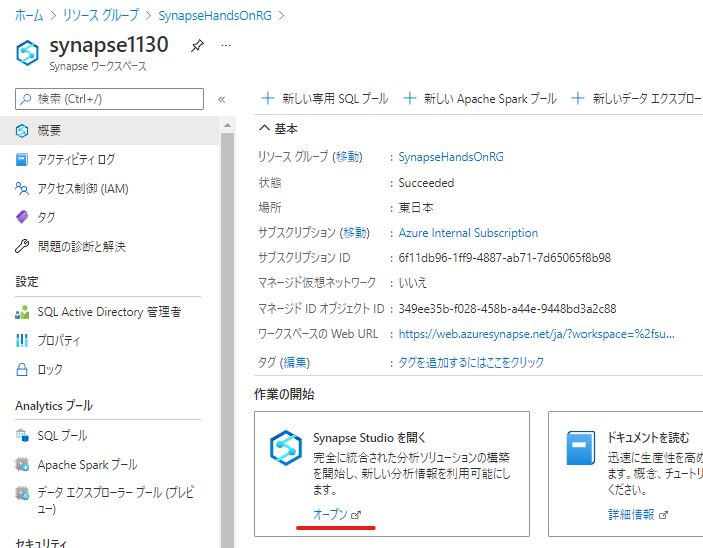
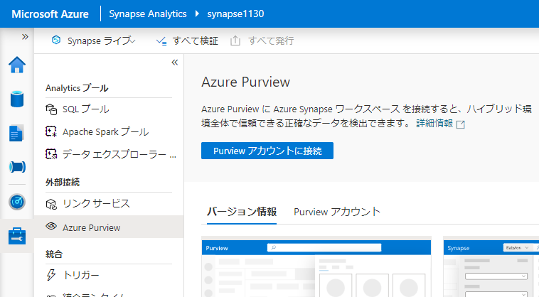
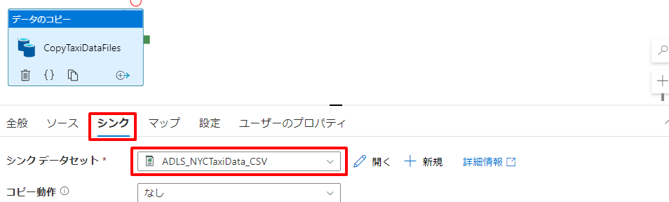
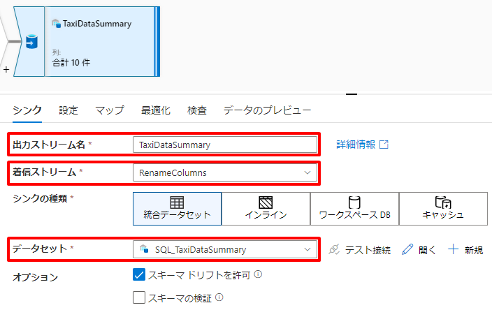
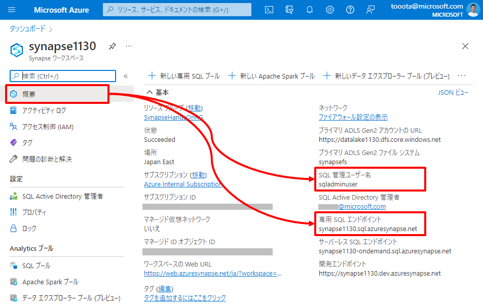
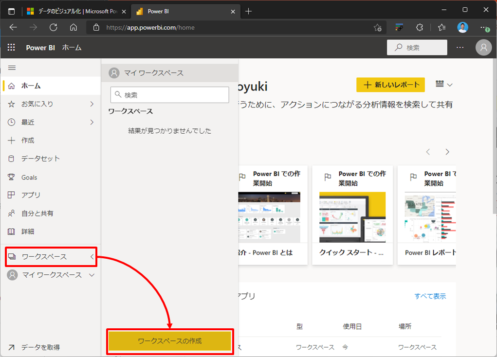

---

# 5. ハンズオン：データ統合と可視化  

本章のハンズオンではオンプレからクラウドまで外部の様々なデータソースとのコネクタを持つ Synapse Pipeline を利用してサイロ化されたデータを Data Lak Store へ統合します。統合したデータは Synapse Dataflow による加工処理を通じて整形済みのデータとして Synapse Dedicated に格納します。最後にデータ活用の典型例として、Power BI と連携し整形済みデータの可視化を行います。  

# シナリオ  
ここでは架空のタクシー事業者を想定したタクシーの乗車記録データの分析と可視化を行います。  

このシナリオにおけるアーキテクチャと関連リソースの役割は以下の通りです。  
  

| アイコン | リソース | 役割 |
| :---: | :---- | :---- |
|  | Azure Blob Storage | Blob Storage を分析対象となるタクシーの運行データ（生データ）の発生源と位置づけ、この生データを Synapse 内の Data Lake Store へ集約します。 |
|  | Azure SQL Database | SQL Database にタクシーの運行データ（生データ）を補完する参照データ（例えばローケーションの名称）が格納されているものとします。このデータも Synapse Dedicated にコピーし腹持ちさせます。 |
|  | Synapse Pipeline | 一連のデータパイプライン（Data Lake Storage への生データの集約、Synapse Dedicated SQL Pool への参照データのコピー、Synapse Dataflow によるデータの加工処理の呼び出し）を定義します。 |
|  | Azure Data Lake Storage | 生データを集約するデータレイクとして利用します。 |
|  | Synapse Dataflow | データの加工処理を定義し実行します。 |
|  | Synapse Dedicated SQL Pool| 構造化データを格納するデータウェアハウスとして利用します。このシナリオでは生データを補完する参照データ と 加工結果のデータを格納します。 |
|  | Power BI Service | Synapse Dedicated に格納された加工結果のデータを元にしたレポートを定義し公開します。 |
|  | Azure Purview | 今回のシナリオでは Synapse Pipeline によるデータパイプラインをとらまえデータの系譜を管理します。とらまえデータの系譜は第6章で活用します。 |

---
# Let's get started

## 5-1. Synapse と Purview のリンク

Synapse は外部の Azure リソースの機能と連携し役割を強化することができます。第5章では Azure Purview と連携し、Synapse Pipeline によるデータパイプラインをとらまえデータの系譜を管理します。とらまえデータの系譜は第6章で活用します。  

それではまず Synapse と Azure Purview と連携させましょう。Synapse の Poratal メニュを辿り Synapse Studio を起動します。  
  

Synapse Studio のメニュを辿り *Purview カウントに接続* をクリックします。  

「Purview アカウントに接続」ブレードで第4章で作成した Purview アカウントを指定します。  

## 5-2. リンクサービスと統合データセットを定義する  

データパイプラインを構成するにはそのパイプラインに関連するデータを「統合データセット」として Synapse 内に定義します。また、統合データセットの定義にはそのソースとなるリソースをリンクサービスとして定義する必要があります。  
それでは、入力元と出力先のそれぞれについて「リンクサービス」と「統合データセット」を定義していきましょう。

### 5-2-1. 入力元のリンクサービスと統合データセットを定義する

#### リンクサービス定義  
ここではタクシー運行データの発生源となる Blob Storage と タクシー運行データを補完する参照データが格納されている SQL Database についてリンクサービスを定義します。

##### Azure Blob Storage  
            
Synapse Studio メニューを辿りリンクサービスを新規作成します。  

      
リンクサービスの種類として「Azure Blob ストレージ」を選択します。

      
リンクサービス定義の情報を入力し、テスト接続を行ったのち作成ボタンを押下します。
| 項目 | 値 |
| :---- | :---- |
| 名前 | 例：blobstorage1130 |
| 認証方法 | アカウントキー |
| アカウントの選択方法 | Azure サブスクリプションから |
| サブスクリプション | ハンズオンに利用しているサブスクリプションを指定 |
| ストレージアカウント名 | デプロイした Azure Blob Storage を指定 |

      
***TODO：認証方法のバリエーションをTipsとして解説***

##### Azure SQL Database  

同じく Synapse Studio メニューを辿りリンクサービスを新規作成します。  

リンクサービスの種類として「Azure SQL Database」を選択します。  

リンクサービス定義の情報を入力し、テスト接続を行ったのち作成ボタンを押下します。
| 項目 | 値 |
| :---- | :---- |
| 名前 | mssqlserver1130（任意） |
| アカウントの選択方法 | Azure サブスクリプションから |
| サブスクリプション | ハンズオンに利用しているサブスクリプションを指定 |
| サーバー名 | デプロイした Azure SQL Database を指定 |
| データベース名 | 作成した データベース を指定 |
| 認証の種類 | SQL 認証 |
| ユーザー名 | デプロイ時に指定したユーザー名を指定 |
| パスワード | デプロイ時に指定したパスワードを指定 |

***TODO：パスワードのAKV管理をTipsとして解説***

#### 統合データセット定義  

リンクサービスが定義できたので次に統合データセットを定義します。  
前の手順で作成したリンクサービスを使い、統合データセットを定義していきます。

##### Azure Blob Storage  

Synapse Studio メニューを辿り *統合データセット* をクリックします。  
  

データセットの種類として「Azure Blob ストレージ」を選択します。  
  

データセットのファイル種類として「DelimitedText」を選択します。  
  

データセット定義の情報を入力しOKボタンを押下します。  

| 項目 | 値 |
| :---- | :---- |
| 名前 | BLOB_NYCTaxiData_CSV（任意） |
| リンクサービス | 作成したリンクサービスを指定 |
| コンテナ－ | handson |
| ディレクトリ | source/nyctaxidata（任意） |
| 先頭行をヘッダーとして | Yes |
| スキーマのインポート | 接続またはストアから |

  

##### Azure SQL Database

同じく Synapse Studio メニューを辿り *統合データセット* をクリックします。  
  

データセットの種類として「Azure SQL Database」を選択します。  
  

データセット定義の情報を入力しOKボタンを押下します。  

| 項目 | 値 |
| :---- | :---- |
| 名前 | SQLDB_TaxiLocationLookup（任意） |
| リンクサービス | 作成したリンクサービスを指定 |
| テーブル名 | dbo.TaxiLocationLookup |
| スキーマのインポート | 接続またはストアから |

  

#### 発行

Synapse Studio 上で行った定義を確定させるために「発行」を行います。  
Synapse Studio の上部にある *すべて発行* をクリックしここまでの定義を確定させます。  
  
  

### 5-2-2. 出力先の統合データセットを定義する

#### Synapse 上の出力先の準備
   
まずは、入力元のデータの統合先となる Synapse 内の出力先を作成します。

##### Data Lake Storage

Blob Storage 上の生データ（タクシー運行データ）の統合先となる Data Lake Storage 上のディレクトリを作成します。  
Data Lake Storage の Portal メニュ から Synapse デプロイ時に指定したファイルシステム（例：synapsefs）の配下にディレクトリ *raw/nyctaxidata* を作成してください。  

##### Synapse Dedicated SQL Pool

SQL Database 上の参照データの統合先となる Synapse SQL Dedicated Pool 上のテーブルを作成します。  
まず Synapse Studio のメニュを辿りクエリエディタを開きます。  
  

次に *resource/script/dedicatedsql.sql* の内容をエディタ上に張り付け実行をクリックします。  
  

このSQLスクリプトの実行により *TaxiDataSummaryテーブル* と *TaxiLocationLookupテーブル* が作成されます。
テーブル定義後このクエリエディタを保存せずに閉じてしまって問題はありません。

#### データセット定義

Synapse 内の Data Lake Storage や Synapse SQL Dedicated Pool については Synapse のデプロイの延長でリンクサービスは自動作成されています。   
このリンクサービスを使って出力先となる統合データセットを定義していきましょう。

##### Synapse Data Lake  
      
Synapse Studio メニューを辿り *統合データセット* をクリックします。  
  

データセットの種類として「Azure Data Lake Storage Gen2」を選択します。  
  

データセットのファイル種類として「DelimitedText」を選択します。  

データセット定義の情報を入力しOKボタンを押下します。  

| 項目 | 値 |
| :---- | :---- |
| 名前 | ADLS_NYCTaxiData_CSV（任意） |
| リンクサービス | Synapse のデプロイの延長で自動作成されるADLSへのリンクサービスを指定 |
| コンテナ－ | synapsefs |
| ディレクトリ | raw/nyctaxidata（任意） |
| 先頭行をヘッダーとして | Yes |  

  

##### Synapse Dedicated SQL Pool  
      
同じく Synapse Studio メニューを辿り *統合データセット* をクリックします。  
  

データセットの種類として「Azure Synapse Analytics」を選択します。  
  

名前を入力し、リンクサービスに Synapse Dedicated SQL Pool のデプロイの延長で自動作成されるリンクサービスを指定した上で、テーブル名の横の更新ボタンを押下します。  

| 分類 | 項目 | 値 |
| :---- | :---- | :---- |
| 全般 | 名前 | SQL_TaxiLocationLookup（任意） |
| 接続 | リンクサービス | Synapse Dedicated SQL Pool のデプロイの延長で自動作成されるリンクサービスを指定 |

  

DBName に dedicatedsql を入力し OK を押下します。  
  

テーブル名に dbo.TaxiLocationLookup を選択しOKボタンを押下します。  

| 分類 | 項目 | 値 |
| :---- | :---- | :---- |
| 接続 | テーブル | dbo.TaxiLocationLookup |  

  

最後に接続タブのリンクサービスプロパティ DBName に dedicatedsql を設定します。  

| 分類 | 項目 | 値 |
| :---- | :---- | :---- |
| 接続 | リンクサービスプロパティ DBName | dedicatedsql |

  

同様に「Azure Synapse Analytics」の統合データセットを新規作成し以下のデータセット定義の情報を入力しOKボタンを押下します。  

| 分類 | 項目 | 値 |
| :---- | :---- | :---- |
| 全般 | 名前 | SQL_TaxiDataSummary（任意） |
| 接続 | リンクサービス | Synapse Dedicated SQL Pool のデプロイの延長で自動作成されるリンクサービスを指定 |
| 接続 | テーブル | dbo.TaxiDataSummary |
| 接続 | リンクサービスプロパティ DBName | dedicatedsql |

  
  

#### 発行 
      
これまでの定義を発行し確定させます。  
  
  

---
## 5-3. データパイプラインを構成して実行する  

次に作成した統合データセットを利用しデータパイプラインの構成します。また構成したデータパイプラインを実際に実行しその動作を見ていきましょう。  
ここでは Data Lake Storage への生データ集約 と Synapse Dedicated SQL Pool への参照データコピーのデータパイプラインを Synapse Pipeline に定義したのち実行します。

### 5-3-1. データパイプラインを構成する

#### パイプラインの追加
   
Synapse Studio メニューを辿り *パイプライン* をクリックします。  
  

パイプラインの名前を入力します。  
| 分類 | 項目 | 値 |
| :---- | :---- | :---- |
| 全般 | 名前 | 例：DataIntegration |

  

#### Data Lake Storage へ生データを集約するアクティビティの追加

パイプラインは様々なアクティビティの集まりで構成されます。  
ここでは Blob Storage 上の生データを Data Lake Storage へ集約するための *コピーアクティビティ* をパイプラインに追加します。  

アクティビティの「移動と変換」から「データのコピー」をドラッグし、右の編集エリアにドロップします。  
  

追加したアクティビティに対して以下の情報を入力しOKボタンを押下します。  
この設定は Blob の データセット配下のすべての CSV ファイルを ADLS のデータセット配下にコピーすることを示しています。  

| 分類 | 項目 | 値 |
| :---- | :---- | :---- |
| 全般 | 名前 | 例：CopyTaxiDataFiles |
| ソース | ソース データセット | 例：BLOB_NYCTaxiData_CSV |
| ソース | ファイル パスの種類 | ワイルドカード ファイル パス |
| ソース | ワイルドカード ファイル名 | *.csv |
| シンク | シンク データセット | 例：ADLS_NYCTaxiData_CSV |

  
  

#### Synapse Dedicated SQL Pool への参照データをコピーするアクティビティの追加
   
同様にアクティビティの「移動と変換」から「データのコピー」をドラッグし、右の編集エリアにドロップします。  
  

追加したアクティビティに対して以下の情報を入力しOKボタンを押下します。  
この設定は SQLDB のデータセット（TaxiLocationLookupテーブル）のレコード全件を Dedicated のデータセット（TaxiLocationLookupテーブル）へコピーすることを示しています。コピーは COPY コマンドにて処理し、コピーに必要なステージング領域として Data Lake Storage を設定しています。またコピーの事前に Synapse Dedicated SQL Pool のデータセットを TRUNCATE することでデータを毎回洗い替えしています。  

***MEMO：https://docs.microsoft.com/ja-jp/azure/data-factory/connector-azure-sql-data-warehouse?tabs=data-factory***

| 分類 | 項目 | 値 |
| :---- | :---- | :---- |
| 全般 | 名前 | 例：CopyTaxiLocationLookup |
| ソース | ソース データセット | 例：SQLDB_TaxiLocationLookup |
| シンク | シンク データセット | 例：SQL_TaxiLocationLookup |
| シンク | 事前コピー スクリプト | TRUNCATE TABLE dbo.TaxiLocationLookup |
| 設定 | ステージングを有効にする | 有効 |
| 設定 | ステージング アカウントのリンク サービス | Synapse のデプロイの延長で自動作成されるADLSへのリンクサービスを指定 |
| 設定 | ステージングを有効にする | staging |

  
  
  

#### 発行
      
これまでの定義を発行し確定します。  
  

### 5-3-2. データパイプラインを実行する  

#### パイプラインの実行  

作成したデータパイプラインを実行しその動作を確認しましょう。  
編集エリア上部の *トリガーの追加* から *今すぐトリガー* を選択しパイプラインを即時実行させます。  
  

「パイプライン実行」ブレードで *OK* をクリックするとデータパイプラインの実行が開始されます。  
  

***Memo***
*新規/編集* を選択するとデータパイプラインの実行を開始させるためのトリガを定義することができます。トリガにはスケジュールの他にイベントを定義することも可能です。  

#### パイプライン実行の確認

実行を開始させたパイプラインの状態を確認しましょう。  
Synapse Studio メニューを辿り *パイプラインの実行* から実行したパイプラインの状態が”成功”となることを確認します。  
  

次に、Data Lake Storage への生データ集約アクティビティの結果を確認しましょう。  
Synapse Studio メニューを辿り出力先に指定した Data Lake Storage 上のパスに６つの CSV ファイルがコピーされていることを確認します。  

同様に、Synapse Dedicated SQL Pool への参照データコピーアクティビティの結果を確認しましょう。  
Synapse Studio メニューを辿り出力先の Synapse Dedicated SQL Pool データセット（TaxiLocationLookupテーブル）に対して「上位100行を選択」しレコードが登録されていることを確認します。  
  
  

---
## 5-4. データの加工処理を定義しデータパイプラインに追加する  

ここではデータの加工と Synapse Dedicated への結果データ格納を Synapse Dataflow に定義し、データパイプラインに追加します。

### 5-4-1. データフローの定義  

#### スキーマのインポート  

データの加工を行うためにはデータセットのスキーマを知る必要があります。  
ADLS データセットについて、前の手順でコピーした実データに基づいてスキーマをインポートします。  
メニューを辿り ADLS データセットの「スキーマのインポート」を実行します。
  

なお、実データの配置前であってもサンプルファイルを指定することで「スキーマのインポート」が可能です。

#### データフローによるデータ加工の定義

メニューを辿り、データフローを追加します。

| 分類 | 項目 | 値 |
| :---- | :---- | :---- |
| 全般 | 名前 | PrepNYCTaxiData |

  

① まず始めに加工の対象となるデータを指定します。編集エリア「ソースの追加」の下向き山カッコから「ソースの追加」を選択します。     

以下の ADLS データセットを追加します。  

| 分類 | 項目 | 値 |
| :---- | :---- | :---- |
| ソースの設定 | 出力ストリーム名 | TaxiDataFiles |
| ソースの設定 | データセット | ADLS_NYCTaxiData_CSV |

② 同じように編集エリア「ソースの追加」の下向き山カッコから「ソースの追加」を選択し、以下の Dedicated データセットを追加します。

| 分類 | 項目 | 値 |
| :---- | :---- | :---- |
| ソースの設定 | 出力ストリーム名 | TaxiLocationLookup |
| ソースの設定 | データセット | SQL_TaxiLocationLookup |

③ 次に派生列を定義します。派生列とは入力列のデータを加工し新たな列を定義することです。

TaxiDataFiles の + から 派生列 を選択します。  

以下の派生列の設定を入力します。
| 分類 | 項目 | 値 |
| :---- | :---- | :---- |
| 派生列の設定 | 出力ストリーム名 | TransformColumns |
| 派生列の設定 | 着信ストリーム | TaxiDataFiles |

  

「式ビルダーを開く」を選択します。     

以下の定義のとおりそれぞれ式を追加します。  
| 分類 | 列名 | 式 |
| :---- | :---- | :---- |
| 派生列の設定 | 列：PaymentType | case (payment_type == '1', 'Credit card', payment_type == '2', 'Cash', payment_type == '3', 'No charge', payment_type == '4', 'Dispute', pent_type == '5', 'Unknown', payment_type == '6', 'Voided trip') |
| 派生列の設定 | 列：PickUpDate | toDate(tpep_pickup_datetime,'yyyy-MM-dd') |
| 派生列の設定 | 列：PickUpLocationID | toInteger(PULocationID) |
| 派生列の設定 | 列：PassengerCount | toInteger(passenger_count) |
| 派生列の設定 | 列：DistanceTravelled | toDecimal(trip_distance) |
| 派生列の設定 | 列：TipAmount | toDecimal(tip_amount) |
| 派生列の設定 | 列：FareAmount | toDecimal(fare_amount) |
| 派生列の設定 | 列：TotalAmount | toDecimal(total_amount) |

同様に他の列も追加します。

すべての列の追加後に「保存して終了」を押下します。

④ 次に結合を定義します。ここでは生データと参照データを結合することで生データの情報を補完します。

TransformColumns の + から 結合 を選択します。  

以下の定義のとおり結合条件を設定します。  
| 分類 | 項目 | 値 |
| :---- | :---- | :---- |
| 結合の設定 | 出力ストリーム名 | JonPickUpLocation |
| 結合の設定 | 左ストリーム | TransformColumns |
| 結合の設定 | 右ストリーム | TaxiLocationLookup |
| 結合の設定 | 結合の種類 | 内部 |
| 結合の設定 | 結合条件 | TransformColumns.PickUpLocationID == TaxiLocationLookup.LocationID|

⑤ 次に集約を定義します。ここではグループ化とグループごとの集計関数を設定します。

JonPickUpLocation の + から 結合 を選択します。  

以下の定義のとおりグループ化と集計関数を設定します。  
| 分類 | 項目 | 値 |
| :---- | :---- | :---- |
| 集計の設定 | 出力ストリーム名 | AggregateDailySummary |
| 集計の設定 | 着信ストリーム | JonPickUpLocation |
| 集計の設定 | グループ化 | PickUpDate, PaymentType, Borough, Zone |
| 集計の設定 | 集約：TotalTripCount | count() |
| 集計の設定 | 集約：TotalPassengerCount | sum(PassengerCount) |
| 集計の設定 | 集約：TotalDistanceTravelled | sum(DistanceTravelled) |
| 集計の設定 | 集約：TotalTipAmount | sum(TipAmount) |
| 集計の設定 | 集約：TotalFareAmount | sum(FareAmount) |
| 集計の設定 | 集約：TotalTripAmount | sum(TotalAmount) |

  

⑥ 次に選択を定義します。ここでは出力列の別名を設定します。別名の設定の他、出力に必要な列の選択も可能です。

AggregateDailySummary の + から 選択 を選択します。  

以下の定義のとおり列の別名を設定します。  
| 分類 | 項目 | 値 |
| :---- | :---- | :---- |
| 選択の設定 | 出力ストリーム名 | RenameColumns |
| 選択の設定 | 着信ストリーム | AggregateDailySummary |
| 選択の設定 | 入力列：Borough | PickUpBorough |
| 選択の設定 | 入力列：Zone | PickUpZone |

⑦ 最後にシンクを定義します。これまでの加工によって生成されたデータセットの出力先設定です。

RenameColumns の + から 選択 を選択します。  

以下の定義のとおり出力先を設定します。  
| 分類 | 項目 | 値 |
| :---- | :---- | :---- |
| シンク | 出力ストリーム名 | TaxiDataSummary |
| シンク | 着信ストリーム | RenameColumns |
| シンク | データセット | SQL_TaxiDataSummary |
| 設定 | テーブルアクション | テーブルの切り詰め |

以下の定義のとおりテーブルアクションを設定します。これはテーブルへの出力前に切り詰め（TRUNCATE）を行うことを示しています。    
| 分類 | 項目 | 値 |
| :---- | :---- | :---- |
| 設定 | テーブルアクション | テーブルの切り詰め |

これでデータフローの完成です。  

### 5-4-2. データパイプラインへの追加と再実行  

#### パイプラインの更新（データフローアクティブティの追加）
   
データコピーの延長としてデータ加工のアクティビティを追加します。  
DataIntegration パイプラインの定義に戻り、アクティビティの「移動と変換」から「データ フロー」をドラッグし、右の編集エリアにドロップします。  

#### データフローの設定
   
追加したアクティビティに対して以下の情報を入力しOKボタンを押下します。
ここではデータフローの実行に必要なステージング領域としてADLSを設定しています。    
| 分類 | 項目 | 値 |
| :---- | :---- | :---- |
| 設定 | データフロー | PrepNYCTaxiData |
| 設定 | ステージングのリンクサービス | Synapse デプロイ時に作成したADLSを指定 |
| 設定 | ステージング ストレージ フォルダー：コンテナ | Staging |

#### アクティビティの結合
   
２つのコピーアクティビティそれぞれについて、右の緑突起をドラッグし、データフローアクティビティへドロップします。  
  

#### 発行
      
これまでの定義を発行し確定します。  
  

#### パイプラインの再実行

パイプラインを再実行します。編集エリア上部の「トリガーの追加」から「今すぐトリガー」を選択しパイプラインを実行します。

#### パイプラインの実行の結果確認  
   
メニューを辿り「パイプラインの実行」でトリガーしたパイプラインの状態が”成功”となることを確認します。  

メニューを辿り出力先の Dedicated データセット（TaxiDataSummaryテーブル）に対して「上位100行を選択」しデータ加工結果のレコードが登録されていることを確認します。  
  

---
## 5-5. 整形したデータを可視化する  

整形したデータ（Synapse Dedicated 内の TaxiDataSummaryテーブル）を Power BI を利用しレポートとして可視化を行い、作成したレポートは Power BI Service に発行し組織に共有します。  
また、Synapse に Power BI Service をリンクさせることで、Synapse Studio 上からレポートの参照や編集を行います。

### 5-5-1. Power BI Desktop でレポートを作成する  

#### Power BI Desktop を起動します。
   
本ハンズオンでは Power BI レポートの作成自体の解説は割愛し、既に作成済みのレポートを利用します。  
*resource/report/NYC Taxi Operation Report.pbit* から Power BI Desktop を起動します。  

#### 接続先の Synapse Dedicated のエンドポイント、SQL Pool 名、および資格情報を入力します。

Synapse Dedicated のエンドポイント、SQL Pool 名、および資格情報は Portal で確認できます。  
  
  

Synapse Dedicated のエンドポイントと SQL Pool 名を入力します。

Synapse Dedicated の資格情報を入力します。

#### Synapse Dedicated 内の TaxiDataSummaryテーブル を可視化したレポートが開きます。

### 5-5-2. Power BI Service のワークスペースへレポートを発行する

前の手順でローカルで作成したレポートをPower BI Service のワークスペースへ発行することで組織へレポートを共有します。

#### Power BI Service にログインします。

https://powerbi.microsoft.com/ja-jp/  

※ Power BI Service のご利用には組織アカウントが必要になります。

#### Power BI ワークスペースを作成します。

※ Free ラインセンスアカウントの場合は「ワークスペースの作成」を押下後に Power BI Pro へのアップグレードに誘導されます。「無料で試す」を選択することで 60 日間 Power BI Pro を試用することができます。本ハンズオンを継続する場合は「無料で試す」を選択ください。

#### Power BI Service にレポートを発行します。

Power BI Desktop に戻り発行ボタンを押下します。

作成したワークスペースを指定しレポートを発行します。

この操作により Power BI Service を通じてレポートが共有されます。

### 5-4-1. Synapse と Power BI Service ワークスペースをリンクする  

Power BI Service ワークスペースを Synapse にリンクし、Synapse Studio 上でレポートを参照や編集を行います。

#### Power BI Service ワークスペースを Synapse にリンクする  
   
メニューを辿りリンクサービスを新規作成します。  
  
   
リンクサービスの種類として「Power BI」を選択します。  

   
リンクサービス定義の情報を入力し、作成ボタンを押下します。  

これまでの定義を発行し確定します。  
  

#### Synapse Studio での レポートを編集する

メニューから Power BI Service ワークスペース上のレポートを辿ります。

ここではレポートの参照だけではなく編集を行うこともでき、ここでの編集は Power BI Service ワークスペース上のレポートへ反映されます。
   
# まとめ

***TODO:何か書く***
多様なコネクタでサイロ化されたデータを統合

# ***※. Key Message***
- Pipelineで多様なコネクタでサイロ化されたデータを統合
- DataflowでGUIで加工定義可能（SprakでのコードファーストもOK）
