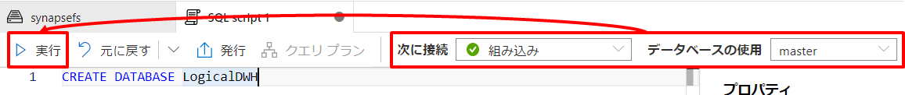

---

# **6. ハンズオン：アドホックデータ探索**  

本章では Synapse が持つ多様なクエリエンジンである Synapse Spark や Synapse Serverless を利用してデータレイク上のデータに対するアドホック探索を行います。また、Azure Purview (Purview) を利用して探索対象となるデータ資産の検索についても触れていきます。  

## **シナリオ**  
ここでは第5章で作成したレポートを参照したデータアナリストが、このレポートの元になっているデータを特定し、その生データから新たなインサイトを得ることを疑似的なシナリオとしてハンズオンを行います。  

## **アーキテクチャ と このシナリオにおける各サービスの用途**  
  


- Azure Data Lake Storage (DataLake)  
  探索対象となるデータを格納しているデータレイクです。

- Azure Purview  
  Purview が管理するカタログから、組織のデータ資産を検索し資産詳細や系譜を確認します。

- Synapse Spark  
  Spark によるクエリエンジンとしてデータレイク内のデータを探索に利用します。

- Synapse Serverless  
  SQL によるクエリエンジンとしてデータレイク内のデータを探索に利用します。

## **ハンズオンステップ概要**  

- 6-1. カタログを参照しデータの詳細や系譜を把握する  
  第5章で作成したレポートのデータセット（Synapse Dedicated 内の TaxiDataSummaryテーブル）について、Purview のカタログを通じてデータセットの元となったデータソース（生データ）を特定します。

- 6-2. Synapse Spark で生データを探索する  
  カタログから特定された生データに対して Synapse Spark によるアドホック探索を行うことで新たなインサイトを探ります。

- 6-3. Synapse Serverless で生データを探索する  
  ここでは 6-2 と同様のシナリオを Synapse Serverless を利用して実施します。

---
# **Let's get started**

---
## **6-1. カタログを参照しデータの詳細や系譜を把握する**  

第5章で作成したレポートのデータセット（Synapse Dedicated 内の TaxiDataSummaryテーブル）について、Purview のカタログを通じてデータセットの元となったデータソース（生データ）を特定します。

### **6-1-1. Purview カタログを検索する**

Synapse Studio 上部の検索ボックスへ、レポートのデータセットである TaxiDataSummary を入力し Purview カタログに対して検索をかけます。  
  

検索結果から TaxiDataSummary が見つかります。  
  

TaxiDataSummary をクリックすると、該当資産の情報を確認することができます。ここでは 系列タブ をクリックし該当資産がどこからどのような処理を経たデータであるかを確認することできます。ここでは TaxiDataSummary が nyxtaxidata と TaxiLocationLookup を元にデータ加工された結果セットであることがわかります。  


### **6-1-2. データ資産の系譜からデータ源泉（生データ）を確認する**

ここでは nyxtaxidata を選択し「アセットに切り替え」をクリックしnyxtaxidata の資産情報を確認してみます。  
  

すると nyxtaxidata が Data Lake 上のフォルダーを示していることがわかります。さらに 関連タブ から該当フォルダー配下のデータファイルが確認できます。  
  

yellow_tripdata をクリックするとさらにデータファイルの資産情報を確認できます。  
  

---
## **6-2. Synapse Spark で生データを探索する**  

カタログから特定された生データに対して Synapse Spark によるアドホック探索を行うことで新たなインサイトを探ります。  

### **6-2-1. PySparkでデータを探索する**

yellow_tripdata の資産情報画面で [開発タブ]->[New notebook]->[Load to DataFrame]を選択します。  
  

すると yellow_tripdata を Spark の DataFrame としてロードするコードが生成されます。  
この コードはアタッチ先に指定した Spark Pool によって処理されます。  
yellow_tripdata の CSV ファイルは先頭行にヘッダを持つため、コード内の「, header=True」の行のコメントアウトを削除します。   
アタッチ先が事前に準備した Spark Pool が指定されていることを確認したのち、実行ボタンを押下します。  

  

ロードした DataFrame に対して以下のようなAPI操作によってデータの探索を行います。  
まず「＋コード」からコードセルを追加します。  
  

次にセル内に以下のコードをペーストし実行します。  
```PySprak
%%pyspark
# Use Data Frame API Operations to Filter Data
display(df.select("tpep_pickup_datetime", "passenger_count", "total_amount") \
.filter("passenger_count > 6 and total_amount > 50.0") \
.sort(df.total_amount.desc()))
```  
  

### **6-2-2. Spark SQLでデータ探索する**

ここでは DataFrame API ではなく Spark SQL を利用した SQL ライクな言語を利用し探索を行ってみます。  

まずは DataFrame を一時テーブル化します（デモ用にデータ量を1万件に絞り込んでいます）。  
同様にコードセルを追加し実行してください。  
```PySprak
%%pyspark
# Create Local Temp View
df.limit(10000).createOrReplaceTempView('NYCTaxiDataTable') 
```

この一時テーブルに対して Spark SQL でいくつかの探索を行ってみましょう。  
同様にコードセルを追加し実行してください。

```SQL
%%sql
--Use SQL to count NYC Taxi Data records
SELECT COUNT(*) FROM NYCTaxiDataTable
```

```SQL
%%sql
-- Use SQL to filter NYC Taxi Data records
SELECT CAST(tpep_pickup_datetime AS date) AS pickup_date
  , tpep_dropoff_datetime
  , passenger_count
  , total_amount
FROM NYCTaxiDataTable
WHERE CAST(tpep_pickup_datetime AS date) = '2019-01-07'
  AND passenger_count > 2
```

```SQL
%%sql
-- Use SQL to aggregate NYC Taxi Data records and visualize data
SELECT CASE payment_type
            WHEN 1 THEN 'Credit card'
            WHEN 2 THEN 'Cash'
            WHEN 3 THEN 'No charge'
            WHEN 4 THEN 'Dispute'
            WHEN 5 THEN 'Unknown'
            WHEN 6 THEN 'Voided trip'
        END AS PaymentType
  , count(*) AS TotalRideCount
FROM NYCTaxiDataTable
GROUP BY payment_type
ORDER BY TotalRideCount DESC
```

このように SQL によって Data Lake 上の生データに対してアドホックな探索を行うことできます。  
また、クエリの結果セットは notebook 上で可視化することもできます。3つ目のクエリ結果に対して、グラフを選択してみてください。

  

### **6-2-3. Dedicated データと Spark データを結合する**  

ここまでは Data Lake 上の生データに対して容易にアクセスできることを確認してきましたが、同様に Dedicated SQL Pool 内のデータにも容易にアクセスが可能です。  
以下のコードにより、5章で作成した Dedicated SQL Pool 内の TaxiLocationLookup テーブル（ローケーションを参照するためのマスタデータ）の内容が DataFrame にロードされます。

```Scala
%%spark
// <Dediacated SQL Pool 名>.<スキーマ名>.<テーブル名>で指定します。
val df_location = spark.read.sqlanalytics("dedicatedsql.dbo.TaxiLocationLookup")
```

こちらの DataFrame も Spark SQL から扱えるように一時テーブル化します。  

```Scala
%%spark
df_location.createOrReplaceTempView("NYCTaxiLocation")
```

以下のように Data Lake からロードした生データと Dedicated SQL Pool からロードした参照データを結合して複雑な分析クエリを発行することが可能になります。

```SQL
%%sql
select 
    VendorID
    , cast(tpep_pickup_datetime as date) as PickUpDate
    , concat(year(tpep_pickup_datetime), '-', format_string('%02d',month(tpep_pickup_datetime),'##')) as PickUpYearMonth --Partition Key
    , cast(tpep_pickup_datetime as timestamp) as PickUpDateTime
    , cast(tpep_dropoff_datetime as date) as DropOffDate
    , cast(tpep_dropoff_datetime as timestamp) as DropOffDateTime
    , passenger_count as PassengerCount
    , trip_distance as TripDistance
    , cast(PULocationID as int) as PickUpLocationID
    , pu.Zone as PickUpLocationZone
    , pu.Borough as PickUpLocationBorough
    , cast(DOLocationID as int) as DropOffLocationID
    , do.Zone as DropOffLocationZone
    , do.Borough as DropOffLocationBorough
    , cast(payment_type as int) as PaymentTypeID
    , case payment_type
            when 1 then 'Credit card'
            when 2 then 'Cash'
            when 3 then 'No charge'
            when 4 then 'Dispute'
            when 5 then 'Unknown'
            when 6 then 'Voided trip'
        end as PaymentTypeDescription
    , cast(case when fare_amount < 0 then 0.00 else fare_amount end as decimal(8,2)) as FareAmount --Cleanse invalid data
    , cast(case when extra < 0 then 0.00 else extra end as decimal(8,2)) as ExtraAmount --Cleanse invalid data
    , cast(case when mta_tax < 0 then 0.00 else mta_tax end as decimal(8,2)) as MTATaxAmount --Cleanse invalid data
    , cast(case when tip_amount < 0 then 0.00 else tip_amount end as decimal(8,2)) as TipAmount --Cleanse invalid data
    , cast(case when tolls_amount < 0 then 0.00 else tolls_amount end as decimal(8,2)) as TollsAmount --Cleanse invalid data
    , cast(case when improvement_surcharge < 0 then 0.00 else improvement_surcharge end as decimal(8,2)) as ImprovementSurchargeAmount --Cleanse invalid data
    , cast(case when total_amount < 0 then 0.00 else total_amount end as decimal(8,2)) as TotalRideAmount --Cleanse invalid data
from NYCTaxiDataTable as rides
  join NYCTaxiLocation as pu
    on rides.PULocationID = pu.LocationID
  join NYCTaxiLocation as do
    on rides.DOLocationID = do.LocationID
where passenger_count > 0 --Data Cleanup Rules
  and year(tpep_pickup_datetime) = 2019
limit 10
```

***TODO:長いクエリは本にかける？　かけるかは別にクエリテキストをGithub共有してコピペできるようにしないと***  

### **6-2-4. 探索結果を永続化する**  

分析クエリの結果はレイクデータベースや Dediacated SQL Pool 内のテーブル へ永続化することで2次利用が可能になります。  
以下のクエリはレイクデータベースへの永続化の例です。  コードの冒頭で lakedb という名前でレイクデータベースを作成しています。

```PySprak
%%pyspark

spark.sql("CREATE DATABASE lakedb")

df_preped = spark.sql(" \
    select \
        VendorID \
        , cast(tpep_pickup_datetime as date) as PickUpDate \
        , concat(year(tpep_pickup_datetime), '-', format_string('%02d',month(tpep_pickup_datetime),'##')) as PickUpYearMonth \
        , cast(tpep_pickup_datetime as timestamp) as PickUpDateTime \
        , cast(tpep_dropoff_datetime as date) as DropOffDate \
        , cast(tpep_dropoff_datetime as timestamp) as DropOffDateTime \
        , passenger_count as PassengerCount \
        , trip_distance as TripDistance \
        , cast(PULocationID as int) as PickUpLocationID \
        , pu.Zone as PickUpLocationZone \
        , pu.Borough as PickUpLocationBorough \
        , cast(DOLocationID as int) as DropOffLocationID \
        , do.Zone as DropOffLocationZone \
        , do.Borough as DropOffLocationBorough \
        , cast(payment_type as int) as PaymentTypeID \
        , case payment_type \
                when 1 then 'Credit card' \
                when 2 then 'Cash' \
                when 3 then 'No charge' \
                when 4 then 'Dispute' \
                when 5 then 'Unknown' \
                when 6 then 'Voided trip' \
            end as PaymentTypeDescription \
        , cast(case when fare_amount < 0 then 0.00 else fare_amount end as decimal(8,2)) as FareAmount \
        , cast(case when extra < 0 then 0.00 else extra end as decimal(8,2)) as ExtraAmount \
        , cast(case when mta_tax < 0 then 0.00 else mta_tax end as decimal(8,2)) as MTATaxAmount  \
        , cast(case when tip_amount < 0 then 0.00 else tip_amount end as decimal(8,2)) as TipAmount  \
        , cast(case when tolls_amount < 0 then 0.00 else tolls_amount end as decimal(8,2)) as TollsAmount  \
        , cast(case when improvement_surcharge < 0 then 0.00 else improvement_surcharge end as decimal(8,2)) as ImprovementSurchargeAmount  \
        , cast(case when total_amount < 0 then 0.00 else total_amount end as decimal(8,2)) as TotalRideAmount  \
    from NYCTaxiDataTable as rides \
    join NYCTaxiLocation as pu \
        on rides.PULocationID = pu.LocationID \
    join NYCTaxiLocation as do \
        on rides.DOLocationID = do.LocationID \
    where passenger_count > 0 --Data Cleanup Rules \
    and year(tpep_pickup_datetime) = 2019 \
")

df_preped.write.mode("overwrite").saveAsTable("lakedb.nyctaxidata_preped")
```

作成したレイクデータベースは Synapse Studio のエクスプローラにも表示されるようになり、Spark Pool に限らず Serverless SQL Pool からも容易にアクセス可能です。

  
  

---
## **6-3. Synapse Serverless で生データを探索する**  

ここでは 6-2 と同様のシナリオを Synapse Serverless を利用して実施します。

### **6-3-1. CSV ファイルを Parquet ファイルに変換する**

CSV 形式の生データをそのまま扱うこともできますが、今回は分析用途に最適化された Parquet 形式のファイルに変換し、そのファイルに対してアドホック探索してみます。  

まずは、以下のコードにより DataFrame にロードした生データを Parquet 形式のファイルとして Data Lake に保存します（デモ用にデータ量を1万件に絞り込んでいます）。

| 項目 | 値 |
| :---- | :---- |
| ストレージアカウント名 | Synapse デプロイ時に作成した Data Lake のストレージアカウント名を指定します（例：datalake1130） |
| コンテナ名 | Synapse デプロイ時に作成した Data Lake のファイルシステム名を指定します（例：synapsefs） |  

```PySprak
%%pyspark
# 
df.limit(10000).write.parquet("abfss://<コンテナ名>@<ストレージアカウント名>.dfs.core.windows.net/raw/nyctaxidata-parquet/")
```

### **6-3-2. SQL でデータを探索する**

Synapse Studio のエクスプローラから Parquet ファイルの出力先を辿ります。  
  

出力先フォルダを右クリックし、[新しいSQLスクリプト]->[上位100行を選択]を選択します。  
  

「ファイルの種類」は Parquet 形式を選択し適用ボタンを押下します。  


Parquet ファイル へのアドホッククエリが記述されたSQLスクリプトエディタが立ち上がります。実行ボタンを押下するとクエリ結果が表示されます。  
  

SQLスクリプトを以下のように編集し分析クエリを実行します。このクエリは FROM句を除き「6-2-2. Spark SQLでデータ探索する」で実行した Spark SQL と全く同じクエリになっています。

```SQL
SELECT CASE payment_type
            WHEN 1 THEN 'Credit card'
            WHEN 2 THEN 'Cash'
            WHEN 3 THEN 'No charge'
            WHEN 4 THEN 'Dispute'
            WHEN 5 THEN 'Unknown'
            WHEN 6 THEN 'Voided trip'
        END AS PaymentType
  , count(*) AS TotalRideCount
FROM
  OPENROWSET(
      BULK 'https://adls20220220.dfs.core.windows.net/synapsefs/raw/nyctaxidata-parquet/**',
      FORMAT = 'PARQUET'
  ) AS [result]
GROUP BY payment_type
ORDER BY TotalRideCount DESC
```

  

### **6-3-3. 外部テーブル定義を介してデータを探索する**

先のクエリではデータファイルのパスをクエリの中で指定していましたが、外部テーブルの作成によりその定義の中にデータファイルへのパスを保持することで、FROM 句に外部テーブル名のみを指定した探索クエリが可能になります。  

まず、外部テーブルを作成する先となるデータベースを定義します。Synapse Studio のメニュを辿りSQLスクリプトエディタを起動します。    
  

以下のSQLをペーストし、「次に接続」に 組み込み、「データベースの使用」に master を選択したのち実行します。  
```SQL
CREATE DATABASE LogicalDWH
```



次に外部テーブルを定義します。Synapse Studio のメニュを辿り出力先フォルダを右クリックし、[新しいSQLスクリプト]->[外部テーブルの作成]を選択します。  

  
  

「続行」を押下します。

  

「SQLプールの選択」は 組み込み を選択、「データベースの選択」は LogicalDWH を選択、「外部テーブル名」は dbo.nyctaxidatatable を入力し「スクリプトを開く」を押下します。


外部テーブルの定義が記述されたSQLスクリプトエディタが立ち上がります。「次に接続」に 組み込み、「データベースの使用」に LogicalDWH を選択したのち実行します。実行すると外部テーブルが作成され、その外部テーブルに対する 100件 のデータを返すサンプルSELECTが実行されます。


### **6-3-4. 外部テーブル定義を介してデータを探索する**

作成した外部テーブルを介してデータを探索してみます。このクエリは「6-2-2. Spark SQLでデータ探索する」で実行した Spark SQL と全く同じクエリになっています。

```SQL
SELECT CASE payment_type
            WHEN 1 THEN 'Credit card'
            WHEN 2 THEN 'Cash'
            WHEN 3 THEN 'No charge'
            WHEN 4 THEN 'Dispute'
            WHEN 5 THEN 'Unknown'
            WHEN 6 THEN 'Voided trip'
        END AS PaymentType
  , count(*) AS TotalRideCount
FROM dbo.nyctaxidatatable
GROUP BY payment_type
ORDER BY TotalRideCount DESC
```


   
# まとめ

***TODO:何か書く***
