---
# 6. ハンズオン：データレイクへのアドホックデータ探索とデータプレパレーション  

第6章は Data Lake Storage 上の生データに対するアドホックデータ探索とデータプレパレーションを行います。  

## シナリオ  
このハンズオンでは Azure Purview が管理するデータカタログを通じて第5章で作成したレポートの源泉となっている生データを特定し、その生データから新たなインサイトを得るためのアドホックデータ探索とデータプレパレーションを行います。Azure Synapse Analytics はデータ探索のためのデータ処理エンジンを複数搭載しますが、このハンズオンでは Synapse Serverless Spark Pool を利用するパターンと Synapse Serverless SQL Pool を利用するパターンの両パターンに触れていきます。  

このシナリオのアーキテクチャと関連リソースの役割は以下の通りです。矢印はデータの流れを示しています。  
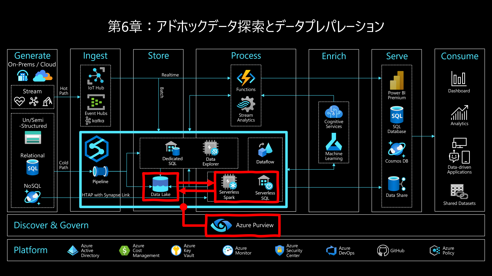  

| アイコン | リソース | 役割 |
| :---: | :---- | :---- |
|  | Azure Data Lake Storage | このシナリオではデータレイクに集約された生データに対して Synapse Serverless Spark Pool や Synapse Serverless SQL Pool のデータ処理エンジンから未発見の Insight を得るためのアドホックなデータ探索を行います。 |
|  | Azure Purview | Azure Purview は組織のデータ資産をデータカタログとして記録管理しています。このシナリオでは データカタログを通じて組織のデータ資産を把握し、分析に必要なデータの特定や見極めを行います。 |
|  | Synapse Serverless Spark Pool | このシナリオでは Spark によるクエリエンジンとしてデータレイク内のデータ探索に利用します。また、データプレパレーションの結果を再利用のためデータレイクに書き戻します。 |
|  | Synapse Serverless SQL Pool | このシナリオでは SQL によるクエリエンジンとしてデータレイク内のデータ探索に利用します。また、データプレパレーションの結果を再利用のためデータレイクに書き戻します。 |

---
# Let's get started

---
## 6-1. データカタログを参照しデータの詳細や系譜を把握する  

第6章ではまずはじめに第5章のハンズオンの最終成果物となった Power BI レポートのデータセット（Synapse Dedicated SQL Pool 内の TaxiDataSummaryテーブル）について、Azure Purview のデータカタログを通じてそのデータセットの元となったデータソースを特定することから始めます。  

### 6-1-1. Purview カタログを検索する

Synapse Studio 上部の検索ボックスへ、レポートのデータセットである「TaxiDataSummary」を入力し Purview のデータカタログに対して検索をかけます。  
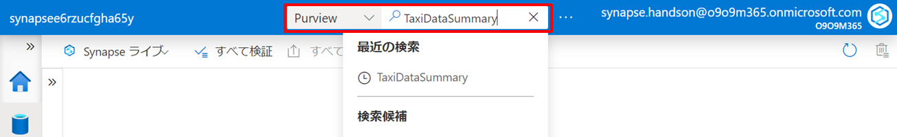  

検索結果から TaxiDataSummary が見つかります。  
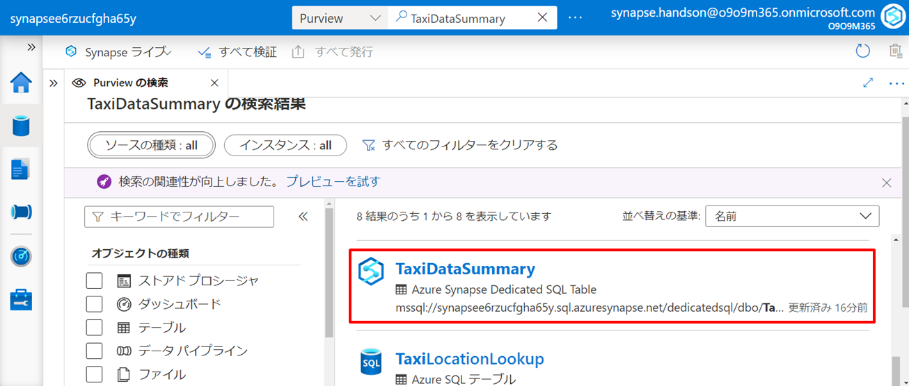  

見つかった TaxiDataSummary をクリックすると、該当資産の様々な付帯情報を確認することができます。ここでは「系列」タブをクリックし該当資産がどこからどのような処理を経たデータであるかを確認します。  
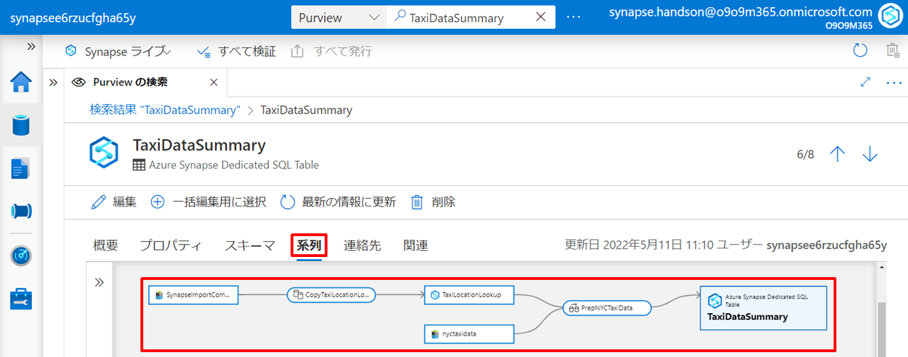    

すると TaxiDataSummary は nyxtaxidata と TaxiLocationLookup を元にデータ加工された結果セットであることがわかります。  

### 6-1-2. データ資産の系譜からデータ源泉（生データ）を把握する

ここでは nyxtaxidata を選択し「アセットに切り替え」をクリックし nyxtaxidata の資産情報を確認してみます。  
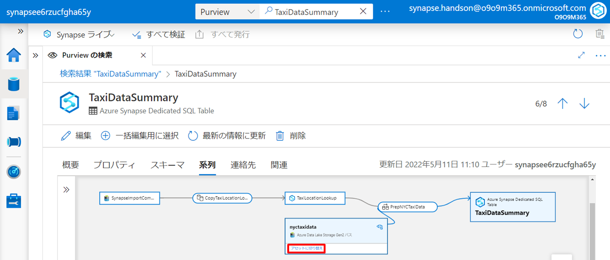    

すると nyxtaxidata が Data Lake Storage 上のフォルダーを示していることがわかります。さらに「関連」タブから該当フォルダー配下のデータファイルが確認できます。  
  

NycTlcYellow をクリックするとさらにデータファイルの資産情報を確認できます。  
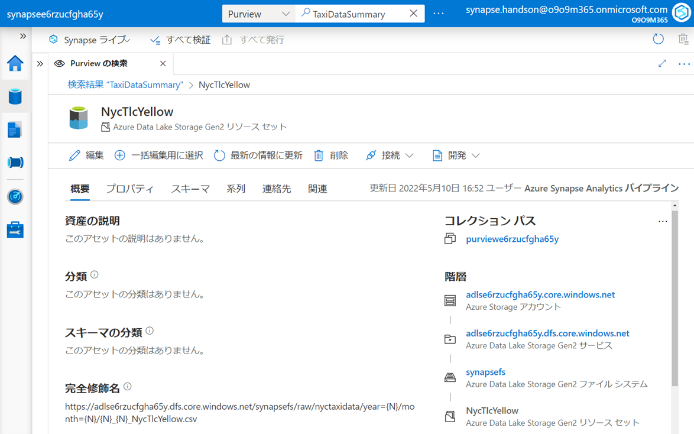  

---
## 6-2. Spark でアドホックデータ探索とデータプレパレーションを行う  

それではデータカタログから特定された生データに対して Synapse Serverless Spark Pool によるアドホック探索を行い新たなインサイトを探ってみましょう。  

### 6-2-1. PySparkでデータを探索する

先ほどの NycTlcYellow の資産情報画面で「開発」タブ ->「New notebook」->「Load to DataFrame」を選択します。  
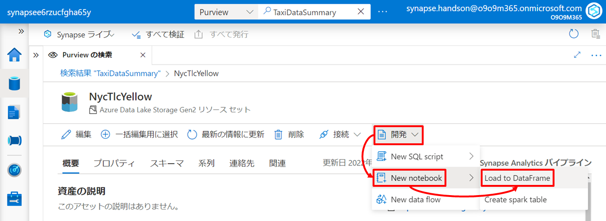  

するとノートブックが開き NycTlcYellow を Spark の DataFrame としてロードするコードが生成されます。  
NycTlcYellow（CSV ファイル）は先頭行にヘッダを持つため、ここではコード内の「, header=True」の行のコメントアウトを以下のように外します。   

```Python  
%%pyspark
df = spark.read.load('abfss://<コンテナ名>@<ストレージアカウント名>.dfs.core.windows.net/raw/nyctaxidata/year=*/month=*/*_*_NycTlcYellow.csv', format='csv'
## If header exists uncomment line below
, header=True
)
display(df.limit(10))
```  

この PySpark コードの実行環境となるアタッチ先として事前準備した Synapse Serverless Spark Pool を指定したのち実行ボタンをクリックします。  
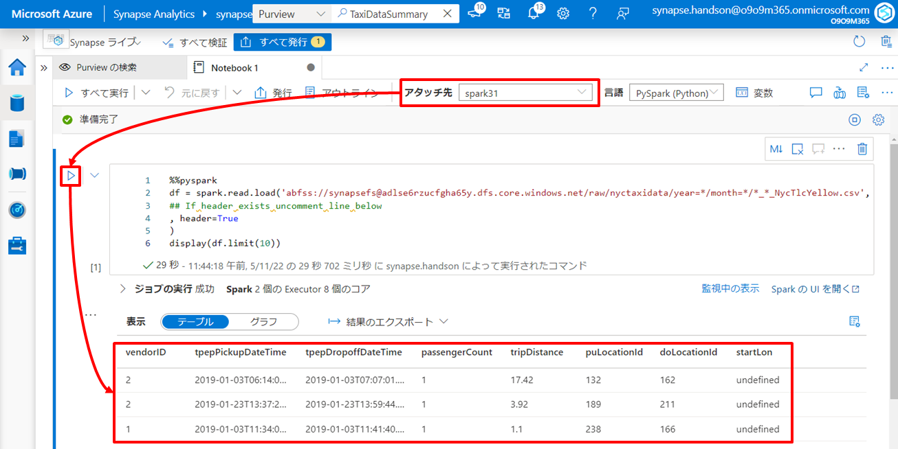  

***TODO：ここから用意したノートブックに切り替えする。ここに手順を入れる***

続けてロードした DataFrame に対して DataFrame API を利用し簡単なデータ探索を行ってみます。「＋コード」からコードセルを追加します。  
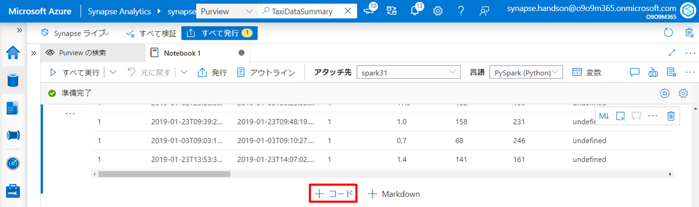  

セル内に以下のコードをペーストし実行します。  

```Python
%%pyspark
# Use Data Frame API Operations to Filter Data
display(df.select("tpepPickupDateTime", "passengerCount", "totalAmount") \
.filter("passengerCount > 6 and totalAmount > 50.0") \
.sort(df.totalAmount.desc()))
```  

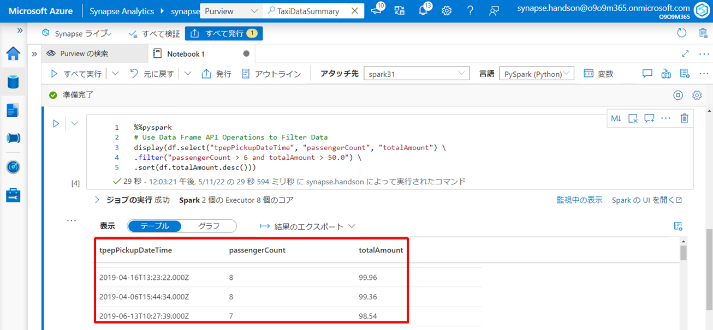  

データカタログから特定した分析対象データに対して即座にデータ探索が行えることが確認できました。  

### 6-2-2. Spark SQLでデータ探索する

次に DataFrame API ではなく Spark SQL を利用した SQL ライクな記述によるデータ探索を行います。  
まずは DataFrame を一時テーブル化します（ハンズオン用にデータ量を1万件に絞り込んでいます）。コードセルを追加し以下のコードを実行してください。  

```Python
%%pyspark
# Create Local Temp View
df.limit(10000).createOrReplaceTempView('NYCTaxiDataTable') 
```

ここからこの一時テーブルに対して Spark SQL でいくつかのデータ探索を行ってみましょう。コードセルを追加し以下のコードを実行してください。  

```SQL
%%sql
--Check schema of NYCTaxiDataTable
DESCRIBE TABLE NYCTaxiDataTable
```

```SQL
%%sql
--Use SQL to count NYC Taxi Data records
SELECT COUNT(*) FROM NYCTaxiDataTable
```

```SQL
%%sql
-- Use SQL to filter NYC Taxi Data records
SELECT CAST(tpepPickupDateTime AS date)
  , tpepDropoffDateTime
  , passengerCount
  , totalAmount
FROM NYCTaxiDataTable
WHERE CAST(tpepPickupDateTime AS date) = '2019-01-01'
  AND passengerCount > 2
```

```SQL
%%sql
-- Use SQL to aggregate NYC Taxi Data records and visualize data
SELECT CASE paymentType
            WHEN 1 THEN 'Credit card'
            WHEN 2 THEN 'Cash'
            WHEN 3 THEN 'No charge'
            WHEN 4 THEN 'Dispute'
            WHEN 5 THEN 'Unknown'
            WHEN 6 THEN 'Voided trip'
        END AS PaymentType
  , count(*) AS TotalRideCount
FROM NYCTaxiDataTable
GROUP BY paymentType
ORDER BY TotalRideCount DESC
```

クエリの結果セットは notebook 上で可視化することもできます。3つ目のクエリ結果に対して、グラフを選択してみてください。  
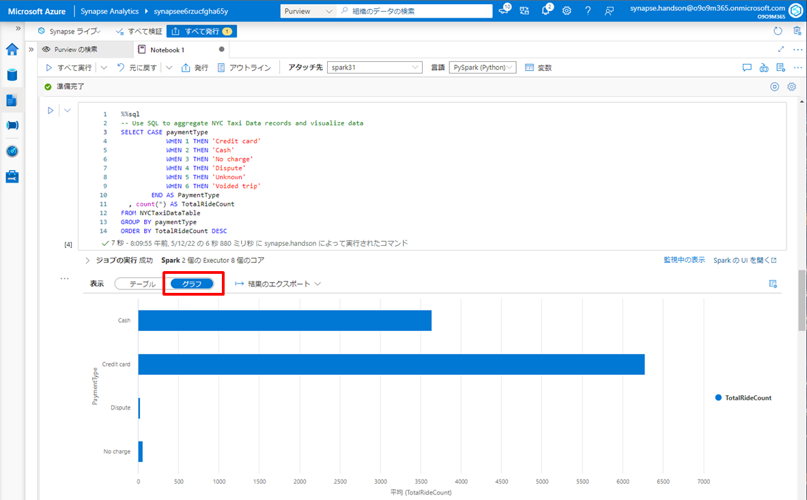  

このように Spark SQL を利用した SQL ライクな記述で Data Lake Storage 上の生データに対して即座かつ容易にアドホックな探索を行うことできます。  

### 6-2-3. Synapse Dedicated SQL Pool 上のデータと Spark 上のデータを結合する  

ここまでは Data Lake Storage 上のデータにアクセスしデータ探索を行いましたが、同様に Dedicated SQL Pool 内のデータも Synapse Serverless Spark Pool から容易にアクセスが可能です。  
以下のコードのみで5章で作成した Dedicated SQL Pool 内の TaxiLocationLookup テーブル（ローケーションを参照するための参照データ）の内容を DataFrame にロードすることができます。  

```Scala
%%spark
// <Dediacated SQL Pool 名>.<スキーマ名>.<テーブル名>で指定します。
val df_location = spark.read.sqlanalytics("dedicatedsql.dbo.TaxiLocationLookup")
```

こちらの DataFrame も Spark SQL から扱えるように一時テーブル化しましょう。    

```Scala
%%spark
df_location.createOrReplaceTempView("NYCTaxiLocation")
```

こうすることで Data Lake Storage からロードしたデータと Dedicated SQL Pool からロードしたデータを結合して分析が可能になります。  

```SQL
%%sql
select 
    VendorID
    , cast(tpepPickupDateTime as date) as PickUpDate
    , concat(year(tpepPickupDateTime), '-', format_string('%02d',month(tpepPickupDateTime),'##')) as PickUpYearMonth --Partition Key
    , cast(tpepPickupDateTime as timestamp) as PickUpDateTime
    , cast(tpepDropoffDateTime as date) as DropOffDate
    , cast(tpepDropoffDateTime as timestamp) as DropOffDateTime
    , passengerCount as PassengerCount
    , tripDistance as TripDistance
    , cast(puLocationId as int) as PickUpLocationID
    , pu.Zone as PickUpLocationZone
    , pu.Borough as PickUpLocationBorough
    , cast(doLocationId as int) as DropOffLocationID
    , do.Zone as DropOffLocationZone
    , do.Borough as DropOffLocationBorough
    , cast(paymentType as int) as PaymentTypeID
    , case paymentType
            when 1 then 'Credit card'
            when 2 then 'Cash'
            when 3 then 'No charge'
            when 4 then 'Dispute'
            when 5 then 'Unknown'
            when 6 then 'Voided trip'
        end as PaymentTypeDescription
    , cast(case when fareAmount < 0 then 0.00 else fareAmount end as decimal(8,2)) as FareAmount --Cleanse invalid data
    , cast(case when extra < 0 then 0.00 else extra end as decimal(8,2)) as ExtraAmount --Cleanse invalid data
    , cast(case when mtaTax < 0 then 0.00 else mtaTax end as decimal(8,2)) as MTATaxAmount --Cleanse invalid data
    , cast(case when tipAmount < 0 then 0.00 else tipAmount end as decimal(8,2)) as TipAmount --Cleanse invalid data
    , cast(case when tollsAmount < 0 then 0.00 else tollsAmount end as decimal(8,2)) as TollsAmount --Cleanse invalid data
    , cast(case when improvementSurcharge < 0 then 0.00 else improvementSurcharge end as decimal(8,2)) as ImprovementSurchargeAmount --Cleanse invalid data
    , cast(case when totalAmount < 0 then 0.00 else totalAmount end as decimal(8,2)) as TotalRideAmount --Cleanse invalid data
from NYCTaxiDataTable as rides
  join NYCTaxiLocation as pu
    on rides.PULocationID = pu.LocationID
  join NYCTaxiLocation as do
    on rides.DOLocationID = do.LocationID
where passengerCount > 0 --Data Cleanup Rules
  and year(tpepPickupDateTime) = 2019
limit 10
```
***TODO:長いクエリは本にかける？　かけるかは別にクエリテキストをGithub共有してコピペできるようにしないと***  

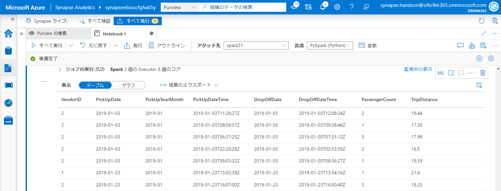  

### 6-2-4. プレパレーション結果をデータレイクに書き出す  

分析クエリの結果は再利用に備え、Data Lake Storage や Synapse Dediacated SQL Pool へ永続化しましょう。    
以下のクエリは Data Lake Storage への永続化の例です。コードの冒頭で「lakedb」という名前でレイクデータベース（論理的なデータウェアハウス）を作成しています。

***Tips: レイクデータベース is 何？***
https://docs.microsoft.com/ja-jp/azure/synapse-analytics/database-designer/concepts-lake-database

```Python
%%pyspark

spark.sql("CREATE DATABASE lakedb")

df_preped = spark.sql(" \
    select \
        VendorID \
        , cast(tpepPickupDateTime as date) as PickUpDate \
        , concat(year(tpepPickupDateTime), '-', format_string('%02d',month(tpepPickupDateTime),'##')) as PickUpYearMonth \
        , cast(tpepPickupDateTime as timestamp) as PickUpDateTime \
        , cast(tpepDropoffDateTime as date) as DropOffDate \
        , cast(tpepDropoffDateTime as timestamp) as DropOffDateTime \
        , passengerCount as PassengerCount \
        , tripDistance as TripDistance \
        , cast(puLocationId as int) as PickUpLocationID \
        , pu.Zone as PickUpLocationZone \
        , pu.Borough as PickUpLocationBorough \
        , cast(doLocationId as int) as DropOffLocationID \
        , do.Zone as DropOffLocationZone \
        , do.Borough as DropOffLocationBorough \
        , cast(paymentType as int) as PaymentTypeID \
        , case paymentType \
                when 1 then 'Credit card' \
                when 2 then 'Cash' \
                when 3 then 'No charge' \
                when 4 then 'Dispute' \
                when 5 then 'Unknown' \
                when 6 then 'Voided trip' \
            end as PaymentTypeDescription \
        , cast(case when fareAmount < 0 then 0.00 else fareAmount end as decimal(8,2)) as FareAmount \
        , cast(case when extra < 0 then 0.00 else extra end as decimal(8,2)) as ExtraAmount \
        , cast(case when mtaTax < 0 then 0.00 else mtaTax end as decimal(8,2)) as MTATaxAmount  \
        , cast(case when tipAmount < 0 then 0.00 else tipAmount end as decimal(8,2)) as TipAmount  \
        , cast(case when tollsAmount < 0 then 0.00 else tollsAmount end as decimal(8,2)) as TollsAmount  \
        , cast(case when improvementSurcharge < 0 then 0.00 else improvementSurcharge end as decimal(8,2)) as ImprovementSurchargeAmount  \
        , cast(case when totalAmount < 0 then 0.00 else totalAmount end as decimal(8,2)) as TotalRideAmount  \
    from NYCTaxiDataTable as rides \
    join NYCTaxiLocation as pu \
        on rides.PULocationID = pu.LocationID \
    join NYCTaxiLocation as do \
        on rides.DOLocationID = do.LocationID \
    where passengerCount > 0 --Data Cleanup Rules \
    and year(tpepPickupDateTime) = 2019 \
")

df_preped.write.mode("overwrite").saveAsTable("lakedb.nyctaxidata_preped")  
```

作成したレイクデータベースは Data Lake Storage 上にデータの実体を持つ論理データウェアハウスとなり、Synapse Studio のエクスプローラにも表示されるようになります。
エクスプローラーを展開する前に「レイクデータベース」を右クリックし「最新の情報に更新する」を選択します。  
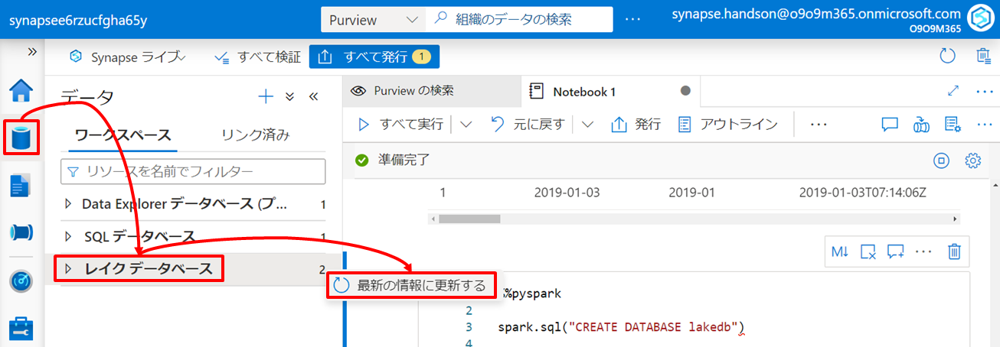  

レイクデータベースは Azure Synapse Analytics のメタデータ共有機能により Synapse Serverless Spark Pool 間に限らず、以下のように Synapse Serverless SQL Pool からもアクセスが可能です。  
  

「次に接続」に「組み込み」、データベースの使用に「master」を選択したのち「実行」をクリックします。  
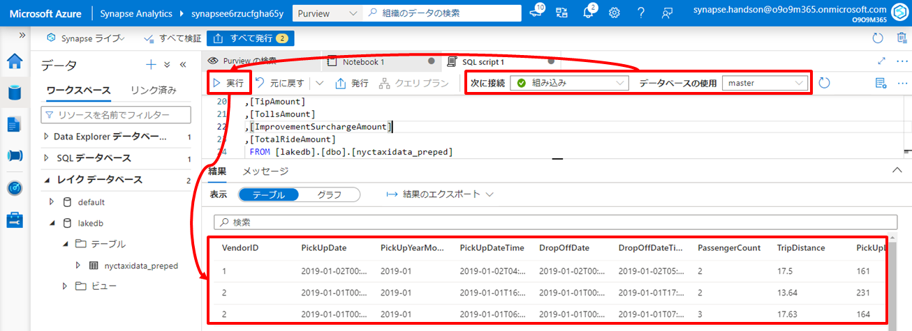  

---
## 6-3.  SQL でアドホックデータ探索とデータプレパレーションを行う  

次に Synapse Serverless SQL Pool を利用して 6-2 と同様のシナリオを流してみましょう。  

### 6-3-1. CSV ファイルを Parquet ファイルに変換する

CSV 形式のデータファイルをそのまま扱うこともできますが、今回は分析用途に最適化された Parquet 形式のファイルに変換し、そのファイルに対して Synapse Serverless SQL Pool によるアドホックなデータ探索を行いましょう。以下のコードにより DataFrame にロードした生データを Parquet 形式のファイルとして Data Lake Storage に保存します（デモ用にデータ量を1万件に絞り込んでいます）。  

| 項目 | 値 |
| :---- | :---- |
| ストレージアカウント名 | Synapse デプロイ時に作成した Data Lake Storage のストレージアカウント名を指定します（例：datalake1130） |
| コンテナ名 | Synapse デプロイ時に作成した Data Lake Storage のファイルシステム名を指定します（例：synapsefs） |  

```Python
%%pyspark

"""
df = spark.read.load('abfss://<コンテナ名>@<ストレージアカウント名>.dfs.core.windows.net/raw/nyctaxidata/year=*/month=*/*_*_NycTlcYellow.csv', format='csv'
## If header exists uncomment line below
, header=True
)
display(df.limit(10))
""" 

df.limit(10000).write.parquet("abfss://<コンテナ名>@<ストレージアカウント名>.dfs.core.windows.net/raw/nyctaxidata-parquet/")
```

### 6-3-2. SQL でデータを探索する

出力した Parquet ファイルを Synapse Studio のエクスプローラから辿り、出力先フォルダを右クリックし「新しいSQLスクリプト」->「上位100行を選択」を選択します。  
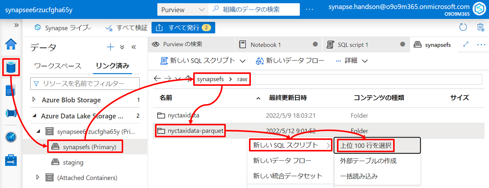  

「ファイルの種類」は「Parquet 形式」を選択し「適用」をクリックします。  
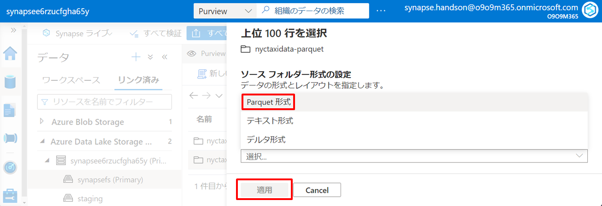  

すると Parquet ファイル へのアドホッククエリが記述された SQL スクリプトエディタが立ち上がります。「実行」をクリックするとクエリ結果が表示されます。  

```SQL  
-- This is auto-generated code
SELECT
    TOP 100 *
FROM
    OPENROWSET(
        BULK 'https://<ストレージアカウント名>.dfs.core.windows.net/<コンテナ名>/raw/nyctaxidata-parquet/**',
        FORMAT = 'PARQUET'
    ) AS [result]
```

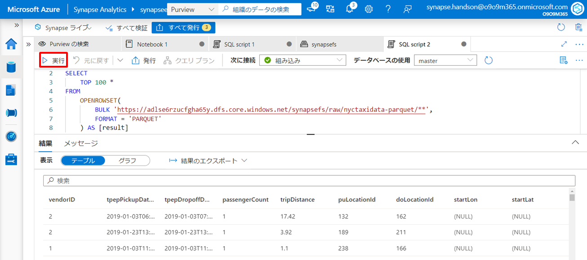  


SQL スクリプトを以下のように編集し実行します。このクエリは FROM 句 を除き「6-2-2. Spark SQL でデータ探索する」で実行した Spark SQL と全く同じクエリになっています。  

```SQL
SELECT CASE paymentType
            WHEN 1 THEN 'Credit card'
            WHEN 2 THEN 'Cash'
            WHEN 3 THEN 'No charge'
            WHEN 4 THEN 'Dispute'
            WHEN 5 THEN 'Unknown'
            WHEN 6 THEN 'Voided trip'
        END AS PaymentType
  , count(*) AS TotalRideCount
FROM
  OPENROWSET(
      BULK 'https://<ストレージアカウント名>.dfs.core.windows.net/<コンテナ名>/raw/nyctaxidata-parquet/**',
      FORMAT = 'PARQUET'
  ) AS [result]
GROUP BY paymentType
ORDER BY TotalRideCount DESC
```

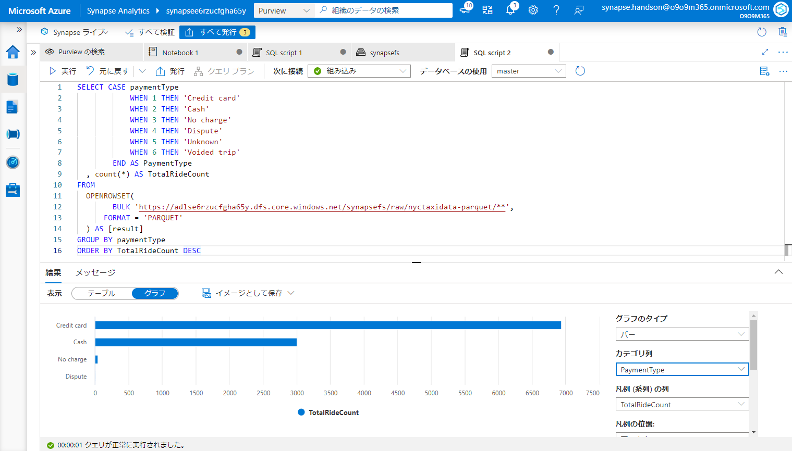  

### 6-3-3. 外部テーブル定義を介してデータを探索する  

先のクエリではデータファイルのパスをクエリの中で直接指定していますが、外部テーブルの定義によりデータファイルへのパスを内包させることができます。  

まず外部テーブルを作成する先となるデータベースを定義します。Synapse Studio のメニュを辿り SQL スクリプトエディタを起動します。  
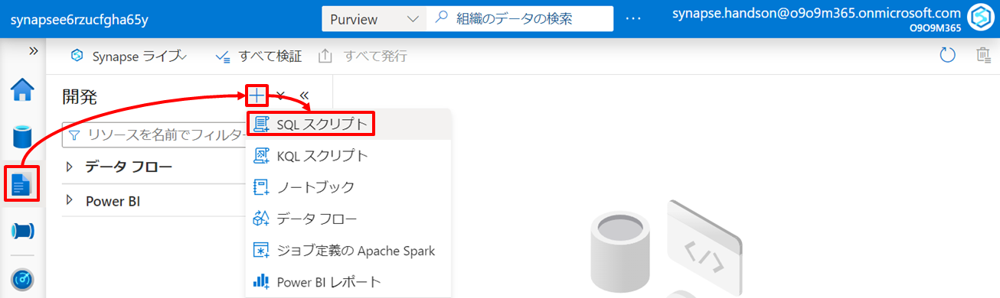  

以下の SQL をペーストし、「次に接続」に「組み込み」、「データベースの使用」に「master」を選択したのち実行します。  

```SQL
CREATE DATABASE ServerlessDWH
```

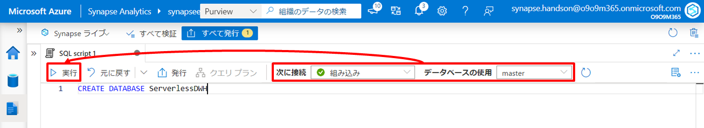  

次に外部テーブルを定義します。Synapse Studio のメニュを辿り出力先フォルダを右クリックし「新しいSQLスクリプト」->「外部テーブルの作成」を選択します。  
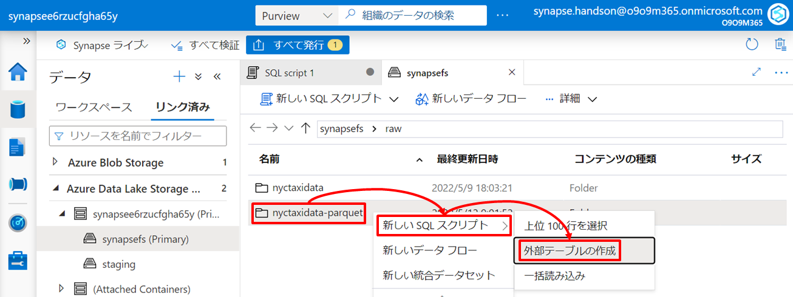  

「続行」をクリックします。  
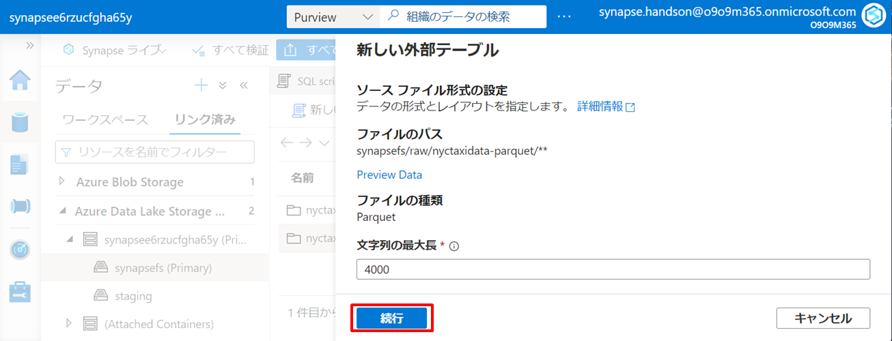  

「SQLプールの選択」は「組み込み」を選択、「データベースの選択」は「ServerlessDWH」を選択、「外部テーブル名」は「dbo.nyctaxidatatable」を入力し「スクリプトを開く」をクリックします。  
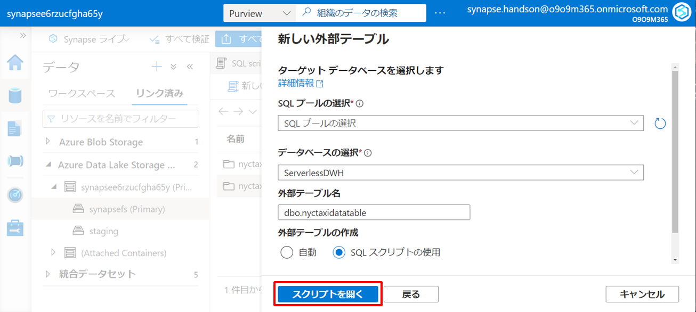  

すると外部テーブルの定義が記述されたSQLスクリプトエディタが立ち上がります。「次に接続」に「組み込み」、「データベースの使用」に 「ServerlessDWH」を選択したのち実行します。実行すると外部テーブルが作成され、その外部テーブルに対する 100件 のデータを返すサンプルSELECTが実行されます。  

```SQL
IF NOT EXISTS (SELECT * FROM sys.external_file_formats WHERE name = 'SynapseParquetFormat') 
	CREATE EXTERNAL FILE FORMAT [SynapseParquetFormat] 
	WITH ( FORMAT_TYPE = PARQUET)
GO

IF NOT EXISTS (SELECT * FROM sys.external_data_sources WHERE name = '<Data Lake Storage ファイルシステム名>_<Data Lake Storage ストレージアカウント名>_dfs_core_windows_net') 
	CREATE EXTERNAL DATA SOURCE [<Data Lake Storage ファイルシステム名>_<Data Lake Storage ストレージアカウント名>_dfs_core_windows_net] 
	WITH (
		LOCATION = 'abfss://<コンテナ名>@<ストレージアカウント名>.dfs.core.windows.net' 
	)
GO

CREATE EXTERNAL TABLE nyctaxidatatable (
	[vendorID] nvarchar(4000),
	[tpepPickupDateTime] nvarchar(4000),
	[tpepDropoffDateTime] nvarchar(4000),
	[passengerCount] nvarchar(4000),
	[tripDistance] nvarchar(4000),
	[puLocationId] nvarchar(4000),
	[doLocationId] nvarchar(4000),
	[startLon] nvarchar(4000),
	[startLat] nvarchar(4000),
	[endLon] nvarchar(4000),
	[endLat] nvarchar(4000),
	[rateCodeId] nvarchar(4000),
	[storeAndFwdFlag] nvarchar(4000),
	[paymentType] nvarchar(4000),
	[fareAmount] nvarchar(4000),
	[extra] nvarchar(4000),
	[mtaTax] nvarchar(4000),
	[improvementSurcharge] nvarchar(4000),
	[tipAmount] nvarchar(4000),
	[tollsAmount] nvarchar(4000),
	[totalAmount] nvarchar(4000),
	[puYear] nvarchar(4000),
	[puMonth] nvarchar(4000)
	)
	WITH (
	LOCATION = 'raw/nyctaxidata-parquet/**',
	DATA_SOURCE = [<Data Lake Storage ファイルシステム名>_<Data Lake Storage ストレージアカウント名>_dfs_core_windows_net],
	FILE_FORMAT = [SynapseParquetFormat]
	)
GO


SELECT TOP 100 * FROM dbo.nyctaxidatatable
GO
```

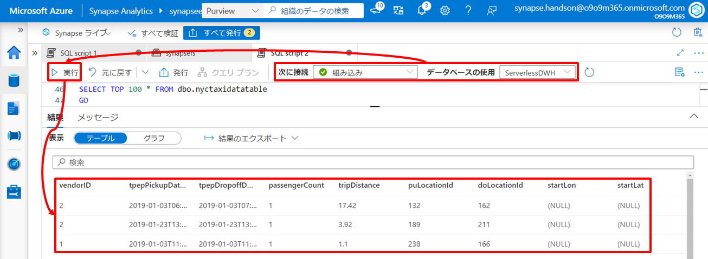  

作成した外部テーブルを参照するクエリに書き換えましょう。結果としてこのクエリは「6-2-2. Spark SQL でデータ探索する」で実行した Spark SQL と全く同じクエリになっています。  

```SQL
SELECT CASE paymentType
            WHEN 1 THEN 'Credit card'
            WHEN 2 THEN 'Cash'
            WHEN 3 THEN 'No charge'
            WHEN 4 THEN 'Dispute'
            WHEN 5 THEN 'Unknown'
            WHEN 6 THEN 'Voided trip'
        END AS PaymentType
  , count(*) AS TotalRideCount
FROM dbo.nyctaxidatatable
GROUP BY paymentType
ORDER BY TotalRideCount DESC
```

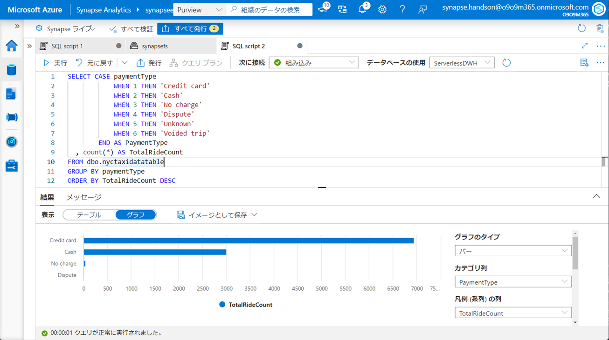  

### 6-3-4. プレパレーション結果をデータレイクに書き出す  

Synapse Serverless SQL Pool の場合、クエリの結果を Data Lake Storage へ書き出すには以下のように CETAS（CREATE EXTERNAL TABLE AS SELECT）を利用します。  

```SQL
CREATE EXTERNAL TABLE total_ride_count_by_payment_type
WITH (
    LOCATION = 'preped_data/',
    DATA_SOURCE = [<Data Lake Storage ファイルシステム名>_<Data Lake Storage ストレージアカウント名>_dfs_core_windows_net],
    FILE_FORMAT = [SynapseParquetFormat]
)  
AS
SELECT CASE paymentType
            WHEN 1 THEN 'Credit card'
            WHEN 2 THEN 'Cash'
            WHEN 3 THEN 'No charge'
            WHEN 4 THEN 'Dispute'
            WHEN 5 THEN 'Unknown'
            WHEN 6 THEN 'Voided trip'
        END AS PaymentType
  , count(*) AS TotalRideCount
FROM dbo.nyctaxidatatable
GROUP BY paymentType
ORDER BY TotalRideCount DESC
GO

SELECT * FROM dbo.total_ride_count_by_payment_type
GO
```

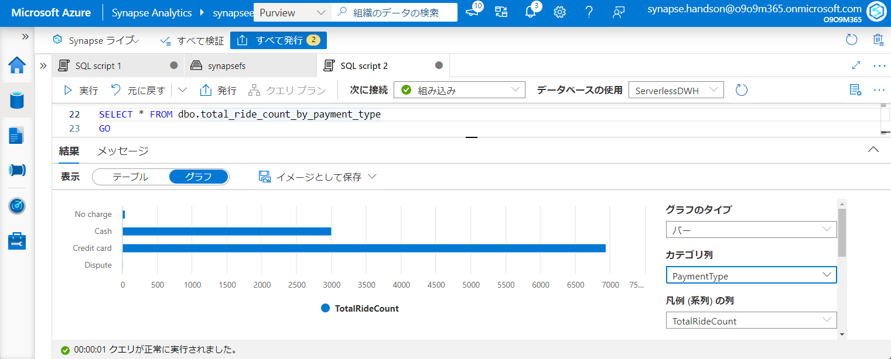  

***Tips***
https://docs.microsoft.com/ja-jp/azure/synapse-analytics/sql/create-external-table-as-select
https://docs.microsoft.com/ja-jp/azure/synapse-analytics/sql/develop-tables-cetas

***TODO：👇工事中***
## 6-4. オプション：Azure Purview データポリシー機能（本書執筆時点でプレビュー）でポリシーベースの包括的なアクセス制御を行う  

Azure Purview にはこの章の冒頭で利用したデータカタログによるデータ資産の把握だけではなく、データポリシー機能（本書執筆時点でプレビュー）というデータガバナンスをより強固にする機能が搭載される予定です。このデータポリシー機能は組織で保有するデータ資産をポリシーに基づいて包括的に管理することが目的です。Azure Data Lake Storage や Azure SQL Database など各データ資産それぞれ個別にアクセス制御のための機能を持ちますが、Azure Purview データポリシー機能によってデータ資産全体を包括的に管理することを目指しています。  

本書執筆時点でプレビューですが、現プレビュー時点で Azure Blob Storage と Azure Data Lake Storage に対してポリシーに基づいたアクセス制御を行うことができるので試してみましょう。  
なお、プレビューであるため UI や手順の変更が発生する可能性が高い点に留意ください。  

### 6-4-1. データポリシー機能を準備する

#### 1. データポリシー機能の有効化

Azure Portal メニュから Cloud Shell を起動し PowerShell モードを選択します。  
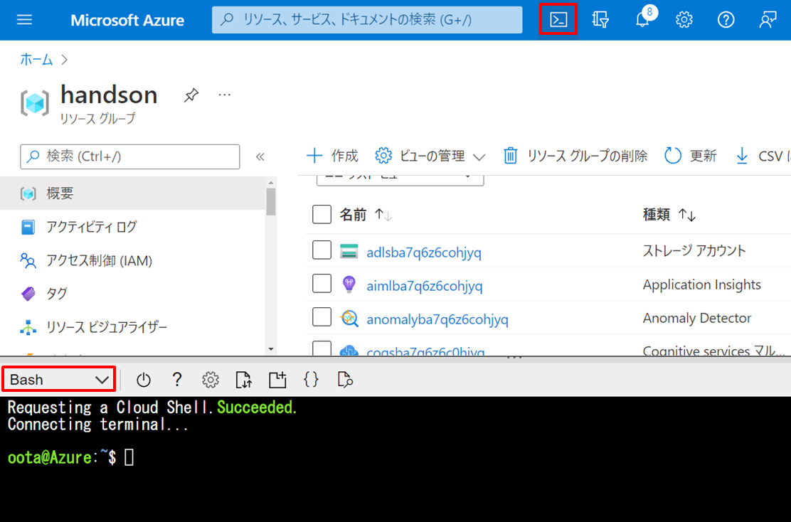  
***TODO：画像差し替え***

以下の PowerShell スクリプト内の<SubscriptionID>にこのハンズオンで利用しているサブスクリプションのIDを指定したのち Cloud Shell のコンソールに張り付け実行します。  

``` PowerShell
# Login into the subscription
Connect-AzAccount -Subscription <SubscriptionID>
# Register the feature
Register-AzProviderFeature -FeatureName AllowPurviewPolicyEnforcement -ProviderNamespace Microsoft.Storage
```

Register-AzProviderFeature コマンドの実行結果で RegistrationState が Registered になるまで待機します。このコマンドは繰り返し実行可能で実行結果として機能の有効化の状態を確認することができます。  

***TODO：画像挿入***

#### 2. データポリシー設定に必要な権限設定


#### 3. データポリシー機能が有効化された Azure Data Lake Storage のデプロイ

### 6-4-2. データポリシー機能を設定する

#### 1. データポリシー機能に使用するデータ資産の Purview への登録

#### 2. データポリシー機能の設定

### 6-4-3. データポリシー機能を動作確認する

allowを確認
ポリシー削除
NGを確認


以上で第6章のハンズオンが完了です。  

# まとめ  

いかがでしたでしょうか。  
第6章ではまずはじめに Azure Purview が管理するデータカタログを通じて組織のデータ資産を把握し、分析に必要なデータの特定や見極めを行いました。  
次に特定されたデータに対して GUI 操作からノートブックや SQL エディタを即座に起動しデータ探索を行いました。Azure Synapse Analytics は複数のデータ処理エンジンの選択肢をもち、用途やスキルセットに応じて最適なデータ処理エンジンを選択することができますが、このハンズオンでは Synapse Serverless Spark Pool による PySpark/SparkSQL や Synapse Serverless SQL Pool による SQL によってアドホック探索を行いました。  
また Azure Synapse Analytics のメタデータ共有機能によりデータ処理エンジン完で成果物を容易に共有することができます。このハンズオンでは Synapse Serverless Spark Pool で作成したレイクデータベースを Synapse Serverless SQL Pool からアクセスが容易に行えることを確認しました。  
