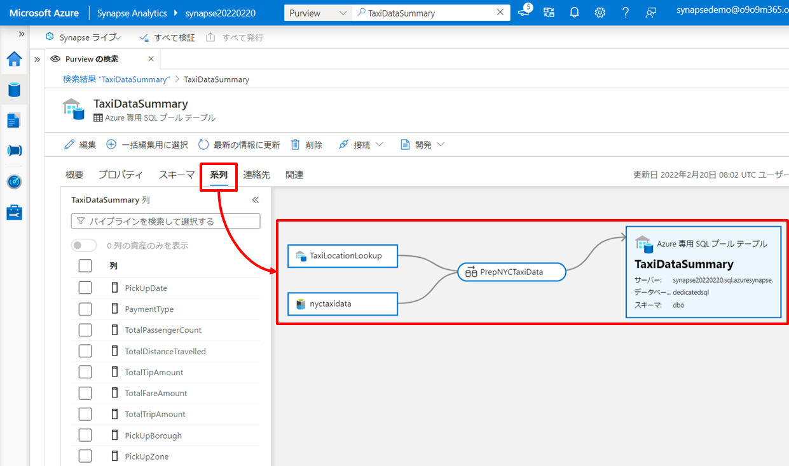
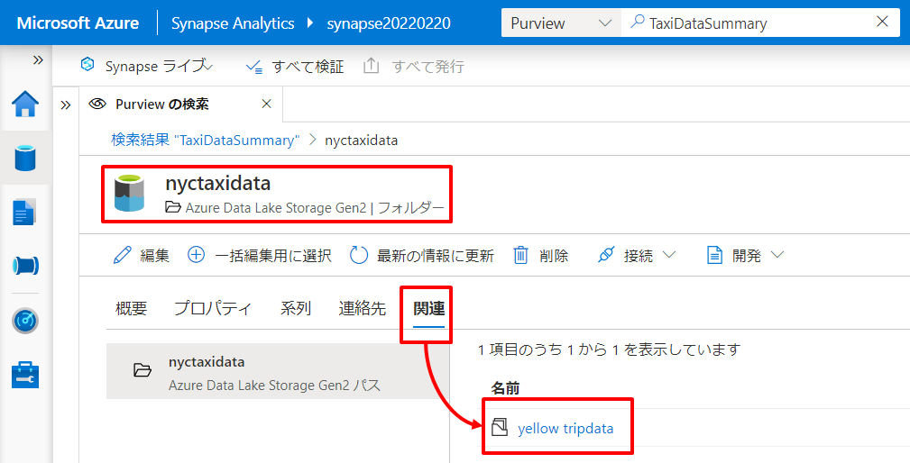
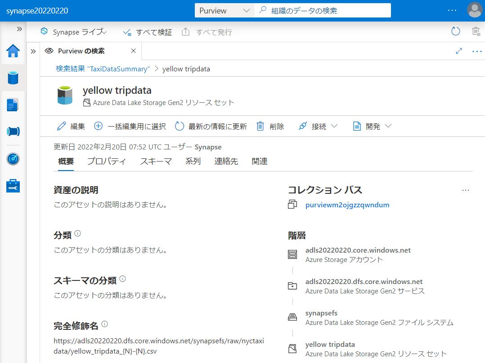
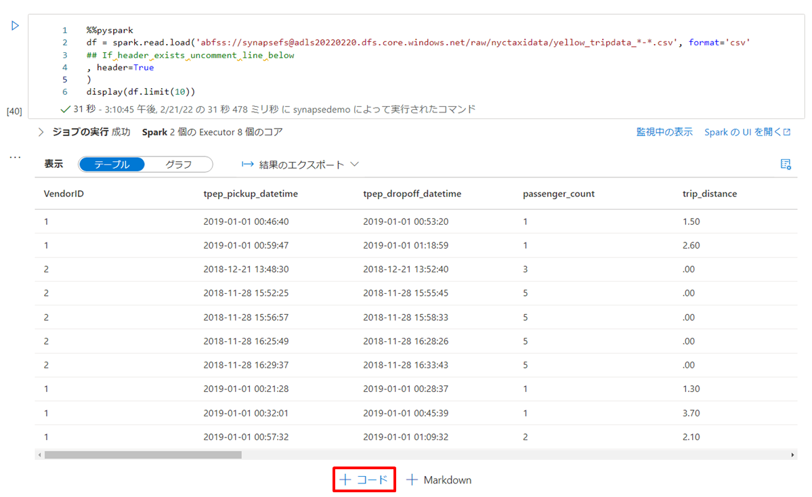
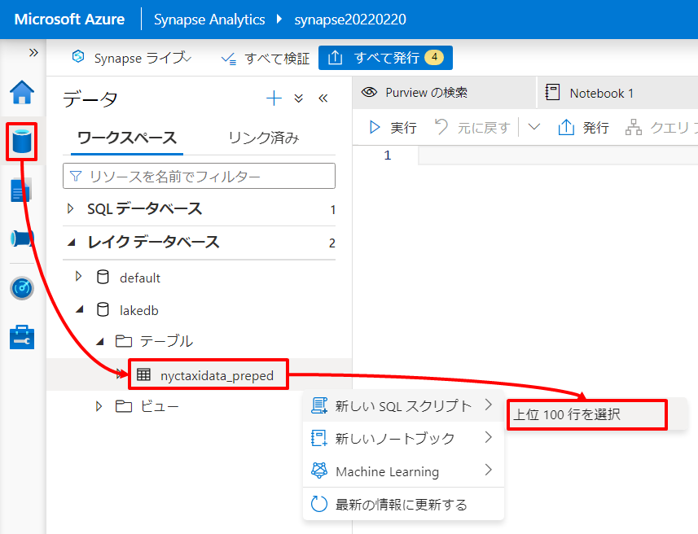
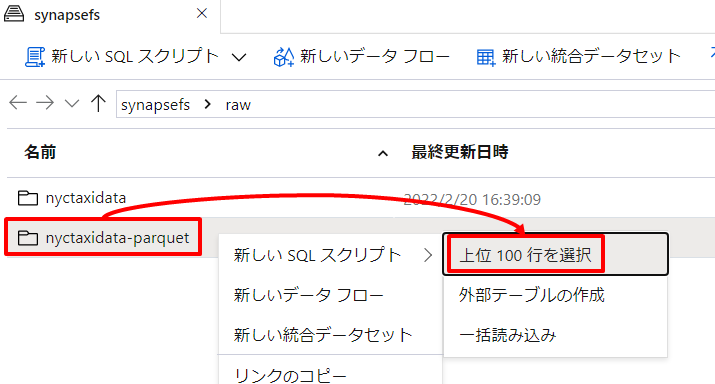
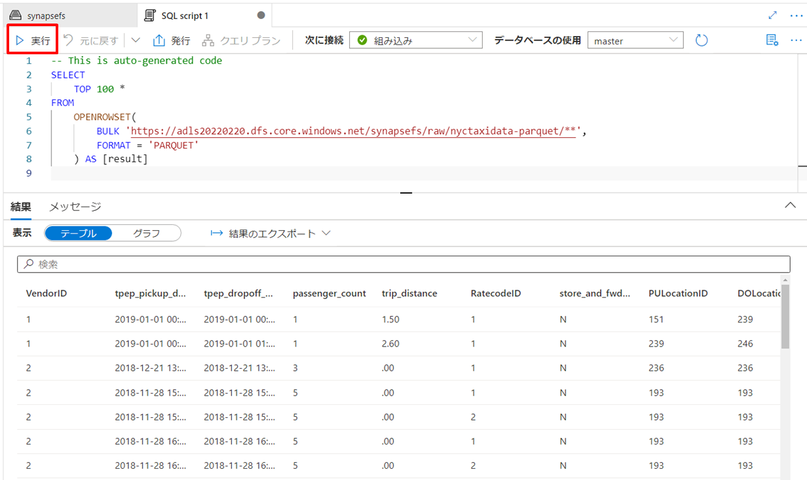
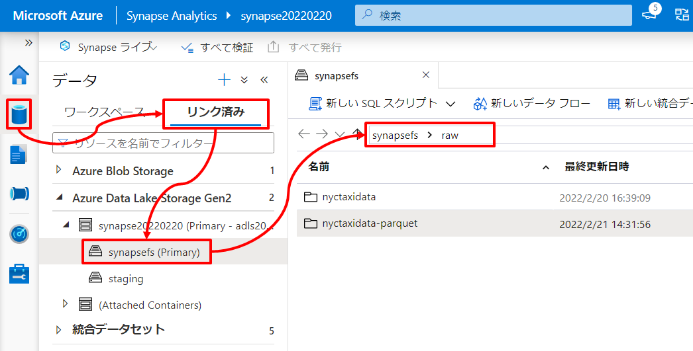
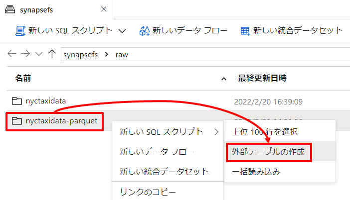

---
# 6. ハンズオン：データレイクへのアドホックデータ探索とデータプレパレーション  

第6章では Data Lake Store 上の生データに対するアドホックデータ探索とデータプレパレーションを行います。

## シナリオ  
ここでは Azure Purview が管理するデータカタログを通じて第5章で作成したレポートの元となっている生データを特定し、その生データから新たなインサイトを得るためのアドホックデータ探索とデータプレパレーションを行います。Synapse はデータ探索のためのデータ処理エンジンを複数搭載しますが、このハンズオンでは Synapse Serverless Spark Pool を利用するパターンと Synapse Serverless SQL Pool を利用するパターンの両パターンに触れていきます。  

このシナリオのアーキテクチャと関連リソースの役割は以下の通りです。矢印はデータの流れを示しています。  
  

| アイコン | リソース | 役割 |
| :---: | :---- | :---- |
|  | Azure Data Lake Storage | このシナリオではデータレイクに集約された生データから未発見の Insight を得るためのアドホックなデータ探索を行います。 |
|  | Azure Purview | Purview は組織のデータ資産をデータカタログとして管理しています。このシナリオでは Purview のデータカタログを通じて組織のデータ資産を把握し、ほしいデータの特定と分析すべき正しいデータの見極めを行います。 |
|  | Synapse Serverless Spark Pool | このシナリオでは Spark によるクエリエンジンとしてデータレイク内のデータ探索に利用します。また、データプレパレーションの結果は再利用のためデータレイクに書き戻します。 |
|  | Synapse Serverless SQL Pool | このシナリオでは SQL によるクエリエンジンとしてデータレイク内のデータ探索に利用します。また、データプレパレーションの結果は再利用のためデータレイクに書き戻します。 |

---
# Let's get started

---
## 6-1. カタログを参照しデータの詳細や系譜を把握する  

第5章で作成したレポートのデータセット（Synapse Dedicated 内の TaxiDataSummaryテーブル）について、Purview のカタログを通じてデータセットの元となったデータソース（生データ）を特定します。

### 6-1-1. Purview カタログを検索する

Synapse Studio 上部の検索ボックスへ、レポートのデータセットである *TaxiDataSummary* を入力し Purview カタログに対して検索をかけます。  
  

検索結果から TaxiDataSummary が見つかります。  
  

TaxiDataSummary をクリックすると、該当資産の情報を確認することができます。ここでは 系列タブ をクリックし該当資産がどこからどのような処理を経たデータであるかを確認することできます。ここでは TaxiDataSummary が nyxtaxidata と TaxiLocationLookup を元にデータ加工された結果セットであることがわかります。  


### 6-1-2. データ資産の系譜からデータ源泉（生データ）を確認する

ここでは nyxtaxidata を選択し「アセットに切り替え」をクリックしnyxtaxidata の資産情報を確認してみます。  
  

すると nyxtaxidata が Data Lake 上のフォルダーを示していることがわかります。さらに 関連タブ から該当フォルダー配下のデータファイルが確認できます。  
  

yellow_tripdata をクリックするとさらにデータファイルの資産情報を確認できます。  
  

---
## 6-2. Spark でアドホックデータ探索とデータプレパレーションを行う  

カタログから特定された生データに対して Synapse Spark によるアドホック探索を行うことで新たなインサイトを探ります。  

### 6-2-1. PySparkでデータを探索する

yellow_tripdata の資産情報画面で [開発タブ]->[New notebook]->[Load to DataFrame]を選択します。  
  

すると yellow_tripdata を Spark の DataFrame としてロードするコードが生成されます。  
yellow_tripdata の CSV ファイルは先頭行にヘッダを持つため、コード内の「, header=True」の行のコメントアウトを削除します。   

```Python  
%%pyspark
df = spark.read.load('abfss://<コンテナ名>@<ストレージアカウント名>.dfs.core.windows.net/raw/nyctaxidata/yellow_tripdata_*-*.csv', format='csv'
## If header exists uncomment line below
, header=True
)
display(df.limit(10))
```  

この PySpark コードの実行環境となるアタッチ先に事前に準備した Spark Pool を指定したのち、実行ボタンをクリックします。  
  

それではロードした DataFrame に対して DataFrame API を利用し簡単なデータ探索を行ってみます。まず「＋コード」からコードセルを追加します。  
  

セル内に以下のコードをペーストし実行します。  

```Python
%%pyspark
# Use Data Frame API Operations to Filter Data
display(df.select("tpep_pickup_datetime", "passenger_count", "total_amount") \
.filter("passenger_count > 6 and total_amount > 50.0") \
.sort(df.total_amount.desc()))
```  

  

このように即座にデータ探索が行えることが確認できました。  

### 6-2-2. Spark SQLでデータ探索する

次に DataFrame API ではなく Spark SQL を利用した SQL ライクな言語を利用し探索を行ってみましょう。  
まずは DataFrame を一時テーブル化します（デモ用にデータ量を1万件に絞り込んでいます）。同様にコードセルを追加し以下のコードを実行してください。  

```Python
%%pyspark
# Create Local Temp View
df.limit(10000).createOrReplaceTempView('NYCTaxiDataTable') 
```

それではこの一時テーブルに対して Spark SQL でデータ探索を行いましょう。同様にコードセルを追加し以下のコードを実行してください。  

```SQL
%%sql
--Use SQL to count NYC Taxi Data records
SELECT COUNT(*) FROM NYCTaxiDataTable
```

```SQL
%%sql
-- Use SQL to filter NYC Taxi Data records
SELECT CAST(tpep_pickup_datetime AS date) AS pickup_date
  , tpep_dropoff_datetime
  , passenger_count
  , total_amount
FROM NYCTaxiDataTable
WHERE CAST(tpep_pickup_datetime AS date) = '2019-01-07'
  AND passenger_count > 2
```

```SQL
%%sql
-- Use SQL to aggregate NYC Taxi Data records and visualize data
SELECT CASE payment_type
            WHEN 1 THEN 'Credit card'
            WHEN 2 THEN 'Cash'
            WHEN 3 THEN 'No charge'
            WHEN 4 THEN 'Dispute'
            WHEN 5 THEN 'Unknown'
            WHEN 6 THEN 'Voided trip'
        END AS PaymentType
  , count(*) AS TotalRideCount
FROM NYCTaxiDataTable
GROUP BY payment_type
ORDER BY TotalRideCount DESC
```

このように SQL によって Data Lake 上の生データに対してアドホックな探索を行うことできます。  

また、クエリの結果セットは notebook 上で可視化することもできます。3つ目のクエリ結果に対して、グラフを選択してみてください。  
  

### 6-2-3. Dedicated データと Spark データを結合する  

ここまでは Data Lake 上の生データに対して容易＆即座にデータ探索を開始できることを確認してきましたが、同様に Dedicated SQL Pool 内のデータにも容易にアクセスが可能です。  
以下のコードにより、5章で作成した Dedicated SQL Pool 内の TaxiLocationLookup テーブル（ローケーションを参照するためのマスタデータ）の内容を DataFrame にロードすることができます。  

```Scala
%%spark
// <Dediacated SQL Pool 名>.<スキーマ名>.<テーブル名>で指定します。
val df_location = spark.read.sqlanalytics("dedicatedsql.dbo.TaxiLocationLookup")
```

こちらの DataFrame も Spark SQL から扱えるように一時テーブル化しましょう。    

```Scala
%%spark
df_location.createOrReplaceTempView("NYCTaxiLocation")
```

こうすることで以下のように Data Lake からロードした生データと Dedicated SQL Pool からロードした参照データを結合して分析が可能になります。  

```SQL
%%sql
select 
    VendorID
    , cast(tpep_pickup_datetime as date) as PickUpDate
    , concat(year(tpep_pickup_datetime), '-', format_string('%02d',month(tpep_pickup_datetime),'##')) as PickUpYearMonth --Partition Key
    , cast(tpep_pickup_datetime as timestamp) as PickUpDateTime
    , cast(tpep_dropoff_datetime as date) as DropOffDate
    , cast(tpep_dropoff_datetime as timestamp) as DropOffDateTime
    , passenger_count as PassengerCount
    , trip_distance as TripDistance
    , cast(PULocationID as int) as PickUpLocationID
    , pu.Zone as PickUpLocationZone
    , pu.Borough as PickUpLocationBorough
    , cast(DOLocationID as int) as DropOffLocationID
    , do.Zone as DropOffLocationZone
    , do.Borough as DropOffLocationBorough
    , cast(payment_type as int) as PaymentTypeID
    , case payment_type
            when 1 then 'Credit card'
            when 2 then 'Cash'
            when 3 then 'No charge'
            when 4 then 'Dispute'
            when 5 then 'Unknown'
            when 6 then 'Voided trip'
        end as PaymentTypeDescription
    , cast(case when fare_amount < 0 then 0.00 else fare_amount end as decimal(8,2)) as FareAmount --Cleanse invalid data
    , cast(case when extra < 0 then 0.00 else extra end as decimal(8,2)) as ExtraAmount --Cleanse invalid data
    , cast(case when mta_tax < 0 then 0.00 else mta_tax end as decimal(8,2)) as MTATaxAmount --Cleanse invalid data
    , cast(case when tip_amount < 0 then 0.00 else tip_amount end as decimal(8,2)) as TipAmount --Cleanse invalid data
    , cast(case when tolls_amount < 0 then 0.00 else tolls_amount end as decimal(8,2)) as TollsAmount --Cleanse invalid data
    , cast(case when improvement_surcharge < 0 then 0.00 else improvement_surcharge end as decimal(8,2)) as ImprovementSurchargeAmount --Cleanse invalid data
    , cast(case when total_amount < 0 then 0.00 else total_amount end as decimal(8,2)) as TotalRideAmount --Cleanse invalid data
from NYCTaxiDataTable as rides
  join NYCTaxiLocation as pu
    on rides.PULocationID = pu.LocationID
  join NYCTaxiLocation as do
    on rides.DOLocationID = do.LocationID
where passenger_count > 0 --Data Cleanup Rules
  and year(tpep_pickup_datetime) = 2019
limit 10
```

***TODO:長いクエリは本にかける？　かけるかは別にクエリテキストをGithub共有してコピペできるようにしないと***  

### 6-2-4. プレパレーション結果をデータレイクに書き戻す  

分析クエリの結果は再利用に備え、Data Lake Storage や Dediacated SQL Pool へ永続化しましょう。    
以下のクエリはData Lake Storageへの永続化の例です。  コードの冒頭で *lakedb* という名前でレイクデータベースを作成しています。

***TODO: レイクデータベース is 何？***
https://docs.microsoft.com/ja-jp/azure/synapse-analytics/database-designer/concepts-lake-database

```Python
%%pyspark

spark.sql("CREATE DATABASE lakedb")

df_preped = spark.sql(" \
    select \
        VendorID \
        , cast(tpep_pickup_datetime as date) as PickUpDate \
        , concat(year(tpep_pickup_datetime), '-', format_string('%02d',month(tpep_pickup_datetime),'##')) as PickUpYearMonth \
        , cast(tpep_pickup_datetime as timestamp) as PickUpDateTime \
        , cast(tpep_dropoff_datetime as date) as DropOffDate \
        , cast(tpep_dropoff_datetime as timestamp) as DropOffDateTime \
        , passenger_count as PassengerCount \
        , trip_distance as TripDistance \
        , cast(PULocationID as int) as PickUpLocationID \
        , pu.Zone as PickUpLocationZone \
        , pu.Borough as PickUpLocationBorough \
        , cast(DOLocationID as int) as DropOffLocationID \
        , do.Zone as DropOffLocationZone \
        , do.Borough as DropOffLocationBorough \
        , cast(payment_type as int) as PaymentTypeID \
        , case payment_type \
                when 1 then 'Credit card' \
                when 2 then 'Cash' \
                when 3 then 'No charge' \
                when 4 then 'Dispute' \
                when 5 then 'Unknown' \
                when 6 then 'Voided trip' \
            end as PaymentTypeDescription \
        , cast(case when fare_amount < 0 then 0.00 else fare_amount end as decimal(8,2)) as FareAmount \
        , cast(case when extra < 0 then 0.00 else extra end as decimal(8,2)) as ExtraAmount \
        , cast(case when mta_tax < 0 then 0.00 else mta_tax end as decimal(8,2)) as MTATaxAmount  \
        , cast(case when tip_amount < 0 then 0.00 else tip_amount end as decimal(8,2)) as TipAmount  \
        , cast(case when tolls_amount < 0 then 0.00 else tolls_amount end as decimal(8,2)) as TollsAmount  \
        , cast(case when improvement_surcharge < 0 then 0.00 else improvement_surcharge end as decimal(8,2)) as ImprovementSurchargeAmount  \
        , cast(case when total_amount < 0 then 0.00 else total_amount end as decimal(8,2)) as TotalRideAmount  \
    from NYCTaxiDataTable as rides \
    join NYCTaxiLocation as pu \
        on rides.PULocationID = pu.LocationID \
    join NYCTaxiLocation as do \
        on rides.DOLocationID = do.LocationID \
    where passenger_count > 0 --Data Cleanup Rules \
    and year(tpep_pickup_datetime) = 2019 \
")

df_preped.write.mode("overwrite").saveAsTable("lakedb.nyctaxidata_preped")
```

作成したレイクデータベースは Data Lake Storage 上にデータの実体を持つデータベースとなり、Synapse Studio のエクスプローラにも表示されるようになります。また、レイクデータベースはSynapse 内のメタデータ共有により Spark Pool 間に限らず、以下のように Serverless SQL Pool からもアクセスが可能です。  
  
  

---
## 6-3.  SQL でアドホックデータ探索とデータプレパレーションを行う  

次に Synapse Serverless SQL Pool を利用して 6-2 と同様のシナリオを流してみましょう。  

### 6-3-1. CSV ファイルを Parquet ファイルに変換する

CSV 形式の生データをそのまま扱うこともできますが、今回は分析用途に最適化された Parquet 形式のファイルに変換し、そのファイルに対して Synapse Serverless SQL Pool によるアドホックなデータ探索を行いましょう。以下のコードにより DataFrame にロードした生データを Parquet 形式のファイルとして Data Lake Storage に保存します（デモ用にデータ量を1万件に絞り込んでいます）。  

| 項目 | 値 |
| :---- | :---- |
| ストレージアカウント名 | Synapse デプロイ時に作成した Data Lake のストレージアカウント名を指定します（例：datalake1130） |
| コンテナ名 | Synapse デプロイ時に作成した Data Lake のファイルシステム名を指定します（例：synapsefs） |  

```Python
%%pyspark

"""
df = spark.read.load('abfss://<コンテナ名>@<ストレージアカウント名>.dfs.core.windows.net/raw/nyctaxidata/yellow_tripdata_*-*.csv', format='csv'
## If header exists uncomment line below
, header=True
)
display(df.limit(10))
""" 

df.limit(10000).write.parquet("abfss://<コンテナ名>@<ストレージアカウント名>.dfs.core.windows.net/raw/nyctaxidata-parquet/")
```

### 6-3-2. SQL でデータを探索する

出力した Parquet ファイルを Synapse Studio のエクスプローラから辿りましょう。  
  

出力先フォルダを右クリックし、[新しいSQLスクリプト]->[上位100行を選択]を選択します。  
  

「ファイルの種類」は Parquet 形式を選択し適用ボタンを押下します。  
  

Parquet ファイル へのアドホッククエリが記述されたSQLスクリプトエディタが立ち上がります。実行ボタンをクリックするとクエリ結果が表示されます。  
  

```SQL  
-- This is auto-generated code
SELECT
    TOP 100 *
FROM
    OPENROWSET(
        BULK 'https://<ストレージアカウント名>.dfs.core.windows.net/<コンテナ名>/raw/nyctaxidata-parquet/**',
        FORMAT = 'PARQUET'
    ) AS [result]
```

SQLスクリプトを以下のように編集し分析クエリを実行します。このクエリは FROM句 を除き「6-2-2. Spark SQL でデータ探索する」で実行した Spark SQL と全く同じクエリになっています。  

```SQL
SELECT CASE payment_type
            WHEN 1 THEN 'Credit card'
            WHEN 2 THEN 'Cash'
            WHEN 3 THEN 'No charge'
            WHEN 4 THEN 'Dispute'
            WHEN 5 THEN 'Unknown'
            WHEN 6 THEN 'Voided trip'
        END AS PaymentType
  , count(*) AS TotalRideCount
FROM
  OPENROWSET(
      BULK 'https://<ストレージアカウント名>.dfs.core.windows.net/<コンテナ名>/raw/nyctaxidata-parquet/**',
      FORMAT = 'PARQUET'
  ) AS [result]
GROUP BY payment_type
ORDER BY TotalRideCount DESC
```

  

### 6-3-3. 外部テーブル定義を介してデータを探索する

先のクエリではデータファイルのパスをクエリの中で直接指定していますが、外部テーブルの定義によりデータファイルへのパスを内包させることができます。

まず、外部テーブルを作成する先となるデータベースを定義します。Synapse Studio のメニュを辿り SQL スクリプトエディタを起動します。  
  

以下の SQL をペーストし、「次に接続」に *組み込み*、「データベースの使用」に *master* を選択したのち実行します。  

```SQL
CREATE DATABASE LogicalDWH
```


次に外部テーブルを定義します。Synapse Studio のメニュを辿り出力先フォルダを右クリックし、[新しいSQLスクリプト]->[外部テーブルの作成]を選択します。  
  
  

「続行」を押下します。  
  
***TODO：画像がわかりにくい***

「SQLプールの選択」は *組み込み* を選択、「データベースの選択」は *LogicalDWH* を選択、「外部テーブル名」は *dbo.nyctaxidatatable* を入力し「スクリプトを開く」を押下します。  

***TODO：画像がわかりにくい***

外部テーブルの定義が記述されたSQLスクリプトエディタが立ち上がります。「次に接続」に *組み込み*、「データベースの使用」に *LogicalDWH* を選択したのち実行します。実行すると外部テーブルが作成され、その外部テーブルに対する 100件 のデータを返すサンプルSELECTが実行されます。  

```SQL
IF NOT EXISTS (SELECT * FROM sys.external_file_formats WHERE name = 'SynapseParquetFormat') 
	CREATE EXTERNAL FILE FORMAT [SynapseParquetFormat] 
	WITH ( FORMAT_TYPE = PARQUET)
GO

IF NOT EXISTS (SELECT * FROM sys.external_data_sources WHERE name = 'container_storageaccount_dfs_core_windows_net') 
	CREATE EXTERNAL DATA SOURCE [container_storageaccount_dfs_core_windows_net] 
	WITH (
		LOCATION = 'abfss://<コンテナ名>@<ストレージアカウント名>.dfs.core.windows.net' 
	)
GO

CREATE EXTERNAL TABLE nyctaxidatatable (
	[VendorID] nvarchar(4000),
	[tpep_pickup_datetime] nvarchar(4000),
	[tpep_dropoff_datetime] nvarchar(4000),
	[passenger_count] nvarchar(4000),
	[trip_distance] nvarchar(4000),
	[RatecodeID] nvarchar(4000),
	[store_and_fwd_flag] nvarchar(4000),
	[PULocationID] nvarchar(4000),
	[DOLocationID] nvarchar(4000),
	[payment_type] nvarchar(4000),
	[fare_amount] nvarchar(4000),
	[extra] nvarchar(4000),
	[mta_tax] nvarchar(4000),
	[tip_amount] nvarchar(4000),
	[tolls_amount] nvarchar(4000),
	[improvement_surcharge] nvarchar(4000),
	[total_amount] nvarchar(4000),
	[congestion_surcharge] nvarchar(4000)
	)
	WITH (
	LOCATION = 'raw/nyctaxidata-parquet/**',
	DATA_SOURCE = [container_storageaccount_dfs_core_windows_net],
	FILE_FORMAT = [SynapseParquetFormat]
	)
GO


SELECT TOP 100 * FROM dbo.nyctaxidatatable
GO
```

  

作成した外部テーブルを参照するクエリに書き換えます。このクエリは「6-2-2. Spark SQL でデータ探索する」で実行した Spark SQL と全く同じクエリになっています。  

```SQL
SELECT CASE payment_type
            WHEN 1 THEN 'Credit card'
            WHEN 2 THEN 'Cash'
            WHEN 3 THEN 'No charge'
            WHEN 4 THEN 'Dispute'
            WHEN 5 THEN 'Unknown'
            WHEN 6 THEN 'Voided trip'
        END AS PaymentType
  , count(*) AS TotalRideCount
FROM dbo.nyctaxidatatable
GROUP BY payment_type
ORDER BY TotalRideCount DESC
```

  

### 6-3-4. プレパレーション結果をデータレイクに書き戻す    

Synapse Serverless SQL Pool の場合、クエリの結果を Data Lake Storage へ書き戻すには CETAS（CREATE EXTERNAL TABLE AS SELECT）を利用します。  

```SQL
CREATE EXTERNAL TABLE total_ride_count_by_payment_type
WITH (
    LOCATION = 'preped_data/',
    DATA_SOURCE = [container_storageaccount_dfs_core_windows_net],
    FILE_FORMAT = [SynapseParquetFormat]
)  
AS
SELECT CASE payment_type
            WHEN 1 THEN 'Credit card'
            WHEN 2 THEN 'Cash'
            WHEN 3 THEN 'No charge'
            WHEN 4 THEN 'Dispute'
            WHEN 5 THEN 'Unknown'
            WHEN 6 THEN 'Voided trip'
        END AS PaymentType
  , count(*) AS TotalRideCount
FROM dbo.nyctaxidatatable
GROUP BY payment_type
ORDER BY TotalRideCount DESC
GO

SELECT * FROM dbo.total_ride_count_by_payment_type
```

  

https://docs.microsoft.com/ja-jp/azure/synapse-analytics/sql/create-external-table-as-select
https://docs.microsoft.com/ja-jp/azure/synapse-analytics/sql/develop-tables-cetas

## 6-4. オプション：Azure Purview データポリシー機能（本書執筆時点でプレビュー）でポリシーベースの包括的なアクセス制御を行う  

Azure Purview にはこの章の冒頭で利用したデータカタログによるデータ資産の把握だけではなく、データポリシー機能（本書執筆時点でプレビュー）というデータガバナンスをより強固にする機能が搭載される予定です。このデータポリシー機能は組織で保有するデータ資産をポリシーに基づいて包括的に管理することが目的です。Azure Data Lake Storage や Azure SQL Database など各データ資産それぞれ個別にアクセス制御のための機能を持ちますが、Azure Purview データポリシー機能によってデータ資産全体を包括的に管理することを目指しています。  

本書執筆時点でプレビューですが、現プレビュー時点で Azure Blob Storage と Azure Data Lake Storage に対してポリシーに基づいたアクセス制御を行うことができるので試してみましょう。  
なお、プレビューであるため UI や手順の変更が発生する可能性が高い点に留意ください。  

### 6-4-1. データポリシー機能を準備する

#### データポリシー機能の有効化

Azure Portal メニュから Cloud Shell を起動し PowerShell モードを選択します。  
  
***TODO：画像差し替え***

以下の PowerShell スクリプト内の<SubscriptionID>にこのハンズオンで利用しているサブスクリプションのIDを指定したのち Cloud Shell のコンソールに張り付け実行します。  

``` PowerShell
# Login into the subscription
Connect-AzAccount -Subscription <SubscriptionID>
# Register the feature
Register-AzProviderFeature -FeatureName AllowPurviewPolicyEnforcement -ProviderNamespace Microsoft.Storage
```

Register-AzProviderFeature コマンドの実行結果で RegistrationState が Registered になるまで待機します。このコマンドは繰り返し実行可能で実行結果として機能の有効化の状態を確認することができます。  

***TODO：画像挿入***

#### データポリシー設定に必要な権限設定


#### データポリシー機能が有効化された Azure Data Lake Storage のデプロイ

### 6-4-2. データポリシー機能を設定する

#### データポリシー機能に使用するデータ資産の Purview への登録

#### データポリシー機能の設定

### 6-4-3. データポリシー機能を動作確認する

allowを確認
ポリシー削除
NGを確認

# まとめ

***TODO:要整理***
- 即座に探索開始
  - 組織のデータ資産把握（データの所在・形式・系譜などから必要なデータ資産を特定）
  - 特定した様々な形式やサイズのデータに対して容易＆即座にアクセス可能
- ノーコード（Dataflow）からコードファースト（Spark, Serverless SQL）まで幅広い探索やプレパレーションに対応（スキルセットに合わせてツールを選択可能）
- メタデータ共有よってエンジン間でのアウトプットを容易に共有可能（微妙なところもあるけれど）


