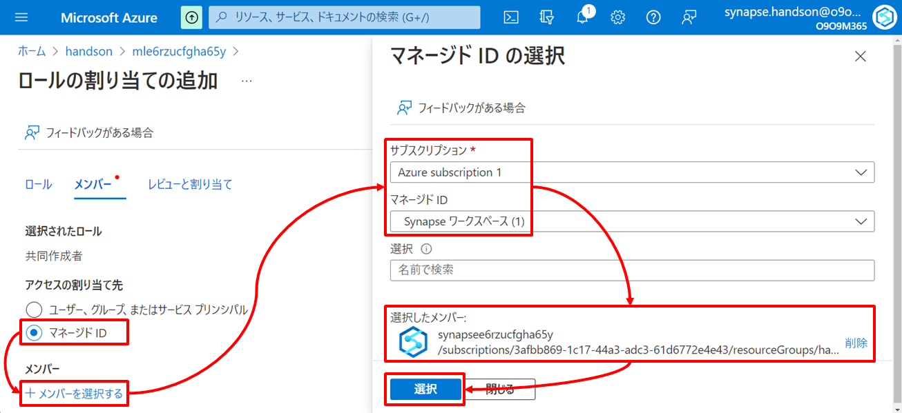
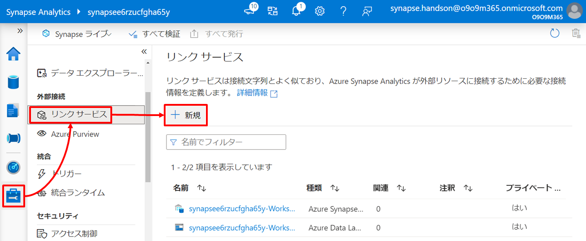
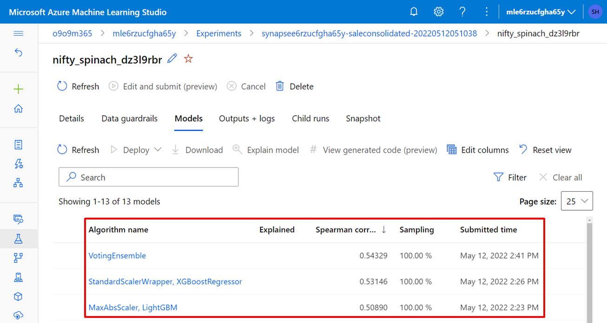
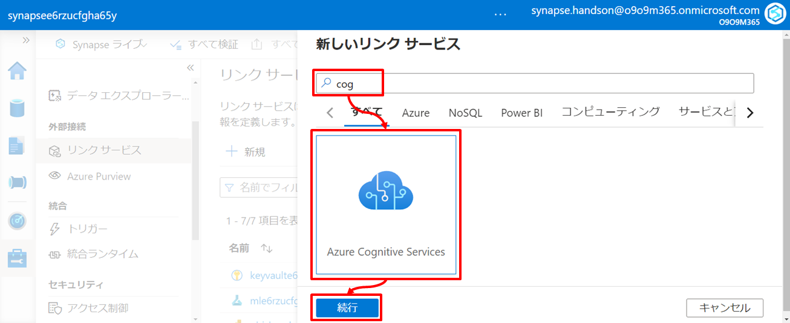

---
# 7. ハンズオン：機械学習統合によるデータエンリッチメント  

第7章では Synapse Serverless Spark Pool と機械学習サービスとの連携によるデータエンリッチメントを行います。  

## シナリオ  

ここでは2つの機械学習連携に触れていきます。  
ひとつは「Azure Machine Learning と連携した自動機械学習 (AutoML) によるデータエンリッチメント」、もうひとつは「Azure Cognitive Services と連携しサービスによって構築済みの機械学習モデルを利用したデータエンリッチメント」です。  

それぞれのシナリオのアーキテクチャと関連リソースの役割は以下の通りです。矢印はデータの流れを示しています。  
  

### シナリオ１：Azure Machine Learning と連携した自動機械学習によるデータエンリッチ  

シナリオ１は Azure Machine Learning と連携した自動機械学習 (AutoML) によるモデルの構築とそれを利用した推論を行います。このハンズオンでは架空の小売事業者の商品の販売実績から機械学習モデルを構築し将来の販売数量の予測を行います。 

| アイコン | リソース | 役割 |
| :---: | :---- | :---- |
|  | Azure Data Lake Storage | このシナリオでは機械学習モデルのトレーニングに利用する販売実績データを保持します。 |
|  | Azure Machine Learning | このシナリオでは AutoML を利用し機械学習モデルのトレーニングを行います。</br>Azure Machine Learning は Microsoft Research の最先端技術に基づいた自動機械学習 (AutoML) の機能を搭載しています。従来の機械学習モデルの開発はリソース集約型であり広範なドメイン知識と多数のモデルを生成して比較するための大量の時間を必要とします。AutoML はこうした時間のかかる反復的な機械学習モデルの開発タスクを自動化する機能で、これによりデータサイエンティスト、アナリスト、開発者はモデルの品質を維持しながら、大規模かつ効率的、生産的に機械学習モデルを構築することができます。（https://docs.microsoft.com/ja-jp/learn/modules/integrate-machine-learning-azure-synapse-analytics/4-describe-azure-automated-machine-learning） |
|  | Synapse Serverless Spark Pool | このシナリオでは機械学習モデルのトレーニングのためのデータプレパレーションと AutoML の呼び出しを行います。</br>AutoML の利用はコードファーストで記述することも、ノーコード (GUI) で設定することも可能で、スキルセットに応じて手段を選択することができます。 |
|  | Synapse Dedicated SQL Pool | このシナリオでは AutoML で作成した機械学習モデルをデータウェアハウス内に取り込み、PREDICT 関数を通じてデータウェアハウス内に閉じた推論を行います。</br>Synapse Dedicated SQL Pool はデータウェアハウスとして様々な機能を搭載し、そのひとつとして T-SQL PREDICT 関数があります。これはデータウェアハウスを機械学習の推論環境として構成する機能で、この関数を通じてデータウェアハウス内に事前デプロイした機械学習モデル（ONNX 形式）を利用した推論を行うことができます。ポイントは推論対象のデータだけではなく、機械学習モデル自体も Synapse Dedicated SQL Pool の中に内包させるため、データを外部に持ち出すことなくデータウェアハウスのセキュリティで保護された境界内で推論を行うことができます。なお PREDICT 関数は PySpark 向けにも提供されているため Synapse Serverless Spark Pool においても同様に実現が可能です。Synapse Serverless Spark Pool での PREDICT 関数は ONNX 形式以外の機械学習モデルもサポートします（https://docs.microsoft.com/ja-jp/learn/modules/integrate-machine-learning-azure-synapse-analytics/6-understand-how-to-score-models-predict、https://docs.microsoft.com/ja-jp/azure/synapse-analytics/machine-learning/tutorial-score-model-predict-spark-pool） |

### シナリオ２：Azure Cognitive Services と連携し構築済み機械学習モデルを利用したデータエンリッチ  

シナリオ２は Azure Cognitive Services と連携し構築済みモデルを利用した推論を行います。このハンズオンでは IoT デバイスから送信されたメトリックデータに対して構築済みモデルを利用した機械学習によって異常検出を行います。  

| アイコン | リソース | 役割 |
| :---: | :---- | :---- |
|  | Azure Data Lake Storage | このシナリオでは推論対象となる IoT デバイスから送信されたメトリックデータを保持します。 |
|  | Azure Cognitive Services | このシナリオでは Azure Cognitive Services がもつ様々な認知能力の中から「判断」分類にある「異常検出」の能力を利用し IoT デバイスから送信されたメトリックデータ内の異常を検出します。</br>Azure Cognitive Services はアプリケーションへのコグニティブインテリジェンスの組み込みに役立つクラウドベースの人工知能サービスです。 コグニティブインテリジェンスは 視覚、音声、言語、判断の4つの分類ごと様々な機能を持ち、AI やデータサイエンスのスキルを必要とせず、REST API、クライアントライブラリSDK、ユーザーインターフェイスを通じて利用することができます。（https://docs.microsoft.com/ja-jp/azure/cognitive-services/what-are-cognitive-services）|
|  | Synapse Serverless Spark Pool | このシナリオでは推論対象のデータプレパレーションと Azure Cognitive Services の呼び出しを行います。</br>Azure Cognitive Services の利用はコードファーストで記述することも、ノーコード (GUI) で設定することも可能で、スキルセットに応じて手段を選択することができます。 |

---
# **Let's get started**

---
## 7-1. シナリオ１：Azure Machine Learning と連携した自動機械学習によるデータエンリッチ  

シナリオ１は架空の小売事業者の商品の販売実績から機械学習モデルを構築し将来の販売数量の予測を行います。  
機械学習モデルの作成に利用する商品の販売実績データは以下の通り、販売日と販売数量をもった簡単なデータセットです。  

***TODO:画像追加***

作成した機械学習モデルは Azure Machine Learning コンピューティング インスタンス、Azure Container Instance、Azure Kubernetes Service、Azure Functions 様々なサービスを推論環境として構成することができますが、今回のハンズオンでは Synapse Dedicated SQL Pool を推論環境として利用します。その場合の制約として、機械学習モデルは ONNX (Open Neural Network Exchange) 形式 とする必要があります。ONNX 形式の機械学習モデルの作成についてはハンズオンの中であらためて解説します。  

※. ONNX は Microsoft とパートナー コミュニティによって作成された機械学習モデルを表現するためのオープン スタンダードです。TensorFlow、PyTorch、SciKit-Learn、Keras、Chainer、MXNet、MATLAB、SparkML など、さまざまなフレームワークのモデルを標準の ONNX 形式に変換することができます。ONNX 形式のモデルは ONNX Runtime によりさまざまなプラットフォームやデバイスで実行することができるようになります。  
https://docs.microsoft.com/ja-jp/azure/machine-learning/concept-onnx

### 7-1-1. Azure Synapse Analytics と Azure Machine Learning とのリンクを行う  

はじめに Azure Synapse Analytics から AutoML を利用するために Azure Machine Learning とのリンクを行います。  

#### 1. Azure Machine Learning の AIM 設定  

このハンズオンでは Azure Synapse Analytics から Azure Machine Learning への認証に マネージド ID を利用するものとし、Azure Synapse Analytics の マネージド ID に対して Azure Machine Learning の 共同作成者ロールを付与します。  

Azure Machine Learning の Azure Portal メニューを通じ「ロールの割り当ての追加」画面に遷移します。  
  

「共同作成者」を選択し「次へ」をクリックします。  
  

「マネージド ID」を選択し「＋メンバーを選択する」をクリックします。  
サブスクリプションを指定したのち、マネージド ID のドロップダウンリストから「Synapse ワークスペース」を選択し、ハンズオンで利用している Azure Synapse Analytics を指定し「選択」->「レビュと割り当て」の順にクリックします。  
  

#### 2. Azure Machine Learning とのリンク  

Synapse ワークスペースの Azure Portal メニューを通じ Synapse Studio を起動します。  
  

Synapse Studio のメニューを通じリンクサービスの「＋新規」をクリックします。  
  

Azure Machine Learning を検索し選択したのち「続行」ボタンを押下します。  
  

いくつかの情報を指定し「テスト接続」を試したのち「作成」ボタンを押下します。  

| 項目 | 値 |
| :---- | :---- |
| 名前 | リンク対象の Azure Machine Learning について Azure Synapse Analytics 内で識別する際の任意の名前を指定します（例：mle6rzucfgha65y） |
| 認証方法 | システム割り当てマネージド ID |
| Azure サブスクリプション | ご利用のサブスクリプションを指定します |
| Azure Machine Learning ワークスペース名 | 作成した Azure Machine Learning を指定します |

  

これまでの定義を発行し確定します。「すべて発行」->「発行」の順でボタンをクリックします。  
  
  

### 7-1-2. 機械学習モデル作成のためのデータプレパレーションを行う  

次に機械学習モデル作成のためのデータセットを用意しましょう。  
Synapse Studio のメニューを通じノートブックを起動します。  
  

ノートブック上のコードセルに以下の Python コードをペーストしたのち、「実行」ボタンをクリックします。  
このコードでは、機械学習モデル作成のためのデータプレパレーション と レイクデータベースへの格納 を行っています。  
元データは第4章の事前準備で用意したデータファイルです。  

| 項目 | 値 |
| :---- | :---- |
| ストレージアカウント名 | Synapse デプロイ時に作成した Data Lake のストレージアカウント名を指定します（例：datalake1130） |
| コンテナー名 | Synapse デプロイ時に作成した Data Lake のファイルシステム名を指定します（例：synapsefs） |  

```Python
%%pyspark
import pyspark.sql.functions as f

# レイクデータベースを作成します（lakedb が未作成の場合はコメントアウトを外してください）。
# spark.sql("CREATE DATABASE lakedb")

# データセットとなるデータを DataFrame にロードします。
df = spark.read.load('abfss://<コンテナー名>@<ストレージアカウント名>.dfs.core.windows.net/source/WWI/sale-small/Year=2019/Quarter=Q4/Month=12/*/*.parquet', format='parquet')

# 機械学習モデル作成のためのデータセットの準備します。
df = df.groupBy('ProductId', 'TransactionDate', 'Hour').agg(f.sum('Quantity').alias('TotalQuantity'))

# 準備したデータセットをレイクデータベース上のテーブルとして永続化します。
df.write.mode("overwrite").saveAsTable("lakedb.SaleConsolidated")
```   

  

Spark 処理が完了したら、Synapse Studio メニューを通じ「レイクデータベース」を右クリックし「最新の情報に更新する」を選択しレイクデータベース上にテーブルが作成されたことを確認します。  
  


作成したデータセットを確認します。 
ここでは Synapse Serverless SQL Pool を利用しましょう。Synapse Studio メニューを通じ「saleConsolidated」を右クリックし「上位100行を選択」をクリックします。  
  

開かれた SQL スクリプトエディタで「実行」をクリックしデータセットを確認します。商品ごと、販売日と販売数量をもった簡単なデータセットです。Synapse Serverless SQL Pool はコンピューティングの起動を待ち合わせる必要が無いためこのようにデータをサクッと確認したいときにも便利です。  
  


### 7-1-3. Azure Machine Learning の AutoML で機械学習モデルを作成する  

それでは、準備したデータセットを使い販売数量を予測する機械学習モデルを AutoML で作成しましょう。  
Synapse Studio メニューを通じ「新しいモデルのトレーニング」を選択します。  
    

販売数量を予測するため「モデルの種類」は「回帰」を選択し「続行」をクリックします。  
  

ラベルを意味する「ターゲット列」には販売数量を示す「TotalQuantity」を指定します。また「Apache Spark プール」に Spark 2.4 で構成した Synapse Serverless Spark Pool を指定し「続行」をクリックします。
  
***Memo：本書執筆時点で AutoML を利用するためには Spark 2.4 が必要です。***

今回は動作確認のためのハンズオンであるため「最大トレーニングジョブ時間」は最小値である *0.25* を指定します。  
また、Synapse Dedicated SQL Pool を推論環境として構成するため、その場合に利用する機械学習モデルとして「ONNXモデルの互換性」を「有効化」を指定します。  
  

続けて「ノートブックで開く」をクリックすると GUI で構成した情報をもとにした実装となる新規にノートブックが起動します。  
コードを編集し処理を自由にカスタムすることも可能ですが、今回はカスタムせずにそのまま実行します。「すべてを実行」ボタンをクリックすると、Azure Machine Learning と連携した AutoML が開始されます。  
  

***TODO：セルごとに解説補強***

6つ目のセルの実行結果は Azure Machine Learning による AutoML の実験ページへのリンクになっており、クリックすると Azure Machine Learning Studio が起動します。  
  

AutoML の実験の Status が「Completed」となるのをしばらく待ったのち「モデル」タブをクリックします。
  

今回の AutoML の実験によって作成された機械学習モデルの一覧を確認することができます。  
  

「モデル」メニューを開くと作成された機械学習モデル（AutoML によって作成された機械学習モデルの中で最も成績の良いモデル）が登録されていることが確認することができます。  
  

### 7-1-4. データウェアハウス内部に推論環境を構成する  

作成した機械学習モデルは Azure Machine Learning コンピューティング インスタンス、Azure Container Instance、Azure Kubernetes Service、Azure Functions 様々なサービスを推論環境として構成することができますが、今回のハンズオンでは Synapse Dedicated SQL Pool を推論環境として利用します。  
Synapse Dedicated SQL Pool を推論環境とすることで推論対象のデータだけではなく機械学習モデル自体も Synapse Dedicated SQL Pool の中に内包させるため、データを外部に持ち出すことなくデータウェアハウスのセキュリティで保護された境界内で推論を行うことができます。
https://docs.microsoft.com/ja-jp/learn/paths/build-ai-solutions-with-azure-ml-service/

推論対象のデータは「dbo.ProductQuantityForecast」として準備済みです。  
Synapse Studio を通じ「モデルを使用した予測」を選択します。  
  

「モデルを使用した予測」ブレードで先ほど作成したモデルを選択し「続行」ボタンをクリックします。  
  

次に入出力のマッピングを設定します。既定値のまま「続行」ボタンをクリックします。  
  

次にこの PREDICT 機能の利用方法とモデルの取り込み先テーブルを指定します。それぞれ入力したら「モデルをデプロイしてスクリプトを開く」ボタンをクリックします。  

| 項目 | 値 |
| :---- | :---- |
| スクリプトの種類 | 表示（ビュー） |
| ビュー名 | dbo.PredictedProductQuantityForecast |
| データベース テーブル | 新規作成 |
| 新しいテーブル | 例：dbo.ONNX_Model |

  

GUI で構成した情報をもとにしたビュー定義とビューの SELECT が記述された SQL スクリプトが起動します。  

```SQL
-- Create a view to score machine learning models.
CREATE VIEW dbo.PredictedProductQuantityForecast
AS
-- Select input scoring data and assign aliases.
WITH InputData AS
(
    SELECT
        CAST([ProductId] AS [bigint]) AS [ProductId],
        CAST([TransactionDate] AS [bigint]) AS [TransactionDate],
        CAST([Hour] AS [bigint]) AS [Hour]
    FROM [dbo].[ProductQuantityForecast]
)
-- Using T-SQL Predict command to score machine learning models. 
SELECT *
FROM PREDICT (MODEL = (SELECT [model] FROM dbo.ONNX_Model WHERE [ID] = '<モデルID>'),
              DATA = InputData,
              RUNTIME = ONNX) WITH ([variable_out1] [real])
GO

-- Display the results.
SELECT * FROM dbo.PredictedProductQuantityForecast
```

  

同時にバイナリデータとしてモデルを格納したテーブルが作成されていることが確認できます。  
テーブルに対して「最新の情報に更新する」を選択すると先に指定した機械学習モデル格納のためのテーブル（例：dbo.ONNX_Model）が作成されています。  
  
  

機械学習モデルを格納したテーブルを SELECT するとモデルの ID やモデルのバイナリデータが確認できます。  

```SQL
SELECT
  [ID], [model], [inputs_schema], [outputs_schema]
FROM
  [dbo].[ONNX_Model]
```

  

### 7-1-5. データウェアハウス内部で推論を行う  

先ほどの SQL スクリプトに戻り、「実行」します。  
  

「variable_out1」に該当レコードの商品に関する販売数量の予測値が返却されます。  

このように PREDICT 関数をビューに組み込むことで 例えば BI ツールからは単にこのビューを参照するだけでダッシュボードやレポートに簡単に AI を組み込むことができます。  
また、今回はビューを介して予測値を得ることを試しましたが、ビューではなくストアドプロシージャで構成することもできます。例えば、以下のようなストアドプロシージャ定義によって元表に対して新しい推論対象データが元表に登録される都度このプロシージャを実行することで予測値を補完する運用が可能です。  

```SQL
CREATE PROCEDURE dbo.ForecastProductQuantity
AS
BEGIN

SELECT
    CAST([ProductId] AS [bigint]) AS [ProductId],
    CAST([TransactionDate] AS [bigint]) AS [TransactionDate],
    CAST([Hour] AS [bigint]) AS [Hour]
INTO [dbo].[#ProductQuantityForecast]
FROM [dbo].[ProductQuantityForecast];

SELECT *
INTO [dbo].[#Pred]
FROM PREDICT (
    MODEL = (
        SELECT [model] FROM [dbo].[ONNX_Model] WHERE [ID] = '<モデルID>'
    ),
    DATA = [dbo].[#ProductQuantityForecast],
    RUNTIME = ONNX
) WITH ([variable_out1] [real]);

MERGE [dbo].[ProductQuantityForecast] AS target  
    USING (select * from [dbo].[#Pred]) AS source (TotalQuantity, ProductId, TransactionDate, Hour)  
    ON (target.ProductId = source.ProductId and target.TransactionDate = source.TransactionDate and target.Hour = source.Hour)  
        WHEN MATCHED THEN
            UPDATE SET target.TotalQuantity = CAST(source.TotalQuantity AS [bigint]);

END
GO
```

このように PREDICT 関数を利用することでデータ移動が省け、容易 かつ シームレスなセキュアな推論環境を構成することができます。  

以上でシナリオ１のハンズオンが完了です。  
このハンズオンでは Azure Machine Learning と連携した AutoML により容易かつ迅速に機械学習モデルを作成できることを確認しました。また Synapse Dedciated SQL Pool を推論環境として構成しました。こうした構成により推論対象のデータだけではなく、機械学習モデル自体も Synapse Dedicated SQL Pool の中に内包させるため、データを外部に持ち出すことなくデータウェアハウスのセキュリティで保護された境界内で推論を行うことができることを確認しました。　

---
## 7-2. シナリオ２：Azure Cognitive Services と連携し構築済みモデルを利用したデータエンリッチ  

シナリオ２は IoT デバイスから送信されたメトリックデータに対して Azure Cognitive Services によって構築済みの機械学習モデルを利用した異常検出を行います。  

### 7-2-1. Azure Synapse Analytics と Azure Cognitive Services とのリンクを行う  

はじめに Azure Synapse Analytics から Azure Cognitive Services を利用するためのリンクを行います。  
Azure Cognitive Services とのリンクには Azure Cognitive Services へ接続するためのシークレットが必要になり、またそのシークレットは Azure Key Vault に登録されている必要があります。  

#### 1. Azure Key Vault の設定

ここでは「Azure Key Vault への Azure Cognitive Services シークレットの登録」と「Azure Synapse Analytics から Azure Key Vault 内のシークレットへのアクセス許可」を構成します。  
構成は Azure Portal からもできますが、今回はコマンドで設定します。Azure Portal メニューから Cloud Shell を起動し Bash モードを選択します。なお Cloud Shell の初回起動時はストレージのマウントが求められるので画面の指示に従いストレージを作成してください。  
  

Bash スクリプト内のパラメータを環境に合わせて編集したのち Cloud Shell のコンソールに張り付け実行します（Azure Cognitive Services Text Analytics は異常検出とは別のシナリオで利用します）。  

| 項目 | 値 |
| :---- | :---- |
| resource_group | リソースグループ名（例：handson） |
| synapse_name | Synapse Workspace 名（例：synapseba7q6z6cohjyq） |
| keyvault_name | Key Vault 名（例：keyvaultba7q6z6cohjyq） |
| cognitive_anomaly_name | Cognitive Services Anomaly Detector 名（例：anomalyba7q6z6cohjyq） |
| cognitive_anomaly_secret_name | Cognitive Services Anomaly Detector 用のシークレット名（例：cognitive-anomaly-key） |
| cognitive_text_name | Cognitive Services Text Analytics 名（例：textalalyticsba7q6z6cohjyq） |
| cognitive_text_secret_name | Cognitive Services Text Analytics 用のシークレット名（例：cognitive-text-key） |

```Bash
resource_group=<リソースグループ名>
synapse_name=<Synapse Workspace 名>
keyvault_name=<Key Vault 名>
cognitive_anomaly_name=<Azure Cognitive Services Anomaly Detector 名>
cognitive_anomaly_secret_name=<Azure Cognitive Services Anomaly Detector 用のシークレット名（例：cognitive-anomaly-key）>
cognitive_text_name=<Azure Cognitive Services Text Analytics 名>
cognitive_text_secret_name=<Azure Cognitive Services Text Analytics 用のシークレット名（例：cognitive-text-key）>
cognitive_multi_name=<Azure Cognitive Services マルチサービスアカウント名>
cognitive_multi_secret_name=<Azure Cognitive Services マルチサービスアカウント用のシークレット名（例：cognitive-multi-key）>

my_object_id=$(az ad signed-in-user show --query id -o tsv)
synapse_object_id=$(az ad sp list --filter "displayname eq '$synapse_name'" --query [].id -o tsv)
cognitive_anomaly_key=$(az cognitiveservices account keys list --name $cognitive_anomaly_name -g $resource_group --query "key1" -o tsv)
cognitive_text_key=$(az cognitiveservices account keys list --name $cognitive_multi_name -g $resource_group --query "key1" -o tsv)
cognitive_multi_key=$(az cognitiveservices account keys list --name $cognitive_text_name -g $resource_group --query "key1" -o tsv)

az keyvault set-policy --name $keyvault_name --object-id $my_object_id --secret-permissions get set delete list
az keyvault set-policy --name $keyvault_name --object-id $synapse_object_id --secret-permissions get list
az keyvault secret set --vault-name $keyvault_name --name $cognitive_anomaly_secret_name --value $cognitive_anomaly_key
az keyvault secret set --vault-name $keyvault_name --name $cognitive_text_secret_name --value $cognitive_text_key
az keyvault secret set --vault-name $keyvault_name --name $cognitive_multi_secret_name --value $cognitive_multi_key
```

***todo: ↓コマンド変更を反映した画面修正***  
  

***todo: コマンド実行結果の確認（AKVへのポリシー追加とシークレット追加の２点）***

#### 2. Azure Key Vault とのリンク  

次に Azure Synapse Analytics からシークレットにアクセスできるよう Azure Key Vault とのリンクを行います。    

Synapse ワークスペースの Azure Portal メニューを通じ Synapse Studio を起動します。  
  

Synapse Studio のメニューを通じリンクサービスの「＋新規」をクリックします。  
  

Azure Key Vault を検索し選択したのち「続行」ボタンを押下します。  
  

いくつかの情報を指定し「テスト接続」を試したのち「作成」ボタンを押下します。  

| 項目 | 値 |
| :---- | :---- |
| 名前 | リンク対象の Azure Key Vault について Azure Synapse Analytics 内で識別する際の任意の名前を指定します（例：keyvaulte6rzucfgha65y） |
| 認証方法 | システム割り当てマネージドID |
| Azure サブスクリプション | ご利用のサブスクリプションを指定します |
| Azure Key Vault の名前 | 作成した Azure Key Vault を指定します |
| テスト接続 | シークレットへ |
| シークレット名 | 前の手順で作成したシークレット名を指定（例：cognitive-anomaly-key） |

    

これまでの定義を発行し確定します。「すべて発行」->「発行」の順でボタンをクリックします。  
  
  

#### 3. Azure Cognitive Services とのリンク

最後に Azure Synapse Analytics から Azure Cognitive Services を利用するためのリンクを行います。  
Synapse Studio のメニューを通じリンクサービスの「＋新規」をクリックします。  
  

Azure Cognitive Services を検索し選択したのち「続行」をクリックします。  
  

Azure Cognitive Services Anomaly Detector への情報を指定し「作成」をクリックします。  

| 項目 | 値 |
| :---- | :---- |
| 名前 | リンク対象の Azure Cognitive Services Anomaly Detector について Azure Synapse Analytics 内で識別する際の任意の名前を指定します（例：anomalydetectione6rzucfgha65y） |
| Azure サブスクリプション | ご利用のサブスクリプションを指定します |
| Azure Cognitive Services の名前 | 作成した Azure Cognitive Services Anomaly Detector を指定します |
| AKV のリンクサービス | 前の手順で構成した Azure Key Vault のリンクサービスを指定します（例：keyvaulte6rzucfgha65y） |
| シークレット名 | 前の手順で作成した Azure Cognitive Services Anomaly Detector 用のシークレット名を指定します（例：cognitive-anomaly-key） |

  

同じ手順で Azure Cognitive Services Text Analytics についてもリンクサービスを構成します（Azure Cognitive Services Text Analytics は異常検出とは別のシナリオで利用します）。  

| 項目 | 値 |
| :---- | :---- |
| 名前 | リンク対象の Azure Cognitive Services Text Analytics について Azure Synapse Analytics 内で識別する際の任意の名前を指定します（例：textanalyticse6rzucfgha65y） |
| Azure サブスクリプション | ご利用のサブスクリプションを指定します |
| Azure Cognitive Services の名前 | 作成した Azure Cognitive Services Text Analytics を指定します |
| AKV のリンクサービス | 前の手順で作成した Azure Key Vault のリンクサービスを指定します（例：keyvaulte6rzucfgha65y） |
| シークレット名 | 前の手順で作成した Azure Cognitive Services Text Analytics 用のシークレット名を指定します（例：cognitive-text-key） |

  

これまでの定義を発行し確定します。「すべて発行」->「発行」の順でボタンをクリックします。  
  
  

### 7-2-2. 推論対象データのプレパレーションを行う

レイクデータベース内に推論対象のデータセットを用意しましょう。  
Synapse Studio のメニューを通じノートブックを起動します。  
  

ノートブック上のコードセルに以下の Python コードをペーストしたのち、「実行」をクリックします。これによりレイクデータベース上にデータセットを作成します。  
元データは第4章の事前準備で用意したデータファイルです。  

| 項目 | 値 |
| :---- | :---- |
| ストレージアカウント名 | Synapse デプロイ時に作成した Data Lake Storage のストレージアカウント名を指定します（例：adlse6rzucfgha65y） |
| コンテナー名 | Synapse デプロイ時に作成した Data Lake Storage のファイルシステム名を指定します（例：synapsefs） |  

```Python
%%pyspark
import pyspark.sql.functions as f

# レイクデータベースを作成します（lakedb が未作成の場合はコメントアウトを外してください）。
# spark.sql("CREATE DATABASE lakedb")

# 推論対象となるデータセットを DataFrame にロード
df = spark.read.load('abfss://<コンテナー名>@<ストレージアカウント名>.dfs.core.windows.net/source/IoTSignals/IoTSignals.csv', format='csv', header='true')

# SparkSQLによるデータ加工用に一時表を作成
df.createOrReplaceTempView('IoTSignalsTable')

# SparkSQLによるデータ加工（分の粒度にデータをロールアウト）
df_preped = spark.sql(" \
    SELECT \
        date_format( CAST(dateTime as TIMESTAMP), 'yyyy-MM-dd HH:mm:00Z' ) AS dateTime \
        , CONCAT(deviceId, '_', unit) AS deviceUnit \
        , AVG(measureValue) AS measureValue \
    FROM \
        IoTSignalsTable \
    GROUP BY \
        date_format( CAST(dateTime AS TIMESTAMP), 'yyyy-MM-dd HH:mm:00Z' ) \
        , deviceId \
        , unit \
    ORDER BY \
        dateTime \
")

# 加工済み DataFrame をレイクデータベース上のテーブルとして永続化
df_preped.write.mode("overwrite").saveAsTable("lakedb.IoTSignals")
```   

  

Spark 処理が完了したら、Synapse Studio メニューを通じ「最新の情報に更新する」を選択し、レイクデータベース上にテーブルが作成されたことを確認します。  
  

```SQL
SELECT TOP (100) [dateTime]
,[deviceUnit]
,[measureValue]
 FROM [lakedb].[dbo].[iotsignals]
```  

  

### 7-2-3. Azure Cognitive Services を利用した異常検出を行う  

用意した推論対象データセットを Azure Cognitive Services で異常検出しましょう。  
Synapse Studio のメニューを通じ「モデルを使用した予測」を選択します。  
  

「モデルを使用した予測」ブレードで「Anomaly Detector」を選択し「続行」をクリックします。  
  

続いて異常検出に必要なパラメータを設定したのち、「ノートブックを開く」をクリックします。  

| 項目 | 値 |
| :---- | :---- |
| Azure Cognitive Services のリンクサービス | 前の手順で作成した Azure Cognitive Services Anomaly Detector のリンクサービスを指定します（例：anomalydetectione6rzucfgha65y） |
| 細分性 | minutely |
| タイムスタンプ列 | dateTime |
| 時系列値 | measureValue |  
| 列のグループ化 | deviceUnit |  

  

Anomaly Detector を呼び出して異常検出を行うための PySpark コードが起動するのでこれを実行します。  

```Python 
from mmlspark.cognitive import *
from notebookutils import mssparkutils


# Load the data into a Spark DataFrame
df = spark.sql("SELECT * FROM lakedb.iotsignals")

anomalyDetector = (SimpleDetectAnomalies()
    .setLinkedService("<Azure Cognitive Services Anomaly Detector へのリンクサービス名>")
    .setOutputCol("output")
    .setErrorCol("error")
    .setGranularity("minutely")
    .setTimestampCol("dateTime")
    .setValueCol("measureValue")
    .setGroupbyCol("deviceUnit"))

results = anomalyDetector.transform(df)

# Show the results
display(results.select("dateTime", "measureValue", "deviceUnit", "output.*", "error").limit(10))
``` 

  

異常検出を行った結果を SparkSQL で探索してみましょう。  
まずは異常検出の結果を格納している DataFrame を一時テーブルとして定義します。  

```Python  
%%pyspark
results.createOrReplaceTempView('IoTSignalsEnrichedTable') 
```   

次に SQL クエリにより異常値の検出有無を確認してみます。  

```SQL   
%%sql
SELECT
    dateTime, deviceUnit, measureValue, output.*
FROM
    IoTSignalsEnrichedTable
WHERE
    output.isAnomaly = true
ORDER BY
    dateTime
```   

  

Anomaly Detector による異常検出の結果から、例えば、dev-1 の 消費電力（MW）が 2021年11月30日 09:39 に異常値を示したことがわかります。  

続けて次の SQL クエリで該当の時間帯周辺について dev-1 のメトリック推移を確認してみます。  

```SQL  
%%sql
SELECT
    dateTime, deviceUnit, measureValue
    , output.isAnomaly
    , (output.expectedValue + output.upperMargin) as expectedUpper
    , (output.expectedValue - output.lowerMargin) as expectedLower
FROM
    IoTSignalsEnrichedTable
WHERE
    deviceUnit LIKE 'dev-1_%'
    AND 
    dateTime BETWEEN '2021-11-30 09:35:00' AND '2021-11-30 10:15:00'
ORDER BY
    dateTime
```   

  
　　
テーブル表現では視覚的に解釈が困難であるためこの結果を簡易グラフ表示してみます。  
「表示」から「グラフ」を選択し右隅の「表示オプション」をクリックしたのち以下のように設定し「適用」をクリックします。
  

このように 機械学習連携により容易にデータのエンリッチメントを組み込むことができることが確認できました。   

その他の例として Azure Cognitive Services Text Analytics による感情分析を試してみましょう。  
新しいノートブックを開いて下記のコードをペーストし、setLinkedService の引数にAzure Cognitive Services Text Analyticsのリンクサービス名を指定したのち実行してみてください。  

```Python  
%%pyspark
from mmlspark.cognitive import *
from notebookutils import mssparkutils
from pyspark.sql.functions import explode

# Load the data into a Spark DataFrame
# df = spark.sql("SELECT * FROM lakedb.reviews")  # レイクデータベースからのロード
df = spark.createDataFrame([
  ("user01", "今日は私たちにとって最高の一日になりました", "2021-11-30 09:39:00"),
  ("user02", "今日は晴れているけれども寒いです", "2021-11-30 10:10:10"),
  ("user03", "これは少し使い勝手が悪いです", "2021-11-30 13:13:13"),
], ["user", "review", "date"])

sentiment = (TextSentiment()
    .setLinkedService("<Azure Cognitive Services Text Analytics へのリンクサービス名>")
    .setOutputCol("output")
    .setErrorCol("error")
    .setLanguage("ja")
    .setTextCol("review"))

results = sentiment.transform(df)

# Show the results
display(results\
    .select("review", explode("output").alias("exploded"), "error")\
    .select("review", "exploded.*", "error"))
```

  

感情分析は異常検出と同様に推論対象のデータセットがレイクデータベースに登録されている場合には GUI での設定で上記に相当するコードを自動生成することも可能です。  

### 7-2-4. オプション：非構造化データに対するエンリッチメントを行う  

異常検出と感情分析の２ケースで扱ってきた構造化データだけではなく、非構造化データのエンリッチも容易です。こちらも少し試してみましょう。  

ここでは多目的用の Azure Cognitive Services マルチサービスアカウントを利用します。

***MEMO***
マルチサービスアカウントは1つのキーとエンドポイントを使用して複数の Azure Cognitive Services にアクセスするためのサービスです。なお、すべての認知機能に対応しているわけではなく例えば Anomaly Detector には非対応です。対応する認知機能の詳細は Docs をご確認ください。
https://docs.microsoft.com/ja-jp/azure/cognitive-services/cognitive-services-apis-create-account?tabs=multiservice%2Cwindows#create-a-new-azure-cognitive-services-resource

Synapse Studio のメニューを通じりリンクサービスの「＋新規」をクリックします。  
  

Azure Cognitive Services を検索し選択したのち「続行」をクリックします。  
  

必要情報を指定し「作成」をクリックします。  

| 項目 | 値 |
| :---- | :---- |
| 名前 | リンク対象の Azure Cognitive Services マルチサービスアカウント について Azure Synapse Analytics 内で識別する際の任意の名前を指定します（例：cogse6rzucfgha65y） |
| Azure サブスクリプション | ご利用のサブスクリプションを指定します |
| Azure Cognitive Services の名前 | 作成した Azure Cognitive Services マルチサービスアカウントを指定します |
| AKV のリンクサービス | 前の手順で構成した Azure Key Vault のリンクサービスを指定します（例：keyvaulte6rzucfgha65y） |
| シークレット名 | 前の手順で作成した Azure Cognitive Services マルチサービスアカウント用のシークレット名を指定します（例：cognitive-multi-key） |

  

これまでの定義を発行し確定します。「すべて発行」->「発行」の順でボタンをクリックします。  
  
  

準備が整ったので新しいノートブックを開きそれぞれのコードを実行してみてください。  

***todo: Multi Cogsをリンク ＆ 音声用のシークレットメモ***
Cogsリンク ＆ 

https://docs.microsoft.com/ja-jp/azure/synapse-analytics/machine-learning/overview-cognitive-services

#### 画像
```Python  
%%pyspark
from mmlspark.cognitive import *
from notebookutils import mssparkutils
from pyspark.sql.functions import explode

# Create a dataframe with the image URLs
df = spark.createDataFrame([
        ("https://docs.microsoft.com/ja-jp/azure/synapse-analytics/machine-learning/media/tutorial-computer-vision-use-mmlspark/dog.jpg", )
    ], ["image", ])

# Run the Computer Vision service. Analyze Image extracts infortmation from/about the images.
analysis = (AnalyzeImage()
    .setLinkedService("<Azure Cognitive Services マルチサービスアカウントへのリンクサービス名>")
    .setVisualFeatures(["Categories","Color","Description","Faces","Objects","Tags"])
    .setOutputCol("analysis_results")
    .setImageUrlCol("image")
    .setErrorCol("error"))

# Show the results of what you wanted to pull out of the images.
display(analysis.transform(df).select("image", "analysis_results.description.tags"))
```  

  
  

***TODO：結果についての解釈を追記***

#### OCR
```Python  
%%pyspark
from mmlspark.cognitive import *
from notebookutils import mssparkutils
from pyspark.sql.functions import explode

df = spark.createDataFrame([
        ("https://docs.microsoft.com/ja-jp/azure/synapse-analytics/machine-learning/media/tutorial-computer-vision-use-mmlspark/ocr.jpg", )
    ], ["url", ])

ri = (ReadImage()
    .setLinkedService("<Azure Cognitive Services マルチサービスアカウントへのリンクサービス名>")
    .setImageUrlCol("url")
    .setOutputCol("ocr"))

display(ri.transform(df))
```  
  
  
***TODO：結果についての解釈を追記***

#### Form
```Python  
%%pyspark
from mmlspark.cognitive import *
from notebookutils import mssparkutils
from pyspark.sql.functions import explode

imageDf = spark.createDataFrame([
  ("https://docs.microsoft.com/ja-jp/azure/synapse-analytics/machine-learning/media/tutorial-form-recognizer/receipt.png",)
], ["image",])

analyzeReceipts = (AnalyzeReceipts()
                 .setLinkedService("<Azure Cognitive Services マルチサービスアカウントへのリンクサービス名>")
                 .setImageUrlCol("image")
                 .setOutputCol("parsed_document")
                 .setConcurrency(5))


results = analyzeReceipts.transform(imageDf).cache()
display(results.select("image", "parsed_document"))
```  
  
  
***TODO：結果についての解釈を追記***

#### 音声

***TODO:音声についてはバージョンが古くキーが必要***

  

```Python  
%%pyspark
from mmlspark.cognitive import *
from notebookutils import mssparkutils
from pyspark.sql.functions import explode

# Create a dataframe with our audio URLs, tied to the column called "url"
df = spark.createDataFrame([("https://mmlspark.blob.core.windows.net/datasets/Speech/audio2.wav",)
                           ], ["url"])

# Run the Speech-to-text service to translate the audio into text
speech_to_text = (SpeechToTextSDK()
    .setSubscriptionKey("<Azure Cognitive Services マルチサービスアカウントのキー>")
    .setLocation("<Azure Cognitive Services マルチサービスアカウントのデプロイリージョン（例：japaneast）>")
    .setOutputCol("text")
    .setAudioDataCol("url")
    .setLanguage("en-US")
    .setProfanity("Masked"))

# Show the results of the translation
display(speech_to_text.transform(df).select("url", "text.DisplayText"))
```  

　

***TODO：結果についての解釈を追記***

以上でシナリオ２のハンズオンが完了です。

# まとめ

いかがでしたでしょうか。  
第7章では Azure Machine Learning や Azure Cognitive Services の機械学習サービスによるデータエンリッチメントを行いました。  
Azure Synapse Analytics はこうした機械学習サービスとの連携により、容易かつ迅速にデータエンリッチメントを実装できることを確認しました。このハンズオンではこうしたデータエンリッチメントをノーコードで実装しましたが、スキルセットに応じてコードファーストを選択し自由にカスタムすることも可能です。  
また、Synapse Dedciated SQL Pool を作成した機械学習モデルの推論環境として構成しました。こうした構成により推論対象のデータだけではなく、機械学習モデル自体も Synapse Dedicated SQL Pool の中に内包させるため、データを外部に持ち出すことなくデータウェアハウスのセキュリティで保護された境界内で推論を行うことができることを確認しました。　　
