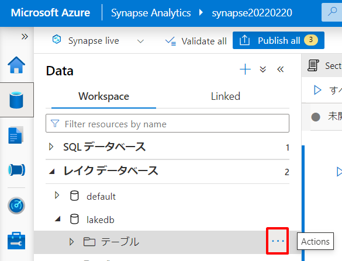
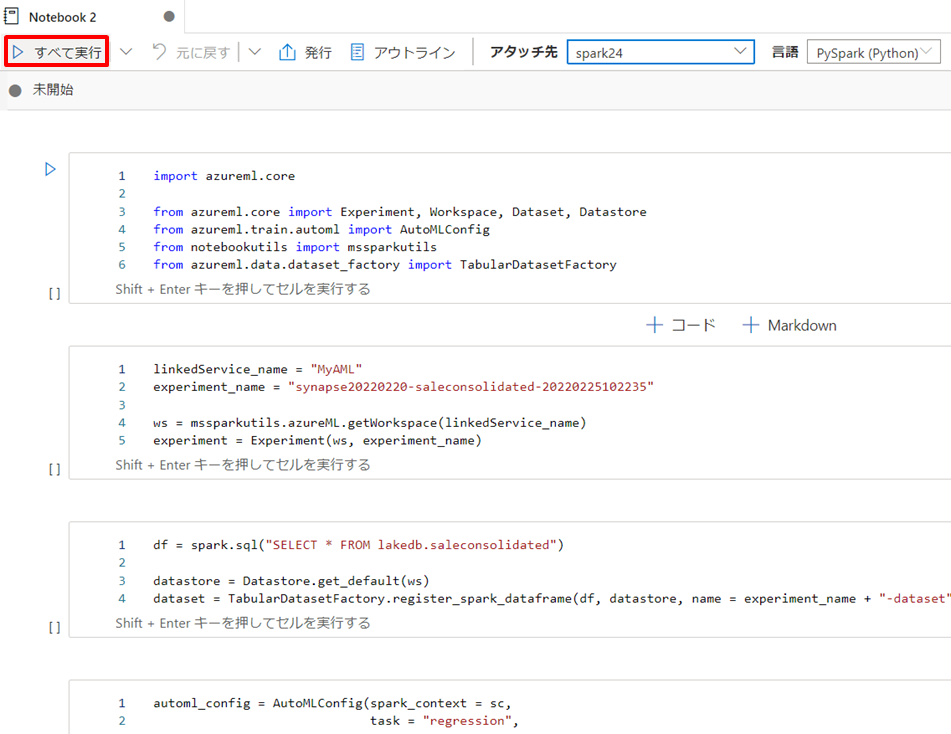
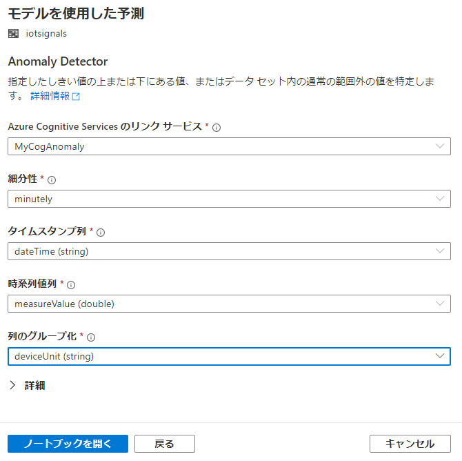
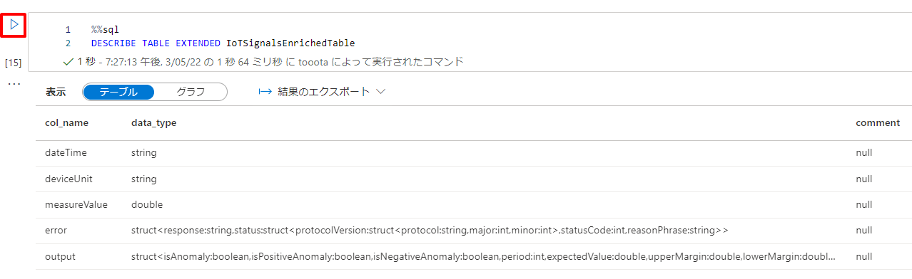
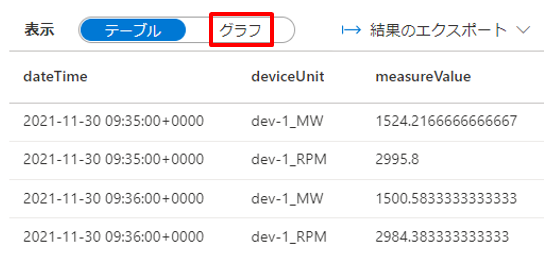
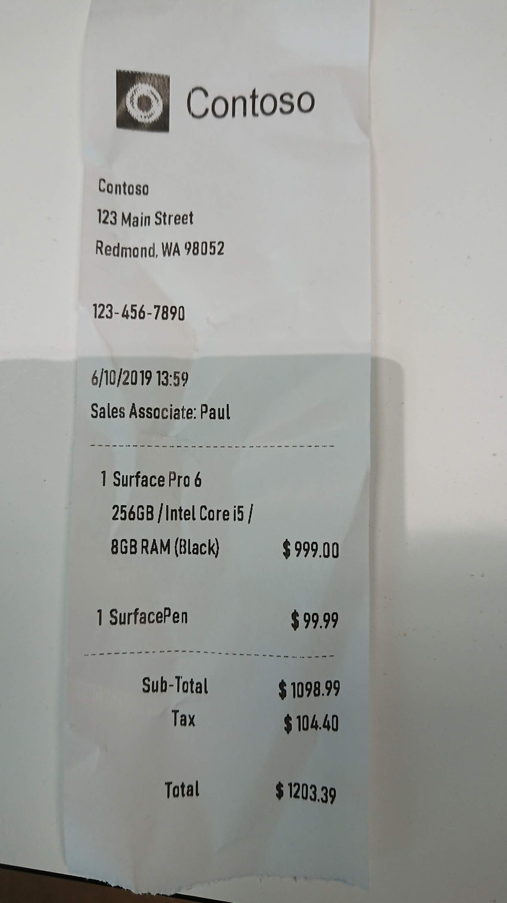
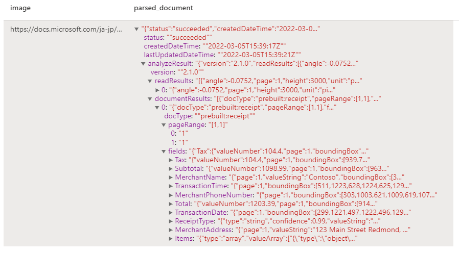

---

# 7. ハンズオン：機械学習統合によるデータエンリッチメント  

本章では Synapse が持つクエリエンジンを利用したデータプレパレーションと該当データによる機械学習を行います。
  
## シナリオ  

ここでは2つのシナリオに触れていきます。  

### Azure Machine Learning (AML) と連携した自動機械学習によるデータエンリッチ

ひとつは Azure Machine Learning (AML) と連携した自動機械学習によるオリジナルモデルの構築とそれを利用した推論を行います。ここでは架空の小売事業者を想定し、商品の売上実績から機械学習モデルを構築し、該当モデルから将来の売上予測を導きます。

### Azure Cognitive Services (ACS) と連携し構築済みモデルを利用したデータエンリッチ

もうひとつは Azure Cognitive Services (ACS) と連携し構築済みモデルを利用した推論を行います。ここでは IoT デバイスが生成するメトリックデータに対して構築済みモデルを利用した機械学習によって異常検出を行います。

## アーキテクチャと各サービスの解説

  

### Azure Machine Learning (AML) と連携した自動機械学習によるデータエンリッチ

AML と連携し AutoML による機械学習モデルのトレーニングを行います。またこのハンズオンではトレーニングを行ったモデルを利用する推論環境として Dedicated SQL を利用します。これによりSynapseの境界内でセキュアな推論を実現できます。

#### Azure Data Lake Storage (DataLake)  
機械学習モデルのトレーニングに利用する売上実績データを保持するデータレイクです。

#### Azure Machine Learning (AML)  
自動機械学習 (自動 ML または AutoML とも呼ばれます) は、時間のかかる反復的な機械学習モデルの開発タスクを自動化するプロセスです。 これにより、データ サイエンティスト、アナリスト、開発者は、モデルの品質を維持しながら、大規模に、効率的で生産的に ML モデルを構築することができます。 Azure Machine Learning の 自動 ML は、Microsoft Research 部門の最先端技術に基づいています。
機械学習モデルの従来の開発はリソース集約型であり、ドメインに関する広範な知識と多数のモデルを生成して比較するための大量の時間を必要とします。 自動機械学習を使用することで、すぐに実稼働環境で使用できる ML モデルを取得するための時間を、容易にかつ効率的に短縮することができます。
https://docs.microsoft.com/ja-jp/learn/modules/integrate-machine-learning-azure-synapse-analytics/4-describe-azure-automated-machine-learning

#### Synapse Spark  
機械学習モデルのトレーニングのためのデータプレパレーションと AutoML の呼び出しを行います。
このオペレーションはコードファーストで記述することもGUIで設定することも可能です。

#### Synapse Dedicated  
専用 SQL プールには、使い慣れた T-SQL 言語を使用して機械学習モデルをスコア付けする機能が用意されています。 T-SQL PREDICT を使用すると、履歴データでトレーニングされた既存の機械学習モデルを、ご自分のデータ ウェアハウスのセキュリティで保護された境界内に持ち込んでスコア付けすることができます。 PREDICT 関数によって、入力として ONNX (Open Neural Network Exchange) モデルとデータが受け取られます。 この機能により、重要なデータをスコアリングのためにデータ ウェアハウスの外部に移動する手順が不要になります。 これは、データ プロフェッショナルが使い慣れた T-SQL インターフェイスを使用して機械学習モデルを迅速にデプロイできるようにすると共に、タスクに適切なフレームワークを使用してデータ サイエンティストとシームレスに共同作業できるように
https://docs.microsoft.com/ja-jp/learn/modules/integrate-machine-learning-azure-synapse-analytics/6-understand-how-to-score-models-predict

### Azure Cognitive Services (ACS) と連携し構築済みモデルを利用したデータエンリッチ

Cogs と連携し IoT デバイスが生成するメトリックデータ に対する異常検出を行います。

#### Azure Cognitive Services  
レイクデータベース内であればGUIで連携可能。
GUIは異常検出と感情分析のみ。
手書きであれば各種Cogsを呼び出せる。


# ***※. Key Message***
- AMLやCogs連携によるデータエンリッチが容易
- ノーコード（GUIでAMLのAutoMLやCogsの異常検出/感情分析）からコードファースト（Spark）まで幅広い「スキル」に対応
- Dedicated SQL を推論環境とすることでSynapseの境界内でセキュアな推論を実現
- 

---
# **Let's get started**

---
## 7-2. Azure Machine Learning (AML) と連携した自動機械学習によるデータエンリッチ  

Synapse を AML とリンクすることにより、レイクデータベース内のデータセットに対して GUI 操作による自動機械学習を行うことができます。  


### 7-2-1. Synapse と Azure Machine Learning のリンク

#### AKV設定

Portal から Cloud Shell を起動し Bash モードを選択します。
  

Bash スクリプト内のパラメータを環境に合わせて編集したのち Cloud Shell のコンソールに張り付けます。

| 項目 | 値 |
| :---- | :---- |
| resource_group | リソースグループ名（例：handson） |
| synapse_name | Synapse Workspace名（例：synapseba7q6z6cohjyq） |
| keyvault_name | Key Vault 名（例：keyvaultba7q6z6cohjyq） |

```Bash
resource_group=<リソースグループ名>
synapse_name=<Synapse Workspace 名>
keyvault_name=<Key Vault 名>

my_object_id=$(az ad signed-in-user show --query objectId -o tsv)
synapse_object_id=$(az ad sp list --display-name $synapse_name --query [].objectId -o tsv)
az keyvault set-policy --name $keyvault_name --object-id $my_object_id --secret-permissions get set delete list
az keyvault set-policy --name $keyvault_name --object-id $synapse_object_id --secret-permissions get list
```

エンターキーを押下しスクリプトを実行します。  
  

#### AML の AIM 設定

AML の Portal メニュを辿り「ロールの割り当ての追加」画面に遷移します。


*共同作成者*を選択し「次へ」を押下します。


*マネージドID*を選択し *＋メンバーを選択する* をクリックします。
サブスクリプションを指定したのち、マネージドIDのドロップダウンリストから *Synapse ワークスペース* を選択し、前の手順で作成した Synapse を指定し「選択」ボタン、「レビュと割り当て」ボタンの順に押下します。


#### Synapse とのリンク

Synapse の Poratal メニュを辿り Synapse Studio を起動します。


Synapse Studio メニュを辿り リンクサービス画面の *＋新規* を選択します。


Azure Machine Learning を検索し選択したのち「続行」ボタンを押下します。


いくつかの情報を指定し「テスト接続」を試したのち「作成」ボタンを押下します。  

| 項目 | 値 |
| :---- | :---- |
| 名前 | 例：MyAML |
| 認証方法 | マネージドID |
| Azure サブスクリプション | ご利用のサブスクリプションを指定 |
| Azure Machine Learning ワークスペース名 | 前の手順で作成したAMLを指定 |


「すべてを発行」、「発行」の順でボタンを押下します。  

  
  

### 7-2-2. モデル作成のためのデータプレパレーションを行う

それではまず、レイクデータベース内にモデル作成のためのデータセットを用意することから始めます。Synapse Studio のメニュを辿りノートブックを起動します。


ノートブック上のコードセルに以下の Python コードをペーストしたのち、「実行」ボタンを押下します。これによりレイクデータベース上にデータセットを作成します。

| 項目 | 値 |
| :---- | :---- |
| ストレージアカウント名 | Synapse デプロイ時に作成した Data Lake のストレージアカウント名を指定します（例：datalake1130） |
| コンテナ名 | Synapse デプロイ時に作成した Data Lake のファイルシステム名を指定します（例：synapsefs） |  

```Spark
%%pyspark
import pyspark.sql.functions as f

# レイクデータベースを作成します（6章で作成済みの場合はコメントアウトしてください）。
spark.sql("CREATE DATABASE lakedb")

# データセットとなるデータを DataFrame にロードします。
df = spark.read.load('abfss://<コンテナ名>@<ストレージアカウント名>.dfs.core.windows.net/source/wwi/sale-small/Year=2019/Quarter=Q4/Month=12/*/*.parquet', format='parquet')

# ロードしたデータセットをモデル作成向けに加工します。
df = df.groupBy('ProductId', 'TransactionDate', 'Hour').agg(f.sum('Quantity').alias('TotalQuantity'))

# 加工したデータセットをレイクデータベース上のテーブルとして永続化します。
df.write.mode("overwrite").saveAsTable("lakedb.SaleConsolidated")
```   

  ***TODO：キャプチャ誤り***

Spark 処理が完了したら、Synapse Studio メニューを辿り *最新の情報に更新する* を選択し、レイクデータベース上にテーブルが作成されたことを確認します。

  
  
  

### 7-2-3. Azure Machine Learning の自動機械学習でモデルを作成する

次に準備したデータセットを自動機械学習にかけモデル作成を行います。
Synapse Studio メニューを辿り「新しいモデルのトレーニング」を選択します。


「モデルの種類」は *回帰* を選択し「続行」ボタンを押下します。


「ターゲット列」に *TotalQuantity* 、「Apache Spark プール」に Spark 2.4 で構成したプールを指定し「続行」ボタンを押下します。  


「最大トレーニングジョブ時間」に *0.25*、「ONNXモデルの互換性」に *有効化* を指定し「ノートブックで開く」ボタンを押下します。  


すると、GUI で構成した情報をもとにした実装となる新規にノートブックが起動します。
コード書けば自由にカスタム構成することも可能です。
「すべてを実行」ボタンを押下し、AMLと連携した自動機械学習を実行します。



6つ目のセルの実行結果は Azure Machine Learning による自動機械学習の実験へのリンクになっており、クリックにより AML Studio が起動します。ここでは Status が *Completed* になるのを待ちます。

  
  

Models タブを開くと自動機械学習によって生成された候補モデルの一覧を確認することができます。

  

Models メニュを開くと候補となったモデルの中で最も成績の良いモデルが登録されていることがわかります。


### 7-2-4. 構築したモデルを利用しデータベース内部で推論を行う  

こうして作成したモデルは AML の機能を使い推論環境としてデプロイ～ 
***TODO: AMLの解説***
おまけ：https://docs.microsoft.com/ja-jp/learn/paths/build-ai-solutions-with-azure-ml-service/

だけではなく、Dediacated SQL Pool や SparkSQL にモデルを取り込み、スコアリング対象のデータを外に持ち出すことなく Synapse 内部で推論を行うための PREDICT 関数が提供されています。PREDICT 関数を利用することでデータの移動や省け、容易でシームレスなセキュアな推論環境を構成することができます。また PREDICT 関数をビューに組み込むことで 例えば BI ツールからは単にこのビューを参照するだけでダッシュボードやレポートに簡単に AI を組み込むことが可能です。

それでは、先ほど作成したモデルを利用し Synapse 内部に閉じたスコアリングを行ってみましょう。

スコアリング対象のデータは *dbo.ProductQuantityForecast* として既に準備済みです。Synapse Studio を辿り *モデルを使用した予測* を選択します。


「モデルを使用した予測」ブレードで先ほど作成したモデルを選択し「続行」ボタンを押下します。


次に入出力のマッピングを設定します。今回は既定値のまま「続行」ボタンを押下します。


次にこの PREDICT 機能の利用方法とモデルの取り込み先テーブルを指定します。それぞれ入力したら「モデルをデプロイしてスクリプトを開く」ボタンを押下します。

| 項目 | 値 |
| :---- | :---- |
| スクリプトの種類 | 表示（ビュー） |
| ビュー名 | 例：dbo.PredictedProductQuantityForecast |
| データベース テーブル | 新規作成 |
| 新しいテーブル | 例：dbo.ONNX_Model |

すると、GUI で構成した情報をもとにしたビュー定義とビュー参照が記述された SQL スクリプトが起動します。


テーブルに対して *最新の情報に更新する* を選択すると、バイナリデータとしてモデルを格納したテーブルが作成されていることが確認できます。

  


先ほどの  SQL スクリプトに戻り、ビュー定義とビュー参照を実行します。

  

*variable_out1* に *TotalQuantity* の予測値が返却されます。

今回はビューを介して予測値を得ることを試しましたが、ビューではなくストアドプロシージャの定義を選択することも可能です。  
例えば、以下のようなストアドプロシージャ定義によって元表に対して新しいデータが元表に登録される都度このプロシージャを実行することで予測値を補強する運用が可能です。

```SQL
CREATE PROCEDURE dbo.ForecastProductQuantity
AS
BEGIN

SELECT
    CAST([ProductId] AS [bigint]) AS [ProductId],
    CAST([TransactionDate] AS [bigint]) AS [TransactionDate],
    CAST([Hour] AS [bigint]) AS [Hour]
INTO [dbo].[#ProductQuantityForecast]
FROM [dbo].[ProductQuantityForecast];

SELECT *
INTO [dbo].[#Pred]
FROM PREDICT (
    MODEL = (
        SELECT [model] FROM [dbo].[ONNX_Model] WHERE [ID] = 'synapse20220220-saleconsolidated-20220225102235-Best:1'
    ),
    DATA = [dbo].[#ProductQuantityForecast],
    RUNTIME = ONNX
) WITH ([variable_out1] [real]);

MERGE [dbo].[ProductQuantityForecast] AS target  
    USING (select * from [dbo].[#Pred]) AS source (TotalQuantity, ProductId, TransactionDate, Hour)  
    ON (target.ProductId = source.ProductId and target.TransactionDate = source.TransactionDate and target.Hour = source.Hour)  
        WHEN MATCHED THEN
            UPDATE SET target.TotalQuantity = CAST(source.TotalQuantity AS [bigint]);

END
GO
```


---
## 7-1. Azure Cognitive Services (ACS) と連携し構築済みモデルを利用したデータエンリッチ

レイクデータベース内であればGUIで連携可能。
GUIは異常検出と感情分析のみ。
手書きであれば各種Cogsを呼び出せる。

### 7-2-1. Synapse と Azure Cognitive Services のリンク

#### AKV設定

Portal から Cloud Shell を起動し Bash モードを選択します。
  

Bash スクリプト内のパラメータを環境に合わせて編集したのち Cloud Shell のコンソールに張り付けます。

| 項目 | 値 |
| :---- | :---- |
| resource_group | リソースグループ名（例：handson） |
| keyvault_name | Key Vault 名（例：keyvaultba7q6z6cohjyq） |
| cognitive_anomaly_name | Cognitive Services Anomaly Detector 名（例：anomalyba7q6z6cohjyq） |
| cognitive_anomaly_secret_name | Cognitive Services Anomaly Detector 用のシークレット名（例：cognitive-anomaly-key） |
| cognitive_text_name | Cognitive Services Text Analytics 名（例：textalalyticsba7q6z6cohjyq） |
| cognitive_text_secret_name | Cognitive Services Text Analytics 用のシークレット名（例：cognitive-text-key） |

```Bash
resource_group=<リソースグループ名>
keyvault_name=<Key Vault 名>
cognitive_anomaly_name=<Cognitive Services Anomaly Detector 名>
cognitive_anomaly_secret_name=<Cognitive Services Anomaly Detector 用のシークレット名（例：cognitive-anomaly-key）>
cognitive_text_name=<Cognitive Services Text Analytics 名>
cognitive_text_secret_name=<Cognitive Services Text Analytics 用のシークレット名（例：cognitive-text-key）>

cognitive_anomaly_key=$(az cognitiveservices account keys list --name $cognitive_anomaly_name -g $resource_group --query "key1" -o tsv)
cognitive_text_key=$(az cognitiveservices account keys list --name $cognitive_text_name -g $resource_group --query "key1" -o tsv)
az keyvault secret set --vault-name $keyvault_name --name $cognitive_anomaly_secret_name --value $cognitive_anomaly_key
az keyvault secret set --vault-name $keyvault_name --name $cognitive_text_secret_name --value $cognitive_text_key
```

エンターキーを押下しスクリプトを実行します。  
  

#### Synapse と Azure Key Vault のリンク

Synapse の Poratal メニュを辿り Synapse Studio を起動します。

  

Synapse Studio メニュを辿り リンクサービス画面の *＋新規* を選択します。


Azure Key Vault を検索し選択したのち「続行」ボタンを押下します。


いくつかの情報を指定し「テスト接続」を試したのち「作成」ボタンを押下します。  

| 項目 | 値 |
| :---- | :---- |
| 名前 | 例：MyKey |
| 認証方法 | マネージドID |
| Azure サブスクリプション | ご利用のサブスクリプションを指定 |
| Azure Key Vault の名前 | 前の手順で作成した Azure Key Vault を指定 |
| テスト接続 | シークレットへ |
| シークレット名 | 前の手順で作成したシークレットを指定（例：cognitive-key） |

  

「すべてを発行」、「発行」の順でボタンを押下します。  
  
  

#### Synapse とのリンク

Synapse の Poratal メニュを辿り Synapse Studio を起動します。

  

Synapse Studio メニュを辿り リンクサービス画面の *＋新規* を選択します。


Azure Cognitive Services を検索し選択したのち「続行」ボタンを押下します。


Anomaly Detector への情報を指定し「作成」ボタンを押下します。  

| 項目 | 値 |
| :---- | :---- |
| 名前 | 例：MyCogAnomaly |
| Azure サブスクリプション | ご利用のサブスクリプションを指定 |
| Azure Cognitive Services の名前 | 前の手順で作成した Anomaly Detector を指定 |
| AKV のリンクサービス | 前の手順で作成した Azure Key Vault のリンクサービスを指定 |
| シークレット名 | 前の手順で作成した Cognitive Services Anomaly Detector 用のシークレットを指定 |

  

同じ手順で Text Analytics についてもリンクサービスを作成します。  

| 項目 | 値 |
| :---- | :---- |
| 名前 | MyCogSentiment |
| Azure サブスクリプション | ご利用のサブスクリプションを指定 |
| Azure Cognitive Services の名前 | 前の手順で作成した Text Analytics を指定 |
| AKV のリンクサービス | 前の手順で作成した Azure Key Vault のリンクサービスを指定 |
| シークレット名 | 前の手順で作成した Cognitive Services Text Analytics 用のシークレットを指定 |

「すべてを発行」、「発行」の順でボタンを押下します。  
   
  

### 7-2-2. 推論対象のデータセットを用意する

それではまず、レイクデータベース内に推論対象のデータセットを用意することから始めます。Synapse Studio のメニュを辿りノートブックを起動します。


ノートブック上のコードセルに以下の Python コードをペーストしたのち、「実行」ボタンを押下します。これによりレイクデータベース上にデータセットを作成します。

| 項目 | 値 |
| :---- | :---- |
| ストレージアカウント名 | Synapse デプロイ時に作成した Data Lake のストレージアカウント名を指定します（例：datalake1130） |
| コンテナ名 | Synapse デプロイ時に作成した Data Lake のファイルシステム名を指定します（例：synapsefs） |  

```Spark
%%pyspark
import pyspark.sql.functions as f

# レイクデータベースを作成（存在しない場合はコメントアウトを外してください）。
# spark.sql("CREATE DATABASE lakedb")

# 推論対象となるデータセットを DataFrame にロード
df = spark.read.load('abfss://synapsefs@adls20220220.dfs.core.windows.net/raw/iotsignals/IoTSignals.csv', format='csv', header='true')

# SparkSQLによるデータ加工用に一時表を作成
df.createOrReplaceTempView('IoTSignalsTable')

# SparkSQLによるデータ加工（分の粒度にデータをロールアウト）
df_preped = spark.sql(" \
    SELECT \
        date_format( CAST(dateTime as TIMESTAMP), 'yyyy-MM-dd HH:mm:00Z' ) AS dateTime \
        , CONCAT(deviceId, '_', unit) AS deviceUnit \
        , AVG(measureValue) AS measureValue \
    FROM \
        IoTSignalsTable \
    GROUP BY \
        date_format( CAST(dateTime AS TIMESTAMP), 'yyyy-MM-dd HH:mm:00Z' ) \
        , deviceId \
        , unit \
    ORDER BY \
        dateTime \
")

# 加工済み DataFrame をレイクデータベース上のテーブルとして永続化
df_preped.write.mode("overwrite").saveAsTable("lakedb.IoTSignals")
```   

  

Spark 処理が完了したら、Synapse Studio メニューを辿り *最新の情報に更新する* を選択し、レイクデータベース上にテーブルが作成されたことを確認します。

  
  
  

### 7-2-3. 構築済みモデルを利用したデータエンリッチを行う  

用意した推論対象データセットを Cognitive Services を通じてデータエンリッチを行います。  
メニューから *モデルを使用した予測* を選択します。  
  

「モデルを使用した予測」ブレードで *Anomaly Detector* を選択し「続行」ボタンを押下します。  
  

続いて異常検出に必要なパラメータを設定したのち、「ノートブックを開く」ボタンを押下します。  

| 項目 | 値 |
| :---- | :---- |
| Azure Cognitive Services のリンクサービス | 前の手順で作成した Azure Cognitive Services のリンクサービスを指定 |
| 細分性 | minutely |
| タイムスタンプ列 | dateTime |
| 時系列値 | measureValue |  
| 列のグループ化 | deviceUnit |  



すると、Anomaly Detector を呼び出して異常検出を行うための PySpark コードが起動するのでこれを実行します。  

  

異常検出を行った結果を SparkSQL で探索してみましょう。  
まずは異常検出を行った結果である DataFrame を一時テーブルとして定義します。

```PySpark  
%%pyspark
results.createOrReplaceTempView('IoTSignalsEnrichedTable') 
```   

  

クエリの前に一時テーブルのスキーマ定義を見てみましょう。  

```SQL   
%%sql
DESCRIBE TABLE EXTENDED IoTSignalsEnrichedTable
```   

  

次に SQL クエリにより異常値の検出有無を確認してみます。

```SQL   
%%sql
SELECT
    dateTime, deviceUnit, measureValue, output.*
FROM
    IoTSignalsEnrichedTable
WHERE
    output.isAnomaly = true
ORDER BY
    dateTime
```   

  

Anomaly Detector による異常検出の結果から、例えば、dev-1 の 消費電力（MW）が 2021年11月30日 09:39 に異常値を示したことがわかります。

次の SQL クエリで該当の時間帯周辺について dev-1 のメトリック推移を確認してみます。

```SQL  
%%sql
SELECT
    dateTime, deviceUnit, measureValue
    , output.isAnomaly
    , (output.expectedValue + output.upperMargin) as expectedUpper
    , (output.expectedValue - output.lowerMargin) as expectedLower
FROM
    IoTSignalsEnrichedTable
WHERE
    deviceUnit LIKE 'dev-1_%'
    AND 
    dateTime BETWEEN '2021-11-30 09:35:00' AND '2021-11-30 10:15:00'
ORDER BY
    dateTime
```   

  
　　
テーブル表現では視覚的に解釈が困難であるためこの結果を簡易グラフ表示してみます。「表示」から *グラフ* を選択します。

  

右隅の「表示オプション」ボタンを押下します。  

  

表示オプションを以下のように設定したのち「適用」ボタンを押下します。

| 項目 | 値 |
| :---- | :---- |
| グラフのタイプ | 折れ線グラフ |
| キー | dateTime |
| 値 | measureValue, expectedUpper, expectedLower |
| 系列グループ | deviceUnit |  
| 集計 | 平均 |  


グラフ表現が得られます。***TODO:解説***

  

このように簡単にAIによるデータエンリッチを組み込むことが可能。  
感情分析を例にしてみましょう。新しいノートブックを開いて下記のコードをペーストし実行してみてください。
なお、感情分析に関しては異常検出と同様に、推論対象データがレイクハウスに登録されている場合にはGUIでの設定に対応しており、下記に相当するコードを自動生成することも可能です。

```PySpark  
%%pyspark
from mmlspark.cognitive import *
from notebookutils import mssparkutils
from pyspark.sql.functions import explode

# Load the data into a Spark DataFrame
# df = spark.sql("SELECT * FROM lakedb.reviews")  # レイクデータベースからのロード
df = spark.createDataFrame([
  ("user01", "今日は私たちにとって最高の一日になりました", "2021-11-30 09:39:00"),
  ("user02", "今日は晴れているけれども寒いです", "2021-11-30 10:10:10"),
  ("user03", "これは少し使い勝手が悪いです", "2021-11-30 13:13:13"),
], ["user", "review", "date"])

sentiment = (TextSentiment()
    .setLinkedService("o9o9textanalytics")  # Text Analytics リンクサービス名を指定
    .setOutputCol("output")
    .setErrorCol("error")
    .setLanguage("ja")
    .setTextCol("review"))

results = sentiment.transform(df)

# Show the results
display(results\
    .select("review", explode("output").alias("exploded"), "error")\
    .select("review", "exploded.*", "error"))
```

  


また、これまでの２ケースで扱ってきたような構造化データだけではなく、非構造化データのエンリッチも可能です。  
新しいノートブックを開いてそれぞれのコードを実行してみてください。

- 画像
```PySpark  
%%pyspark
from mmlspark.cognitive import *
from notebookutils import mssparkutils
from pyspark.sql.functions import explode

# Create a dataframe with the image URLs
df = spark.createDataFrame([
        ("https://docs.microsoft.com/ja-jp/azure/synapse-analytics/machine-learning/media/tutorial-computer-vision-use-mmlspark/dog.jpg", )
    ], ["image", ])

# Run the Computer Vision service. Analyze Image extracts infortmation from/about the images.
analysis = (AnalyzeImage()
    .setLinkedService("o9o9cognitiveservice")
    .setVisualFeatures(["Categories","Color","Description","Faces","Objects","Tags"])
    .setOutputCol("analysis_results")
    .setImageUrlCol("image")
    .setErrorCol("error"))

# Show the results of what you wanted to pull out of the images.
display(analysis.transform(df).select("image", "analysis_results.description.tags"))
```  
  
  

- OCR
```PySpark  
%%pyspark
from mmlspark.cognitive import *
from notebookutils import mssparkutils
from pyspark.sql.functions import explode

df = spark.createDataFrame([
        ("https://docs.microsoft.com/ja-jp/azure/synapse-analytics/machine-learning/media/tutorial-computer-vision-use-mmlspark/ocr.jpg", )
    ], ["url", ])

ri = (ReadImage()
    .setLinkedService("o9o9cognitiveservice")
    .setImageUrlCol("url")
    .setOutputCol("ocr"))

display(ri.transform(df))
```  
  
  

Form
```PySpark  
%%pyspark
from mmlspark.cognitive import *
from notebookutils import mssparkutils
from pyspark.sql.functions import explode

imageDf = spark.createDataFrame([
  ("https://docs.microsoft.com/ja-jp/azure/synapse-analytics/machine-learning/media/tutorial-form-recognizer/receipt.png",)
], ["image",])

analyzeReceipts = (AnalyzeReceipts()
                 .setLinkedService("o9o9cognitiveservice")
                 .setImageUrlCol("image")
                 .setOutputCol("parsed_document")
                 .setConcurrency(5))


results = analyzeReceipts.transform(imageDf).cache()
display(results.select("image", "parsed_document"))
```  
  
  

音声
```PySpark  
%%pyspark
from mmlspark.cognitive import *
from notebookutils import mssparkutils
from pyspark.sql.functions import explode

# Create a dataframe with our audio URLs, tied to the column called "url"
df = spark.createDataFrame([("https://mmlspark.blob.core.windows.net/datasets/Speech/audio2.wav",)
                           ], ["url"])

# Run the Speech-to-text service to translate the audio into text
speech_to_text = (SpeechToTextSDK()
    .setSubscriptionKey("d733d3fae28a492bb81dd2c6fe8087f2")  # Cognitive Servicesのキーを指定します
    .setLocation("westus2") # Cognitive Servicesをデプロイしたリージョンを指定します
    .setOutputCol("text")
    .setAudioDataCol("url")
    .setLanguage("en-US")
    .setProfanity("Masked"))

# Show the results of the translation
display(speech_to_text.transform(df).select("url", "text.DisplayText"))
```  
　

***TODO:Cogsキーの説明とマスキング***


# まとめ
ノーコード（AutoML）からコードファーストまで幅広い「スキル」に対応 ＆ InDatabaseMLによる容易＆セキュアな推論環境
***TODO:何か書く***