- 流れ
  - Github ダウンロード
  - スキーマ＆データセットアップ
    - Blob：Portalからデータファイル(ディレクトリ構造済み)をアップロード
    - SQLDB：INSERT or ARM deployの中でbacpacインポート（bacpac置き場のBlobが必要）
		
- 5章、6章
  - サービス
    - Synapse
    - SQLDB
    - Blob
  - スキーマ
    - Blob生データディレクトリ　ADPE2E/source/nyctaxidata
    - ADLS生データディレクトリ　ADPE2E/raw/nyctaxidata-raw
    - SQLDB参照データ　TaxiLocationLookup
    - Dedicated参照テーブル　TaxiLocationLookup
    - Dedicated結果テーブル　TaxiDataSummary
  -  生データ
     -  Blob 生データ
     -  SQLDB参照データ

---
## **事前準備**

1. リソース一式をダウンロード   

   1. [Github](https://github.com/gho9o9/SynapseHandsOn)  

      

   2. [Sample Data](https://o9o9storageshare.blob.core.windows.net/share/synapse_hands_on/nyctaxidata.zip)  
      
      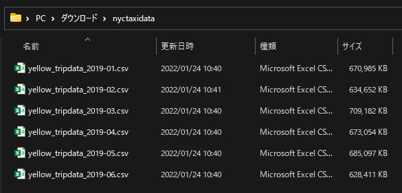

2. Azure リソースのデプロイ

   1. Synapse のデプロイ

      1. 検索  
         

      2. 作成  
         

      3. 基本  
         

      4. セキュリティ  
         

      5. ネットワーク  
         

      6. タグ  
         

      7. レビュー＋作成  
         
   
   2. Synapse Dedicated SQL Pool の作成
   
      1. 作成  

        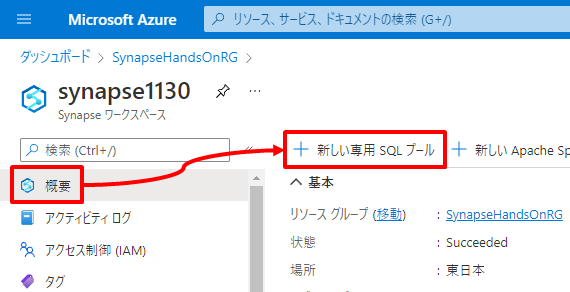

      2. 基本  
        
        ***TODO：後続のPower BIレポートはDB名を即値dedicatedsqlが前提（pbitのパラメータにできる？）***

        | 項目 | 値 |
        | :---- | :---- |
        | 専用 SQL プール名 | 例：dedicatedsql |
        | パフォーマンスレベル | 例：DW100c |

        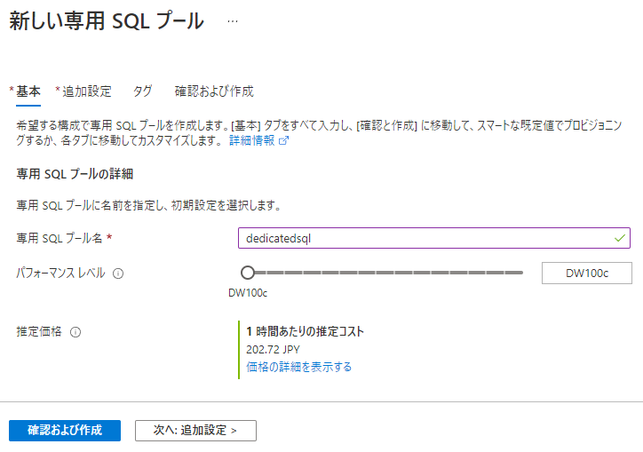

      3. 追加設定
        
        | 項目 | 値 |
        | :---- | :---- |
        | 照合順序 | 例：Japanese_XJIS_100_CS_AS_KS_WS |      

      4. タグ

        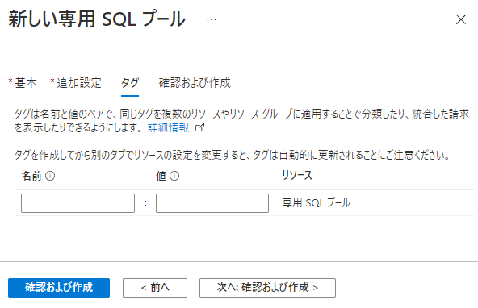

      5. 確認および作成

        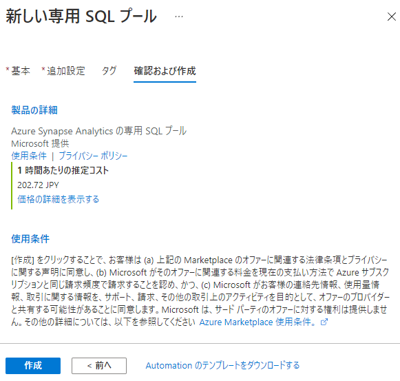

   3. その他のAzureリソースのデプロイ  
      
      1. Deploy to Azure ボタンをクリック  

         

      2. Azure ログイン  

         

      3. パラメータ指定  

         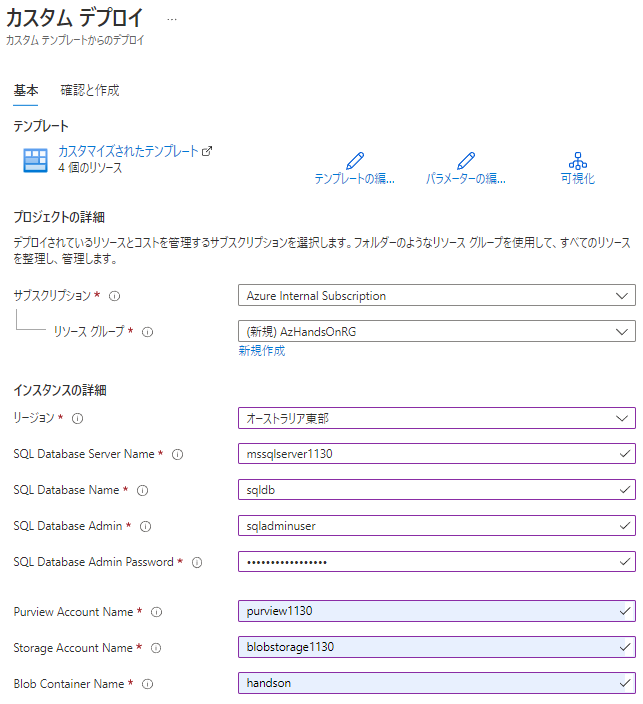

      4. 作成  
      
         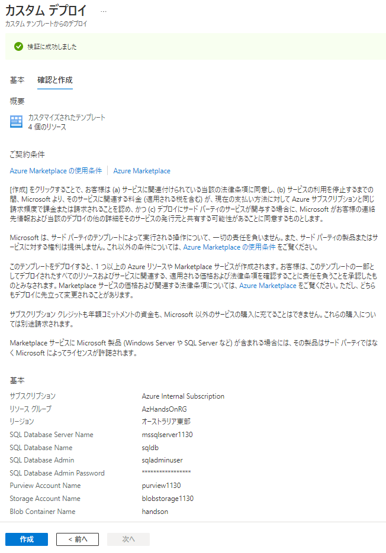   
      
3. Azure リソースの Set Up  

   1. Blob へのデータファイルのアップロード  

      1. Portalのデータエクスプローラーからディレクトリ *source/nyctaxidata* を作成

         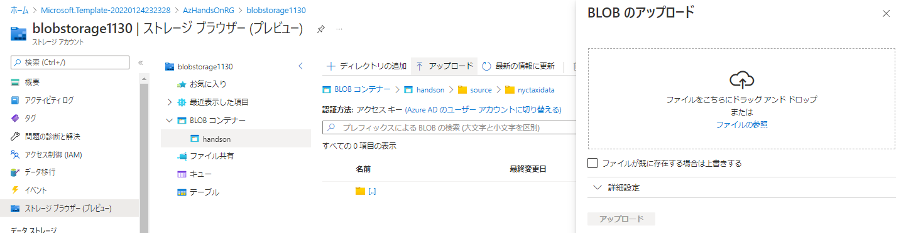

      2. Sample Data 一式をアップロード

         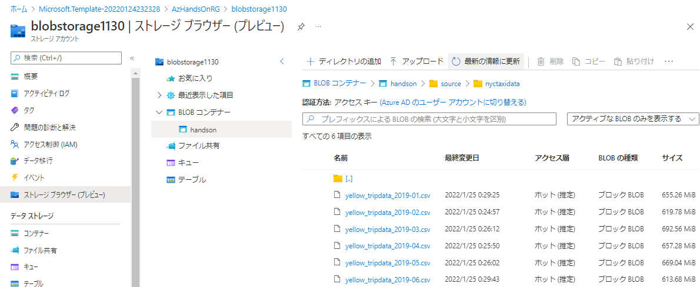

   2. SQLDB のスキーマ定義とデータ投入  

      1. Portal のクエリエディタから SQLDB にログイン  

         

      2. 「クエリを開く」から *resource/script/sqldb.sql* を開き「実行」  

         

   3. Synapse と Purview のリンク  

      1. Synapse Studio 起動  
         
          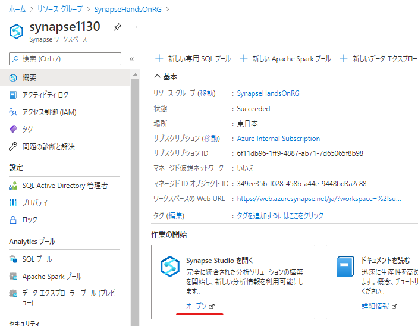

      2.  Purview カウントに接続  

          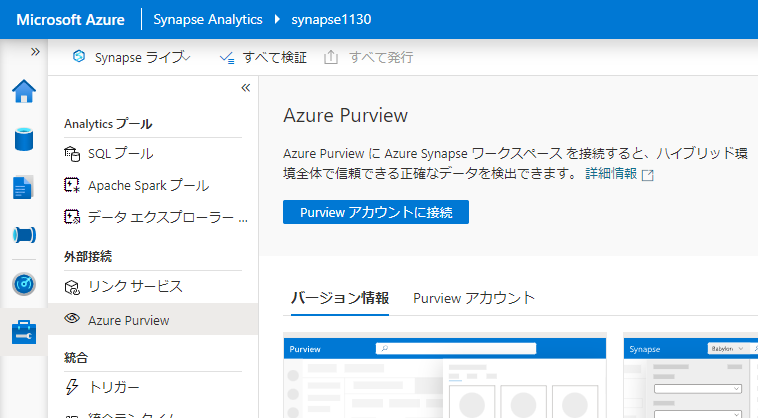

          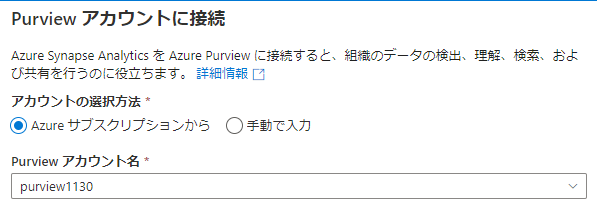

          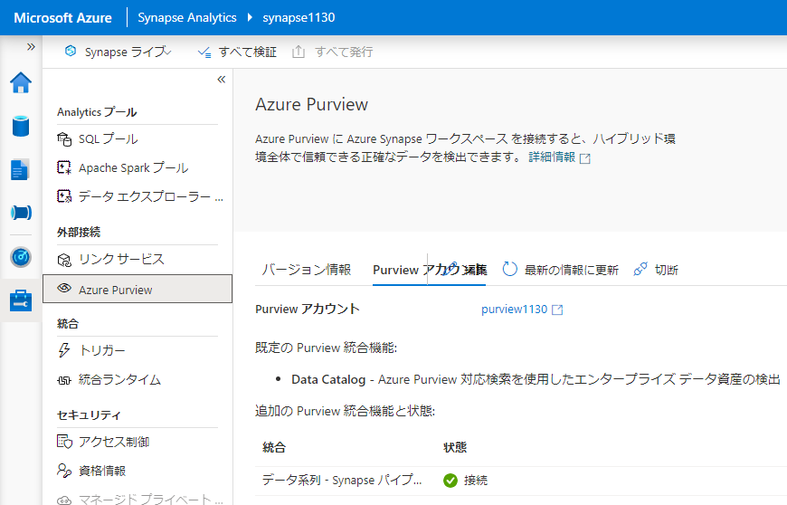

3. Power BI Desktop のインストール  
   
   ***TODO：ダウンロード版とMicrosoft Store版がある（とりあえず 自動アップデートされるMS Store版で解説👇）***  
   ***TODO: 参考：https://bi-seminar.jp/2018/03/07/power-bi-desktop-2way-install/***

   https://powerbi.microsoft.com/ja-jp/downloads/

   

   

