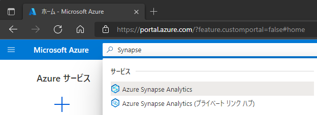
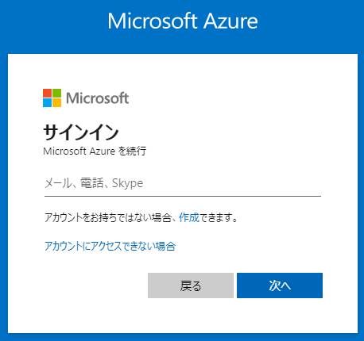

- 流れ
  - Github ダウンロード
  - スキーマ＆データセットアップ
    - Blob：Portalからデータファイル(ディレクトリ構造済み)をアップロード
    - SQLDB：INSERT or ARM deployの中でbacpacインポート（bacpac置き場のBlobが必要）
		
- 5章、6章
  - サービス
    - Synapse
    - SQLDB
    - Blob
  - スキーマ
    - Blob生データディレクトリ　ADPE2E/source/nyctaxidata
    - ADLS生データディレクトリ　ADPE2E/raw/nyctaxidata-raw
    - SQLDB参照データ　TaxiLocationLookup
    - Dedicated参照テーブル　TaxiLocationLookup
    - Dedicated結果テーブル　TaxiDataSummary
  -  生データ
     -  Blob 生データ
     -  SQLDB参照データ

---
## **事前準備**

1. Azure リソースのデプロイ

   1. Synapse のデプロイ

      1. 検索  
         

      2. 作成  
         

      3. 基本  
         

      4. セキュリティ  
         

      5. ネットワーク  
         

      6. タグ  
         

      7. レビュー＋作成  
         
      
   2. その他のAzureリソースのデプロイ  
      
      1. Deploy to Azure ボタンをクリック  

         

      2. Azure ログイン  

         

      3. パラメータ指定  

         

      4. 作成  
      
         

2. Github(***TODO：アドレス***)からリソース一式をダウンロード   
3. Blob
   1. Portalのデータエクスプローラーからディレクトリ *source/nyctaxidata* を作成
   2. ディレクトリにデータファイル一式 *todo* をアップロード
4. SQLDB：INSERT or ARM deployの中でbacpacインポート（bacpac置き場のBlobが必要）
   1. Portalのクエリエディタからクエリ *todo* を実行

