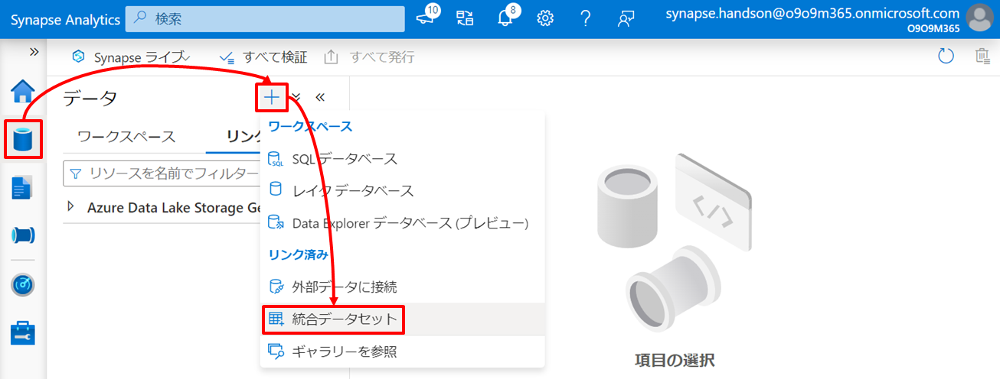
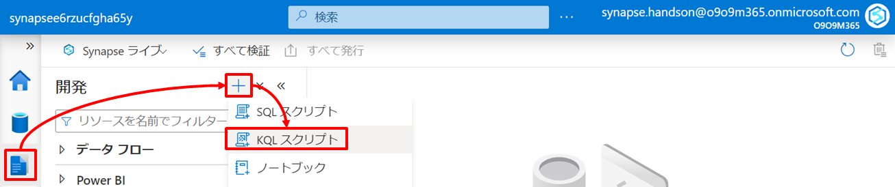
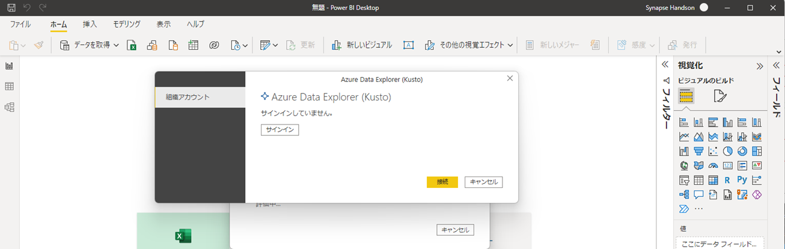

---
# 8. ハンズオン：リアルタイムデータ分析

第8章では第5章～第7章のようなバッチ処理とは異なるリアルタイム処理によるデータ分析を行います。  

## シナリオ

ここでは性質の異なる2種類のデータに対するリアルタイム分析を行います。  
ひとつは「トランザクションデータに対するリアルタイム分析」、もうひとつは「ストリームデータに対するリアルタイム分析」です。  

それぞれのシナリオのアーキテクチャと関連リソースの役割は以下の通りです。矢印はデータの流れを示しています。  
  

### シナリオ１：トランザクションデータに対するリアルタイム分析
シナリオ１はオンラインシステムで生成されるトランザクションデータに対するリアルタイム分析で HTAP（Hybrid Transaction Analytical Processing）と呼ばれるシナリオに対応します。これには Azure Synapse Analytics がもつ Synapse Link 機能を活用します。  

Synapse Link とはクラウドネイティブの HTAP を実現するための機能で OLTP 向けデータストアの背後に OLAP 向けのデータストア（分析ストア）を自動的に作成し、その分析ストアと Azure Synapse Analytics をシームレスに統合することでオンラインのトランザクションデータに対するニアリアルタイムな分析を実現します。  
  

Synapse Link は 本書の執筆時点で Azure Cosmos DB と Microsoft Dataverse に対応しており、今後 Azure SQL Database などへの対応も計画されている機能です。  

このハンズオンではオンライントランザクションデータを格納している Azure Cosmos DB に対して Synapse Link を有効にし Synapse Serverless Spark Pool と Synapse Serverless SQL Pool からアクセスし分析を行います。その分析結果は Azure Cosmos DB に書き出し、すぐにアプリケーションから再利用できるようにします。  

| アイコン | リソース | 役割 |
| :---: | :---- | :---- |
|  | Azure Cosmos DB | このシナリオではオンライントランザクションデータを格納しているデータストアとして位置づけます。またこのトランザクションデータは HTAP のための Synapse Link を有効化しています（第4章での ARM テンプレートによるデプロイ時に有効化しています）。Synapse Link の有効化によりオンライン用途に最適化された Azure Cosmos DB ネイティブのデータ構造を元に、分析用途に最適化されたデータ構造である分析ストアが非同期に自動生成されるようになります。 |
|  | Synapse Serverless Spark Pool | このシナリオでは Synapse Link を有効化した Cosmos DB 内の分析ストアにアクセスし分析処理を行います。また、その分析結果を Azure Cosmos DB へ書き出しオンラインアプリケーションから利用できるようにします。 |
|  | Synapse Serverless SQL Pool | このシナリオでは Synapse Serverless Spark Pool 同様に Synapse Serverless SQL Pool の読み取りアクセスを試してみます（Synapse Serverless SQL Pool は Synapse Serverless Spark Pool と異なり書き込みに対応していません）。 |

https://docs.microsoft.com/ja-jp/azure/synapse-analytics/synapse-link/concept-synapse-link-cosmos-db-support?toc=/azure/cosmos-db/toc.json&bc=/azure/cosmos-db/breadcrumb/toc.json

### シナリオ２：ストリームデータに対するリアルタイム分析  
シナリオ２は IoT デバイスなどから発生するストリームデータに対するリアルタイム分析です。  
このハンズオンでは IoT デバイスから発生するメトリックデータを Azure IoT Hub でとらまえ、Azure IoT Hub に順次到着するストリームデータを Azure Stream Analytics でリアルタイム分析を行い、結果を Power BI Service にプッシュする、いわゆるホットパス分析を行います。さらに Synapse Data Explorer Pool (執筆時点プレビュー) を Azure IoT Hub に接続しウォームパス分析を行い、結果を Power BI Service 上のホットパス分析結果に合流させます。  
なお、IoT デバイスにはオンラインシミュレーターを活用するため、物理的な IoT デバイスを準備することなくハンズオンが可能です。  

| アイコン | リソース | 役割 |
| :---: | :---- | :---- |
|  | Raspberry Pi Azure IoT Online Simulator | このハンズオンでは IoT デバイスとしてオンラインシミュレーター ([Raspberry Pi Azure IoT Online Simulator](https://azure-samples.github.io/raspberry-pi-web-simulator/)) を利用します。この IoT デバイスシミュレーターは温度と湿度を計測し IoT Hub へメトリックを送信します。 |
|  | Azure IoT Hub | IoT デバイスから発生するメトリックデータを受信します。 |
|  | Azure Stream Analytics | リアルタイムなデータ処理（ストリーム処理）を継続的に行うホットパス分析に利用します。</br>Azure Stream Analytics はストリーム処理を行うための Azure サービスのひとつで、ストリーム処理の時間枠を柔軟に制御するためのウィンドウ関数や機械学習を利用するための分析関数などの様々な組み込み関数が提供され、こうしたストリーム処理を SQL 構文を使用して記述する点が特徴です。</br>このハンズオンでは Azure IoT Hub が受信したデバイスからのメトリックを Azure Stream Analytics で継続的にとらまえるとともに、組み込みの機械学習によりメトリックの異常検出を行い、結果を Power BI Service へプッシュします。 |
|  | Synapse Data Explorer Pool | AAzure IoT Hub に順次到着するストリームデータを監視し Synapse Data Explorer Pool が内部にもつデータベース内に取り込みます。取り込んだデータは Power BI Service から Synapse Data Explorer Pool に対して Kusto 言語 による分析を行い可視化します。 |
|  | Power BI Service | Azure Stream Analytics によるホットパスからプッシュされたメトリックと異常検出の結果をダッシュボード上でリアルタイムに可視化します。加えて Synapse Data Explorer Pool によるウォームパスからメトリックの履歴データを参照し同じダッシュボード上に可視化します。 |

---
# **Let's get started**

---
## 7-1. シナリオ１：トランザクションデータに対するリアルタイム分析  

シナリオ１はオンラインシステムで生成されるトランザクションデータに対するリアルタイム分析で HTAP（Hybrid Transaction Analytical Processing）と呼ばれるシナリオに対応します。これには Azure Synapse Analytics がもつ Synapse Link 機能を活用します。  

### 7-1-1. Azure Cosmos DB へのサンプルデータの投入  

ハンズオン用のサンプルデータを JSON ファイルで用意しているのでこれを Azure Cosmos DB へロードしましょう。  
Azure Cosmos DB への JSON ファイルのロードには[移行ツール](https://docs.microsoft.com/ja-jp/azure/cosmos-db/import-data)や SDK などいくつかの手段がありますが、このハンズオンでは Synapse Pipeline を利用してロードします。  

#### 1. Azure Synapse Analytics と Azure Cosmos DB とのリンク  

JSON ファイルのロード先となる Azure Cosmos DB の統合データセットを定義するためにまずはリンクを行います。  
Synapse Studio のメニューを通じリンクサービスの「＋新規」をクリックします。  
  

Azure Cosmos DB (SQL API) を選択し「作成」をクリックします。  
  

必要情報を入力したのち「保存」をクリックします。  

| 項目 | 値 |
| :---- | :---- |
| 名前 | リンク対象の Azure Cosmos DB について Azure Synapse Analytics 内で識別する際の任意の名前を指定します（例：cosmose6rzucfgha65y） |
| 認証方式 | アカウントキー |
| サブスクリプション | ハンズオン用のサブスクリプションを指定します |  
| Azure Cosmos DB アカウント名 | 作成した Azure Cosmos DB を指定します |  
| データベース名 | SalesDB（第4章の Azure Cosmos DB デプロイ時にデータベースも作成済みです） |  

  

#### 2. 統合データセットの定義   

次に Azure Cosmos DB の統合データセットを２つ定義します。  
Synapse Studio メニューを通じ「統合データセット」をクリックします。  
  

データセットの種類として「Azure Cosmos DB (SQLAPI)」を選択します。  
  

データセット定義の情報を入力し「OK」をクリックします。  

| 項目 | 値 |
| :---- | :---- |
| 名前 | Cosmos_SalesDB_Customer |  
| リンクサービス | 作成した Cosmos DB のリンクサービスを指定 |  
| コレクション | Customer |  

  

もうひとつのデータセットについても同様の手順で作成します。  

| 項目 | 値 |
| :---- | :---- |
| 名前 | Cosmos_SalesDB_SalesOrder |  
| リンクサービス | 作成した Cosmos DB のリンクサービスを指定 |  
| コレクション | SalesOrder |  

  

同様にコピー元となる Data Lake Storage について以下の２つの統合データセットを定義します。  
Synapse Studio メニューを通じ「統合データセット」をクリックします。  
  

データセットの種類として「Azure Data Lake Storage Gen2」を選択します。  
  

データセットのファイル種類として「JSON」を選択します。  
  

| 項目 | 値 |
| :---- | :---- |
| 名前 | ADLS_Customer_JSON |  
| リンクサービス | Azure Synapse Analytics のデプロイ時に自動作成される Data Lake Storage へのリンクサービスを指定します |
| ファイルシステム | synapsefs |  
| ディレクトリ | source/SalesDB |  
| ファイル | customer.json |  

  

もうひとつのデータセットについても同様の手順で作成します。  

| 項目 | 値 |
| :---- | :---- |
| 名前 | ADLS_SalesOrder_JSON |  
| リンクサービス | Azure Synapse Analytics のデプロイ時に自動作成される Data Lake Storage へのリンクサービスを指定します |
| ファイルシステム | synapsefs |  
| ディレクトリ | source/SalesDB |  
| ファイル | salesOrder.json |  


#### 3. パイプラインの定義  

次にサンプルデータのロードを行うパイプラインを定義します。  
Synapse Studio メニューを通じ「パイプライン」をクリックします。  
  

パイプラインの名前を入力します。  

| 分類 | 項目 | 値 |
| :---- | :---- | :---- |
| プロパティ | 名前 | Copy_JSON_Into_CosmosDB |

  

次に、サンプルデータのロードを行うためのコピーアクティビティをパイプラインに追加します。  

アクティビティの「移動と変換」から「データのコピー」をドラッグし、右の編集エリアにドロップします。  
  

追加したアクティビティに対して以下の情報を入力します。  

| タブ | 項目 | 値 |
| :---- | :---- | :---- |
| 全般 | 名前 | Copy Customer |
| ソース | ソースデータセット | ADLS_Customer_JSON |
| シンク | シンクデータセット | Cosmos_SalesDB_Customer |

  
  

同様の手順でもうひとつのコピーアクティビティをパイプラインに追加します。  

| タブ | 項目 | 値 |
| :---- | :---- | :---- |
| 全般 | 名前 | Copy SalesOrder |
| ソース | ソースデータセット | ADLS_SalesOrder_JSON |
| シンク | シンクデータセット | Cosmos_SalesDB_SalesOrder |

  

これまでの定義を発行し確定します。「すべて発行」->「発行」の順でボタンをクリックします。  
  
  

#### 4. パイプラインの実行  

作成したパイプラインを実行しデータロードを行います。  
編集エリア上部の「トリガーの追加」から「今すぐトリガー」を選択しパイプラインを実行します。  
  

Synapse Studio メニューを通じパイプラインが「成功」となったことを確認します。  
  

Azure Cosmos DB アカウントの Azure Portal メニューを通じ「データエクスプローラー」でロードされたデータが確認できます。  
  

これで分析のための疑似環境として Azure Cosmos DB の構成が完了です。  

### 7-1-2. Cosmos DB 分析ストアへアクセスしリアルタイム分析を行う

ここからは Azure Cosmos DB の分析ストアへアクセスし分析を行います。  
分析はあらかじめ用意したノートブックを利用します。Synapse Studio メニューを通じ「インポート」をクリックしハンズオンアセット一式内の「resource\script\SynapseLink_CosmosDB.ipynb」をインポートします。  
  

ノートブックが開いたらこのノートブックの実行環境とする Synapse Spark Spark Pool を指定してください。  
  

#### 1. シンプルなデータ探索  

コードセルをひとつずつ実行していきましょう。  

まずはデータのロードです。<Azure Cosmos DB リンクサービス名> に先ほど作成したリンクサービス名を指定したのちにコードセルの左の「横向き三角」をクリックしてください。初回の実行は Spark クラスタを起動するため少し時間を要すためしばらく完了を待ちます。「ジョブの実行」が成功となれば Azure Cosmos DB の分析ストアからの DataFrame へのロードが完了です。   
  

続けて 1-3 までコードセルをひとつずつ実行します。1-2 では DataFrame にロードした Azure Cosmos DB 内のトランザクションデータの簡易クレンジングを行い、1-3 では簡単な集計を行っています。  
  

#### 2. クロスコンテナー結合を活用した分析  

次にクロスコンテナー結合を行ってみます。Azure Cosmos DB 自体が持つトランザクションストアはコンテナーをまたぐ結合がサポートされていませんが、Synapse Link による分析ストアについてはクロスコンテナー結合が可能になります。  

同様に 2-2 までひとつずつコードセルを実行していってください。  

2-1 では SparkSQL による分析に備えて Azure Cosmos DB の分析ストアを参照する外部テーブルを定義します。<Azure Cosmos DB リンクサービス名>に先ほど作成したリンクサービス名（MyCosmos）を指定したのちにコードセルを実行してください。  

2-2 ではクロスコンテナー結合を活用した分析を行っています。ここでは最終的に Customer と SalesOrder を結合し、国ごと都市ごとの顧客数、商品注文数、売上などを集計しています。  
  

#### 3. 分析結果のトランザクションストアへの書き出し  

最後にこの集計結果を再利用するためにトランザクションストアへの書き出しを行います。<Azure Cosmos DB リンクサービス名>に先ほど作成したリンクサービス名（MyCosmos）を指定したのちにコードセルを実行してください。  

コードセルの実行が完了したら Azure Cosmos DB を確認してみましょう。先ほどの集計結果が Sales コンテナーにロードされていることが確認できます。
  

最後のコードセルは環境のクリーンアップです。必要に応じて実行してください。  
  

#### 4. オプション：Synapse Serverless SQL Pool からの Cosmos DB トランザクションストアの参照  

Cosmos DB トランザクションストアは OPENROWSET を利用することで Serverless SQL からも読み取りアクセスすることができます。  

Synapse Studio メニューを通じ「インポート」をクリックしハンズオンアセット一式内の「resource\script\SynapseLink_CosmosDB.sql」をインポートします。  
  

Azure Cosmos DB のキーを以下で確認したのち、SQLスクリプト内の<Azure Cosmos DB キー>と<Azure Cosmos DB アカウント名>を置き換えてください。  

  

```SQL
CREATE CREDENTIAL MyCosmosDbAccountCredential
WITH IDENTITY = 'SHARED ACCESS SIGNATURE', SECRET = '<Azure Cosmos DB キー>'
GO

SELECT Country, City, Total_Customers, Total_Orders, Total_Revenue, Rank_Revenue, *
FROM OPENROWSET(
      PROVIDER = 'CosmosDB',
      CONNECTION = 'Account=<Azure Cosmos DB アカウント名>;Database=SalesDB',
      OBJECT = 'Sales',
      SERVER_CREDENTIAL = 'MyCosmosDbAccountCredential'
    ) AS rows
GO

DROP CREDENTIAL MyCosmosDbAccountCredential
GO
```

クエリを実行すると Azure Cosmos DB の分析ストアが読み込まれます。ここでは例として先の手順で集計結果を書き出した Sales コンテナーに対して読み取りアクセスしています。  
  

以上でシナリオ１のハンズオンが完了です。  
このハンズオンでは Synapse Link 機能を活用し OLTP 向けデータストアの背後に自動作成される OLAP 向けのデータストア（分析ストア）と Azure Synapse Analytics がシームレスに統合されることでオンラインのトランザクションデータに対するニアリアルタイムな分析を構築できることを確認しました。  

---

## 7-2. シナリオ２：ストリームデータに対するリアルタイム分析  

シナリオ２は IoT デバイスなどから発生するストリームデータに対するリアルタイム分析です。  
このハンズオンでは IoT デバイスから発生するメトリックデータを Azure IoT Hub でとらまえ、Azure IoT Hub に順次到着するストリームデータを Azure Stream Analytics でリアルタイム分析を行い、結果を Power BI Service にプッシュする、いわゆるホットパス分析を行います。さらに Synapse Data Explorer Pool (執筆時点プレビュー) を Azure IoT Hub に接続しウォームパス分析を行い、結果を Power BI Service 上のホットパス分析結果に合流させます。  
なお、IoT デバイスにはオンラインシミュレーターを活用するため、物理的な IoT デバイスを準備することなくハンズオンが可能です。  

### 7-2-1. IoT デバイスを準備する  

#### 1. Azure IoT Hub へ IoT デバイスを登録する  

まずはじめに Azure IoT Hub へメトリックを送信してくる IoT デバイス の登録と接続のためのキーを確認します。  

Azure IoT Hub の Portal メニューを通じ「＋デバイスの追加」をクリックします。  
  

デバイスの作成画面で「デバイスID」に任意の名前を入力し、残りは既定値のまま「保存」をクリックします。  
  

「最新の情報に更新」をクリックしたのちデバイスの一覧から登録したデバイスをクリックします。  
  

デバイスの詳細画面で「プライマリ接続文字列」をコピーしてメモしておきます。これは IoT デバイス が IoT Hub に接続するためのキーを含む接続文字列になります。  
  

#### 2. Azure IoT Hub のコンシューマグループを追加する

このハンズオンでは Azure IoT Hub で受信したメトリックを Azure Stream Analytics によるホットパス分析に用いるパスと、Synapse Data Explorer (執筆時点プレビュー) によるウォームパス分析に用いるパスの２系統があるため、これら系統ごとに Azure IoT Hub のコンシューマグループを用意します。  
  

Azure IoT Hub の Azure Portal メニューを通じ、以下の２つのコンシューマグループを登録してください。  

| コンシューマグループ名 | 用途 |
| :---- | :---- |
| hotopath | ホットパス分析用 |
| warmpath | ウォームパス分析用 |

  

#### 3. IoT デバイス を準備し起動する

このハンズオンでは IoT デバイスとしてオンラインシミュレーター ([Raspberry Pi Azure IoT Online Simulator](https://azure-samples.github.io/raspberry-pi-web-simulator/)) を利用します。  
  

オンラインシミュレーターのサイトにアクセスし 15行目のコード内の「[Your IoT hub device connection string]」を先ほどメモした「プライマリ接続文字列」で置き換えます。  

```JavaScript
//const connectionString = '[Your IoT hub device connection string]';
const connectionString = 'HostName=<Azure IoT Hub 名>.azure-devices.net;DeviceId=<デバイス名>;SharedAccessKey=xxxxxxxxxxxxxxxxxx';
```

次に getMessage 関数をカスタマイズします。27行目 と 28行目 の間に下記のコードを追加してください。これは IoT デバイス側からデータを観測した時間を記録するものです。  

```JavaScript
creationUtcTime: new Date().toISOString(),
```

カスタマイズ後の getMessage 関数は下記の通りです。  

```JavaScript
function getMessage(cb) {
  messageId++;
  sensor.readSensorData()
    .then(function (data) {
      cb(JSON.stringify({
        creationUtcTime: new Date().toISOString(),  //この一行を追加します
        messageId: messageId,
        deviceId: 'Raspberry Pi Web Client',
        temperature: data.temperature_C,
        humidity: data.humidity
      }), data.temperature_C > 30);
    })
    .catch(function (err) {
      console.error('Failed to read out sensor data: ' + err);
    });
}
```

コードの編集が完了したのち「Run」をクリックし IoT デバイスを起動します。  
  

これにより IoT デバイス から Azure IoT Hub へのメトリック送信が開始されます。  

### 7-2-2. ホットパス分析を行う

それではホットパス分析を行いましょう。ホットパス分析はストリームデータに対するリアルタイムなデータ処理（ストリーム処理）を継続的に行うパスです。  

このハンズオンでは Azure Stream Analytics をストリーム処理に利用します。Azure Stream Analytics はストリーム処理を行うための Azure サービスのひとつで、ストリーム処理の時間枠を柔軟に制御するためのウィンドウ関数や機械学習を利用するための分析関数などの様々な組み込み関数が提供され、こうしたストリーム処理を SQL 構文を使用して記述する点が特徴です。  

今回は Azure IoT Hub が受信したデバイスからのメトリックを Azure Stream Analytics で継続的にとらまえるとともに、組み込みの機械学習によりメトリックの異常検出を行い、結果を Power BI Service へプッシュします。Power BI Service ではプッシュされたメトリックと異常検出の結果をダッシュボード上でリアルタイムに可視化します。  

本書での詳細解説は割愛しますが、Azure Stream Analytics では「入力元」と「出力先」そしてそれらをつなぐストリーム分析の「ジョブ」で構成されます。  

***TODO：ASA統合の一般公開済みロードマップを紹介する？（Synpapseの先行きが不透明すぎるので伏せる？）***
　https://www.youtube.com/watch?v=sDOUu_LlliU

#### 1. Azure Stream Analytics 入力元の定義  

はじめに「入力元」の定義です。このハンズオンでは IoT デバイスからのメトリクスを受信する Azure IoT Hub が入力となります。  
Azure Stream Analytics の Azure Portal メニューを通じ「IoT Hub」を選択します。  
  

新規入力ブレードで必要情報を入力したのち「保存」をクリックします。  

| 項目 | 値 |
| :---- | :---- |
| 入力のエイリアス | 任意の名前を指定します（例：iothube6rzucfgha65y） |
| サブスクリプション | ハンズオン用のサブスクリプションを指定します |  
| IoT Hub | ハンズオンの準備でデプロイした IoT Hub を指定します |  
| コンシューマーグループ | 前の手順で作成した IoT Hub の ホットパス用のコンシューマーグループを指定します（例：hotpath） |  
| 共有アクセスポリシー名 | iothubowner |  

  

#### 2. Azure Stream Analytics 出力先の定義  

次に「出力先」の定義です。このハンズオンではストリーム処理の結果を Power BI Service へプッシュします。  
Azure Stream Analytics の Azure Portal メニューを通じ「Power BI」を選択します。  
  

新規出力ブレードで必要情報を入力したのち「承認」をクリックし Power BI Service へサインインを行います。  

| 項目 | 値 |
| :---- | :---- |
| 出力エイリアス | 任意の名前を指定します（例：pbihandsonworkspace） |
| グループワークスペース | Power BI Service ワークスペースを指定します（ワークスペースが存在しない場合は第5章を参考に新規作成してください） |  
| 認証モード | ユーザートークン |
| データセット名 | 任意の名前を指定します（例：IoTPushDataset） |  
| テーブル名 | 任意の名前を指定します（例：IoTSignals） |  

   

Power BI Service へのサインインを行ったのち「保存」をクリックします。  
  

#### 3. Azure Stream Analytics ジョブを定義  

最後に「入力元」と「出力先」をつなぐパイプラインとなるストリーム分析の「ジョブ」を SQL 構文で定義します。  
Azure Stream Analytics の Azure Portal メニューを通じ「クエリ」を選択し、既存の SQL クエリを以下の SQL クエリで上書きしたのち「クエリの保存」をクリックします。  

```SQL
WITH SmootheningStep AS
(
    SELECT
        deviceId , 
        System.Timestamp() as time ,
        AVG(CAST(temperature as float)) as temperature ,        
        AVG(CAST(humidity as float)) as humidity
    -- Azure IoT Hub からメトリックを取得します。
    FROM <入力エイリアス名（例：iothube6rzucfgha65y）>
    -- メトリックはウィンドウ関数を利用し2秒ごと過去10秒の平均値に変換します。
    GROUP BY deviceId, HOPPINGWINDOW(second, 10, 2)
),
AnomalyDetectionStep AS
(
    SELECT
        time ,
        temperature ,
        -- 分析関数を利用し組み込みの機械学習による異常検出を行います。
        AnomalyDetection_SpikeAndDip(temperature, 95, 120, 'spikesanddips')
            OVER(PARTITION BY deviceId LIMIT DURATION(second, 120)) AS sad_temperature ,
        humidity ,
        AnomalyDetection_SpikeAndDip(humidity, 95, 120, 'spikesanddips')
            OVER(PARTITION BY deviceId LIMIT DURATION(second, 120)) AS sad_humidity
    FROM SmootheningStep
)
SELECT
    time ,
    temperature ,
    -- 異常検出スコア
    CAST(GetRecordPropertyValue(sad_temperature, 'Score') AS float) AS sad_score_temperature ,
    -- 異常の有無
    CAST(GetRecordPropertyValue(sad_temperature, 'IsAnomaly') AS bigint) AS sad_isanomaly_temperature ,
    humidity ,
    CAST(GetRecordPropertyValue(sad_humidity, 'Score') AS float) AS sad_score_humidity ,
    CAST(GetRecordPropertyValue(sad_humidity, 'IsAnomaly') AS bigint) AS sad_isanomaly_humidity
-- 取得したメトリックと異常検出結果を Power BI Service へプッシュします。
INTO <出力エイリアス名（例：pbihandsonworkspace）>
FROM AnomalyDetectionStep
```

  

「クエリのテスト」をクリックし、temperature や humidity のデータが IoT デバイスから受信できていることを確認できます。  
  

このクエリジョブは Azure IoT Hub で受信したメトリクスを継続的にとらまえるとともに、組み込みの機械学習によりメトリックの異常検出を行い、その結果を Power BI Service へ継続的にプッシュします。  

#### 5. ストリーム分析ジョブの開始  

一連の準備が整ったのでここでストリーム分析ジョブを開始させましょう。  
クエリジョブに問題がなさそうであれば Azure Stream Analytics の Azure Portal のメニューを通じ「開始」をクリックしストリーム分析ジョブを起動します。  
  

これにより Azure IoT Hub で受信したメトリクスへの異常検出と Power BI Service への結果のプッシュが開始されます。  

#### 6. Power BI Service ダッシュボードを作成  

Azure Stream Analytics から継続的にプッシュされるデータをダッシュボードで可視化しましょう。  
Power BI Service にサインインします。  
https://powerbi.microsoft.com/ja-jp/   

Power BI Service のメニューを通じ Azure Stream Analytics の出力先として指定したワークスペースを選択します。  
  

ワークスペースのリソースの一覧で  Azure Stream Analytics の出力先として指定したストリームデータセットが作成されていることが確認できます。  
  

Power BI Service のメニューを通じ「＋新規」->「ダッシュボード」を選択し、任意のダッシュボード名（例：IoTSignalsDashBoard）を入力します。  
  

ダッシュボード編集画面が開くので「編集」->「＋タイルの追加」を選択します。  
  

ソースとして「カスタムストリーミングデータ」を選択し「次へ」をクリックします。  
    

作成されたデータセットを選択し「次へ」をクリックします。  
  

以下の通り視覚化の設定を行った後「適用」をクリックします。  

##### 温度推移グラフ  

| 項目 | 値 |
| :---- | :---- |
| 視覚化タイプ | 折れ線グラフ |
| 軸 | time |  
| 値 | temperature |  
| 表示する時間枠 | 1分 |  
| タイトル | 温度推移 |  

  
  

「温度推移」グラフと同様の手順でいくつかのグラフを追加してください。  

##### 温度カード  

| 項目 | 値 |
| :---- | :---- |
| 視覚化タイプ | カード |
| フィールド | temperature |  
| タイトル | 温度 |  

##### 温度異常グラフ  

| 項目 | 値 |
| :---- | :---- |
| 視覚化タイプ | 集合縦棒グラフ |
| 軸 | time |  
| 値 | sap_isanomaly_temperature |  
| 表示する時間枠 | 1分 |  
| タイトル | 温度異常 |  

##### 湿度推移グラフ

| 項目 | 値 |
| :---- | :---- |
| 視覚化タイプ | 折れ線グラフ |
| 軸 | time |  
| 値 | humidity |  
| 表示する時間枠 | 1分 |  
| タイトル | 湿度推移 |  

##### 湿度カード  

| 項目 | 値 |
| :---- | :---- |
| 視覚化タイプ | カード |
| フィールド | humidity |  
| タイトル | 湿度 |  

##### 湿度異常グラフ

| 項目 | 値 |
| :---- | :---- |
| 視覚化タイプ | 集合縦棒グラフ |
| 軸 | time |  
| 値 | sap_isanomaly_humidity |  
| 表示する時間枠 | 1分 |  
| タイトル | 湿度異常 |  

最後に以下のイメージを参考にダッシュボードレイアウトを調整します。  
  

例えば異常検出すると以下のように異常が表現されます。  


***TODO:アラート飛ばしたり***
https://docs.microsoft.com/ja-jp/azure/stream-analytics/stream-analytics-threshold-based-rules

なお異常検出の感度は Azure Stream Analytics ジョブを定義であるクエリ内のウィンドウ関数や異常検出関数（AnomalyDetection_SpikeAndDip）のパラメータで調整します。  

簡易的に異常をシミュレーションしたい場合はオンライン シミュレーターを一度停止し getMessage 関数内の31行目の温度や32行目の湿度に異常値を入れたのちに再開してみてください。

```JavaScript
function getMessage(cb) {
  //省略
        temperature: 75, //温度異常値
        humidity: 40    //湿度異常値
  //省略
)
```

Azure Stream Analytics で分析された結果が Power BI Service のダッシュボード上にリアルタイムに表示されることが確認できました。  
以上でホットパス分析のハンズオンが完了です。必要に応じてシミュレータとストリーム分析ジョブを停止してください。  

  
  

#### 7. オプション：コールドパス分析向けデータエクスポート  

最後に後々のコールドパス分析用にストリームデータをストレージにエクスポートする手順を試しておきましょう。  
ウィンドウ処理が不要なストリーム処理の場合は Azure Functions の Azure IoT Hub トリガー を利用してイベントドリブン処理を行うこともできますが、今回は Azure Stream Analytics を利用し Data Lake Storage へのエクスポートを行います。  
https://docs.microsoft.com/ja-jp/azure/azure-functions/functions-bindings-event-iot-trigger?tabs=in-process%2Cfunctionsv2%2Cextensionv5&pivots=programming-language-csharp

このハンズオンでは Azure Stream Analytics から Data Lake Storage への認証に マネージド ID を利用するものとし、まずはAzure Stream Analytics の マネージド ID に対して Data Lake Storage の「ストレージ BLOB データ共同作成者ロール」を付与します。  

Data Lake Storage の Azure Portal メニューを通じ「ロールの割り当ての追加」画面に遷移します。  
  

「ストレージ BLOB データ共同作成者ロール」を選択し「次へ」をクリックします。  
  

「マネージド ID」を選択し「＋メンバーを選択する」をクリックします。  
サブスクリプションを指定したのち、マネージド ID のドロップダウンリストから「Stream Analytics ジョブ」を選択し、ハンズオンで利用している Azure Stream Analytics を指定し「選択」->「レビュと割り当て」の順にクリックします。  
  

次に Azure Stream Analytics の Azure Portal メニューを通じ「Blob Storage または ADLS Gen2」を選択します。  
  

新規出力ブレードで必要情報を入力したのち「保存」をクリックします。  

| 項目 | 値 |
| :---- | :---- |
| 出力エイリアス | 任意の名前を指定します（例：adlse6rzucfgha65y ） |
| サブスクリプション | ハンズオン用のサブスクリプションを指定します |  
| ストレージアカウント | 作成した Data Lake Storage を指定します |  
| コンテナー | 新規作成 |  
| コンテナー名  | 任意の名前を指定します（例：iotdevices） |  
| 認証モード  | システム割当マネージド ID の作成 |  
| パスパターン  | metric/json/{date}/{time} |  

  

Azure Stream Analytics の Azure Portal メニューを通じ「クエリ」を選択し、以下の SQL クエリをホットパス分析用のクエリの後ろに張り付けたのち クエリの保存 をクリックします。  

```SQL
-- コールドパス分析用に Data Lake Storage へエクスポート
SELECT
    -- すべてのデータをエクスポート
    *
INTO
    -- Azure Data Lake Storage へエクスポート
    adlse6rzucfgha65y
FROM
    -- Azure IoT Hub からインポート
    iothube6rzucfgha65y
```  


IoT デバイス と ストリーム分析ジョブ をそれぞれ再開させます。  
  
  

しばらくすると指定したストレージにデータが順次エクスポートされていきます。  
  

ストレージにエクスポートされたデータを例えば Synapse Serverless SQL Pool から探索してみましょう。  
Synapse Studio のメニューを通じ SQL スクリプトエディタを起動し以下のクエリを張り付けます。  
  

```SQL
SELECT
    JSON_VALUE (jsonContent, '$.creationUtcTime') AS creationUtcTime
    , JSON_VALUE (jsonContent, '$.temperature') AS temperature
    , JSON_VALUE (jsonContent, '$.humidity') AS humidity
FROM
    OPENROWSET(
        BULK 'https://<Storage アカウント名>.dfs.core.windows.net/<コンテナー名>/metric/json/*/*/*/*/*.json',
        FORMAT = 'CSV',
        FIELDQUOTE = '0x0b',
        FIELDTERMINATOR ='0x0b'
    )
    WITH (
        jsonContent varchar(MAX)
    ) AS result
/*
WHERE
    result.filepath(1) = 2022
    AND result.filepath(2) = 05
    AND result.filepath(3) <= 13
*/
ORDER BY
    creationUtcTime ASC
```  

<Storage アカウント名>と<コンテナー名>を編集したのち実行します。 

  

このように Azure Synapse Analytics であればコールドパス分析も即座に開始することができます。  

必要に応じてシミュレータとストリーム分析ジョブを停止してください。  
  
  

### 7-2-3. ウォームパス分析を行う  

ストリーム処理によるホットパス分析はデータの受信と同時に即座な分析が可能ですが、言い換えると過ぎ去った時間での遡及処理を行うことはありません。  
一方でデータの送受信の経路上には様々なソフトウェア、デバイス、ネットワークなどが存在するため、なんらかの要因によりデータの受信に遅延が発生することは起こりえます。  

これはストリーム処理の結果は根本的に不正確になりうることを示しており、これを解決する必要があるケースではコールドパスやウォームパスを構成することによってホットパス分析による暫定結果に対する確定結果として後から補正することができます。  

コールドパスについてはこれまでのハンズオンで扱ったので、このハンズオンでは Synapse Data Explorer Pool（執筆時点でプレビュー） を利用するウォームパスを構成してみたいと思います。Azure IoT Hub が受信したデバイスからのメトリックを Synapse Data Explorer Pool へ継続的に取り込み、ダイレクトクエリとして構成した Power BI レポートからオンデマンドに Synapse Data Explorer Pool へアクセスし継続的に取り込まれた過去データを履歴として可視化します。  

このハンズオンの大きな流れは、まず Synapse Data Explorer Pool の作成します。次にデータの取り込み先となるデータベースとテーブルの定義に加え 取込データのスキーマと取込先テーブルのスキーマとのマッピング定義を行います。そののち Azure IoT Hub と Synapse Data Explorer Pool との接続設定を構成し断続的な取り込みを開始します。最後に取り込まれたデータを Power BI レポートで可視化するという流れです。  

***TODO；この粒度で前振りするとわかりやすいのでほかのパートも補強する***

#### 1. Synapse Data Explorer Pool の起動  

Data Explorer プール（プレビュー）の Azure Portal メニューを通じ「開始」をクリックします。
  

状態が「Running」となるのをしばらく待ちます。  
  

#### 2. Synapse Data Explorer Pool データベースの定義  

データの取り込み先となるデータベースを Synapse Data Explorer Pool で定義します。  
Data Explorer Pool（プレビュー）の Azure Portal メニューを通じ「＋データベースの追加」をクリックします。  
  

データベース名に任意の名前（例：kustodb）を入力し「作成」をクリックします。  
  

#### 3. Synapse Data Explorer Pool テーブルの定義  

続けてテーブルを定義します。  
Synapse Studio のメニューを通じ「KQL スクリプト」をクリックし KQL スクリプトエディタを起動します。    
   

KQL スクリプトエディタ上に下記コードを張り付け、「次に接続」にデプロイした Synapse Data Explorer Pool を、「データベースの使用」に「kustodb」を指定したのち「実行」クリックします。  

```KQL
.create table IoTSignals (enqueued_utc_time: datetime, creationUtcTime: datetime, messageId: string, deviceId: string, temperature: real, humidity: real)
```  

    

このスクリプト実行により「IoTSignals」テーブルが作成されます。

#### 4. Synapse Data Explorer Pool スキーママッピングの定義  

取込データのスキーマと取込先テーブルのスキーマとのマッピング定義を行います。  
同様にKQL スクリプトエディタを開き下記コードを張り付けて実行します。  

```KQL
.create table IoTSignals ingestion json mapping "IoTSignalsMapping"
'['
'   { "column" : "enqueued_utc_time", "DataType":"datetime", "Properties":{"path":"$.iothub-enqueuedtime"}},'
'   { "column" : "creationUtcTime", "DataType":"datetime", "Properties":{"path":"$.creationUtcTime"}},'
'   { "column" : "messageId", "DataType":"string", "Properties":{"path":"$.messageId"}},'
'   { "column" : "deviceId", "DataType":"string", "Properties":{"path":"$.deviceId"}},'
'   { "column" : "temperature", "DataType":"real", "Properties":{"path":"$.temperature"}},'
'   { "column" : "humidity", "DataType":"real", "Properties":{"path":"$.humidity"}}'
']'
```  

  

#### 5. Azure IoT Hub への接続と Synapse Data Explorer Pool への取り込みの開始  

Azure IoT Hub へ Synapse Data Explorer Pool を接続することでメトリックの取り込みを開始します。  

まず Data Explorer プール（プレビュー）の Azure Portal メニューを通じ作成したデータベースをクリックします。  
  

次に Data Explorer データベースの Azure Portal メニューを通じ「データ接続」から「IoT Hub」を選択します。  
  

IoT Hub 接続設定で必要情報を入力し「作成」をクリックします。  

| 項目 | 値 |
| :---- | :---- |
| データ接続名 | 任意の名前を指定します（例：iothube6rzucfgha65y） |
| サブスクリプション | ハンズオン用のサブスクリプションを指定します |  
| IoT Hub | ハンズオンの準備でデプロイした IoT Hub を指定します |  
| 共有アクセスポリシー | iothubowner |  
| コンシューマーグループ  | 前の手順で作成した IoT Hub のウォームパス用のコンシューマーグループを指定します（例：warmpath） |  
| イベントシステムのプロパティ | iothub-enqueuedtime |  
| テーブル名  | IoTSignals |  
| データ形式  | JSON |  
| マッピング名  | IoTSignalsMapping |  

  

#### 6.  IoT デバイスの起動  

オンライン シミュレーターに戻り再開させます。  
  

これにより IoT デバイス から Azure IoT Hub へのメトリック送信が開始されます。  

#### 7. Kusto クエリによるアドホック探索  

しばらく待ち Synapse Data Explorer Pool のテーブルにメトリックが取り込まれ始めたら、Kusto クエリでデータを探索してみましょう。  
Synapse Studio メニューを通じ「1000行を取得する」をクリックし起動した KQL スクリプトエディタを実行します。  
  
  

以下のように設定することで簡易的なグラフ表示も可能です。  
  

Kusto クエリを少し編集し現時刻から過去１時間分のデータをデバイス上でメトリックが生成された時刻順に並べ替えてみましょう。  

```KQL
IoTSignals
| extend creationJstTime = replace_string(tostring(creationUtcTime + 32400s), 'Z', '+9:00')
| project creationJstTime, creationUtcTime, temperature, humidity
| where creationUtcTime > ago(1h)
| sort by creationUtcTime asc
```  

    

※ Synapse Data Explorer Pool の datetime 型のタイムゾーンは UTC 固定であるため replace_string(tostring(creationUtcTime + 32400s), 'Z', '+9:00') によって JST 表記の文字列を取得しています。  

#### 8. Power BI レポートによるメトリックの可視化  

Synapse Data Explorer Pool に取り込まれたメトリックを Power BI レポートで可視化しましょう。   
本ハンズオンでは Power BI Desktop によるレポートの作成自体の解説は割愛し、準備済みのレポートを利用します。  

はじめに Data Explorer プール（プレビュー）の Azure Portal メニューを通じ「URI」で示される Synapse Data Explorer Pool へのエンドポイントをメモしてください。   
  

次に Power BI Desktop を起動します。  
ハンズオンアセット一式内の「resource/report/IoTSignals Report.pbit」を開き、ダイアログで必要情報を入力したのち「読み込み」ボタンを押下します。  

| 項目 | 値 |
| :---- | :---- |
| AzureSynapseAnalyticsDataExplorerPoolEndpoint | Synapse Data Explorer Pool へのエンドポイントを指定します |
| DataExplorerPoolDatabaseName | Synapse Data Explorer Pool に作成したデータベース名を指定します（例：kustodb） |  

  

認証情報が求めらるたら認証を行ったのち「接続」ボタンを押下します。  
  

するとメトリックデータが可視化された作成済みのレポートが開きます。  
  

#### 9. Power BI Service によるレポートの共有とダッシュボードへのピン留め  

このレポートを Power BI Service に発行し組織内に共有しましょう。  
まずはこの Power BI ファイルを保存してください。保存時に指定するファイル名は Power BI Service 上のレポート名やデータセット名となります。  

ファイルを保存したのち、Power BI Desktop メニューから「発行」をクリックします。  
  

Power BI Service ワークスペースを指定します（ワークスペースが存在しない場合は第5章を参考に新規作成してください）  
  

発行が完了したのち Power BI Service にサインインします（※ Power BI Service のサインアップには組織アカウントが必要です）。  
https://powerbi.microsoft.com/ja-jp/   

Power BI Service メニューを通じ作成したワークスペースを選択します。  
  

ワークスペースのコンテンツ一覧から先ほど発行したレポート（例：IoTSignals Report）に紐づくデータセットの「設定」を開きます。  
  

データセットの設定画面の「資格情報を編集」をクリックします。  
  

せつめい

https://docs.microsoft.com/en-us/power-bi/connect-data/service-azure-sql-database-with-direct-connect#single-sign-on
***TODO：あとで更新***

ワークスペースのコンテンツ一覧から先ほど発行したレポートを開きます。  
  
  

このレポートを先ほどのホットパス分析で作成したダッシュボードに追加しましょう。  
グラフの右上のピンをクリックしたのち、ホットパス分析で作成したダッシュボードを指定し「ピン留め」ボタンを押下します。  
  
  

ワークスペースのコンテンツ一覧からダッシュボードを開きます。  
  

するとホットパス分析で作成したダッシュボード内にウォームパス分析で作成したレポートがピン留めされています。以下を参考にダッシュボードのレイアウトを整えてください。  
  

このようにネットワークの瞬断など何らかの一過性障害の影響を受けやすいホットパスに対してウォームパスを繋ぐことでホットパス分析による暫定結果をウォームパス分析で補正することができるようになります。  

これでウォームパス分析のハンズオンが完了です。  

必要に応じてシミュレータ、Azure Stream Analytics ジョブ、Synapse Data Explorer Pool を停止してください。  
  
  
  

以上でシナリオ２のハンズオンが完了です。

# まとめ

いかがでしたでしょうか。  
第8章では性質の異なる2種類のデータに対するリアルタイム分析を行いました。  
ひとつは「トランザクションデータに対するリアルタイム分析」です。このハンズオンでは Synapse Link 機能を活用し OLTP 向けデータストアの背後に自動作成される OLAP 向けのデータストア（分析ストア）と Azure Synapse Analytics がシームレスに統合されることでオンラインのトランザクションデータに対するニアリアルタイムな分析を構成できることを確認しました。  
もうひとつは「ストリームデータに対するリアルタイム分析」です。このハンズオンでは Azure Stream Analytics を利用したホットパスによる即時性の高い分析を行いました。加えて Synapse Data Explorer Pool を利用したウォームパスを構成しました。これによりネットワークの瞬断など何らかの一過性障害の影響を受けやすいホットパスによる暫定結果をウォームパスで補正することのできるアーキテクチャを構成しました。

以上ですべてのハンズオンが完了です。ここまでお付き合いいただいた皆様おつかれさまでした！
