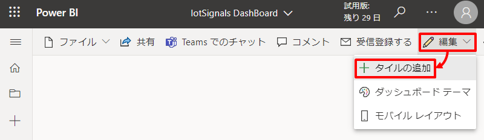
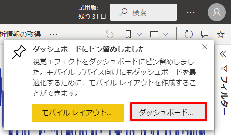

---

# 8. ハンズオン：リアルタイムデータ分析

本章では第5章～第7章のようなバッチ処理とは異なるリアルタイム処理によるデータ分析を行います。

## シナリオ

ここでは2つのシナリオに触れていきます。  

### トランザクションデータに対するリアルタイム分析
ひとつはオンラインシステムで生成されるトランザクションデータに対する分析で HTAP と呼ばれるシナリオに対応します。これには Synapse がもつ Synapse Link 機能を活用します。Synapse Link は 執筆時点で Cosmos DB と Dataverse に対応しており、今後 SQL Server などへの対応も計画されている機能です。今回は Azure Cosmos DB 内のオンライントランザクションデータを対象に分析を行います。  

### ストリームデータに対するリアルタイム分析
もうひとつは IoTデバイスなどから発生するストリームデータに対する分析です。これには Azure Stream Analytics (ASA) によるホットパス分析とコールドパス分析向けの Synapse へのエクスポートに加えて、Synapse Data Explorer (執筆時点プレビュ) によるウォームパス分析を行います。

## アーキテクチャと各サービスの解説

  

### トランザクションデータに対するリアルタイム分析  
オンライントランザクションデータを格納している Cosmos DB に対して Synapse Link を有効にし Synapse Spark と Synapse Serverless からアクセスし分析を行います。その分析結果は Cosmos DB に書き戻しすぐにアプリケーションから再利用できるようにします。  

#### Cosmos DB  
オンライントランザクションデータを格納しているデータストアとして位置づけます。このトランザクションデータは HTAP 分析用要件があるため Synapse Link を有効化します。Synapse Link の有効化により オンライン用途に最適化された Cosmos DB ネイティブのデータ構造を元にして、分析用途に最適化されたデータ構造である分析ストアが非同期に自動生成されるようになります。  

#### Synapse Spark  
Synapse Link を有効化した Cosmos DB 内の分析ストアにアクセスし分析処理を行い、その分析結果を Cosmos DB へ書き戻します。  

#### Synapse Serverless  
Synapse Spark 同様に Synapse Serverless からも読み込みアクセスを行います。Serverless については Spark と異なり書き込みには対応していません。  

### ストリームデータに対するリアルタイム分析
デバイスから発生するメトリックデータを IoT Hub でとらまえ、IoT Hub に順次到着するストリームデータを Stream Analytics でホットパス分析を行い、結果を Power BI Service にプッシュするとともに、コールドパス分析向けに生のメトリックデータを Data Lake へエクスポートさせます。加えて、Synapse Data Explorer (執筆時点プレビュ) を IoT Hub に接続しウォームパス分析を行い Power BI にてホットパス分析結果に合流させます。

#### IoT Hub  
デバイスから発生するメトリックデータをとらまえます。

#### Stream Analytics  
IoT Hub に順次到着するストリームデータに対して SQL ライクな言語によるホットパス分析を行い、結果を Power BI Service のプッシュデータストアへ送信します。また生のメトリックデータをコールドパス分析向けに Data Lake へエクスポートします。

#### Synapse Data Explorer  
Synapse Data Explorerが内部にもつデータベース内に IoT Hub に順次到着するストリームデータを取り込みます。取り込んだデータは Power BI Service から Synapse Data Explorer に対して Kusto 言語 による分析を行い可視化させます。

#### Power BI Service  
Stream Analytics を介したホットパスから届くリアルタイムデータと Synapse Data Explorer を介したウォームパスから届くニアリアルタイムデータをダッシュボード上で可視化します。

# ***※. Key Message***
- Synapse Link による トランザクションデータに対するニアリアルタイム分析（HTAP）への対応
- ストリームデータに対するリアルタイム分析（SDXウォームパス、ASAホットパス）への対応
  - (Gated Previewだけど SELECT INTO Synapse FROM Stream への対応計画あり)


---
# **Let's get started**

---
#### トランザクションデータに対するリアルタイム分析

## 7a-1. ハンズオン環境を準備する  
オンライントランザクションデータの発生源として Cosmos DB をデプロイし、データベースおよびSynapse Linkを有効化したコンテナ（分析ストア）を作成したのち、ハンズオン用のデータを投入します。データの投入には Pipeline を利用し JSONファイル を コンテナに取り組みます。

### 7a-1-1. Cosmos DB のデプロイと Synapse Link を有効化したコンテナ（分析ストア）の作成

[](https://portal.azure.com/#create/Microsoft.Template/uri/https%3A%2F%2Fraw.githubusercontent.com%2Fgho9o9%2FSynapseHandsOn%2Fmain%2Fresource%2Fdeploy%2Fazuredeploy_cosmos.json)

### 7a-1-2. Synapse Pipeline によるデータの投入  

今回は json ファイルデータを用意しているのでこれを Cosmos DB にロードすることでCosmos DB 内のトランザクションデータを準備します。

json ファイルのロードには[移行ツール](https://docs.microsoft.com/ja-jp/azure/cosmos-db/import-data)や SDK などいくつかの手段がありますが、このハンズオンでは Synapse Pipeline を利用してロードしてみようと思います。

はじめに json ファイルを Data Lake にアップロードすることから始めましょう。  
Portalのデータエクスプローラーからディレクトリ *source/SalesDB* を作成し、そこへ *resource\data\lab-8\SalesDB* 配下の json ファイルをアップロードします。

  

次に json ファイルを Cosmos DB へコピーするためのパイプラインの作成を行っていきます。  

まずは Synapse Workspace に Cosmos DB をリンクすることから始めましょう。  
Synapse Studio のメニュを辿り *＋新規* をクリックします。  
  

Azure Cosmos DB (SQL API) を選択し「作成」ボタンを押下します。  
  

新しいリンクサービスブレードで必要情報を入力したのち「保存」ボタンを押下します。  

| 項目 | 値 |
| :---- | :---- |
| 名前 | 例）MyCosmos |
| 認証方式 | 例）アカウントキー |
| サブスクリプション | ハンズオン用のサブスクリプションを指定 |  
| Azure Cosmos DB アカウント名 | 作成した Cosmos DB を指定 |  
| データベース名 | SalesDB |  

  

次に以下の４つの統合データセットを定義します。  

| 項目 | 値 |
| :---- | :---- |
| データストアの種類 | Azure Data Lake Storage Gen2 |
| データの形式 | JSON |
| 名前 | 例）ADLS_Customer_JSON |  
| リンクサービス | Synapse デプロイ時に自動作成される Data Lake のリンクサービスを指定 |  
| ファイルシステム | synapsefs |  
| ディレクトリ | source/SalesDB |  
| ファイル | customer.json |  

| 項目 | 値 |
| :---- | :---- |
| データストアの種類 | Azure Data Lake Storage Gen2 |
| データの形式 | JSON |
| 名前 | 例）ADLS_SalesOrder_JSON |  
| リンクサービス | Synapse デプロイ時に自動作成される Data Lake のリンクサービスを指定 |  
| ファイルシステム | synapsefs |  
| ディレクトリ | source/SalesDB |  
| ファイル | salesOrder.json |  

| 項目 | 値 |
| :---- | :---- |
| データストアの種類 | Azure Cosmos DB (SQLAPI) |
| 名前 | 例）Cosmos_SalesDB_Customer |  
| リンクサービス | 作成した Cosmos DB のリンクサービスを指定 |  
| コレクション | Customer |  

| 項目 | 値 |
| :---- | :---- |
| データストアの種類 | Azure Cosmos DB (SQLAPI) |
| 名前 | 例）Cosmos_SalesDB_SalesOrder |  
| リンクサービス | 作成した Cosmos DB のリンクサービスを指定 |  
| コレクション | SalesOrder |  

次にコピーを行うパイプラインを作成します。  

  

- パイプライン

| 分類 | 項目 | 値 |
| :---- | :---- | :---- |
| プロパティ | 名前 | 例）Copy_JSON_Into_CosmosDB |

- Customer コピーアクティビティ

| 分類 | 項目 | 値 |
| :---- | :---- | :---- |
| 全般 | 名前 | 例）Copy Customer |
| ソース | ソースデータセット | 例）ADLS_Customer_JSON |
| シンク | シンクデータセット | 例）Cosmos_SalesDB_Customer |

- SalesOrder コピーアクティビティ

| 分類 | 項目 | 値 |
| :---- | :---- | :---- |
| 全般 | 名前 | 例）Copy SalesOrder |
| ソース | ソースデータセット | 例）ADLS_SalesOrder_JSON |
| シンク | シンクデータセット | 例）Cosmos_SalesDB_SalesOrder |

次に「すべて発行」をクリックし編集を確定したのちパイプラインを実行してください。  

  
  

最後にデータがロードされたことを確認します。  
パイプラインが成功となったのち Cosmos DB でデータがロードされていることが確認できます。    
  
  

これで Cosmos DB への分析のための疑似環境が作成できました。

## 7a-2. Cosmos DB 分析ストアへアクセスし分析を行う
Synapse Link を有効化したコンテナへ Synapse からアクセスし、Spark による分析とコンテナへの書き戻しを行います。ここではあらかじめ用意したノートブックを利用してハンズオンを進めます。  
まずは ノートブックをインポートしましょう。メニュを辿り *インポート* をクリックし *resource\script\SynapseLink_CosmosDB.ipynb* をインポートします。  
  

ノートブックが開いたらこのノートブックの実行環境とする Spark Pool を指定してください。  
  

### 7a-2-1. シンプルなデータ探索  

コードセルの左の「実行」をクリックすることでコードセルをひとつづつ実行していきましょう。  
まずはデータのロードです。<Cosmos DB へのリンクサービス名を指定してください> に先ほど作成したリンクサービス名（例：MyCosmos）を指定したのちに「実行」をクリックしてください。  
  

初回の実行は Spark クラスタを起動するため少し時間を要すためしばらく完了を待ちます。
  

同様に 1-3 までひとつづつコードセルを実行していってください。1-2 で DataFrame にロードした Cosmos DB のトランザクションデータのクレンジングを行ったのち、1-3 で簡単な集計を行っています。
  

### 7a-2-2. クロスコンテナー結合を活用した分析  

次にクロスコンテナ結合を行ってみます。Cosmos DB 自体は OLTP に最適化されているため、クロスコンテナー結合はサポートされていませんが、分析ストアについては分析に最適化されたフォーマットに自動変換されておりクロスコンテナー結合が可能になります。  
同様に 2-2 までひとつづつコードセルを実行していってください。  

2-1 では SparkSQL による分析に備えて Cosmos DB の分析ストアを参照する外部テーブルを定義します。<Cosmos DB へのリンクサービス名を指定してください>に先ほど作成したリンクサービス名（例：MyCosmos）を指定したのちに「実行」をクリックしてください。  
  

2-2 ではクロスコンテナー結合を活用した分析を行っています。ここでは最終的に Customer と SalesOrder を結合し、国ごと都市ごとの顧客数、商品注文数、売上などを集計しています。  
  

### 7a-2-3. 分析結果のトランザクションストアへの書き戻し  

最後にこの集計結果を再利用するためにトランザクションストアへの書き戻しを行います。<Cosmos DB へのリンクサービス名を指定してください>に先ほど作成したリンクサービス名（例：MyCosmos）を指定したのちに「実行」をクリックしてください。  
  

コードセルの実行が完了したら Cosmos DB を確認してみましょう。先ほどの集計結果がロードされていることが確認できます。
  

最後に環境のクリーンアップを行いこのパートは終了です。  
  

### 7a-2-4. 補足：Serverless SQL からの Cosmos DB トランザクションストアの Read  

Cosmos DB トランザクションストアは OPENROWSET を利用することで Serverless SQL からも Read を行うことができます。  
ノートブックと同様にメニュを辿り *インポート* をクリックし *resource\script\SynapseLink_CosmosDB.sql* をインポートします。

Cosmos DB のキーを以下で確認したのち、SQLスクリプト内の<Cosmos DB キー>と<Cosmos DB アカウント名>を置き換えてください。  
    
      

クエリを実行すると Cosmos DB の分析ストア が読み込まれます。ここでは例として先ほど Cosmos DB に書き戻した分析の集計結果を読み込んでいます。  
  

---

#### ストリームデータに対するリアルタイム分析

## 7b-1. ハンズオン環境を準備する  

### 7b-1-1. デバイスの登録と接続キーの確認

まずは IoT Hub にデバイスを登録します。  
Portal メニュを辿り「＋デバイスの追加」を押下します。  

  

デバイスの作成画面で *デバイスID* に任意の名前を入力し、残りは既定値のまま「保存」ボタンを押下します。  
  

デバイスの一覧から登録したデバイスをクリックします。  
  

デバイスの詳細画面で *プライマリ接続文字列* をコピーしてメモしておきます。  
  

### 7b-1-2. IoT Hub コンシューマグループの登録

コンシューマグループを2つ登録。***TODO詳説***

  

### 7b-1-3. シミュレーター起動

今回のハンズオンは IoT デバイスとして以下のサイトの Raspberry Pi オンライン シミュレーターを利用します。

https://azure-samples.github.io/raspberry-pi-web-simulator/  

  

オンライン シミュレーターにアクセスし 15行目のコード内の *[Your IoT hub device connection string]* を先ほどメモした *プライマリ接続文字列* で置き換えます。

```JavaScript
const connectionString = 'HostName=iothubm2ojgzzqwndum.azure-devices.net;DeviceId=MyRasPiSim;SharedAccessKey=XXXXXXXXXXXXXXXX';
```

次に getMessage 関数をカスタマイズします。27行目 と 28行目 の間に下記のコードを追加してください。

```JavaScript
creationUtcTime: new Date().toISOString(),
```

カスタマイズ後の getMessage 関数は下記の通りです。  

```JavaScript
function getMessage(cb) {
  messageId++;
  sensor.readSensorData()
    .then(function (data) {
      cb(JSON.stringify({
        creationUtcTime: new Date().toISOString(),
        messageId: messageId,
        deviceId: 'Raspberry Pi Web Client',
        temperature: data.temperature_C,
        humidity: data.humidity
      }), data.temperature_C > 30);
    })
    .catch(function (err) {
      console.error('Failed to read out sensor data: ' + err);
    });
}
```

これでハンズオンの準備が完了です。

## 7b-2. ホットパス分析を行う

まずはホットパス分析を行います。これは～～

### 7b-2-1. 入力の定義  

Portal メニュを辿りストリーム入力として *IoT Hub* を選択します。  

  

IoT Hub 新規入力ブレードで必要情報を入力したのち「保存」ボタンを押下します。  

| 項目 | 値 |
| :---- | :---- |
| 入力のエイリアス | 例）MyIoTHub |
| サブスクリプション | ハンズオン用のサブスクリプションを指定 |  
| IoT Hub | 作成した IoT Hub を指定 |  
| コンシューマーグループ | hotpath |  
| 共有アクセスポリシー名 | iothubowner |  

  

### 7b-2-1. 出力の定義  

Portal メニュを辿りストリーム出力として *Power BI* を選択します。  
  

Power BI 新規出力ブレードで必要情報を入力したのち「承認」ボタンを押下します。  
   

サインインののち「保存」ボタンを押下します。  
  
  

### 7b-2-2. ストリーム分析ジョブを定義  

組み込みのAIを活用した異常検出を行います。  


```SQL
WITH AnomalyDetectionStep AS
(
    SELECT
        EVENTENQUEUEDUTCTIME AS time
        , CAST(temperature AS float) AS temp
        , AnomalyDetection_SpikeAndDip(CAST(temperature AS float), 95, 120, 'spikesanddips')
            OVER(LIMIT DURATION(second, 120)) AS sad_temp
        , CAST(humidity AS float) AS humi
        , AnomalyDetection_SpikeAndDip(CAST(humidity AS float), 95, 120, 'spikesanddips')
            OVER(LIMIT DURATION(second, 120)) AS sad_humi
    FROM MyIoTHub
)
SELECT
    time
    , temp
    , CAST(GetRecordPropertyValue(sad_temp, 'Score') AS float) AS sad_temp
    , CAST(GetRecordPropertyValue(sad_temp, 'IsAnomaly') AS bigint) AS isanomaly_temp
    , humi
    , CAST(GetRecordPropertyValue(sad_humi, 'Score') AS float) AS sad_humi
    , CAST(GetRecordPropertyValue(sad_humi, 'IsAnomaly') AS bigint) AS isanomaly_humi    
INTO MyPowerBI
FROM AnomalyDetectionStep
```

### 7b-2-3. シミュレーターとストリーム分析ジョブを起動

オンライン シミュレーターに戻り、*Run* をクリックしシミュレーターを起動します。  

  

Stream Analytics クエリエディターに戻り「クエリのテスト」をクリックし、temp や humi のデータが取得できていることを確認してください。  

  

クエリに問題がなさそうであれば Portal のメニュを辿り「開始」をクリックしストリーム分析ジョブを起動します。  


### 7b-2-4. ダッシュボードを作成  

Power BI Service にサインインします。  

メニュを辿り作成したワークスペースを選択します。  


ワークスペースのリソースの一覧で先ほど作成したストリームデータセットが作成されていることが確認できます。  
  

*＋新規* から *ダッシュボード* を選択し、任意のダッシュボード名を入力します。  
  
  

ダッシュボード編集画面で *編集* から *＋タイルの追加* を選択します。  
  

ソースは *カスタムストリーミングデータ* を選択し「次へ」ボタンを押下します。  
  

データセットは前の手順で作成したデータセットを選択し「次へ」ボタンを押下します。  
  

以下の通り視覚化の設定を行った後「適用」ボタンを押下します。

- 温度推移グラフ  

| 項目 | 値 |
| :---- | :---- |
| 視覚化タイプ | 折れ線グラフ |
| 軸 | time |  
| 値 | temp |  
| 表示する時間枠 | 1分 |  
| タイトル | 温度推移 |  

  
  

温度推移グラフ同様の手順でいくつかのグラフを追加します。  

- 温度カード  

| 項目 | 値 |
| :---- | :---- |
| 視覚化タイプ | カード |
| フィールド | temp |  
| タイトル | 温度 |  

- 温度異常グラフ  

| 項目 | 値 |
| :---- | :---- |
| 視覚化タイプ | 集合縦棒グラフ |
| 軸 | time |  
| 値 | isanomaly_temp |  
| 表示する時間枠 | 1分 |  
| タイトル | 温度異常 |  

- 湿度推移グラフ

| 項目 | 値 |
| :---- | :---- |
| 視覚化タイプ | 折れ線グラフ |
| 軸 | time |  
| 値 | humi |  
| 表示する時間枠 | 1分 |  
| タイトル | 湿度 |  

- 湿度カード  

| 項目 | 値 |
| :---- | :---- |
| 視覚化タイプ | カード |
| フィールド | humi |  
| タイトル | 湿度 |  

- 湿度異常グラフ

| 項目 | 値 |
| :---- | :---- |
| 視覚化タイプ | 集合縦棒グラフ |
| 軸 | time |  
| 値 | humi_temp |  
| 表示する時間枠 | 1分 |  
| タイトル | 湿度異常 |  

最後にダッシュボードレイアウトを調整します。  
  

例えばデバイスに異常が発生すると以下のように異常が検出されます。  
  

異常のシミュレーションはオンライン シミュレーターを一度停止し getMessage 関数内の31行目の温度もしくは32行目の湿度に異常値を入れたのちに再開してみてください。

```JavaScript
function getMessage(cb) {
  //省略
        temperature: 75, //温度異常値
        humidity: 40    //湿度異常値
  //省略
)
```

動作確認が完了したら、シミュレータ と ストリーム分析ジョブ を停止します。

  


### 7b-2-5. おまけ：コールドパス分析向けデータエクスポート  

同じ要領でストリーム分析の出力先を Data Lake に設定することでコールドパス分析用にデータをエクスポートすることも容易です。  
他にもFunctionsの IoTHub トリガー なんかも良し ***TODO：ちゃんと書く***
Portal メニュを辿りストリーム出力として *Blob Storage または ADLS Gen2* を選択します。  
  

新規出力ブレードで必要情報を入力したのち「保存」ボタンを押下します。  

| 項目 | 値 |
| :---- | :---- |
| 出力エイリアス | 例）MyDataLake |
| サブスクリプション | ハンズオン用のサブスクリプションを指定 |  
| ストレージアカウント | 作成したストレージアカウントを指定 |  
| コンテナ－ | 新規作成 |  
| コンテナ－名  | 例）mydevices |  
| 認証モード  | システム割当マネージドIDの作成 |  
| パスパターン  | raspi/json/{date}/{time} |  


ホットパス分析用のクエリの後ろに以下のクエリを追記しクエリを保存します。  

```SQL
-- コールドパス分析用に Data Lake へエクスポート
SELECT
    *
INTO
    MyDataLake
FROM
    MyIoTHub
```  


シミュレータ と ストリーム分析ジョブ をそれぞれ開始すると、指定した Data Lake にデータが順次エクスポートされていきます。  
  

Data Lake にエクスポートされたデータは例えば Serverless SQL から容易探索が可能です。  
  

```SQL
SELECT
    JSON_VALUE (jsonContent, '$.creationUtcTime') AS creationUtcTime
    , JSON_VALUE (jsonContent, '$.temperature') AS temperature
    , JSON_VALUE (jsonContent, '$.humidity') AS humidity
FROM
    OPENROWSET(
        BULK 'https://<Data Lake 用の Storage Account を指定>.dfs.core.windows.net/mydevices/raspi/json/*/*/*/*/*.json',
        FORMAT = 'CSV',
        FIELDQUOTE = '0x0b',
        FIELDTERMINATOR ='0x0b'
    )
    WITH (
        jsonContent varchar(MAX)
    ) AS result
WHERE
    result.filepath(1) = 2022
    AND result.filepath(2) = 03
    AND result.filepath(3) <= 20
ORDER BY
    creationUtcTime ASC
```  

  

## 7b-3. ウォームパス分析を行う  


https://www.youtube.com/watch?v=2aOa_S3Up0A

### 7b-3-1. Data Explorer Pool の作成と起動  

※. 2022年4月時点でプレビューです。  

Portal メニュを辿り *＋新しいデータエクスプローラープール* をクリックします。  
  

データエクスプローラープール名に任意の名前を入力します。その他の設定は動作確認用の低コストな設定を行い、「作成」ボタンを押下します。
  
  

作成した Data Explorer Pool を起動します。  
  

状態が *Running* となるのをしばらく待ちます。  
  

### 7b-3-2. SDXのテーブルとマッピングの定義  

まずは Data Explorer 内にデータベースを作成します。以下のようにメニュを辿り *＋データベースの追加* をクリックします。  

  
  

データベース名に任意の名前を入力し「作成」ボタンを押下します。  
  

続けてメトリックを格納するためのテーブルを作成します。Synapse Studio のメニュを辿り KQL スクリプトエディタを開き、下記コードを張り付けて実行します。  

    

```Kusto
.create table IoTSignals (enqueued_utc_time: datetime, creationUtcTime: datetime, messageId: string, deviceId: string, temperature: real, humidity: real)
```  
    

最後に IoTHub からの入力データのスキーマとテーブルのスキーマのマッピング定義を作成します。これはメトリックをテーブルに取り込む際に利用されます。同様にKQL スクリプトエディタを開き、下記コードを張り付けて実行します。    

```Kusto
.create table IoTSignals ingestion json mapping "IoTSignalsMapping"
'['
'   { "column" : "enqueued_utc_time", "DataType":"datetime", "Properties":{"path":"$.iothub-enqueuedtime"}},'
'   { "column" : "creationUtcTime", "DataType":"datetime", "Properties":{"path":"$.creationUtcTime"}},'
'   { "column" : "messageId", "DataType":"string", "Properties":{"path":"$.messageId"}},'
'   { "column" : "deviceId", "DataType":"string", "Properties":{"path":"$.deviceId"}},'
'   { "column" : "temperature", "DataType":"real", "Properties":{"path":"$.temperature"}},'
'   { "column" : "humidity", "DataType":"real", "Properties":{"path":"$.humidity"}}'
']'
```  

  

参考：https://docs.microsoft.com/ja-jp/azure/data-explorer/ingest-data-iot-hub
参考：https://docs.microsoft.com/ja-jp/azure/data-explorer/ingest-data-iot-hub-overview
参考：https://docs.microsoft.com/ja-jp/azure/iot-hub/iot-hub-devguide-messages-construct
参考：https://docs.microsoft.com/en-us/azure/data-explorer/kusto/management/create-ingestion-mapping-command
参考：https://docs.microsoft.com/en-us/azure/data-explorer/kusto/management/create-tables-command

おまけ：まてびゅー
  https://docs.microsoft.com/ja-jp/azure/data-explorer/kusto/management/materialized-views/materialized-view-overview

### 7b-3-3. IoT Hub へのデータ接続設定  

次に IoT Hub との接続設定を行います。Portal メニュを辿り *IoT Hub* を選択します。    
  
   

IoT Hub 接続設定で必要情報を入力し「作成」ボタンを押下します。  

| 項目 | 値 |
| :---- | :---- |
| データ接続名 | 例）MyIoTHub |
| サブスクリプション | ハンズオン用のサブスクリプションを指定 |  
| IoT Hub | 作成した IoT Hub を指定 |  
| 共有アクセスポリシー | iothubowner |  
| コンシューマーグループ  | warmpath |  
| イベントシステムのプロパティ | iothub-enqueuedtime |  
| テーブル名  | IoTSignals |  
| データ形式  | JSON |  
| マッピング名  | IoTSignalsMapping |  

  

### 7b-3-4. Kusto クエリによる分析  

しばらくすると Data Explorer のテーブルに デバイスから IoT Hub へ送信されたメトリックデータが格納され始めるので Kusto クエリでデータを確認してみましょう。Synapse Studio メニュを辿り *1000行を取得する* をクリックします。  

  
  
  

なお、Data Explorer の datetime 型のタイムゾーンは UTC 固定です。例えば下記のクエリは JST 表記の文字列を取得しています。加えて過去一時間のデータに絞りデータ生成時間の昇順で並べ替えを行っています。

```Kusto
IoTSignals
| extend creationJstTime = replace_string(tostring(creationUtcTime + 32400s), 'Z', '+9:00')
| project creationJstTime, creationUtcTime, temperature, humidity
| where creationUtcTime > ago(1h)
| sort by creationUtcTime asc
```  
  

IoTSignals
| extend creationJstTime = creationUtcTime + 32400s
| where creationUtcTime > ago(1h)
| sort by creationUtcTime asc

### 7b-3-5. Powr BI レポートへの組み込み

Data Explorer に格納されたデータを Power BI で可視化してみたいと思います。 
まずはじめに Portal メニュを辿り Data Explorer のエンドポイント をメモしてください。 
  

*resource/report/IoTSignals Report.pbit* から Power BI Desktop を起動し、下記のダイアログで必要情報を入力し「読み込み」ボタンを押下します。  

| 項目 | 値 |
| :---- | :---- |
| AzureSynapseAnalyticsDataExplorerPoolEndpoint | Data Explorer のエンドポイントを指定 |
| DataExplorerPoolDatabaseName | Data Explorer に作成したデータベース名を指定 |  

  

認証情報が求めらるため認証を行ったのち「接続」ボタンを押下します。    
  

するとメトリックデータが可視化された作成済みのレポートが開きます。  
  

このレポートを Power BI Service に発行し組織内に共有してみます。  
まずはこの Power BI ファイルを保存してください。なお、このファイル名は Power BI Service 上のレポート名やデータセット名となります。

ファイルを保存したのち、メニュから「発行」をクリックします。  
  

ワークスペースは第5章で作成したワークスペースを指定します。  
  

発行が完了したのち、Power BI Service にログインし、メニュを辿りワークスペースを選択します。  
  

ワークスペースのコンテンツ一覧から先ほど発行したレポートを選択します。  
  
  

このレポートをホットパス分析ダッシュボードに追加してみます。グラフの右上のピンをクリックしたのち、ホットパス分析で作成したダッシュボードを指定し「ピン留め」ボタンを押下します。  
  
  

右上に表示されるバルーンから *ダッシュボード* をクリックします。  
  

以下を参考にダッシュボードのレイアウトを整えてください。  
  

ホットパスのようなストリーム処理の場合、ネットワークの瞬断など何らかの一過性障害によりデータの到着が遅延する可能性があり、またストリーム処理は届くデータを順次処理する機構であるため履歴データは原則扱いませんが、今回追加したグラフにより遅延して到着したデータを含む履歴としても確認することができるダッシュボードを作成することができました。

動作確認が完了したらストリーム分析ジョブと Data Explorer Pool を停止します。  
  
  

# まとめ

***TODO:何か書く***


# memo

- アウトライン
  - トランザクション
    - HTAP
  - ストリーム
    - ホットパス　IoTHUB -> SA -> ダッシュボード
    - ウォームパス　IoTHUB -> ADX
    - コールドパス　IoTHUB -> SA -> BLOB -> Synapse
    - 補足：EventHubのStorageへのキャプチャ（AVROのみ）の利用
      - Spark https://databricks.com/jp/blog/2018/11/30/apache-avro-as-a-built-in-data-source-in-apache-spark-2-4.html
      - Pipeline https://docs.microsoft.com/ja-jp/azure/data-factory/format-avro
      - ADX https://docs.microsoft.com/ja-jp/azure/data-explorer/kusto/query/schema-entities/externaltables
      - ServerlessはNG　https://docs.microsoft.com/ja-jp/azure/synapse-analytics/sql/overview-features#data-formats


パス
　
　https://docs.microsoft.com/ja-jp/azure/architecture/reference-architectures/iot

  
  https://techcommunity.microsoft.com/t5/educator-developer-blog/azure-data-explorer-services-for-storing-and-running-interactive/ba-p/739121

  https://docs.microsoft.com/ja-jp/learn/modules/design-data-integration/6-design-strategy-for-hot-warm-cold-data-path

ASA統合
　https://www.youtube.com/watch?v=sDOUu_LlliU


for SQLDB, for Dataverse
https://blog.engineer-memo.com/2021/11/03/ignite-2021-%E3%81%A7-sql-server-2022-%E3%81%8C%E3%82%A2%E3%83%8A%E3%82%A6%E3%83%B3%E3%82%B9%E3%81%95%E3%82%8C%E3%81%BE%E3%81%97%E3%81%9F/#Synapse_Link_for_SQL_Server
