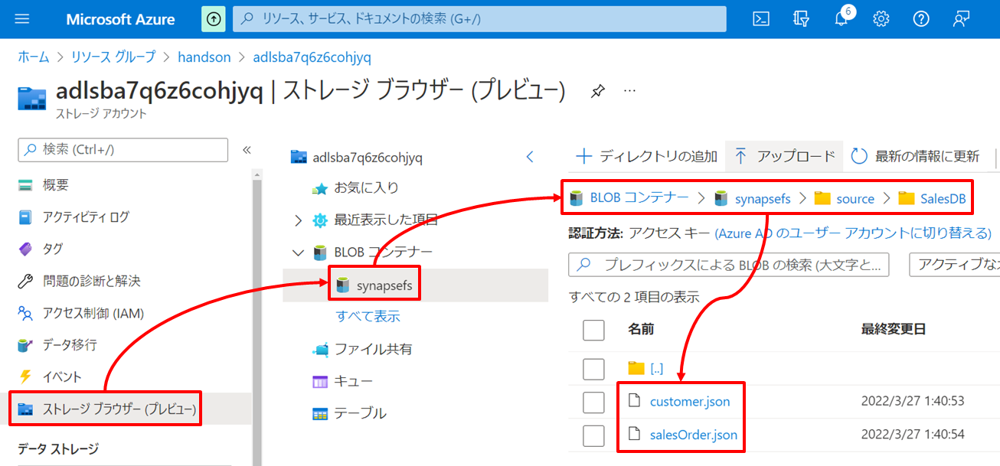
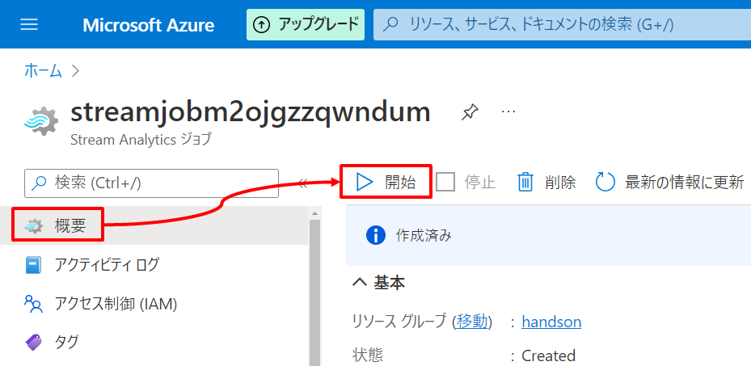
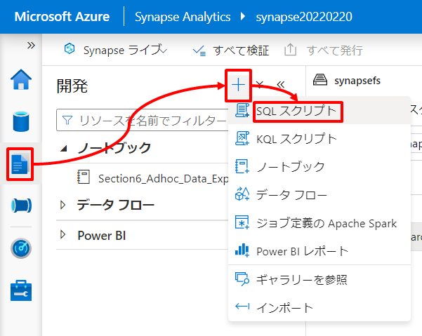
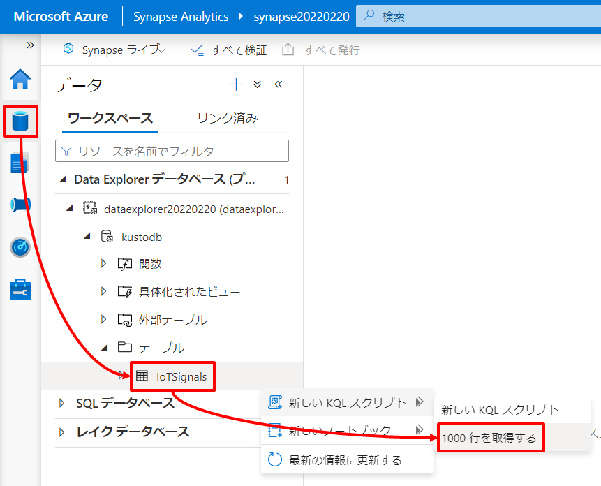

---
# 8. ハンズオン：リアルタイムデータ分析

第8章では第5章～第7章のようなバッチ処理とは異なるリアルタイム処理によるデータ分析を行います。  

## シナリオ

ここでは性質の異なる2種類のデータに対するリアルタイム分析を行います。  
ひとつは「トランザクションデータに対するリアルタイム分析」、もうひとつは「ストリームデータに対するリアルタイム分析」です。

それぞれのシナリオのアーキテクチャと関連リソースの役割は以下の通りです。矢印はデータの流れを示しています。  
  

### シナリオ１：トランザクションデータに対するリアルタイム分析
シナリオ１はオンラインシステムで生成されるトランザクションデータに対するリアルタイム分析で HTAP（Hybrid Transaction Analytical Processing）と呼ばれるシナリオに対応します。これには Synapse がもつ Synapse Link 機能を活用します。

Synapse Link とはクラウドネイティブの HTAP を実現するための機能で OLTP 向けデータストア（トランザクションストア）の背後に OLAP 向けのデータストア（分析ストア）を自動的に作成し、その分析ストアと Synapse をシームレスに統合することでオンラインのトランザクションデータに対するニアリアルタイムな分析を実現します。  
  
Synapse Link は 本書の執筆時点で Azure Cosmos DB と Microsoft Dataverse に対応しており、今後 Azure SQL Database などへの対応も計画されている機能です。  

このハンズオンではオンライントランザクションデータを格納している Azure Cosmos DB に対して Synapse Link を有効にし Synapse Serverless Spark Pool と Synapse Serverless SQL Pool から Azure Cosmos DB 分析ストアへアクセスし分析を行います。分析結果は Azure Cosmos DB トランザクションストアに書き戻しすぐにアプリケーションから再利用できるようにします。  

| アイコン | リソース | 役割 |
| :---: | :---- | :---- |
|  | Azure Cosmos DB | このシナリオではオンライントランザクションデータを格納しているデータストアとして位置づけます。</br>トランザクションデータを格納するコンテナは 第4章での ARM テンプレートによるデプロイ時に作成しており、またコンテナ作成時に Synapse Link を有効化しています（執筆時点ではコンテナの新規作成時に Synapse Link の有効化が必要ですが、既存のコンテナに対する有効化も今後サポート予定です）。</br>Synapse Link の有効化によりオンライン用途に最適化された Azure Cosmos DB ネイティブのデータ構造を元に、分析用途に最適化されたデータ構造である分析ストアが非同期に自動生成されるようになります。 |
|  | Synapse Serverless Spark Pool | このシナリオでは Synapse Link を有効化した Cosmos DB 内の分析ストアにアクセスし分析処理を行います。また、その分析結果を Azure Cosmos DB トランザクションストアへ書き戻しオンラインアプリケーションから再利用できるようにします。  |
|  | Synapse Serverless SQL Pool | このシナリオでは Synapse Serverless Spark Pool 同様に Synapse Serverless SQL Pool の読み込みアクセスを試してみます（Synapse Serverless SQL Pool は Synapse Serverless Spark Pool と異なり書き込みに対応していません）。 |
|  | Synapse Dataflow | このシナリオではハンズオンの対象外としますが、Synapse Serverless Spark Pool 同様に 分析ストアへの読み込みとトランザクションストアへの書き出しに対応しており、Synapse Dataflow を利用することで Spark によるデータ処理を GUI によるローコードで実装することが可能です。 |

https://docs.microsoft.com/ja-jp/azure/synapse-analytics/synapse-link/concept-synapse-link-cosmos-db-support?toc=/azure/cosmos-db/toc.json&bc=/azure/cosmos-db/breadcrumb/toc.json

### シナリオ２：ストリームデータに対するリアルタイム分析
シナリオ２は IoT デバイスなどから発生するストリームデータに対する分析です。  
このハンズオンでは IoT デバイスから発生するメトリックデータを IoT Hub でとらまえ、IoT Hub に順次到着するストリームデータを Stream Analytics でホットパス分析を行い、結果を Power BI Service にプッシュするとともに、コールドパス分析向けに生のメトリックデータを Data Lake へエクスポートさせます。加えて、Synapse Data Explorer (執筆時点プレビュ) を IoT Hub に接続しウォームパス分析を行い Power BI にてホットパス分析結果に合流させます。  
なお、IoT デバイスにはオンラインシミュレーターを活用するため、物理的な IoT デバイスを準備することなくハンズオンが可能です。

| アイコン | リソース | 役割 |
| :---: | :---- | :---- |
|  | Raspberry Pi Azure IoT Online Simulator | このハンズオンでは IoT デバイスとしてオンラインシミュレーター ([Raspberry Pi Azure IoT Online Simulator](https://azure-samples.github.io/raspberry-pi-web-simulator/)) を利用します。この IoT デバイスシミュレーターは温度と湿度を計測し IoT Hub へメトリックを送信します。 |
|  | Azure IoT Hub | IoT デバイスから発生するメトリックデータを受信します。 |
|  | Azure Stream Analytics | リアルタイムなデータ処理（ストリーム処理）を継続的に行うホットパス分析に利用します。</br>Azure Stream Analytics はストリーム処理を行うための Azure サービスのひとつで、ストリーム処理の時間枠を柔軟に制御するためのウィンドウ関数や機械学習を利用するための分析関数など様々な組み込み関数が提供され、こうしたストリーム処理を SQL 構文を使用して記述する点が特徴です。</br>このハンズオンでは Azure IoT Hub が受信したデバイスからのメトリックを Azure Stream Analytics で継続的にとらまえるとともに、組み込みの機械学習によりメトリックの異常検出を行い、結果を Power BI Service へプッシュします。 |
|  | Synapse Data Explorer Pool | Synapse Data Explorerが内部にもつデータベース内に IoT Hub に順次到着するストリームデータを取り込みます。取り込んだデータは Power BI Service から Synapse Data Explorer に対して Kusto 言語 による分析を行い可視化させます。 |
|  | Power BI Service | Azure Stream Analytics によるホットパスからプッシュされたメトリックと異常検出の結果をダッシュボード上でリアルタイムに可視化します。加えて Synapse Data Explorer によるウォームパスからメトリックの履歴データを参照し同じダッシュボード上に可視化します。 |

---
# **Let's get started**

---
## 7-1. シナリオ１：トランザクションデータに対するリアルタイム分析

### 7-1-1. Azure Cosmos DB へのサンプルデータの投入  

ハンズオン用のサンプルデータは JSON ファイルで用意しているのでこれを Azure Cosmos DB へロードします。  
JSON ファイルのロードには[移行ツール](https://docs.microsoft.com/ja-jp/azure/cosmos-db/import-data)や SDK などいくつかの手段がありますが、このハンズオンでは Synapse Pipeline を利用してロードしましょう。  

#### Data Lake Storage への JSON ファイルのアップロード 

はじめに JSON ファイルを Data Lake Storage にアップロードすることから始めましょう。  
Azure Portal のデータエクスプローラーからディレクトリ *source/SalesDB* を作成し、そこへ *resource\data\lab-8\SalesDB* 配下の json ファイルをアップロードします。  

  

#### Synapse と Azure Cosmos DB のリンク  

次に JSON ファイルを Azure Cosmos DB へコピーするためのパイプラインを作成します。  

コピー先となる Azure Cosmos DB の統合データセットを定義する必要があるため、まずは Synapse Workspace に Cosmos DB をリンクします。  
Synapse Studio のメニュを辿り *＋新規* をクリックします。  
  

Azure Cosmos DB (SQL API) を選択し「作成」ボタンを押下します。  
  

新しいリンクサービスブレードで必要情報を入力したのち「保存」ボタンを押下します。  

| 項目 | 値 |
| :---- | :---- |
| 名前 | 例）MyCosmos |
| 認証方式 | 例）アカウントキー |
| サブスクリプション | ハンズオン用のサブスクリプションを指定 |  
| Azure Cosmos DB アカウント名 | 第4章でデプロイした Azure Cosmos DB を指定 |  
| データベース名 | SalesDB（第4章のデプロイ時にデータベースも作成済みです） |  

  

#### 統合データセットの定義   

次に Azure Cosmos DB の統合データセットを以下の通り２つ定義します。  
統合データセットの定義方法は第5章を参考にしてください。  

| 項目 | 値 |
| :---- | :---- |
| データストアの種類 | Azure Cosmos DB (SQLAPI) |
| 名前 | 例）Cosmos_SalesDB_Customer |  
| リンクサービス | 作成した Cosmos DB のリンクサービスを指定 |  
| コレクション | Customer |  

| 項目 | 値 |
| :---- | :---- |
| データストアの種類 | Azure Cosmos DB (SQLAPI) |
| 名前 | 例）Cosmos_SalesDB_SalesOrder |  
| リンクサービス | 作成した Cosmos DB のリンクサービスを指定 |  
| コレクション | SalesOrder |  

同様にコピー元となる Data Lake Storage の統合データセットを作成します。  

| 項目 | 値 |
| :---- | :---- |
| データストアの種類 | Azure Data Lake Storage Gen2 |
| データの形式 | JSON |
| 名前 | 例）ADLS_Customer_JSON |  
| リンクサービス | Synapse デプロイ時に自動作成される Data Lake のリンクサービスを指定 |  
| ファイルシステム | synapsefs |  
| ディレクトリ | source/SalesDB |  
| ファイル | customer.json |  

| 項目 | 値 |
| :---- | :---- |
| データストアの種類 | Azure Data Lake Storage Gen2 |
| データの形式 | JSON |
| 名前 | 例）ADLS_SalesOrder_JSON |  
| リンクサービス | Synapse デプロイ時に自動作成される Data Lake のリンクサービスを指定 |  
| ファイルシステム | synapsefs |  
| ディレクトリ | source/SalesDB |  
| ファイル | salesOrder.json |  

#### パイプラインの定義  

次にコピーを行うパイプラインを定義します。  
パイプラインの定義方法は第5章を参考にしてください。

- パイプライン

| 分類 | 項目 | 値 |
| :---- | :---- | :---- |
| プロパティ | 名前 | 例）Copy_JSON_Into_CosmosDB |

- Customer コピーアクティビティ

| 分類 | 項目 | 値 |
| :---- | :---- | :---- |
| 全般 | 名前 | 例）Copy Customer |
| ソース | ソースデータセット | 例）ADLS_Customer_JSON |
| シンク | シンクデータセット | 例）Cosmos_SalesDB_Customer |

- SalesOrder コピーアクティビティ

| 分類 | 項目 | 値 |
| :---- | :---- | :---- |
| 全般 | 名前 | 例）Copy SalesOrder |
| ソース | ソースデータセット | 例）ADLS_SalesOrder_JSON |
| シンク | シンクデータセット | 例）Cosmos_SalesDB_SalesOrder |

***TODO；パイプラインの全体像の画像を張り付け***

#### パイプラインの実行

最後に「すべて発行」をクリックし編集を確定したのちパイプラインを実行してください。  

  
  

Synapse Studio メニュを辿りパイプラインが成功となったことを確認します。    
  

また Azure Cosmos DB の Portal メニュを辿り、データエクスプローラーにてロードされたデータが確認できます。    
  

これで 分析のための疑似環境として Azure Cosmos DB の構成が完了です。  

### 7-1-2. Cosmos DB 分析ストアへアクセスし分析を行う

ここからは Azure Cosmos DB の分析ストアへアクセスし分析を行います。  
分析はあらかじめ用意したノートブックを利用します。メニュを辿り *インポート* をクリックし *resource\script\SynapseLink_CosmosDB.ipynb* をインポートします。  
  

ノートブックが開いたらこのノートブックの実行環境とする Spark Pool を指定してください。  
  

#### シンプルなデータ探索  

コードセルの左の「実行」をクリックすることでコードセルをひとつづつ実行していきましょう。  
まずはデータのロードです。<Cosmos DB へのリンクサービス名を指定してください> に先ほど作成したリンクサービス名（例：MyCosmos）を指定したのちに「実行」をクリックしてください。  
  

初回の実行は Spark クラスタを起動するため少し時間を要すためしばらく完了を待ちます。「ジョブの実行」が成功となれば完了です。  
  

続けて 1-3 までコードセルをひとつづつ実行します。1-2 では DataFrame にロードした Azure Cosmos DB 内のトランザクションデータの簡易クレンジングを行い、1-3 では簡単な集計を行っています。
  

#### クロスコンテナー結合を活用した分析  

次にクロスコンテナ結合を行ってみます。Cosmos DB 自体はコンテナーをまたぐ結合がサポートされていませんが、Synapse Link による分析ストアについてはクロスコンテナー結合が可能になります。  
同様に 2-2 までひとつづつコードセルを実行していってください。  

2-1 では SparkSQL による分析に備えて Cosmos DB の分析ストアを参照する外部テーブルを定義します。<Cosmos DB へのリンクサービス名を指定してください>に先ほど作成したリンクサービス名（例：MyCosmos）を指定したのちに「実行」をクリックしてください。  
  

2-2 ではクロスコンテナー結合を活用した分析を行っています。ここでは最終的に Customer と SalesOrder を結合し、国ごと都市ごとの顧客数、商品注文数、売上などを集計しています。  
  

#### 分析結果のトランザクションストアへの書き戻し  

最後にこの集計結果を再利用するためにトランザクションストアへの書き戻しを行います。<Cosmos DB へのリンクサービス名を指定してください>に先ほど作成したリンクサービス名（例：MyCosmos）を指定したのちに「実行」をクリックしてください。  
  

コードセルの実行が完了したら Cosmos DB を確認してみましょう。先ほどの集計結果がロードされていることが確認できます。
  

最後に環境のクリーンアップを行いこのパートは終了です。  
  

#### 補足：Serverless SQL からの Cosmos DB トランザクションストアの Read  

Cosmos DB トランザクションストアは OPENROWSET を利用することで Serverless SQL からも Read を行うことができます。  
ノートブックと同様にメニュを辿り *インポート* をクリックし *resource\script\SynapseLink_CosmosDB.sql* をインポートします。

Cosmos DB のキーを以下で確認したのち、SQLスクリプト内の<Cosmos DB キー>と<Cosmos DB アカウント名>を置き換えてください。  
    
      

クエリを実行すると Cosmos DB の分析ストア が読み込まれます。ここでは例として先ほど Cosmos DB に書き戻した分析の集計結果を読み込んでいます。  
  

---

## 7-2. シナリオ２：ストリームデータに対するリアルタイム分析

### 7-2-1. IoT デバイスを準備する

#### 1. IoT Hub へ IoT デバイスを登録する  

まずはじめに IoT Hub へメトリックを送信してくる IoT デバイス の登録と接続のためのキーを確認します。  

IoT Hub の Portal メニュを辿り「＋デバイスの追加」をクリックします。  
  

デバイスの作成画面で *デバイスID* に任意の名前を入力し、残りは既定値のまま「保存」ボタンを押下します。  
  

デバイスの一覧から登録したデバイスをクリックします。  
  

デバイスの詳細画面で *プライマリ接続文字列* をコピーしてメモしておきます。これは IoT デバイス が IoT Hub に接続するためのキーを含む接続文字列になります。     
  

#### 2. IoT Hub のコンシューマグループを追加する

このハンズオンでは IoT Hub で受信したメトリックを Stream Analytics によるホットパス分析に用いるパスと、Synapse Data Explorer (執筆時点プレビュ) によるウォームパス分析に用いるパスの２系統があるため、この系統ごとに IoT Hub のコンシューマグループを作成する必要があります。   
  

IoT Hub の Portal メニュを辿り、以下の２つのコンシューマグループを登録してください。  

| コンシューマグループ名 | 用途 |
| :---- | :---- |
| hotopath | ホットパス分析用 |
| warmpath | ウォームパス分析用 |

  

#### 3. IoT デバイス を準備する

このハンズオンでは IoT デバイスとしてオンラインシミュレーター ([Raspberry Pi Azure IoT Online Simulator](https://azure-samples.github.io/raspberry-pi-web-simulator/)) を利用します。  
  

オンラインシミュレーターのサイトにアクセスし 15行目のコード内の *[Your IoT hub device connection string]* を先ほどメモした *プライマリ接続文字列* で置き換えます。  

```JavaScript
const connectionString = 'HostName=iothubm2ojgzzqwndum.azure-devices.net;DeviceId=MyRasPiSim;SharedAccessKey=XXXXXXXXXXXXXXXX';
```

次に getMessage 関数をカスタマイズします。27行目 と 28行目 の間に下記のコードを追加してください。これは IoT デバイス側からデータを観測した時間を記録するものです。  

```JavaScript
creationUtcTime: new Date().toISOString(),
```

カスタマイズ後の getMessage 関数は下記の通りです。  

```JavaScript
function getMessage(cb) {
  messageId++;
  sensor.readSensorData()
    .then(function (data) {
      cb(JSON.stringify({
        creationUtcTime: new Date().toISOString(),
        messageId: messageId,
        deviceId: 'Raspberry Pi Web Client',
        temperature: data.temperature_C,
        humidity: data.humidity
      }), data.temperature_C > 30);
    })
    .catch(function (err) {
      console.error('Failed to read out sensor data: ' + err);
    });
}
```

### 7-2-2. ホットパス分析を行う

まずはホットパス分析を行います。これはストリームデータに対するリアルタイムなデータ処理（ストリーム処理）を継続的に行うパスです。  

このハンズオンでは Azure Stream Analytics をストリーム処理に利用します。Azure Stream Analytics はストリーム処理を行うための Azure サービスのひとつで、ストリーム処理の時間枠を柔軟に制御するためのウィンドウ関数や機械学習を利用するための分析関数など様々な組み込み関数が提供され、こうしたストリーム処理を SQL 構文を使用して記述する点が特徴です。  

今回は Azure IoT Hub が受信したデバイスからのメトリックを Azure Stream Analytics で継続的にとらまえるとともに、組み込みの機械学習によりメトリックの異常検出を行い、結果を Power BI Service へプッシュします。Power BI Service ではプッシュされたメトリックと異常検出の結果をダッシュボード上でリアルタイムに可視化します。  

本書での詳細解説は割愛しますが、Azure Stream Analytics では 入力元 と 出力先、そしてそれらをつなぐストリーム分析ジョブを定義します。  

***TODO：ASA統合の世界観を紹介する？（Synpapseの先行きが不透明すぎるので伏せる？）***
　https://www.youtube.com/watch?v=sDOUu_LlliU

ストリーム処理
　https://docs.microsoft.com/ja-jp/azure/architecture/data-guide/technology-choices/stream-processing
　https://docs.microsoft.com/ja-jp/azure/architecture/data-guide/big-data/real-time-processing
　https://docs.microsoft.com/ja-jp/learn/paths/implement-data-streaming-with-asa/
　https://docs.microsoft.com/ja-jp/stream-analytics-query/built-in-functions-azure-stream-analytics

パス
　https://docs.microsoft.com/ja-jp/azure/architecture/reference-architectures/iot
  https://techcommunity.microsoft.com/t5/educator-developer-blog/azure-data-explorer-services-for-storing-and-running-interactive/ba-p/739121
  https://docs.microsoft.com/ja-jp/learn/modules/design-data-integration/6-design-strategy-for-hot-warm-cold-data-path

#### 1. Azure Stream Analytics 入力の定義  

まずは 入力元 の定義です。このハンズオンでは IoT デバイスからのメトリクスを受信する Azure IoT Hub が入力となります。  
Azure Stream Analytics の Portal メニュを辿り 入力　-> ＋ストリーム入力の追加 -> IoT Hub を選択します。  
  

IoT Hub 新規入力ブレードで必要情報を入力したのち「保存」ボタンを押下します。  

| 項目 | 値 |
| :---- | :---- |
| 入力のエイリアス | 任意の名前を指定（例：MyIoTHub） |
| サブスクリプション | ハンズオン用のサブスクリプションを指定 |  
| IoT Hub | ハンズオンの準備でデプロイした IoT Hub を指定 |  
| コンシューマーグループ | 前の手順で作成した IoT Hub の ホットパス用のコンシューマーグループを指定（例：hotpath） |  
| 共有アクセスポリシー名 | iothubowner |  

  

#### 2. Azure Stream Analytics 出力の定義  

次に 出力先 の定義です。このハンズオンではストリーム処理の結果を Power BI Service へプッシュします。  
Azure Stream Analytics の Portal メニュを辿り 出力 -> 追加 -> Power BI を選択します。  
  

Power BI 新規出力ブレードで必要情報を入力します。   

| 項目 | 値 |
| :---- | :---- |
| 出力エイリアス | 任意の名前を指定（例：MyPowerBI） |
| グループワークスペース | 第5章で作成したワークスペースを指定 |  
| 認証モード | ユーザートークン |
| データセット名 | 任意の名前を指定（例：IoT Push Dataset） |  
| テーブル名 | 任意の名前を指定（例：IoTSignals） |  

   

「承認」をクリックし Power BI Service へのサインインを行ったのち「保存」ボタンをクリックします。  
  
  

#### 3. Azure Stream Analytics ジョブを定義  

最後に入力元 と 出力先 をつなぐパイプラインとなるストリーム分析ジョブを SQL 構文で定義します。  
Azure Stream Analytics の Portal メニュを辿り クエリ を選択し、以下の SQL クエリをエディタ上に張り付けたのち クエリの保存 をクリックします。  
このクエリジョブは Azure IoT Hub で受信したメトリクスを継続的にとらまえるとともに、組み込みの機械学習によりメトリックの異常検出を行い、結果を Power BI Service へプッシュします。

```SQL
WITH SmootheningStep AS
(
    SELECT
        deviceId , 
        System.Timestamp() as time ,
        AVG(CAST(temperature as float)) as temperature ,        
        AVG(CAST(humidity as float)) as humidity
    -- Azure IoT Hub からメトリックを取得します。
    FROM MyIoTHub
    -- メトリックはウィンドウ関数を利用し2秒ごと過去10秒の平均値に変換します。
    GROUP BY deviceId HOPPINGWINDOW(second, 10, 2)
),
AnomalyDetectionStep AS
(
    SELECT
        time ,
        temperature ,
        -- 分析関数を利用し組み込みの機械学習による異常検出を行います。
        AnomalyDetection_SpikeAndDip(temperature, 95, 120, 'spikesanddips')
            OVER(PARTITION BY deviceId LIMIT DURATION(second, 120)) AS sad_temperature ,
        humidity ,
        AnomalyDetection_SpikeAndDip(humidity, 95, 120, 'spikesanddips')
            OVER(PARTITION BY deviceId LIMIT DURATION(second, 120)) AS sad_humidity
    FROM SmootheningStep
)
SELECT
    time ,
    temperature ,
    -- 異常検出スコア
    CAST(GetRecordPropertyValue(sad_temperature, 'Score') AS float) AS sad_score_temperature ,
    -- 異常の有無
    CAST(GetRecordPropertyValue(sad_temperature, 'IsAnomaly') AS bigint) AS sad_isanomaly_temperature ,
    humidity ,
    CAST(GetRecordPropertyValue(sad_humidity, 'Score') AS float) AS sad_score_humidity ,
    CAST(GetRecordPropertyValue(sad_humidity, 'IsAnomaly') AS bigint) AS sad_isanomaly_humidity
-- 取得したメトリックと異常検出結果を Power BI Service へプッシュします。
INTO MyPowerBI
FROM AnomalyDetectionStep
```

  

#### 4. ストリーム分析ジョブの開始

まずは IoT デバイスを起動します。  
オンライン シミュレーターに戻り、*Run* をクリックします。  
  
これにより IoT デバイス から Azure IoT Hub へのメトリック送信が開始されます。  

それではストリーム分析ジョブを開始させましょう。  
Azure Stream Analytics クエリエディターに戻り「クエリのテスト」をクリックし、temperature や humidity のデータが取得できていることを確認してください。  
  

クエリジョブに問題がなさそうであれば Azure Stream Analytics の Portal のメニュを辿り 概要 -> 開始 をクリックしストリーム分析ジョブを起動します。  

これにより Azure IoT Hub で受信したメトリクスへの異常検出と Power BI Service への結果のプッシュが開始されます。  

#### 5. Power BI Service ダッシュボードを作成  

Azure Stream Analytics から継続的にプッシュされているデータを確認し可視化しましょう。  
Power BI Service にサインインします。  
https://powerbi.microsoft.com/ja-jp/   

Power BI Service のメニュを辿り Azure Stream Analytics の出力先として指定したワークスペースを選択します。  


ワークスペースのリソースの一覧で  Azure Stream Analytics の出力先として指定したストリームデータセットが作成されていることが確認できます。  
  

＋新規 -> ダッシュボード を選択し、任意のダッシュボード名を入力します。  
  
  

ダッシュボード編集画面で 編集 -> ＋タイルの追加 を選択します。  
  

ソースは カスタムストリーミングデータ を選択し「次へ」をクリックします。  
  

作成されたデータセットを選択し「次へ」をクリックします。  
  

以下の通り視覚化の設定を行った後「適用」をクリックします。  

- 温度推移グラフ  

| 項目 | 値 |
| :---- | :---- |
| 視覚化タイプ | 折れ線グラフ |
| 軸 | time |  
| 値 | temp |  
| 表示する時間枠 | 1分 |  
| タイトル | 温度推移 |  

  
  

温度推移グラフ同様の手順でいくつかのグラフを追加します。  

- 温度カード  

| 項目 | 値 |
| :---- | :---- |
| 視覚化タイプ | カード |
| フィールド | temp |  
| タイトル | 温度 |  

- 温度異常グラフ  

| 項目 | 値 |
| :---- | :---- |
| 視覚化タイプ | 集合縦棒グラフ |
| 軸 | time |  
| 値 | isanomaly_temp |  
| 表示する時間枠 | 1分 |  
| タイトル | 温度異常 |  

- 湿度推移グラフ

| 項目 | 値 |
| :---- | :---- |
| 視覚化タイプ | 折れ線グラフ |
| 軸 | time |  
| 値 | humi |  
| 表示する時間枠 | 1分 |  
| タイトル | 湿度 |  

- 湿度カード  

| 項目 | 値 |
| :---- | :---- |
| 視覚化タイプ | カード |
| フィールド | humi |  
| タイトル | 湿度 |  

- 湿度異常グラフ

| 項目 | 値 |
| :---- | :---- |
| 視覚化タイプ | 集合縦棒グラフ |
| 軸 | time |  
| 値 | humi_temp |  
| 表示する時間枠 | 1分 |  
| タイトル | 湿度異常 |  

最後に以下のイメージを参考にダッシュボードレイアウトを調整します。  
  

例えばデバイスに異常が発生すると以下のように異常が検出されます。  
  

異常のシミュレーションはオンライン シミュレーターを一度停止し getMessage 関数内の31行目の温度や32行目の湿度に異常値を入れたのちに再開してみてください。

```JavaScript
function getMessage(cb) {
  //省略
        temperature: 75, //温度異常値
        humidity: 40    //湿度異常値
  //省略
)
```

Azure Stream Analytics で分析された結果が Power BI Service のダッシュボード上にリアルタイムに表示されることが確認できました。  
動作確認が完了したら、シミュレータ と ストリーム分析ジョブ を停止します。  

  
  

#### 6. おまけ：コールドパス分析向けデータエクスポート  

最後に後々のコールドパス分析用にストリームデータをストレージにエクスポートする手順を試しておきましょう。  
ウィンドウ処理が不要なストリーム処理の場合は Azure Functions で Azure IoT Hub トリガー を利用してイベントドリブン処理を行うこともできますが、今回は Azure Stream Analytics を利用し同じ要領でエクスポートを行います。  
https://docs.microsoft.com/ja-jp/azure/azure-functions/functions-bindings-event-iot-trigger?tabs=in-process%2Cfunctionsv2%2Cextensionv5&pivots=programming-language-csharp

Azure Stream Analytics の Portal メニュを辿り 出力 -> 追加 -> Blob Storage または ADLS Gen2 を選択します。  
  

新規出力ブレードで必要情報を入力したのち「保存」をクリックします。  

| 項目 | 値 |
| :---- | :---- |
| 出力エイリアス | 任意の名前を指定（例：MyDataLake） |
| サブスクリプション | ハンズオン用のサブスクリプションを指定 |  
| ストレージアカウント | 作成した Azure Data Lake Storage を指定 |  
| コンテナ－ | 新規作成 |  
| コンテナ－名  | 任意の名前を指定（例：mydevices） |  
| 認証モード  | システム割当マネージド ID の作成 |  
| パスパターン  | raspi/json/{date}/{time} |  

  

Azure Stream Analytics の Portal メニュを辿り クエリ を選択し、以下の SQL クエリをホットパス分析用のクエリの後ろに張り付けたのち クエリの保存 をクリックします。  

```SQL
-- コールドパス分析用に Data Lake へエクスポート
SELECT
    -- すべてのデータをエクスポート
    *
INTO
    -- Azure Data Lake Storage へエクスポート
    MyDataLake
FROM
    -- Azure IoT Hub からインポート
    MyIoTHub
```  

  

IoT デバイス と ストリーム分析ジョブ をそれぞれ開始すると、指定したストレージにデータが順次エクスポートされていきます。  
  

ストレージにエクスポートされたデータを例えば Serverless SQL から探索してみましょう。    
  

Synapse Studio のメニュを辿り SQL スクリプトエディタを起動し以下のクエリを張り付けます。  
  

```SQL
SELECT
    JSON_VALUE (jsonContent, '$.creationUtcTime') AS creationUtcTime
    , JSON_VALUE (jsonContent, '$.temperature') AS temperature
    , JSON_VALUE (jsonContent, '$.humidity') AS humidity
FROM
    OPENROWSET(
        BULK 'https://<Storage Account名>.dfs.core.windows.net/mydevices/raspi/json/*/*/*/*/*.json',
        FORMAT = 'CSV',
        FIELDQUOTE = '0x0b',
        FIELDTERMINATOR ='0x0b'
    )
    WITH (
        jsonContent varchar(MAX)
    ) AS result
WHERE
    result.filepath(1) = 2022
    AND result.filepath(2) = 03
    AND result.filepath(3) <= 20
ORDER BY
    creationUtcTime ASC
```  

<Storage Account名>を編集したのち実行します。  
  

このように Synapse であればコールドパス分析も即座に開始することができます。  

### 7-2-3. ウォームパス分析を行う  

ストリーム処理によるホットパス分析はデータの受信と同時に即座な分析が可能ですが、言い換えると過ぎ去った時間での遡及処理を行うことはありません。  
一方でデータの送受信の経路上には様々なソフトウェア、デバイス、ネットワークなどが存在するため、なんらかの要因によりデータの受信に遅延が発生することは起こりえます。  

これはストリーム処理の結果が不正確になりうることを示しており、これを解決するためにコールドパスやウォームパスを構成することによってホットパス分析による暫定結果を確定結果として後から補正することができます。  

コールドパスについてはこれまでのハンズオンで扱ったので、このハンズオンでは Synapse Data Explorer Pool（執筆時点でプレビュー） を利用するウォームパスを構成してみたいと思います。Azure IoT Hub が受信したデバイスからのメトリックを Synapse Data Explorer Pool へ継続的に取り込み、ダイレクトクエリとして構成した Power BI レポートからオンデマンドに Synapse Data Explorer Pool へアクセスし継続的に取り込まれた過去データを履歴として可視化します。

このハンズオンの大きな流れは、まず Synapse Data Explorer Pool の作成します。次にデータの取り込み先となるデータベースとテーブルの定義に加え 取込データのスキーマと取込先テーブルのスキーマとのマッピング定義を行います。そののち Azure IoT Hub と Synapse Data Explorer Pool との接続設定を構成し断続的な取り込みを開始します。最後に取り込まれたデータを Power BI レポートで可視化するという流れです。  

#### 1. Synapse Data Explorer Pool の作成と起動  

※. 2022年4月時点でプレビューです。  
それでは Synapse Data Explorer Pool の作成から始めましょう。  
Synapse の Portal メニュを辿り 概要 -> ＋新しいデータエクスプローラープール をクリックします。  
  

データエクスプローラープール名に任意の名前を入力します。その他の設定は動作確認用の低コストな設定を行い「作成」をクリックします。  
  
  

作成した Synapse Data Explorer Pool を起動し状態が *Running* となるのをしばらく待ちます。  
  
  

#### 2. Synapse Data Explorer Pool データベースの定義

Synapse Data Explorer Pool にデータの取り込み先となるデータベースを定義します。  
以下のように Synapse Data Explorer Pool の Portal メニュを辿り 概要 -> ＋データベースの追加 をクリックします。  
  
  

データベース名に任意の名前を入力し「作成」をクリックします。  
  

#### 3. Synapse Data Explorer Pool テーブルの定義

続けてテーブルを定義します。  
Synapse Studio のメニュを辿り KQL スクリプトエディタを開きます。  
   

KQL スクリプトエディタ上に下記コードを張り付けて実行します。  

```Kusto
.create table IoTSignals (enqueued_utc_time: datetime, creationUtcTime: datetime, messageId: string, deviceId: string, temperature: real, humidity: real)
```  

    

#### 4. Synapse Data Explorer Pool スキマーマッピングの定義

取込データのスキーマと取込先テーブルのスキーマとのマッピング定義を行います。  
同様にKQL スクリプトエディタを開き下記コードを張り付けて実行します。  

```Kusto
.create table IoTSignals ingestion json mapping "IoTSignalsMapping"
'['
'   { "column" : "enqueued_utc_time", "DataType":"datetime", "Properties":{"path":"$.iothub-enqueuedtime"}},'
'   { "column" : "creationUtcTime", "DataType":"datetime", "Properties":{"path":"$.creationUtcTime"}},'
'   { "column" : "messageId", "DataType":"string", "Properties":{"path":"$.messageId"}},'
'   { "column" : "deviceId", "DataType":"string", "Properties":{"path":"$.deviceId"}},'
'   { "column" : "temperature", "DataType":"real", "Properties":{"path":"$.temperature"}},'
'   { "column" : "humidity", "DataType":"real", "Properties":{"path":"$.humidity"}}'
']'
```  

  

参考：https://docs.microsoft.com/ja-jp/azure/data-explorer/ingest-data-iot-hub
参考：https://docs.microsoft.com/ja-jp/azure/data-explorer/ingest-data-iot-hub-overview
参考：https://docs.microsoft.com/ja-jp/azure/iot-hub/iot-hub-devguide-messages-construct
参考：https://docs.microsoft.com/en-us/azure/data-explorer/kusto/management/create-ingestion-mapping-command
参考：https://docs.microsoft.com/en-us/azure/data-explorer/kusto/management/create-tables-command
参考：まてびゅー：https://docs.microsoft.com/ja-jp/azure/data-explorer/kusto/management/materialized-views/materialized-view-overview

#### 5. Synapse Data Explorer Pool への取り込みの開始

Azure IoT Hub へ Synapse Data Explorer Pool を接続することでメトリックの取り込みを開始します。  
以下のように Synapse Data Explorer Pool の Portal メニュを辿り データ接続 -> ＋データ接続の追加 -> IoT Hub を選択します。  
  
  

IoT Hub 接続設定で必要情報を入力し「作成」をクリックします。  

| 項目 | 値 |
| :---- | :---- |
| データ接続名 | 任意の名前を指定（例：MyIoTHub） |
| サブスクリプション | ハンズオン用のサブスクリプションを指定 |  
| IoT Hub | ハンズオンの準備でデプロイした IoT Hub を指定 |  
| 共有アクセスポリシー | iothubowner |  
| コンシューマーグループ  | 前の手順で作成した IoT Hub のウォームパス用のコンシューマーグループを指定（例：warmpath） |  
| イベントシステムのプロパティ | iothub-enqueuedtime |  
| テーブル名  | IoTSignals |  
| データ形式  | JSON |  
| マッピング名  | IoTSignalsMapping |  

  

#### 6. Kusto クエリによるアドホック探索  

しばらく待ち Synapse Data Explorer Pool のテーブルにメトリックが取り込まれ始めたら、Kusto クエリでデータを探索してみましょう。  
Synapse Studio メニュを辿り 1000行を取得する をクリックし起動した KQL スクリプトエディタを実行します。    
  
  

以下のように設定することで簡易的なグラフ表示も可能です。  
  

KQL クエリを少し編集し現時刻から過去１時間分のデータをデバイス上でメトリックが生成された時刻順に並べ替えてみましょう。  

```Kusto
IoTSignals
| extend creationJstTime = replace_string(tostring(creationUtcTime + 32400s), 'Z', '+9:00')
| project creationJstTime, creationUtcTime, temperature, humidity
| where creationUtcTime > ago(1h)
| sort by creationUtcTime asc
```  
  

※ Synapse Data Explorer Pool の datetime 型のタイムゾーンは UTC 固定であるため replace_string(tostring(creationUtcTime + 32400s), 'Z', '+9:00') によって JST 表記の文字列を取得しています。  

#### 7. Power BI レポートによるメトリックの可視化

Synapse Data Explorer Pool に取り込まれたメトリックを Power BI レポートで可視化しましょう。   
なお本ハンズオンでは Power BI Desktop によるレポートの作成自体の解説は割愛し、準備済みのレポートを利用します。  

まずはじめに Synapse Data Explorer Pool の Portal メニュを辿り 概要 -> URI で示される Synapse Data Explorer Pool へのエンドポイントをメモしてください。   
  

次に Power BI Desktop を起動します。  
準備済みのレポート *resource/report/IoTSignals Report.pbit* を開き、ダイアログで必要情報を入力したのち「読み込み」ボタンを押下します。  

| 項目 | 値 |
| :---- | :---- |
| AzureSynapseAnalyticsDataExplorerPoolEndpoint | Synapse Data Explorer Pool へのエンドポイントを指定 |
| DataExplorerPoolDatabaseName | Synapse Data Explorer Pool に作成したデータベース名を指定（例：kustodb） |  

  

認証情報が求めらるたら認証を行ったのち「接続」ボタンを押下します。  
  

するとメトリックデータが可視化された作成済みのレポートが開きます。  
  

#### 8. Power BI Service によるレポートの共有とダッシュボードへのピン留め

このレポートを Power BI Service に発行し組織内に共有しましょう。  
まずはこの Power BI ファイルを保存してください。なお、このファイル名は Power BI Service 上のレポート名やデータセット名となります。  

ファイルを保存したのち、メニュから「発行」をクリックします。  
  

ワークスペースは第5章で作成したワークスペースを指定します。  
  

発行が完了したのち、Power BI Service にログインし、メニュを辿りワークスペースを選択します。  
  

ワークスペースのコンテンツ一覧から先ほど発行したレポートを開きます。  
  
  

次にこのレポートを先ほどのホットパス分析で作成したダッシュボードに追加します。  
グラフの右上のピンをクリックしたのち、ホットパス分析で作成したダッシュボードを指定し「ピン留め」ボタンを押下します。  
  
  

右上に表示されるバルーンから *ダッシュボード* をクリックしダッシュボードを開きます。  
  

するとホットパス分析で作成したダッシュボード内にウォームパス分析で作成したレポートがピン留めされているので、以下を参考にダッシュボードのレイアウトを整えてください。  
  

このように、ネットワークの瞬断など何らかの一過性障害の影響を受けやすいホットパスに対してウォームパスを繋ぐことでホットパス分析による暫定結果を確定結果として後から補正することができるようになります。  

動作確認が完了したら、シミュレータ と Synapse Data Explorer Pool を停止します。  
  
  

以上でこのハンズオンは終了です。  

# まとめ

***TODO:要整理***
- Synapse Link による トランザクションデータに対するニアリアルタイム分析（HTAP）への対応
- ストリームデータに対するリアルタイム分析（SDXウォームパス、ASAホットパス）への対応
  - (Gated Previewだけど SELECT INTO Synapse FROM Stream への対応計画あり)
